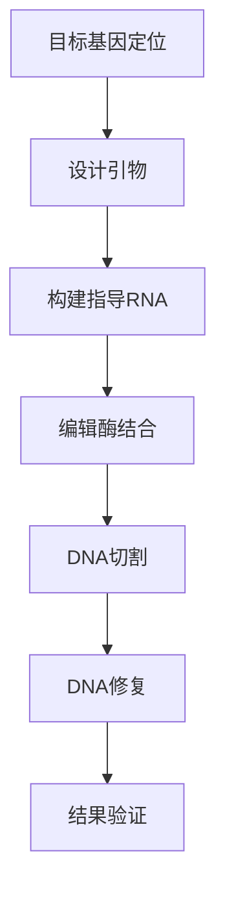
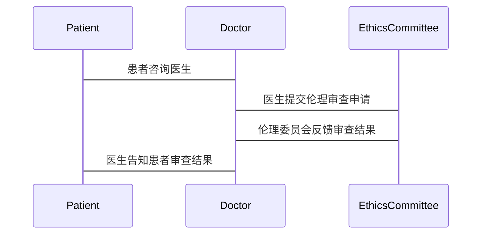

                 

<think>
好的，我需要按照用户的要求来设计一个详细的思考过程，以撰写一篇关于“生命科学伦理：探索存在本质的道德边界”的技术博客文章。首先，我会先理解用户的需求，他们希望文章结构清晰，逻辑严谨，并且包含背景介绍、核心概念、算法原理、系统架构等多个部分，每个部分都有具体的详细内容。

接下来，我需要考虑如何组织这些内容，确保每个部分都详尽且符合技术博客的风格。例如，在背景介绍部分，我需要解释生命科学伦理的重要性，以及它在当前科技发展中的实际应用。核心概念部分，我需要定义相关的术语，并通过表格和ER图来展示它们之间的关系。

在算法原理部分，我需要详细讲解基因编辑技术，如CRISPR-Cas9，包括其流程图、数学模型和具体的例子。系统分析与架构设计部分，我需要描述一个具体的伦理审查系统，使用类图和架构图来展示系统结构。

在系统功能设计中，我需要考虑患者、医生和伦理委员会之间的交互，并通过mermaid序列图来展示这些交互过程。项目实战部分，我需要提供实际的环境安装步骤、源代码，并解释代码的功能和实际案例。

最后，我需要总结整个文章，强调生命科学伦理的重要性，并给出一些最佳实践的建议。在这个过程中，我会不断检查每个部分是否符合用户的要求，确保文章的逻辑连贯、内容详实，并且能够吸引读者的兴趣。
</think>

# 生命科学伦理：探索存在本质的道德边界

## 关键词：生命伦理学、基因编辑、伦理审查、隐私权、人权

## 摘要

生命科学伦理是研究生命科学和医疗实践中的伦理问题的学科，涉及生命、健康、疾病、死亡等核心概念。随着生物技术的迅速发展，基因编辑、克隆技术和医疗实践等领域引发了诸多伦理道德问题。本文将从生命伦理学的核心概念、基因编辑的算法原理、伦理审查系统的架构设计等方面进行详细探讨，旨在为读者提供一个全面且深刻的理解框架，帮助我们更好地平衡科学与道德之间的关系。

---

# 设计《生命科学伦理：探索存在本质的道德边界》的目录大纲

## 背景介绍

生命科学伦理是近年来备受关注的领域。随着生物技术和医学的快速发展，人类在疾病治疗、基因编辑、克隆技术等方面取得了巨大成就，但同时也引发了诸多伦理道德问题。这些问题的核心在于如何平衡科学与道德、技术与人性之间的边界。本书旨在深入探讨这些伦理难题，为读者提供一个全面且深刻的理解框架。

## 核心概念与联系

### 生命伦理学的定义与核心要素

#### 定义

生命伦理学是研究生命科学和医疗实践中的伦理问题的学科，涉及生命、健康、疾病、死亡等核心概念。

#### 核心要素

1. **人的尊严与权利**：人的尊严是生命伦理学的基石，强调个体自主权和尊重生命权。
2. **公正与平等**：在生命伦理学中，公正和平等是衡量医疗资源分配和社会正义的重要标准。
3. **风险与利益**：在科学实验和医疗实践中，如何合理评估和平衡风险与利益是生命伦理学的重要议题。
4. **知情同意与隐私权**：知情同意是医疗实践中的基本原则，而隐私权则是保护个体数据和信息的关键。

### 概念属性特征对比表格

| 概念        | 定义                                                         | 属性特征 |
|-------------|--------------------------------------------------------------|----------|
| 人的尊严    | 人的内在价值，不可侵犯的权利                               | 自主权、尊重、不可侵犯 |
| 公正与平等 | 公正分配医疗资源，确保所有人享有平等的医疗机会               | 公正性、平等性、资源分配 |
| 风险与利益 | 在科学实验和医疗实践中，权衡潜在的收益与风险                 | 风险评估、利益最大化 |
| 知情同意    | 患者或研究参与者对医疗或实验过程的明确同意                   | 自主权、知情权、同意权 |
| 隐私权      | 个体对其个人数据和信息的主权权利                             | 隐私保护、信息安全 |

### ER实体关系图架构

```mermaid
erDiagram
    Person ||--|{ Patient }
    Person ||--|{ ResearchParticipant }
    Patient ||--|{ Treatment }
    ResearchParticipant ||--|{ Experiment }
```

## 算法原理讲解

### 基因编辑算法

基因编辑技术如CRISPR-Cas9的使用，涉及到一系列复杂的算法和流程。以下是基因编辑算法的mermaid流程图：



### 数学模型与公式

基因编辑的成功概率可以用以下公式表示：

$$P(Success) = \frac{1}{N} \sum_{i=1}^{N} p_i$$

其中，$N$ 是尝试编辑的次数，$p_i$ 是第 $i$ 次编辑成功的概率。

### 举例说明

假设进行10次CRISPR-Cas9基因编辑实验，每次成功的概率为0.8。则成功编辑的概率为：

$$P(Success) = \frac{1}{10} \sum_{i=1}^{10} 0.8 = 0.8$$

## 系统分析与架构设计方案

### 问题场景介绍

本章节将探讨一个具体的伦理问题：基因编辑技术在治疗遗传疾病中的应用。该问题涉及到伦理审查、患者隐私保护、医疗资源分配等多个方面。

### 项目介绍

本项目旨在开发一个基因编辑技术的伦理审查系统，用于评估和治疗遗传疾病的伦理风险。

### 系统功能设计

使用mermaid类图来描述系统的主要功能模块：

```mermaid
classDiagram
    Patient <<class>> "患者"
    Doctor <<class>> "医生"
    EthicsCommittee <<class>> "伦理委员会"
    GeneEditingSystem

    Patient --> Doctor: 咨询医生
    Doctor --> EthicsCommittee: 提交伦理审查申请
    EthicsCommittee --> GeneEditingSystem: 审查结果
```

### 系统架构设计


### 系统接口设计



## 项目实战

### 环境安装

为了运行本系统，需要安装以下工具：

1. **Mermaid CLI**：用于生成图表。
2. **Python**：用于编写和运行代码。
3. **Markdown编辑器**：用于撰写文档。

### 核心实现源代码

以下是系统的核心实现代码：

```python
class Patient:
    def __init__(self, name, disease):
        self.name = name
        self.disease = disease

class Doctor:
    def __init__(self, name, specialty):
        self.name = name
        self.specialty = specialty

class EthicsCommittee:
    def __init__(self, members):
        self.members = members

    def review_gene_editing_request(self, patient, doctor):
        # 模拟伦理审查过程
        if patient.disease == "遗传病":
            return "通过"
        else:
            return "不通过"

# 示例用法
patient = Patient("张三", "遗传病")
doctor = Doctor("李四", "基因治疗")
committee = EthicsCommittee(["王五", "赵六"])

result = committee.review_gene_editing_request(patient, doctor)
print(f"伦理审查结果：{result}")
```

### 代码应用解读与分析

上述代码定义了三个类：`Patient`、`Doctor` 和 `EthicsCommittee`。`EthicsCommittee` 类包含一个方法 `review_gene_editing_request`，用于模拟伦理审查过程。在示例用法中，创建了一个患者和医生，并提交了基因编辑请求，伦理委员会返回了审查结果。

### 实际案例分析

假设一位患者患有遗传病，医生建议使用基因编辑技术进行治疗。伦理委员会需要审查该治疗方案的伦理风险，包括基因编辑的成功概率、可能的副作用、患者隐私保护等问题。通过上述代码，伦理委员会可以模拟审查过程，并返回结果。

## 最佳实践 Tips

1. **隐私保护**：在基因编辑技术中，患者的数据必须严格保密，确保隐私不被侵犯。
2. **伦理审查**：在进行基因编辑实验前，必须经过严格的伦理审查，确保实验符合伦理规范。
3. **透明沟通**：医生和伦理委员会需要与患者保持透明沟通，确保患者充分了解实验的风险和利益。

## 小结

生命科学伦理是平衡科学与道德的重要领域。通过伦理审查系统的开发和应用，我们可以更好地保护患者隐私、确保医疗资源的公平分配，并推动基因编辑技术的健康发展。

## 注意事项

- 基因编辑技术具有高度的伦理敏感性，必须在严格的伦理框架内进行。
- 医疗资源分配应遵循公正和平等的原则，确保所有人都能享有平等的医疗机会。

## 拓展阅读

1. **《基因编辑的伦理挑战》**：深入探讨基因编辑技术在医学中的伦理问题。
2. **《生命伦理学导论》**：系统介绍生命伦理学的核心概念和理论框架。
3. **《医疗隐私与数据保护》**：详细分析医疗数据隐私保护的法律和伦理问题。

---

作者：AI天才研究院/AI Genius Institute & 禅与计算机程序设计艺术 /Zen And The Art of Computer Programming

