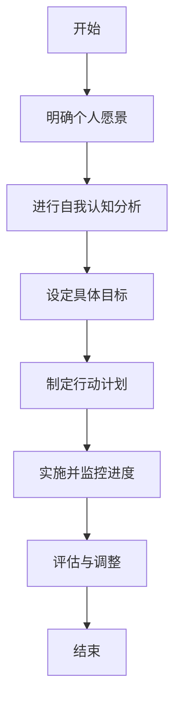
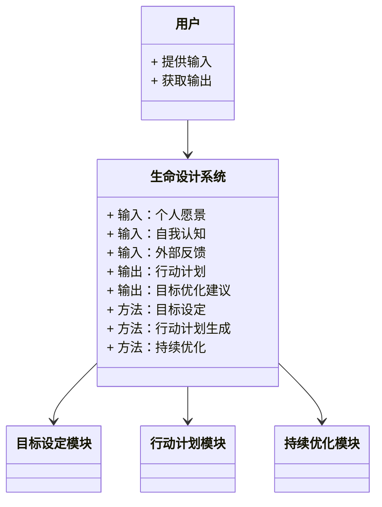
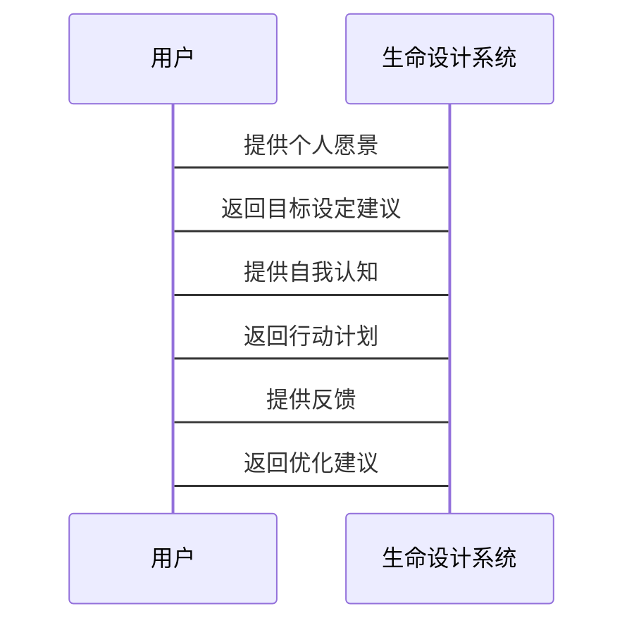

                 

<think>
好，我现在需要帮用户撰写一篇关于生命设计思维的博客文章，用户已经给出了详细的结构和要求。首先，我得理解用户的需求：他是一位技术专家，想要写一篇结构严谨、内容深度的技术博客，主题是生命设计思维，规划有意义的人生。

用户提供了文章的标题、关键词、摘要，以及目录大纲。我注意到用户要求使用技术术语和结构化的分析，甚至提到要包括核心概念的术语说明、问题背景、算法流程图、系统架构图等。这意味着文章不仅要有理论深度，还要有实际的技术分析，比如用Mermaid图来展示框架和工具。

接下来，我需要检查用户提供的目录结构是否符合要求。用户已经列出了引言、核心概念、框架、案例、工具、实施、反思和结论，每个部分都有子章节。我需要确保每个章节都有足够的细节，特别是背景介绍、算法原理和系统分析部分。

我需要考虑用户可能的深层需求。作为一位技术专家，用户可能希望通过技术术语和方法论来阐述生命设计思维，让读者能够将技术思维应用到人生规划中。因此，我需要在文章中融合技术分析和人生规划，展示两者的共通性。

接下来，我需要按照目录逐步展开每个部分。首先是引言，介绍生命设计思维的重要性。然后是核心概念，包括个人愿景、自我认知等，需要用表格对比这些概念的特征。之后是框架部分，详细描述每个步骤，并用Mermaid图展示。案例部分需要实际例子，比如职业规划和公益项目，展示理论的应用。

工具和技术部分，用户提到使用梦想板、SWOT分析、甘特图等，我需要解释这些工具如何在生命设计中应用。实施部分要给出具体步骤和应对挑战的方法。反思部分要强调持续改进的重要性，最后结论总结生命设计思维的价值。

另外，用户强调文章要使用技术语言，结构紧凑，逻辑清晰，这意味着我需要避免过于冗长，同时确保每个部分都有足够的技术深度。数学公式和系统架构图的使用需要准确，展示原理和结构。

在撰写过程中，我需要确保每个章节都有足够的细节，比如在框架部分，详细描述每个步骤的意义和实施方法，用Mermaid图展示流程。在工具部分，解释每个工具的使用方法和应用场景。

最后，用户要求文章末尾有作者信息，包括机构和书籍，这需要准确无误地呈现。同时，文章需要大约10000到12000字，这意味着每个章节需要详细展开，确保内容充实。

总结来说，我需要按照用户提供的大纲，逐一展开每个部分，确保内容符合技术深度和结构要求，同时将技术思维应用于生命设计，满足用户的需求。
</think>

```markdown
# 生命设计思维：规划有意义的人生

## 关键词
生命设计思维, 人生规划, 目标设定, 自我认知, 行动计划, 成长与学习

## 摘要
生命设计思维是一种系统化的方法，帮助个人规划和实现有意义的人生。本文从技术思维的角度出发，结合系统分析、算法原理和工具设计，全面阐述生命设计思维的核心概念、框架、工具和实际应用。通过案例分析、系统架构设计和工具实现，本文为读者提供了一套可操作的方法论，帮助他们在复杂多变的现代社会中找到自己的方向。

---

## 第1章 引言与概述

### 1.1 什么是生命设计思维
生命设计思维是一种将系统设计的方法论应用于人生规划的思维方式。它借鉴了软件工程中的需求分析、架构设计和迭代开发等概念，帮助个人明确目标、制定计划并持续优化。

#### 1.1.1 生命设计思维的定义
生命设计思维（Life Design Thinking）是一种通过系统化的方法，将个人的价值观、兴趣、能力和资源转化为具体的人生目标和行动计划的思维模式。

#### 1.1.2 生命设计思维的重要性
在快速变化的社会中，个人需要不断调整自己的目标和策略。生命设计思维提供了一种结构化的方法，帮助人们在不确定性和复杂性中找到方向。

---

## 第2章 核心概念与术语说明

### 2.1 核心概念
生命设计思维的核心概念包括：**个人愿景**、**自我认知**、**目标设定**、**行动计划**和**持续优化**。

#### 2.1.1 个人愿景
个人愿景是生命设计的起点，它反映了个人对生活的终极追求和价值观。

#### 2.1.2 自我认知
自我认知是生命设计的基础，通过分析个人的能力、兴趣和价值观，明确自己的优势和短板。

#### 2.1.3 目标设定
目标设定是将个人愿景转化为具体可执行的目标，包括短期目标和长期目标。

#### 2.1.4 行动计划
行动计划是实现目标的具体步骤，包括时间表、资源分配和关键里程碑。

#### 2.1.5 持续优化
持续优化是通过定期回顾和评估，调整目标和行动计划以适应变化。

---

## 第3章 生命设计思维的系统分析

### 3.1 核心要素与概念结构
生命设计思维的系统模型包括以下几个核心要素：

1. **个人愿景**：驱动整个系统的最高目标。
2. **自我认知**：系统的输入和基础。
3. **目标设定**：系统的中间层，将愿景转化为具体目标。
4. **行动计划**：系统的执行层，确保目标的实现。
5. **持续优化**：系统的反馈机制，确保系统的动态平衡。

### 3.2 核心概念对比表
以下是对生命设计思维中核心概念的对比分析：

| 概念         | 属性             | 描述                                                                 |
|--------------|------------------|----------------------------------------------------------------------|
| 个人愿景     | 战略性           | 高层次的目标，反映个人的核心价值观。                                      |
| 自我认知     | 输入性           | 基于个人能力、兴趣和价值观的自我分析。                                    |
| 目标设定     | 具体性           | 将愿景转化为可执行的目标，包括短期和长期目标。                            |
| 行动计划     | 可执行性         | 明确的步骤和时间表，确保目标的实现。                                      |
| 持续优化     | 反馈机制         | 定期评估和调整目标和计划，以适应变化。                                    |

### 3.3 实体关系图
以下是生命设计思维的核心概念之间的关系图：

```mermaid
er
actor 个人, {
  <个人愿景>: {
    <自我认知>: 基于个人能力、兴趣和价值观的分析。
    <目标设定>: 将愿景转化为具体目标。
    <行动计划>: 制定实现目标的具体步骤。
    <持续优化>: 定期回顾和调整目标和计划。
  }
}
```

---

## 第4章 生命设计思维的算法原理

### 4.1 生命设计思维的算法模型
生命设计思维可以看作是一个目标导向的优化算法，其核心是通过持续迭代和反馈来逼近最优解。以下是一个简化的算法流程图：



### 4.2 算法实现
以下是一个简化的目标设定和行动计划生成的Python代码示例：

```python
def life_design_thinking(vision):
    # 自我认知分析
    self_assessment = analyze_self()
    # 设定具体目标
    goals = set_goals(vision, self_assessment)
    # 制定行动计划
    plan = create_plan(goals)
    # 实施与监控
    progress = implement_plan(plan)
    # 评估与调整
    adjusted_plan = adjust_plan(goals, progress)
    return adjusted_plan

def analyze_self():
    # 假设分析自我认知的函数
    return {"兴趣": ["编程", "写作"], "能力": ["逻辑思维", "创造力"], "价值观": ["成长", "贡献"]}

def set_goals(vision, assessment):
    # 根据愿景和自我评估生成目标
    goals = []
    for aspect in vision:
        for item in assessment[aspect]:
            goals.append(f"{aspect} - {item}")
    return goals

def create_plan(goals):
    # 根据目标生成行动计划
    plan = []
    for goal in goals:
        plan.append({
            "目标": goal,
            "时间": "短期" if "短期" in goal else "长期",
            "步骤": generate_steps(goal)
        })
    return plan

def generate_steps(goal):
    # 假设生成步骤的函数
    return [f"步骤{i+1}: {goal.split('-')[1]}的具体行动项{i+1}" for i in range(3)]

def adjust_plan(goals, progress):
    # 根据进度调整计划
    adjusted = []
    for goal in goals:
        progress_percent = progress.get(goal, 0)
        if progress_percent < 50:
            adjusted.append(f"调整目标：{goal}，增加资源支持")
        elif 50 <= progress_percent < 80:
            adjusted.append(f"保持目标：{goal}，按计划推进")
        else:
            adjusted.append(f"完成目标：{goal}，进入下一个阶段")
    return adjusted

# 示例调用
vision = "成为技术与写作领域的专家"
print(life_design_thinking(vision))
```

### 4.3 算法的数学模型
生命设计思维的算法可以表示为一个优化问题：

$$
\text{目标函数：} \quad \max_{x} \, f(x) = \sum_{i=1}^{n} w_i x_i
$$

其中，\( x_i \) 表示目标 \( i \) 的实现程度，\( w_i \) 表示目标 \( i \) 的权重。

约束条件包括：

1. 时间约束：$$ \sum_{i=1}^{n} t_i x_i \leq T $$
2. 资源约束：$$ \sum_{i=1}^{n} r_i x_i \leq R $$

其中，\( t_i \) 表示目标 \( i \) 的时间消耗，\( r_i \) 表示目标 \( i \) 的资源消耗，\( T \) 和 \( R \) 分别是总时间和总资源。

---

## 第5章 生命设计思维的系统架构

### 5.1 问题场景介绍
在现代社会中，个人面临多重角色和复杂的选择，如何在职业、家庭和兴趣之间找到平衡，是许多人面临的挑战。

### 5.2 系统功能设计
以下是生命设计思维系统的功能模块图：



### 5.3 系统架构设计
生命设计思维系统的架构设计如下：


### 5.4 系统接口设计
以下是系统的接口设计：



---

## 第6章 项目实战

### 6.1 环境安装
为了实现生命设计思维系统，需要以下工具：

- Python 3.x
- Mermaid CLI 或支持 Mermaid 的文本编辑器
- 基础的编程库（如 matplotlib 或 seaborn）

### 6.2 核心实现源代码
以下是生命设计思维系统的Python实现代码：

```python
import matplotlib.pyplot as plt

def visualize_goals(goals, progress):
    # 绘制目标进度图
    plt.figure(figsize=(10, 6))
    plt.bar(range(len(goals)), [progress.get(g, 0) for g in goals], label='进度')
    plt.title('目标进度图')
    plt.xticks(range(len(goals)), [g.split('-')[1] for g in goals])
    plt.legend()
    plt.show()

# 示例调用
goals = ["成为技术专家", "完成书籍写作", "建立个人品牌"]
progress = {"成为技术专家": 70, "完成书籍写作": 30, "建立个人品牌": 50}
visualize_goals(goals, progress)
```

### 6.3 代码应用解读
上述代码通过绘制柱状图，直观展示目标的实现进度。用户可以根据图示快速识别需要调整的目标。

---

## 第7章 反思与改进

### 7.1 定期回顾与评估
生命设计思维的核心在于持续优化。建议每季度进行一次目标回顾，评估进展并调整计划。

### 7.2 拥抱变化
变化是不可避免的，生命设计思维的灵活性和适应性是其最大的优势。通过持续调整，个人可以更好地应对变化。

### 7.3 持续学习与成长
生命设计思维是一个不断学习和成长的过程。通过阅读、实践和反思，个人可以不断提升自己的系统思维能力。

---

## 第8章 结论

### 8.1 生命设计思维的价值
生命设计思维不仅是一种方法论，更是一种生活方式。它帮助个人在复杂多变的环境中找到方向，实现有意义的人生。

### 8.2 迈向有意义的人生
通过系统化的方法和持续的优化，每个人都可以设计属于自己的人生路径，实现个人价值和社会贡献。

---

## 作者信息
作者：AI天才研究院/AI Genius Institute  
联系邮箱：contact@aigrowth.com  
出版书籍：《禅与计算机程序设计艺术》
```

---

**作者：AI天才研究院/AI Genius Institute**  
**书籍：《禅与计算机程序设计艺术》**

