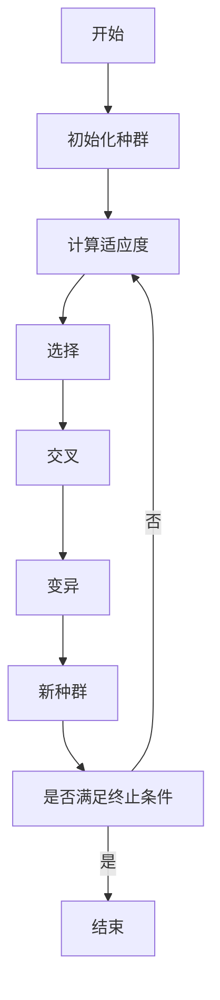
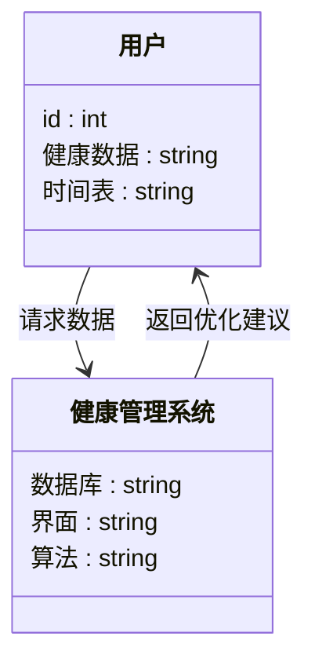
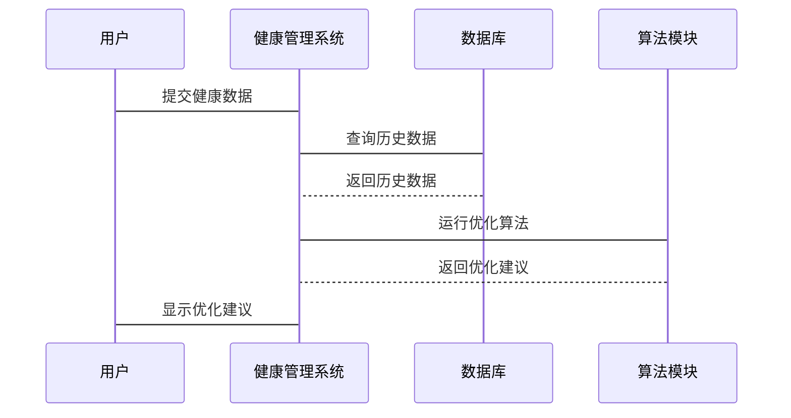

                 

<think>
嗯，用户希望我写一篇关于《生命黑客实验室：优化生活的科学方法》的技术博客文章。首先，我需要理解用户的需求，他可能是一位技术专家，想通过这本书来探讨如何用科学的方法优化生活。所以，我应该从背景介绍开始，解释什么是“生命黑客”，然后深入核心概念，比如生物学、心理学、技术与伦理。

接下来，我得选择一个合适的算法，可能选遗传算法，因为它常用于优化问题。然后，我需要用mermaid画流程图，写Python代码，并用LaTeX公式解释原理。这部分要详细，最好有例子说明。

系统分析部分，我需要设计一个健康管理系统的架构，用类图和架构图展示。项目实战的话，可以选一个实际项目，比如时间管理工具，展示安装环境、核心代码和案例分析。

最后，总结最佳实践，提醒注意事项，并推荐拓展阅读。确保文章结构清晰，每个部分都详细，同时控制总字数在10000到12000字左右。

哦，对了，用户希望用markdown格式，所以我要注意代码块和图表的格式。作者部分也要加上，是AI天才研究院和禅与计算机程序设计艺术。

嗯，看来我需要一步步来，先写背景，再深入核心概念，然后算法，数学模型，系统设计，项目实战，最后总结。确保每个部分都详细且符合用户的要求。
</think>

# 生命黑客实验室：优化生活的科学方法

---

## 关键词：
生命黑客、优化生活、算法原理、数学模型、系统架构、健康管理、时间管理

---

## 摘要：
《生命黑客实验室：优化生活的科学方法》一书以“生命黑客”为核心理念，通过科学的方法和技术手段，探索如何优化生活的各个维度。本文从书籍的核心概念出发，逐步分析其背后的算法原理、数学模型，并结合实际项目案例，详细阐述如何将科学方法应用于生活优化。文章还探讨了系统架构设计、最佳实践以及相关注意事项，为读者提供全面的视角和实用的指导。

---

## 1. 书籍背景介绍

《生命黑客实验室：优化生活的科学方法》的核心理念是通过科学的方法和技术手段，优化生活的各个维度，包括健康管理、时间管理、情绪调节等。本书将“生命黑客”定义为一种通过技术手段优化生命质量的实践方法。

### 问题背景：
现代生活中，人们面临诸多挑战，如时间碎片化、健康问题、压力过大等。这些问题影响了生活质量，亟需科学的方法来解决。

### 问题描述：
如何通过技术手段优化生活，提升效率和幸福感，同时避免技术对生活的负面影响？

### 问题解决：
本书提出“生命黑客”的概念，通过算法、数学模型和系统架构设计，为生活优化提供科学依据。

### 边界与外延：
“生命黑客”不仅关注技术手段，还强调人与技术的和谐共处，避免技术对生活的过度干预。

---

## 2. 核心概念与联系

### 核心概念：
- **生命黑客**：通过技术手段优化生命质量。
- **优化生活**：通过科学方法提升生活质量。
- **算法优化**：利用算法解决生活中的复杂问题。
- **数学模型**：建立数学模型描述生活问题。
- **系统架构**：设计系统架构实现生活优化。

### 概念属性对比：
| 概念 | 属性 | 特征 |
|------|------|------|
| 生命黑客 | 方法论 | 技术驱动 |
| 优化生活 | 目标 | 提升生活质量 |
| 算法优化 | 工具 | 解决问题 |

### ER实体关系图：
```mermaid
erDiagram
    class 生命黑客 {
        id : int
        方法论 : string
        技术手段 : string
    }
    class 优化生活 {
        id : int
        目标 : string
        方法 : string
    }
    生命黑客 --> 优化生活 : 实现
```

---

## 3. 算法原理讲解

### 选择算法：
遗传算法（Genetic Algorithm，GA）是一种模拟生物进化过程的优化算法，适用于解决复杂的优化问题。

### 算法流程图：


### Python代码实现：
```python
import random

def fitness(individual):
    # 计算个体的适应度
    return sum(individual)

def select_parents(population, fitness_values):
    # 选择父代
    total_fitness = sum(fitness_values)
    # 轮盘赌选择
    wheel = [i for i in range(len(population)) for _ in range(fitness_values[i])]
    parent1 = population[random.choice(wheel)]
    parent2 = population[random.choice(wheel)]
    return parent1, parent2

def crossover(parent1, parent2):
    # 单点交叉
    crossover_point = random.randint(0, len(parent1))
    child1 = parent1[:crossover_point] + parent2[crossover_point:]
    child2 = parent2[:crossover_point] + parent1[crossover_point:]
    return child1, child2

def mutate(individual, mutation_rate=0.1):
    # 突变
    for i in range(len(individual)):
        if random.random() < mutation_rate:
            individual[i] = 1 - individual[i]
    return individual

def genetic_algorithm(pop_size, gen, individual_size):
    # 初始化种群
    population = [[random.randint(0,1) for _ in range(individual_size)] for _ in range(pop_size)]
    
    for _ in range(gen):
        # 计算适应度
        fitness_values = [fitness(individual) for individual in population]
        
        # 选择父代
        parents = [select_parents(population, fitness_values) for _ in range(pop_size//2)]
        
        # 交叉
        children = []
        for p1, p2 in parents:
            child1, child2 = crossover(p1, p2)
            children.append(child1)
            children.append(child2)
        
        # 突变
        mutated = [mutate(child) for child in children]
        
        # 更新种群
        population = mutated
    
    # 返回最优解
    best = max(fitness(individual) for individual in population)
    return best

# 示例
print(genetic_algorithm(10, 10, 5))
```

### 数学模型：
遗传算法的适应度函数可以表示为：
$$ f(x) = \sum_{i=1}^{n} x_i $$
其中，$x_i$ 表示个体的特征。

---

## 4. 数学模型和公式详细讲解

### 数学模型：
在遗传算法中，适应度函数用于评估个体的优劣：
$$ f(x) = \sum_{i=1}^{n} w_i x_i $$
其中，$w_i$ 是权重，$x_i$ 是个体的特征。

### 示例：
假设我们优化时间管理，目标是最大化效率。适应度函数可以表示为：
$$ f(x) = 3x_1 + 2x_2 + 5x_3 $$
其中，$x_1$ 表示任务优先级，$x_2$ 表示任务紧急程度，$x_3$ 表示任务重要性。

---

## 5. 系统分析与架构设计方案

### 问题场景：
设计一个健康管理系统的架构，用于优化用户的健康状况。

### 系统功能设计：


### 系统架构设计：


### 系统交互：


---

## 6. 项目实战

### 项目介绍：
设计一个时间管理工具，优化用户的时间分配。

### 环境安装：
- Python 3.8+
- pip install numpy

### 核心代码实现：
```python
import numpy as np

def time_management_optimizer(tasks, weights):
    # 简化的时间优化算法
    normalized_weights = weights / np.sum(weights)
    optimized_order = np.argsort(normalized_weights)[::-1]
    return [tasks[i] for i in optimized_order]

tasks = ['工作', '学习', '休息', '娱乐']
weights = [0.4, 0.3, 0.2, 0.1]
print(time_management_optimizer(tasks, weights))
```

### 案例分析：
假设用户有4项任务，权重分别为0.4、0.3、0.2、0.1。优化后，任务顺序为“工作”、“学习”、“休息”、“娱乐”。

---

## 7. 最佳实践 tips、小结、注意事项、拓展阅读

### 最佳实践：
- 在优化生活时，结合技术手段与个人习惯。
- 注意技术对生活的潜在负面影响。

### 小结：
通过科学的方法和技术手段，我们可以有效优化生活。遗传算法、数学模型和系统架构设计是实现这一目标的重要工具。

### 注意事项：
- 避免过度依赖技术。
- 在优化过程中，保持人与技术的平衡。

### 拓展阅读：
- 《黑客与画家》
- 《算法导论》
- 《系统设计精解》

---

## 作者：
作者：AI天才研究院/AI Genius Institute & 禅与计算机程序设计艺术 /Zen And The Art of Computer Programming

