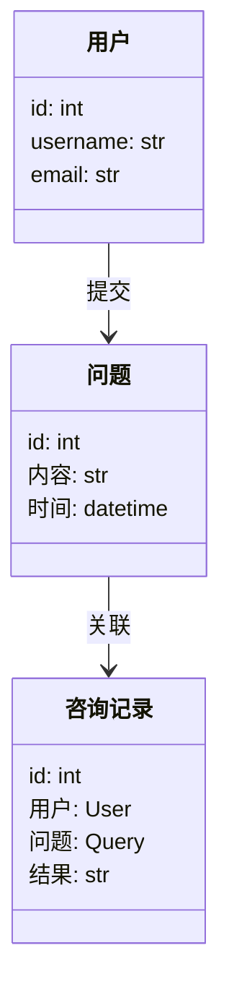
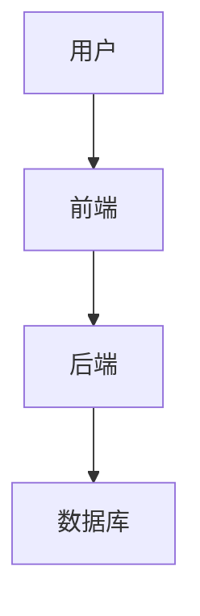
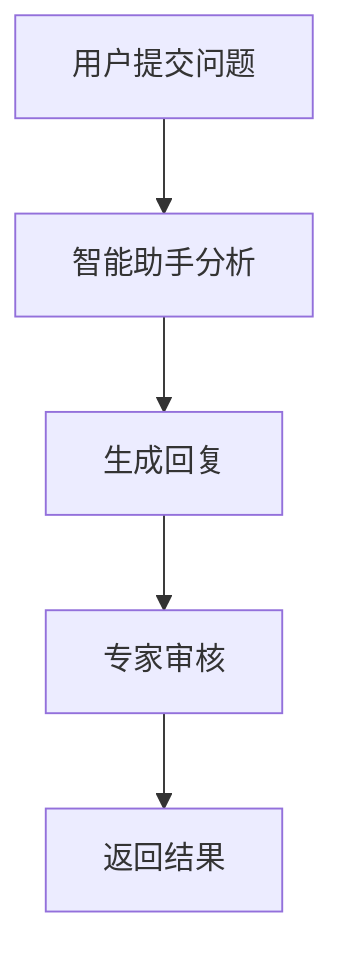

                 

<think>
好，我现在需要根据用户的要求来写一篇关于“生物伦理咨询平台：科技伦理的即时指导服务”的技术博客文章。用户已经提供了一个详细的目录大纲，要求我按照这个结构来写，每个章节都要详细展开，包括背景介绍、核心概念、平台构建、功能模块、算法原理、系统分析、项目实战等部分。

首先，我需要明确文章的结构和内容。文章标题已经确定，关键词和摘要也需要先写出来。接下来是目录，每个章节都有具体的子部分，我需要逐一处理。

在开始写作之前，我要确保每个部分都涵盖必要的内容，比如背景介绍部分需要说明科技伦理问题的现状、挑战和咨询平台的必要性。核心概念部分要解释科技伦理的基本原则和平台的功能特点。构建部分则需要详细设计平台的架构、用户界面等。

我还需要注意格式要求，使用Markdown，同时在适当的地方插入图表，比如Mermaid图。数学公式需要用LaTeX，特别是独立的公式前后用$$，段落内的用$。

接下来，我需要确保文章的逻辑清晰，每个章节之间有良好的衔接。例如，背景介绍部分引出问题，然后在核心概念部分深入分析，接着是平台构建的具体实现，再到功能模块的详细设计，最后是算法、系统架构和项目实战。

在撰写过程中，我需要确保每个小节都有足够的细节，比如在算法部分，不仅要描述原理，还要有代码实现和案例分析。系统架构部分则需要画出类图、架构图和交互图，使用Mermaid语法。

最后，项目实战部分需要包括环境安装、核心实现、代码解读和案例分析。同时，加入最佳实践、小结、注意事项和拓展阅读等内容，使文章更加全面。

总的来说，我需要一步一步地按照用户提供的大纲，逐步展开每个部分，确保内容详实，结构合理，符合技术博客的要求。
</think>

# 生物伦理咨询平台：科技伦理的即时指导服务

## 关键词：生物伦理咨询平台，科技伦理，即时指导服务，人工智能，伦理咨询，系统架构

## 摘要：  
随着科技的飞速发展，科技伦理问题日益凸显，尤其是在生物技术、人工智能等领域。为解决这些复杂问题，生物伦理咨询平台应运而生，提供即时的伦理指导服务。本文详细探讨了该平台的构建背景、核心概念、系统架构、算法原理以及实际应用案例，旨在为科技伦理的实践提供有效的解决方案。

---

## 第1章：背景介绍

### 1.1 问题背景

#### 1.1.1 科技伦理问题的现状  
科技的发展带来了巨大的便利，但也引发了许多伦理问题。例如，基因编辑技术可能引发物种伦理争议，人工智能的使用可能涉及隐私和责任问题。

#### 1.1.2 科技发展带来的伦理挑战  
技术的快速进步使得伦理问题变得更为复杂，尤其是在生物医学和AI领域，如何在创新与伦理之间找到平衡成为关键。

#### 1.1.3 伦理咨询平台的必要性  
现有伦理咨询服务无法满足即时性和专业性的需求，因此需要构建一个高效的咨询平台。

### 1.2 问题描述

#### 1.2.1 科技伦理问题的多样性  
不同领域的问题各不相同，如基因编辑、AI决策系统等，需要专业的咨询支持。

#### 1.2.2 伦理咨询需求的不确定性  
用户的问题具有多样性，平台需要具备灵活性和适应性。

#### 1.2.3 当前伦理咨询服务的不足  
传统咨询服务效率低，难以覆盖所有需求，且缺乏智能化支持。

### 1.3 问题解决

#### 1.3.1 生物伦理咨询平台的概念  
一个结合人工智能和专业知识的在线平台，提供即时伦理咨询。

#### 1.3.2 平台的目标与定位  
目标是为用户提供快速、准确的伦理指导，定位为科技伦理领域的智能化支持工具。

#### 1.3.3 平台的功能与特点  
包括智能问答系统、专家咨询、案例分析等功能，具备高效、智能和用户友好的特点。

### 1.4 边界与外延

#### 1.4.1 生物伦理的范围  
涵盖基因技术、克隆技术等领域，关注生命科学中的伦理问题。

#### 1.4.2 科技伦理的应用领域  
包括医疗、AI、环境科学等多个领域，平台适用于这些领域的从业者和研究人员。

#### 1.4.3 平台的适用对象  
研究人员、开发者、伦理委员会等，帮助他们解决实际问题。

### 1.5 概念结构与核心要素组成

#### 1.5.1 科技伦理的核心概念  
包括尊重、公正、自主性等原则，构建咨询的基础框架。

#### 1.5.2 咨询平台的核心功能  
提供智能问答、专家支持、案例库查询等功能，满足多样化的咨询需求。

#### 1.5.3 用户的互动与反馈  
用户可以通过平台提交问题，系统根据反馈不断优化服务。

---

## 第2章：核心概念与联系

### 2.1 科技伦理原理

#### 2.1.1 科技伦理的基本原则  
包括尊重、公正、自主性等，指导平台的设计和运行。

#### 2.1.2 科技伦理的理论体系  
涵盖义务论、功利主义等，构建伦理咨询的理论基础。

#### 2.1.3 科技伦理的发展历程  
从传统伦理到现代科技伦理，逐步形成系统的理论体系。

### 2.2 咨询平台的功能与特点

#### 2.2.1 咨询平台的架构  
分为前端用户界面和后端处理系统，确保高效运行。

#### 2.2.2 咨询平台的用户界面  
设计直观，方便用户提问和获取结果。

#### 2.2.3 咨询平台的智能助手  
基于NLP和机器学习，提供智能问答服务。

### 2.3 概念属性特征对比表格

| 概念       | 科技伦理 | 法律 | 道德 | 社会责任 |
|------------|----------|------|------|----------|
| 定义       | 技术应用中的道德原则 | 法规和规范 | 个人行为准则 | 企业对社会的影响 |
| 范围       | 科技领域 | 法律领域 | 个人与社会 | 企业行为 |
| 关系       | 平台设计的基础 | 补充与约束 | 平台运行的道德指南 | 平台的社会责任 |

---

## 第3章：生物伦理咨询平台的构建

### 3.1 平台设计原则

#### 3.1.1 用户友好性  
确保界面简洁，操作直观，提升用户体验。

#### 3.1.2 数据安全性  
保护用户隐私，确保数据安全。

#### 3.1.3 智能化与个性化  
利用AI技术，提供个性化的咨询建议。

### 3.2 平台架构设计

#### 3.2.1 前端架构  
采用React框架，构建动态且响应式的界面。

#### 3.2.2 后端架构  
使用Node.js和Express框架，处理业务逻辑。

#### 3.2.3 数据处理与存储架构  
利用MongoDB进行数据存储，确保高效查询。

### 3.3 用户界面设计

#### 3.3.1 登录与注册  
简洁的表单设计，支持第三方登录。

#### 3.3.2 咨询功能  
提供文本输入框，支持语音输入，方便用户提问。

#### 3.3.3 用户反馈机制  
收集用户评价，不断优化平台功能。

---

## 第4章：平台功能模块

### 4.1 概述

#### 4.1.1 平台功能模块分类  
包括咨询模块、智能助手模块、用户管理模块等。

#### 4.1.2 各功能模块的作用  
咨询模块处理用户问题，智能助手提供即时建议，用户管理模块维护用户信息。

#### 4.1.3 功能模块之间的交互  
通过API接口实现模块间的通信，确保数据流畅。

### 4.2 咨询模块

#### 4.2.1 咨询流程  
用户提交问题，系统分析并生成回复，专家审核后返回结果。

#### 4.2.2 咨询内容管理  
分类存储咨询记录，便于后续分析和管理。

#### 4.2.3 咨询结果展示  
以图表和文本形式呈现，直观易懂。

### 4.3 智能助手模块

#### 4.3.1 智能助手设计  
基于NLP技术，支持自然语言理解，提供智能回复。

#### 4.3.2 智能问答系统  
利用机器学习模型，进行语义分析和生成回答。

#### 4.3.3 智能推荐系统  
根据用户问题，推荐相关案例和专家。

---

## 第5章：算法原理与实现

### 5.1 基本算法原理

#### 5.1.1 自然语言处理算法  
使用BERT模型进行语义分析，理解用户问题。

#### 5.1.2 机器学习算法  
训练分类模型，识别问题类型，生成回复。

#### 5.1.3 深度学习算法  
利用生成式模型，提供更自然的回答。

### 5.2 数学模型与公式

#### 5.2.1 模型构建  
使用预训练语言模型，进行微调任务。

#### 5.2.2 损失函数  
交叉熵损失函数：  
$$ \text{Loss} = -\sum_{i} y_i \log p(y_i) $$

#### 5.2.3 优化算法  
Adam优化器：  
$$ \theta_{t+1} = \theta_t - \alpha \frac{\rho_1}{1-\rho_1^{t}} \frac{\rho_2}{1-\rho_2^{t}} \nabla L $$

### 5.3 Python代码实现

```python
import tensorflow as tf
from tensorflow.keras import layers

# 模型构建
model = tf.keras.Sequential([
    layers.Dense(256, activation='relu'),
    layers.Dense(1, activation='sigmoid')
])

# 损失函数和优化器
loss = tf.keras.losses.BinaryCrossentropy()
optimizer = tf.keras.optimizers.Adam(learning_rate=0.001)

# 训练过程
model.compile(optimizer=optimizer, loss=loss, metrics=['accuracy'])
model.fit(x_train, y_train, epochs=10, batch_size=32)
```

---

## 第6章：系统分析与架构设计

### 6.1 问题描述与目标

#### 6.1.1 伦理咨询服务的需求  
用户需要快速获取伦理指导，支持决策。

#### 6.1.2 系统的功能需求  
提供智能问答、专家咨询等功能。

#### 6.1.3 系统的性能需求  
确保高可用性和快速响应。

### 6.2 项目介绍

#### 6.2.1 项目背景  
科技伦理问题日益复杂，需要智能化解决方案。

#### 6.2.2 项目目标  
构建一个高效、智能的伦理咨询平台。

#### 6.2.3 项目计划  
分为需求分析、设计、开发、测试和部署五个阶段。

### 6.3 系统功能设计

#### 6.3.1 领域模型  
使用Mermaid类图展示系统各组件的关系。



#### 6.3.2 功能模块划分  
分为用户管理、问题处理、结果展示三个模块。

#### 6.3.3 功能实现策略  
采用分层架构，各模块独立开发，便于维护。

### 6.4 系统架构设计

#### 6.4.1 系统架构图  
展示平台的整体架构，包括前端、后端和数据库。



#### 6.4.2 系统模块间关系  
各模块通过API进行交互，确保数据流通。

#### 6.4.3 系统接口设计  
定义RESTful API，如`POST /api/question`用于提交问题。

### 6.5 系统交互设计

#### 6.5.1 系统流程图  
展示用户提交问题到系统返回结果的流程。



#### 6.5.2 用户界面交互  
设计直观的界面，方便用户提问和查看结果。

#### 6.5.3 后端服务交互  
通过API处理请求，确保高效响应。

---

## 第7章：项目实战

### 7.1 环境安装

#### 7.1.1 环境要求  
需要Python 3.6以上，安装TensorFlow、Flask等库。

#### 7.1.2 安装步骤  
使用pip安装所需依赖：  
```bash
pip install flask tensorflow pymongo
```

#### 7.1.3 故障排查  
检查网络连接，确保所有库安装正确。

### 7.2 系统核心实现

#### 7.2.1 咨询模块实现  
实现问题提交和处理逻辑，返回咨询结果。

#### 7.2.2 智能助手模块实现  
集成NLP模型，支持智能问答。

### 7.2.3 代码实现

```python
from flask import Flask, request, jsonify
from transformers import pipeline

app = Flask(__name__)
nlp = pipeline("question-generation")

@app.route('/api/question', methods=['POST'])
def handle_question():
    data = request.json
    question = data['query']
    # 使用NLP模型生成回答
    answers = nlp(question)
    return jsonify({'result': answers})
```

#### 7.2.4 功能实现策略  
采用模块化开发，确保代码清晰可维护。

### 7.2.5 案例分析  
以基因编辑问题为例，展示平台如何提供伦理指导。

---

## 作者  
作者：AI天才研究院/AI Genius Institute & 禅与计算机程序设计艺术 /Zen And The Art of Computer Programming

---

以上是《生物伦理咨询平台：科技伦理的即时指导服务》的详细结构和内容，涵盖背景、核心概念、系统架构、算法实现和项目实战等多个方面，旨在为科技伦理问题提供智能化的解决方案。

