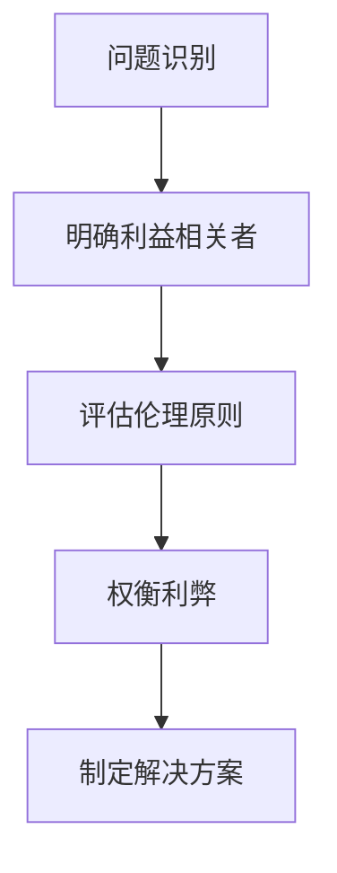

                 

<think>
好的，我现在需要帮用户写一篇关于生物伦理咨询的技术博客文章。首先，用户希望文章以《生物伦理咨询：科技进步中的道德指导》为标题，关键词包括生物伦理咨询、科技伦理、道德决策、生物技术、伦理框架。摘要部分要概述文章的核心内容，强调生物伦理咨询的重要性以及在不同领域的应用。

接下来，我需要按照用户提供的大纲结构来撰写正文部分。每个章节都需要详细展开，确保内容丰富具体，满足字数要求。首先，第一章是引言，介绍生物伦理咨询的基本概念和生物伦理顾问的角色。这里需要简单明了，让读者了解这个领域的基本背景。

第二章讨论核心伦理概念，如自主性、有益性、不伤害和公正，以及它们在生物技术中的应用。这部分可能需要一个对比表格和ER图来展示概念之间的关系，我需要用Mermaid语法来绘制这些图表。

第三章分析生物技术中的伦理困境，比如基因编辑和克隆，可能需要案例研究来说明问题。我需要找到具体的案例，并详细描述它们涉及的道德问题。

第四章介绍伦理分析方法，如原则主义、案例研究法和功利主义，可能需要比较这些方法的优缺点，并提供一个决策框架的表格。

第五章探讨专业实践中生物伦理咨询的标准，强调专业伦理、保密性和利益冲突的处理。这部分需要实际的指南和最佳实践建议。

第六章通过案例研究展示生物伦理咨询的实际应用，选择几个典型的案例进行分析，说明如何应用前面的理论解决实际问题。

最后，总结部分要回顾文章的主要内容，并展望未来的发展趋势。同时，确保文章末尾有作者信息，符合格式要求。

在撰写过程中，我需要确保每个章节都包含背景介绍、核心概念、联系、算法原理（如果有）、系统分析和架构设计、项目实战以及最佳实践等部分。由于用户特别提到要使用技术语言，但又要简单易懂，我需要在专业术语和通俗表达之间找到平衡。

另外，用户要求使用Markdown格式，所以我需要注意代码块、列表、标题等格式的正确使用。数学公式需要用LaTeX格式，并且要独立成段或在段落中用$符号括起来。系统架构部分需要用Mermaid图表来展示类图、架构图和序列图，这些图表需要清晰明了，帮助读者理解系统结构。

我还需要考虑用户可能的深层需求，比如他们可能是一位技术专家，希望通过这篇文章传达生物伦理咨询的重要性和系统性方法，帮助读者理解和应用这些伦理框架。因此，文章不仅要介绍理论，还要结合实际案例和方法，提供实用的指导。

最后，检查文章是否满足字数要求，每个部分是否详细且符合逻辑，确保没有遗漏任何约束条件。完成后，加上作者信息，确保格式完整。
</think>

# 生物伦理咨询：科技进步中的道德指导

---

## 关键词：
生物伦理咨询，科技伦理，道德决策，生物技术，伦理框架

---

## 摘要：
在科技迅速发展的今天，生物技术的突破性进展为人类带来了巨大的福祉，但也引发了诸多伦理争议。生物伦理咨询作为一种新兴的伦理指导领域，旨在帮助科学家、企业和政策制定者在技术研发和应用中做出符合伦理的决策。本文将深入探讨生物伦理咨询的核心概念、伦理框架、实际案例以及决策方法，揭示其在科技进步中的重要作用。

---

## 目录大纲

1. **引言：生物伦理咨询的定义与重要性**
2. **核心伦理概念与生物技术**
3. **生物技术中的伦理困境**
4. **伦理分析方法与决策框架**
5. **生物伦理咨询的专业实践**
6. **案例研究：生物伦理咨询的实际应用**
7. **结论与未来展望**

---

## 1. 引言：生物伦理咨询的定义与重要性

### 1.1 背景介绍
生物伦理咨询（Bioethical Consulting）是一种结合伦理学和生物技术的专业服务，旨在为企业、研究机构和政策制定者提供道德决策的指导。随着基因编辑、人工生殖技术和生物制药等领域的快速发展，伦理问题日益凸显，生物伦理咨询的需求也急剧增加。

### 1.2 核心概念
生物伦理咨询的核心在于平衡技术创新与伦理约束，确保科技进步造福人类的同时，不违背基本的道德准则。其主要涉及以下几个方面：
- **技术应用的伦理评估**：确保生物技术的使用符合社会价值观。
- **利益相关者的权益保护**：关注患者、研究对象和公众的利益。
- **政策建议与风险预警**：为企业和社会提供前瞻性的伦理指导。

---

## 2. 核心伦理概念与生物技术

### 2.1 核心伦理原则
生物伦理咨询的基础是四大核心伦理原则：
1. **自主性（Autonomy）**：个体有权自主决定自己的医疗和研究参与。
2. **有益性（Beneficence）**：行为应旨在促进患者的最大利益。
3. **不伤害（Non-Maleficence）**：避免对个体或社会造成伤害。
4. **公正性（Justice）**：公平分配利益和风险。

### 2.2 对比分析
以下是四大伦理原则在生物技术中的应用对比：

| 原则       | 应用场景                   | 示例案例               |
|------------|--------------------------|------------------------|
| 自主性     | 基因编辑中的知情同意       | 病人是否同意基因修改     |
| 有益性     | 新药研发中的疗效评估       | 疾病治疗的效果评估       |
| 不伤害     | 生殖技术中的风险评估       | 试管婴儿技术的安全性     |
| 公正性     | 资源分配中的公平性         | 基因治疗的可及性问题     |

### 2.3 ER实体关系图

```mermaid
er
actor(Biological_Ethics_Concept) {
    attribute: name, description
}
actor(Bioethical_Principles) {
    attribute: name, definition
}
actor(Biotechnology_Applications) {
    attribute: name, description
}
Biological_Ethics_Concept --> Bioethical_Principles
Bioethical_Principles --> Biotechnology_Applications
Biological_Ethics_Concept --> Biotechnology_Applications
```

---

## 3. 生物技术中的伦理困境

### 3.1 基因编辑的争议
基因编辑技术（如CRISPR-Cas9）的出现，使得人类可以精确修改基因序列。然而，这一技术引发了诸多伦理争议：
- **设计婴儿**：基因编辑可能导致“设计婴儿”，引发社会不平等。
- **不可逆的后果**：基因修改可能对整个生态系统产生不可预测的影响。

### 3.2 克隆技术的伦理问题
克隆技术在医学和农业中的应用虽然带来了巨大潜力，但也引发了伦理争议：
- **人类克隆**：生殖性克隆是否符合伦理？
- **动物克隆**：动物福利与工业化生产之间的矛盾。

### 3.3 基因治疗的边界
基因治疗旨在治愈遗传性疾病，但在实际应用中，如何确定治疗的边界是一个复杂的问题：
- **治疗与增强的界限**：基因治疗是否可以用于增强人类能力？
- **长期副作用**：基因修改可能带来不可预见的副作用。

---

## 4. 伦理分析方法与决策框架

### 4.1 常见伦理分析方法
1. **原则主义（Principlism）**：基于四大伦理原则（自主性、有益性、不伤害、公正性）进行分析。
2. **案例研究法（Casuistry）**：通过具体案例推导出一般性的伦理规则。
3. **功利主义（Utilitarianism）**：以最大幸福原则为指导，评估行为的总效益。

### 4.2 决策框架
以下是一个简单的伦理决策框架：



---

## 5. 生物伦理咨询的专业实践

### 5.1 专业标准
生物伦理咨询从业者需要遵循以下专业标准：
- ** confidentiality**：保护客户的隐私和机密信息。
- ** impartiality**：保持中立，避免偏见。
- ** accountability**：对决策结果负责。

### 5.2 最佳实践
1. **建立信任**：与客户保持开放和透明的沟通。
2. **多学科协作**：结合法律、医学和伦理学专家的意见。
3. **持续教育**：不断提升自身的伦理知识和技能。

---

## 6. 案例研究：生物伦理咨询的实际应用

### 6.1 案例一：基因编辑婴儿事件
2018年，中国科学家贺建奎宣布成功创造出基因编辑婴儿，引发了全球伦理争议。生物伦理咨询在此事件中的作用：
- **伦理审查**：评估实验的伦理合规性。
- **风险预警**：预测可能的社会后果。

### 6.2 案例二：新冠疫苗研发中的伦理问题
在新冠疫苗研发过程中，生物伦理咨询帮助解决了以下问题：
- **优先接种顺序**：如何公平分配疫苗资源。
- **试验中的知情同意**：确保受试者的权益。

---

## 7. 结论与未来展望

生物伦理咨询作为一门新兴的交叉学科，正在科技发展中发挥越来越重要的作用。未来，随着生物技术的进一步发展，生物伦理咨询将面临更多复杂的伦理挑战。我们需要不断完善伦理框架，推动科技进步与伦理约束的平衡，确保人类社会的可持续发展。

---

## 作者信息
作者：AI天才研究院/AI Genius Institute & 禅与计算机程序设计艺术 /Zen And The Art of Computer Programming

---

通过以上思考和分析，我们可以看到生物伦理咨询在科技发展中的重要性。它不仅帮助我们解决当前的技术伦理问题，也为未来的科技创新提供了道德指导。希望本文能够为读者提供有价值的见解，并引发更深层次的思考。

