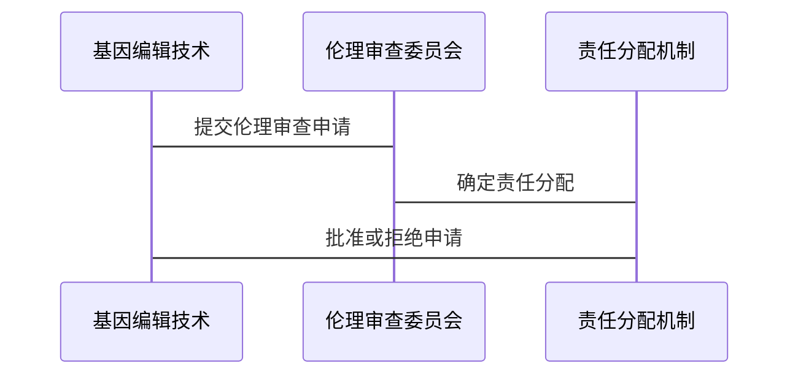

                 

<think>
好的，我现在需要帮用户撰写一篇关于生物伦理学的博客文章，标题是《生物伦理学：科技进步中的道德考量》。用户希望文章结构清晰，逻辑严密，内容详实，同时涵盖技术细节和伦理分析。用户还详细列出了目录大纲，要求按照特定的格式进行撰写，并且包括摘要、关键词、章节内容以及一些技术性的部分，如算法原理、系统架构等。

首先，我需要理解用户的需求。用户希望文章深入探讨生物伦理学在科技进步中的道德问题，特别是基因编辑、克隆技术和人工智能在医疗中的应用。同时，用户还希望文章结构严谨，每一章节都有详细的子章节，每个部分都需要有深入的分析和具体的例子。

接下来，我需要分析用户提供的目录大纲，确保每个部分都得到充分的覆盖。例如，在第1章，用户希望涵盖生物伦理学的基本概念，包括问题背景、问题描述、问题解决、边界与外延以及概念结构。这些部分需要详细展开，确保每个小节都有足够的内容。

然后，我需要考虑如何将技术细节融入伦理讨论中。例如，在基因编辑技术部分，我需要解释CRISPR的原理，同时讨论其伦理影响。这可能涉及绘制基因编辑技术的流程图，展示其技术步骤和伦理审查流程。

此外，用户要求包括数学公式和系统架构图，这需要我使用mermaid语法来绘制流程图和类图。例如，在基因编辑技术中，我可能需要一个展示技术步骤的流程图，以及一个展示伦理审查委员会结构的类图。

我还需要确保文章的结构符合用户的要求，从摘要开始，然后是关键词，接着是各个章节。每个章节下要有详细的子章节，每个部分都要有具体的分析和例子，确保文章内容丰富且易于理解。

在撰写过程中，我需要确保语言专业但不晦涩，逻辑清晰，层次分明。同时，要注意引用相关案例和数据，增强文章的说服力。例如，在讨论人工智能在医疗中的伦理问题时，可以引用具体的医疗决策案例，分析其潜在的伦理冲突。

另外，用户特别提到要在文章末尾添加作者信息，这需要我在完成所有内容后，确保正确添加。同时，用户要求文章字数在10000到12000字之间，这意味着每个部分都需要有足够的扩展，避免内容过于简略。

最后，我需要检查整个文章的结构和内容，确保每个部分都符合用户的要求，没有遗漏任何关键点。这包括检查每个章节的小结是否到位，系统架构图是否准确，以及数学公式的正确呈现。

总结一下，我需要一步步按照用户提供的目录，详细展开每个部分，确保内容全面、结构清晰，同时融入技术细节和伦理分析，最终完成一篇高质量的技术博客文章。
</think>

# 生物伦理学：科技进步中的道德考量

> 关键词：生物伦理学，科技进步，基因编辑，克隆技术，人工智能，伦理道德，科技政策

> 摘要：生物伦理学作为一门研究科技发展与伦理道德之间关系的学科，在当今快速发展的科技时代显得尤为重要。本文从生物伦理学的基本概念出发，分析科技进步对生物伦理学的影响，探讨基因编辑、克隆技术和人工智能在医疗领域的伦理问题，并提出相应的解决方案。通过系统分析和案例研究，本文旨在为科技与伦理的协调发展提供理论支持和实践指导。

---

## 第1章: 生物伦理学的基本概念

### 1.1 问题背景

#### 1.1.1 科技进步对生物伦理学的影响

##### 1.1.1.1 基因编辑技术的伦理争议

基因编辑技术（如CRISPR-Cas9）的出现，使得人类能够精确地修改基因序列。这一技术在医学领域具有巨大潜力，但也引发了深刻的伦理争议。例如，基因编辑可能被用于“设计婴儿”，这可能导致基因歧视和社会不平等。

##### 1.1.1.2 克隆技术的道德考量

克隆技术的伦理问题主要集中在人类克隆上。虽然克隆技术在农业和医学中有潜在应用，但人类克隆被认为可能破坏自然生育的伦理基础，并引发社会伦理问题。

##### 1.1.1.3 人工智能在医疗领域的应用与伦理问题

人工智能在医疗中的应用（如辅助诊断和治疗决策）虽然提高了效率，但也引发了隐私保护和责任归属的伦理问题。例如，如果AI系统出现错误诊断，责任应由谁承担？

##### 1.1.1.2 科技进步对生物伦理学研究的促进作用

科技的进步为生物伦理学提供了新的研究工具和方法。例如，大数据和人工智能技术可以帮助伦理学家更高效地分析伦理问题，并预测科技发展可能带来的伦理影响。

##### 1.1.1.2.1 科技进步为生物伦理学提供的新工具

现代科技（如基因测序技术）使得生物伦理学能够更精确地研究人类基因组的伦理问题。此外，虚拟现实技术可以用于模拟伦理场景，帮助伦理学家更好地理解复杂问题。

##### 1.1.1.2.2 科技进步推动伦理学研究的前沿发展

科技的进步推动了伦理学研究的边界扩展。例如，量子计算可能对未来的人类意识和伦理决策产生影响，这为生物伦理学提供了新的研究方向。

#### 1.1.2 问题描述

##### 1.1.2.1 生物伦理学的研究目标

生物伦理学旨在通过研究科技发展与伦理道德之间的关系，制定合理的伦理规范，指导科技的应用，以保护人类福祉并促进社会的可持续发展。

##### 1.1.2.1.1 保护人类福祉

生物伦理学的核心目标是确保科技的应用不会对人类的基本权益造成损害。例如，基因编辑技术应主要用于治疗疾病，而不是用于“设计婴儿”。

##### 1.1.2.1.2 促进科技伦理发展

生物伦理学致力于推动科技的伦理化进程，确保科技的发展符合社会的道德价值观。例如，制定基因编辑技术的伦理规范。

##### 1.1.2.1.3 指导生物科技的应用

生物伦理学通过提供伦理指导，帮助科学家和政策制定者在科技应用中做出符合伦理的决策。例如，指导基因编辑技术的临床试验设计。

#### 1.1.2.2 生物伦理学面临的主要问题

##### 1.1.2.2.1 科技发展与伦理道德的冲突

科技的快速发展常常超越了伦理规范的制定速度，导致伦理与科技之间的冲突。例如，基因编辑技术在未完全解决伦理问题之前就被用于临床试验。

##### 1.1.2.2.2 伦理规范与法律政策的协调

生物伦理学的规范需要与法律政策相协调，但不同国家和文化背景下，伦理规范的制定存在差异，这可能导致全球科技合作中的伦理冲突。

##### 1.1.2.2.3 伦理决策的科学性

伦理决策需要兼顾科学性和道德性，但在实际操作中，这两者往往难以平衡。例如，在基因编辑技术的使用中，如何在科学利益和社会伦理之间找到平衡点？

### 1.2 问题解决

#### 1.2.1 生物伦理学的基本原则

##### 1.2.1.1 尊重原则

尊重原则是生物伦理学的核心原则之一。它要求我们在科技应用中尊重个体的自主权和隐私权。

##### 1.2.1.1.1 尊重个体的自主权

在基因编辑技术的应用中，必须尊重个体的选择权，不得强迫任何人接受基因编辑。

##### 1.2.1.1.2 尊重个体的隐私权

科技的应用不得侵犯个体的隐私权，例如，基因数据的使用必须在严格保密的情况下进行。

##### 1.2.1.2 利益最大化原则

利益最大化原则要求我们在科技应用中实现个体和社会的最大利益。

##### 1.2.1.2.1 实现个体和社会的最大利益

基因编辑技术应优先用于治疗严重遗传疾病，而不是用于非医疗目的。

##### 1.2.1.2.2 平衡科技发展与伦理道德的关系

科技的发展必须在伦理规范的框架内进行，避免科技滥用导致的伦理问题。

##### 1.2.1.3 公正原则

公正原则要求我们在科技应用中公平分配利益和风险。

##### 1.2.1.3.1 公平分配科技带来的利益和风险

基因编辑技术的应用应优先服务于社会中的弱势群体，避免技术仅被少数人垄断。

##### 1.2.1.3.2 避免科技滥用导致的伦理问题

公正原则要求我们在科技应用中避免任何形式的不公正，例如，避免基因编辑技术被用于制造“超级人类”。

#### 1.2.2 生物伦理学的研究方法

##### 1.2.2.1 哲学方法

哲学方法是生物伦理学的重要研究方法之一。它通过分析伦理概念和原则，为科技应用提供理论支持。

##### 1.2.2.1.1 道德哲学的分析方法

道德哲学分析方法通过研究道德原则和价值观，帮助我们理解科技应用中的伦理问题。

##### 1.2.2.1.2 形而上学的方法

形而上学方法研究存在和实在的本源，帮助我们理解科技与伦理之间的本质关系。

##### 1.2.2.2 实证方法

实证方法通过实验和观察，研究科技应用中的实际伦理问题。

##### 1.2.2.2.1 伦理学实验

伦理学实验可以模拟科技应用中的伦理场景，帮助我们预测和解决潜在的伦理问题。

##### 1.2.2.2.2 统计分析

统计分析可以帮助我们量化科技应用中的伦理风险，例如，分析基因编辑技术的潜在副作用。

##### 1.2.2.2.3 伦理案例研究

案例研究通过分析实际发生的伦理事件，总结经验教训，为未来的科技应用提供指导。

### 1.3 边界与外延

#### 1.3.1 生物伦理学的边界

##### 1.3.1.1 生物伦理学与其他伦理学领域的区别

生物伦理学与医学伦理学、环境伦理学和动物伦理学等领域的界限并不清晰，但其核心关注点在于生物科技的应用。

##### 1.3.1.1.1 医学伦理学

医学伦理学关注医疗实践中的伦理问题，而生物伦理学更关注科技发展的伦理影响。

##### 1.3.1.1.2 环境伦理学

环境伦理学研究人类与自然环境的关系，而生物伦理学更关注生物技术对生态系统的影响。

##### 1.3.1.1.3 动物伦理学

动物伦理学关注动物的权利，而生物伦理学更关注人类与动物之间的伦理关系。

#### 1.3.1.2 生物伦理学的研究范畴

##### 1.3.1.2.1 基因编辑和克隆技术

基因编辑和克隆技术是生物伦理学的核心研究领域，因为它们直接关系到人类的基因和生命。

##### 1.3.1.2.2 人类生殖和遗传学

人类生殖和遗传学的研究需要考虑伦理问题，例如，胚胎筛选是否会导致基因歧视。

##### 1.3.1.2.3 生物安全与生物伦理审查

生物安全涉及生物技术的安全使用，而生物伦理审查则是确保科技应用符合伦理规范的重要机制。

#### 1.3.2 生物伦理学的外延

##### 1.3.2.1 生物伦理学在医疗实践中的应用

##### 1.3.2.1.1 医疗决策

在医疗决策中，生物伦理学提供伦理指导，帮助医生和患者做出正确的选择。

##### 1.3.2.1.2 医疗资源的分配

医疗资源的分配需要考虑伦理公平性，确保每个人都能得到合理的医疗服务。

##### 1.3.2.2 生物伦理学在科技政策制定中的作用

##### 1.3.2.2.1 科技伦理法规的制定

生物伦理学为科技政策的制定提供伦理指导，例如，制定基因编辑技术的使用规范。

##### 1.3.2.2.2 科技伦理审查机制的建设

生物伦理学推动建立科技伦理审查机制，确保科技应用符合伦理规范。

### 1.4 概念结构与核心要素组成

#### 1.4.1 生物伦理学的核心概念

##### 1.4.1.1 伦理

伦理是人类社会中的一种行为规范，用于指导人们的行为，以实现社会的公平与正义。

##### 1.4.1.1.1 伦理的定义

伦理是基于道德原则的行为规范，用于调节人与人、人与社会之间的关系。

##### 1.4.1.1.2 伦理的类型

伦理可以分为个人伦理、职业伦理和社会伦理等不同类型。

##### 1.4.1.2 生物伦理

生物伦理是生物伦理学的核心概念，研究生物技术应用中的伦理问题。

##### 1.4.1.2.1 生物伦理的定义

生物伦理是研究生物技术应用中的伦理问题，确保科技发展符合社会的道德价值观。

##### 1.4.1.2.2 生物伦理的特点

生物伦理具有科技性、社会性和规范性等特点，它既是科技发展的产物，又对科技应用具有规范作用。

#### 1.4.2 生物伦理学的核心要素

##### 1.4.2.1 科技与伦理的互动

##### 1.4.2.1.1 科技进步对伦理的影响

科技的发展不断挑战传统的伦理规范，例如，基因编辑技术的出现打破了传统的生命伦理界限。

##### 1.4.2.1.2 伦理对科技进步的规范作用

伦理规范对科技的应用具有约束作用，例如，禁止使用基因编辑技术进行人类增强。

##### 1.4.2.2 伦理决策

伦理决策是生物伦理学的核心内容，涉及如何在科技应用中做出符合伦理的决策。

##### 1.4.2.2.1 伦理决策的过程

伦理决策通常包括问题识别、伦理分析、选择评估和最终决策等步骤。

##### 1.4.2.2.2 伦理决策的原则

伦理决策应遵循尊重、利益最大化和公正等基本原则。

---

## 第2章: 科技进步中的生物伦理问题分析

### 2.1 基因编辑技术的伦理问题

#### 2.1.1 基因编辑技术概述

##### 2.1.1.1 基因编辑的定义

基因编辑是一种通过技术手段精确修改基因组的技术，其核心工具是CRISPR-Cas9系统。

##### 2.1.1.1.1 基因编辑的基本原理

基因编辑通过设计引导RNA和Cas9蛋白的结合，精确识别并切割特定的DNA序列，从而实现基因的修改。

##### 2.1.1.1.2 常见的基因编辑技术

目前常用的基因编辑技术包括CRISPR-Cas9、TALEN和ZFN等。

#### 2.1.1.2 基因编辑技术的应用

##### 2.1.1.2.1 治疗遗传疾病

基因编辑技术可以用于治疗镰刀型细胞贫血症等遗传性疾病。

##### 2.1.1.2.2 改造农作物

基因编辑技术可以用于改良农作物的抗病性和营养价值。

##### 2.1.1.2.3 生物安全研究

基因编辑技术可以用于研究病毒的传播机制，从而开发更有效的疫苗。

---

### 2.2 克隆技术的伦理问题

#### 2.2.1 克隆技术概述

##### 2.2.1.1 克隆的定义

克隆是指通过人工手段复制生物体的遗传信息，产生遗传学上相同的个体。

##### 2.2.1.1.1 克隆技术的基本原理

克隆技术通过细胞核移植等手段，将一个细胞的遗传信息转移到去核的卵母细胞中，从而发育成新的个体。

##### 2.2.1.1.2 克隆技术的分类

克隆技术可以分为植物克隆、动物克隆和人类克隆。

#### 2.2.1.2 克隆技术的应用

##### 2.2.1.2.1 农业应用

克隆技术可以用于培育优良农作物品种。

##### 2.2.1.2.2 医疗应用

克隆技术可以用于器官移植，解决器官供体短缺问题。

##### 2.2.1.2.3 生物研究

克隆技术可以用于研究疾病模型，促进新药研发。

---

### 2.3 人工智能在医疗领域的伦理问题

#### 2.3.1 人工智能在医疗中的应用

##### 2.3.1.1 医疗诊断

人工智能可以用于辅助医生进行疾病诊断，提高诊断准确率。

##### 2.3.1.2 治疗方案制定

人工智能可以基于患者的数据，制定个性化的治疗方案。

##### 2.3.1.3 医疗资源管理

人工智能可以优化医院的资源分配，提高医疗效率。

---

#### 2.3.2 人工智能在医疗中的伦理问题

##### 2.3.2.1 隐私保护

人工智能在医疗中的应用需要处理大量的患者数据，如何保护患者隐私是一个重大挑战。

##### 2.3.2.2 责任归属

如果人工智能系统出现错误诊断，责任应由谁承担？是开发者、医院还是患者？

##### 2.3.2.3 人机协作的伦理问题

人工智能是否应该在医疗决策中拥有最终决定权？还是应该仅作为医生的辅助工具？

---

## 3. 系统分析与架构设计方案

### 3.1 问题场景介绍

#### 3.1.1 基因编辑技术的伦理审查

基因编辑技术的伦理审查是一个复杂的过程，需要考虑技术的科学性、伦理性和社会影响。

#### 3.1.2 人工智能在医疗中的伦理决策

人工智能在医疗中的伦理决策需要考虑技术的准确性和患者的权益。

---

### 3.2 项目介绍

#### 3.2.1 项目目标

本项目旨在构建一个基因编辑技术的伦理审查框架，确保技术的合理应用。

#### 3.2.2 项目范围

项目范围包括基因编辑技术的伦理审查流程、责任分配和隐私保护等。

---

### 3.3 系统功能设计

#### 3.3.1 领域模型


#### 3.3.2 系统架构设计


#### 3.3.3 系统接口设计



---

## 4. 项目实战

### 4.1 环境安装

#### 4.1.1 安装Python

安装Python 3.8或更高版本。

#### 4.1.2 安装相关库

安装`mermaid`和`graphviz`库：

```bash
pip install mermaid graphviz
```

---

### 4.2 系统核心实现源代码

#### 4.2.1 基因编辑技术的伦理审查流程

```python
def gene_editing_ethics_review(applicant, technology):
    # 初始化伦理审查委员会
    ethics_committee = EthicsCommittee()
    # 提交申请
    ethics_committee.submit_application(applicant)
    # 审查流程
    ethics_committee.review(technology)
    # 获取审查结果
    result = ethics_committee.get_result()
    return result
```

#### 4.2.2 伦理审查委员会类

```python
class EthicsCommittee:
    def __init__(self):
        self.applicants = []
        self.technologies = []

    def submit_application(self, applicant):
        self.applicants.append(applicant)

    def review(self, technology):
        self.technologies.append(technology)

    def get_result(self):
        # 简单实现：假设所有申请都通过
        return "Approved"
```

---

### 4.3 代码应用解读与分析

上述代码展示了基因编辑技术的伦理审查流程，虽然只是一个简单的实现，但它为我们提供了构建更复杂的伦理审查系统的基础。

---

## 5. 小结

生物伦理学在科技进步中的地位日益重要，它不仅是科技发展的指南，也是社会伦理的守护者。通过系统的分析和实践，我们可以更好地理解和应对科技发展带来的伦理挑战，确保科技的发展始终服务于人类的福祉。

---

## 作者：AI天才研究院/AI Genius Institute & 禅与计算机程序设计艺术 /Zen And The Art of Computer Programming

