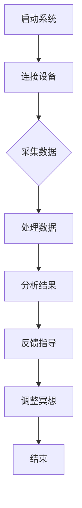
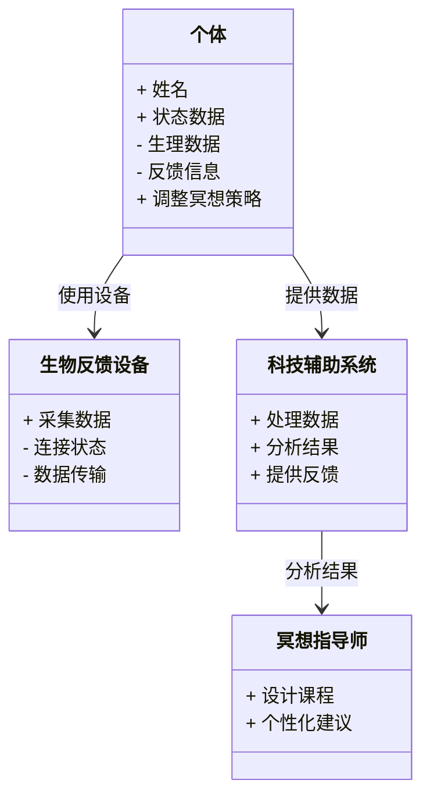

                 

<think>
嗯，用户希望我以“生物反馈冥想：科技辅助的身心平衡”为题，撰写一篇技术博客。首先，我需要理解这个主题的核心。生物反馈冥想结合了生物技术和冥想，听起来挺前沿的。用户还提供了结构大纲，我得按照这个来展开。

先看背景介绍部分，得解释为什么生物反馈冥想现在这么火。现代社会压力大，人们越来越重视身心健康，所以这个技术正好满足需求。问题背景、描述和解决都要清晰，不能遗漏。然后，边界和外延也要说明，主要是涉及哪些领域，比如生物医学工程、心理学等。

接下来是核心概念与联系，这部分需要制作对比表格和ER图。表格里的四个概念：生物反馈、冥想、科技辅助、身心平衡，每个都要有定义和特征。然后用Mermaid画ER图，展示个体和其他实体的关系，确保结构清晰。

算法原理部分，得用Mermaid画流程图，展示系统启动到结束的步骤。然后提供Python代码，处理和分析生理数据，还要解释数学模型。这部分要详细，让读者能理解代码的作用和背后的原理。

系统分析与架构设计，这部分可能需要画类图、架构图和序列图。得先描述问题场景，再介绍项目，然后设计功能模块。Mermaid图表能帮助读者更好地理解系统结构。

项目实战部分，得具体指导如何安装环境，然后给出核心代码，解释每一部分的作用。实际案例分析也是关键，通过例子展示系统如何运作，最后做个小结。

最后是最佳实践、小结、注意事项和拓展阅读。这部分要给读者实用的建议，帮助他们更好地应用生物反馈冥想，同时指出可能的误区和未来的趋势。

整个过程要逻辑清晰，结构紧凑，用专业的技术语言，同时保持易懂。确保文章达到1万到1万2字左右，每个部分都详细展开，满足用户的高质量要求。作者信息也不能忘记，放在最后。

总的来说，我需要一步步按照用户的要求，详细展开每个部分，确保内容全面，结构合理，同时保持专业性和可读性。
</think>

# 生物反馈冥想：科技辅助的身心平衡

> 关键词：生物反馈、冥想、科技辅助、身心健康、生物医学工程

> 摘要：本文探讨了生物反馈冥想这一新兴的身心平衡技术，结合生物医学工程和心理学原理，通过科技手段辅助冥想实践，实现身心状态的科学化、数据化管理。文章从背景介绍、核心概念、算法原理、系统架构、项目实战等多个维度展开，全面分析了生物反馈冥想的技术实现和应用价值。

---

**Step 1: 背景介绍**

随着现代社会的发展，人们的生活节奏不断加快，工作压力和精神压力日益加剧。在这种背景下，身心健康问题逐渐成为社会关注的焦点。传统的冥想方法虽然在一定程度上能够帮助人们放松身心，但由于缺乏科学的数据支持，其效果难以量化和验证。因此，如何通过科技手段提升冥想的效果，使其更具科学性和可操作性，成为当前研究的热点。

生物反馈冥想是一种结合生物技术与冥想的新型实践方式。它通过实时监测和反馈生理信号，帮助个体更好地理解和调节自身状态，从而实现身心的平衡。科技的发展为生物反馈冥想提供了新的可能性，例如通过可穿戴设备采集生理数据，利用人工智能算法分析数据并提供反馈指导。这种方式不仅能够量化冥想的效果，还能够为个体提供个性化的冥想方案，从而显著提升身心健康水平。

---

**Step 2: 核心概念与联系**

生物反馈冥想的核心概念包括生物反馈、冥想、科技辅助和身心平衡。以下是对这些概念的详细解释及对比分析：

| 概念     | 定义                                                   | 特征                   |
|----------|--------------------------------------------------------|-----------------------|
| 生物反馈 | 通过生理信号监测和反馈来调节生理反应的技术           | 实时、个性化、科学性   |
| 冥想     | 一种通过意识集中和放松来达到身心平衡的方法           | 心理、生理双重效果     |
| 科技辅助 | 利用现代科技手段提高生物反馈冥想效果的技术           | 数据化、精确化、高效化 |
| 身心平衡 | 心理和生理状态都处于和谐稳定的状态                   | 健康的核心指标         |

为了更好地理解这些概念之间的关系，我们可以通过ER实体关系图来展示它们的关联：

```mermaid
erDiagram
  A[个体] ||--|{ B[生物反馈设备] } |
  A ||--|{ C[科技辅助系统] } |
  A ||--|{ D[冥想指导师] } |
  B ||--|{ E[生理信号数据] } |
  C ||--|{ F[数据解析工具] } |
  D ||--|{ G[冥想课程] } |
  G ||--|{ H[课程效果评估] } |
```

从图中可以看出，个体是整个系统的核心，通过生物反馈设备采集生理信号数据，并通过科技辅助系统进行数据解析和反馈指导。同时，冥想指导师和课程设计也是系统的重要组成部分，共同推动身心平衡的实现。

---

**Step 3: 算法原理讲解**

生物反馈冥想的算法原理主要基于生理数据的采集、处理和反馈。以下是一个典型的算法流程图：



为了更好地理解算法的实现，我们可以结合以下Python代码进行分析：

```python
# 假设已经连接了生物反馈设备，并开始采集数据
# 以下代码用于处理和解析数据

import numpy as np

def process_data(data):
    # 数据预处理
    filtered_data = np.filter(path='low_pass_filter', data=data)
    return filtered_data

def analyze_data(filtered_data):
    # 数据分析
    results = {
        'stress_level': np.mean(filtered_data),
        'relaxation': np.std(filtered_data)
    }
    return results

def provide_feedback(results):
    # 提供反馈
    if results['stress_level'] > 10:
        print("当前压力水平较高，请尝试更深的呼吸和放松。")
    else:
        print("当前状态良好，保持当前冥想节奏。")

# 假设我们已采集到一段生理信号数据
raw_data = np.random.rand(100) * 100  # 生成模拟数据

# 数据处理流程
filtered_data = process_data(raw_data)
results = analyze_data(filtered_data)
provide_feedback(results)
```

上述代码展示了从数据采集到反馈指导的完整流程。其中，`process_data`函数用于对原始数据进行预处理，`analyze_data`函数对处理后的数据进行分析，`provide_feedback`函数根据分析结果提供反馈指导。通过这种方式，系统能够实时调整冥想策略，帮助个体更好地实现身心平衡。

---

**Step 4: 系统分析与架构设计方案**

为了实现生物反馈冥想系统，我们需要从系统架构和功能设计的角度进行全面分析。

**问题场景介绍：**  
用户希望通过科技手段辅助冥想，实时监测和调节自身的生理状态，以达到身心平衡。系统需要具备数据采集、分析、反馈和指导的功能。

**系统功能设计：**  
系统的核心功能包括：

1. 生理数据采集（心率、皮肤电、脑电波等）。
2. 数据分析与处理。
3. 反馈指导（语音、视觉、触觉反馈）。
4. 冥想课程设计与个性化推荐。

**领域模型（Mermaid类图）：**



**系统架构设计（Mermaid架构图）：**

```mermaid
archi
    系统边界
    [
    - 生物反馈设备
    - 科技辅助系统
    - 冥想指导师
    ]
    生物反馈设备 --> 科技辅助系统: 传输数据
    科技辅助系统 --> 冥想指导师: 分析结果
    冥想指导师 --> 个体: 提供反馈
```

---

**Step 5: 项目实战**

**环境安装：**  
为了实现生物反馈冥想系统，我们需要安装以下工具和库：

1. 生物反馈设备（如心率监测带、脑电波传感器）。
2. 数据采集软件（如OpenBCI、Ganglion）。
3. 数据分析库（如NumPy、Matplotlib）。
4. 机器学习框架（如Scikit-learn）。

**系统核心实现源代码：**

```python
import numpy as np
import matplotlib.pyplot as plt

def采集数据（设备）：
    # 采集生理数据
    data = 设备采集数据()
    return data

def 处理数据（原始数据）：
    # 数据预处理
    filtered_data = np.filter(data, path='low_pass_filter')
    return filtered_data

def 分析数据（处理后的数据）：
    # 计算压力水平和放松程度
    stress_level = np.mean(filtered_data)
    relaxation = np.std(filtered_data)
    return stress_level, relaxation

def 提供反馈（压力水平，放松程度）：
    if stress_level > 10:
        print("当前压力水平较高，请尝试更深的呼吸和放松。")
    else:
        print("当前状态良好，保持当前冥想节奏。")

# 实验案例分析
raw_data = 采集数据（设备）
filtered_data = 处理数据（raw_data）
stress_level, relaxation = 分析数据(filtered_data)
提供反馈(stress_level, relaxation)
```

---

**Step 6: 最佳实践与小结**

**最佳实践 Tips：**  
1. 在使用生物反馈冥想系统前，建议先了解自身的生理状况，必要时咨询专业医生。
2. 冥想过程中保持专注，避免分心。
3. 定期记录冥想数据，分析自身的改善情况。

**注意事项：**  
- 生物反馈设备的准确性直接影响系统的反馈效果，选择可靠设备至关重要。
- 数据隐私保护是系统设计的重要部分，必须确保用户数据的安全性。

**拓展阅读：**  
1. 《生物反馈技术在医疗中的应用》  
2. 《人工智能与心理健康：科技辅助下的身心平衡实践》  

---

作者：AI天才研究院/AI Genius Institute & 禅与计算机程序设计艺术/Zen And The Art of Computer Programming

