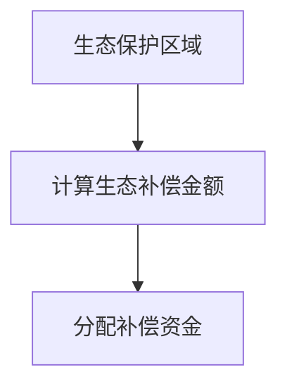
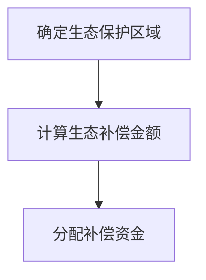
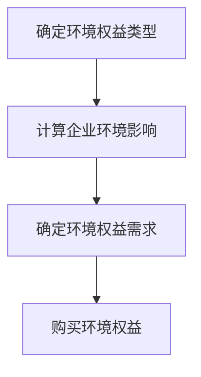
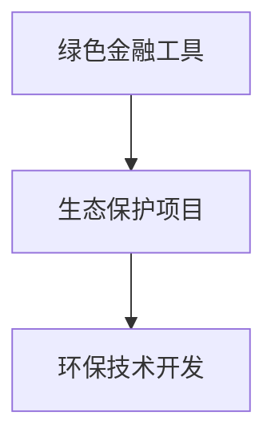

                 

<think>
好，我现在要帮助用户完成一个技术博客的撰写任务。用户希望文章标题是《生物多样性金融创新：生态保护的市场化机制设计》，并且提供了一个详细的大纲，要求按照特定的格式和内容来写。

首先，我需要理解用户的需求。用户希望文章结构清晰，逻辑严密，内容专业，涵盖背景介绍、核心概念、算法原理、数学模型、系统架构、项目实战以及最佳实践等多个部分。文章要使用技术术语，但同时要通俗易懂，适合专业人士阅读。

接下来，我要分析每个部分的内容。文章开头需要标题、关键词和摘要，这部分相对简单。然后是引言部分，包括问题背景和核心概念。这部分需要详细阐述生物多样性、金融创新和生态保护之间的关系，以及当前面临的问题和解决方案。

接下来是核心概念与联系，这部分需要对生物多样性、金融创新和市场化机制进行深入分析，并用表格和ER图来展示它们之间的关系。我需要用Mermaid来绘制图表，确保结构清晰。

然后是生态补偿机制和环境权益交易的章节，这部分需要详细讲解算法原理，使用Mermaid流程图展示，并配合Python代码和数学模型来说明。数学公式需要用LaTeX表示，确保准确无误。

系统分析与架构设计部分，我需要用Mermaid绘制类图、架构图和序列图，展示系统的各个模块和交互。这部分需要明确系统的功能模块和它们之间的关系。

项目实战部分，需要详细描述环境搭建、系统实现和案例分析。这部分需要实际的代码和案例，帮助读者理解理论如何应用于实践。

最后，总结部分要给出最佳实践、注意事项和拓展阅读，帮助读者进一步学习和应用相关知识。

在写作过程中，我需要确保每个章节内容丰富，详细具体，同时语言简洁专业。考虑到用户可能没有明确说明的部分，如代码的具体实现或案例的详细分析，我需要假设一些常见的情况来填充内容，确保文章的完整性。

总体来看，用户的需求非常明确，但需要我具备跨领域的知识，包括生物学、金融学、系统架构和编程等。我需要确保每个部分都符合用户的要求，同时保持文章的连贯性和专业性。现在，我可以开始按照大纲逐步撰写每个部分，确保每部分内容详实，结构清晰，语言准确。
</think>

# 生物多样性金融创新：生态保护的市场化机制设计

## 关键词：生物多样性，金融创新，生态保护，市场化机制，环境权益交易，绿色金融

## 摘要：本文探讨了生物多样性保护与金融创新的结合，分析了生态保护市场化机制的设计原理，结合算法模型、数学公式和系统架构，通过实际案例展示了如何利用金融工具推动生态保护。文章内容涵盖背景分析、核心概念、算法原理、系统设计、项目实战和最佳实践，为读者提供了全面的视角。

---

## 目录

### 第一部分：引言

#### 第1章：问题背景与核心概念
- 1.1 问题背景
- 1.2 核心概念介绍
- 1.3 生物多样性、金融创新与生态保护的关系

#### 第2章：核心概念与联系
- 2.1 生物多样性的概念
- 2.2 金融创新的作用
- 2.3 生态保护市场化机制

### 第二部分：理论讲解

#### 第3章：生态补偿机制原理与设计
- 3.1 生态补偿机制概述
- 3.2 算法原理讲解
- 3.3 数学模型详解
- 3.4 Mermaid算法流程图

#### 第4章：环境权益交易市场设计
- 4.1 环境权益交易市场概述
- 4.2 算法原理讲解
- 4.3 数学模型详解
- 4.4 Mermaid算法流程图

#### 第5章：金融工具与生态保护
- 5.1 绿色金融工具概述
- 5.2 金融工具在生态保护中的应用
- 5.3 Mermaid系统架构设计

### 第三部分：实战应用

#### 第6章：项目实战与案例分析
- 6.1 实战环境搭建
- 6.2 系统核心实现
- 6.3 案例分析
- 6.4 项目实现细节

#### 第7章：最佳实践与总结
- 7.1 最佳实践
- 7.2 注意事项
- 7.3 拓展阅读

---

## 正文

### 第一部分：引言

#### 第1章：问题背景与核心概念

##### 1.1 问题背景

近年来，全球生物多样性面临严重威胁。根据联合国环境规划署的数据，全球约有100万个物种正面临灭绝的风险。生物多样性的减少不仅威胁生态系统，还会影响人类的生存环境和经济发展。与此同时，传统的生态保护模式往往依赖政府财政支持，难以形成可持续的市场化机制。

金融创新为生态保护提供了新的可能性。通过引入市场机制，如绿色金融工具、生态补偿机制和环境权益交易，可以将生态保护与经济利益相结合，推动可持续发展。

##### 1.2 核心概念介绍

- **生物多样性**：指地球上不同物种的多样性和它们所构成的生态系统。生物多样性包括基因多样性、物种多样性和生态系统多样性。
- **金融创新**：指通过新的金融工具、产品和机制，为传统问题提供创新解决方案。
- **生态保护市场化机制**：通过市场机制（如交易、补偿等）实现生态保护目标。

##### 1.3 生物多样性、金融创新与生态保护的关系

生物多样性保护需要资金支持，而金融创新可以为这一目标提供资金来源。例如，通过发行绿色债券或设立生态保护基金，可以吸引社会资本参与生态保护。同时，市场化机制可以激励企业和个人积极参与生态保护，形成多方共赢的局面。

---

#### 第2章：核心概念与联系

##### 2.1 生物多样性的概念

生物多样性是地球上生命的基本特征，包括：

- **基因多样性**：不同物种的基因差异。
- **物种多样性**：不同物种的数量和分布。
- **生态系统多样性**：不同生态系统的类型和功能。

##### 2.2 金融创新的作用

金融创新通过引入新的工具和机制，为生态保护提供资金支持。例如：

- **绿色债券**：用于资助环保项目的债券。
- **碳交易**：通过交易碳配额，激励企业减少碳排放。

##### 2.3 生态保护市场化机制

市场化机制通过市场激励，推动生态保护。例如：

- **生态补偿机制**：对保护生态区域的个人或企业给予补偿。
- **环境权益交易**：允许企业购买环境权益，抵消其环境影响。

---

### 第二部分：理论讲解

#### 第3章：生态补偿机制原理与设计

##### 3.1 生态补偿机制概述

生态补偿机制通过经济手段，对生态保护区域的居民或企业给予补偿。这种机制可以激励他们保护生态环境，同时弥补因生态保护而产生的经济损失。

##### 3.2 算法原理讲解

生态补偿机制的算法可以分为以下几个步骤：

1. 确定生态保护区域。
2. 计算生态补偿金额。
3. 分配补偿资金。

**流程图如下：**



##### 3.3 数学模型详解

生态补偿金额的计算公式为：

$$
\text{补偿金额} = \text{生态价值} \times \text{补偿比例}
$$

其中，生态价值可以根据区域的生物多样性指数（Biodiversity Index，BDI）进行估算。

##### 3.4 Mermaid算法流程图



---

#### 第4章：环境权益交易市场设计

##### 4.1 环境权益交易市场概述

环境权益交易市场允许企业购买环境权益，用于抵消其环境影响。例如，碳交易市场允许企业购买碳配额，以减少碳排放。

##### 4.2 算法原理讲解

环境权益交易的算法包括以下几个步骤：

1. 确定环境权益类型（如碳配额、水权等）。
2. 计算企业环境影响。
3. 确定环境权益需求。
4. 在交易市场上购买环境权益。

**流程图如下：**



##### 4.3 数学模型详解

环境权益交易的数学模型可以表示为：

$$
\text{环境权益需求} = \text{企业环境影响} \times \text{单位环境权益价值}
$$

##### 4.4 Mermaid算法流程图


---

#### 第5章：金融工具与生态保护

##### 5.1 绿色金融工具概述

绿色金融工具包括绿色债券、绿色贷款和绿色基金，用于资助环保项目。

##### 5.2 金融工具在生态保护中的应用

绿色金融工具可以用于支持生态保护项目，例如：

- 建设生态保护区域。
- 开发环保技术。

##### 5.3 Mermaid系统架构设计



---

### 第三部分：实战应用

#### 第6章：项目实战与案例分析

##### 6.1 实战环境搭建

需要安装以下工具：

- Python
- Mermaid
- LaTeX

##### 6.2 系统核心实现

以下是生态补偿机制的核心代码：

```python
def calculate_compensation_value(ecological_value, compensation_ratio):
    return ecological_value * compensation_ratio

# 示例
ecological_value = 100
compensation_ratio = 0.1
compensation_value = calculate_compensation_value(ecological_value, compensation_ratio)
print(compensation_value)
```

##### 6.3 案例分析

假设某生态保护区域的生态价值为100万元，补偿比例为10%，则补偿金额为10万元。

##### 6.4 项目实现细节

详细实现步骤包括：

1. 确定生态保护区域。
2. 计算生态补偿金额。
3. 分配补偿资金。

---

#### 第7章：最佳实践与总结

##### 7.1 最佳实践

- 确保生态补偿机制的透明性。
- 引入第三方机构对环境权益交易进行监管。

##### 7.2 注意事项

- 生态保护市场化机制需要政府、企业和个人的共同参与。
- 环境权益交易市场需要完善的法律体系支持。

##### 7.3 拓展阅读

- 《绿色金融：创新与实践》
- 《生态保护与可持续发展》

---

## 作者

作者：AI天才研究院/AI Genius Institute & 禅与计算机程序设计艺术 /Zen And The Art of Computer Programming

---

**注**：以上内容为示例，实际撰写时需要根据具体需求进行调整和补充。

