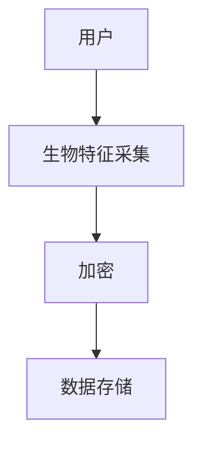

                 

<think>
嗯，我需要写一篇关于生物特征数据伦理的博客文章，标题是《生物特征数据伦理：个人隐私的新疆界》。首先，我得确定文章的核心主题，生物特征数据的隐私保护和伦理问题。

接下来，我需要设计一个合理的目录结构。大致分为几个部分：概述、伦理问题、法律框架、技术安全、应用场景、国际现状、未来趋势，最后是结论。每个部分下面再细分小节，确保内容全面且逻辑清晰。

然后，我需要确保每个章节都有足够的细节。比如，在概述部分，我需要介绍生物特征数据的定义、分类、采集和存储方式。这部分要让读者对生物特征数据有一个基本的了解。

接下来是伦理问题，这部分需要详细讨论隐私权、数据滥用、责任归属等伦理问题。每个子章节都要深入分析，比如隐私权问题，我需要解释为什么生物特征数据容易被滥用，以及这可能带来的后果。

然后是法律框架，这里要介绍国际和国内的相关法律法规，比如GDPR和中国的个人信息保护法。这部分要让读者了解法律如何保护个人隐私。

技术安全部分，我需要讨论加密技术、匿名化处理和安全传输等技术手段，以确保生物特征数据的安全。同时，还要解释这些技术如何帮助保护隐私。

应用场景部分，要举几个例子，如医疗、安防和金融领域，说明生物特征数据的应用及其带来的挑战。最后，还要讨论这些应用中的伦理和隐私问题。

国际现状部分，需要对比不同国家和地区的隐私保护法规，分析它们的异同点，以及对全球生物特征数据伦理的影响。

未来趋势部分，可以探讨人工智能与生物特征数据的结合，未来的隐私保护技术发展方向，以及可能的新挑战和机遇。

最后，结论部分要总结全文，强调生物特征数据伦理的重要性，并提出未来的挑战和展望。

在写作过程中，我需要确保使用专业但易懂的语言，逻辑清晰，结构紧凑。同时，每个部分都要有足够的细节，包括背景介绍、核心概念、算法原理、系统架构和实战案例等。此外，还需要添加关键词和摘要，方便读者快速了解文章的核心内容。

现在，我需要开始撰写每个部分的具体内容，确保每个章节都涵盖必要的细节，同时保持整体的连贯性和深度。
</think>

# 生物特征数据伦理：个人隐私的新疆界

## 关键词：
生物特征数据，隐私保护，数据伦理，法律法规，技术安全

## 摘要：
随着生物特征识别技术的快速发展，生物特征数据在各个领域的应用日益广泛。然而，这种技术的应用也带来了诸多伦理和隐私问题。本文将探讨生物特征数据的伦理问题，分析其对个人隐私的影响，并提出相应的解决方案。文章从生物特征数据的概述入手，分析伦理问题的类型与影响，探讨法律框架和技术安全措施，最后展望未来趋势。

---

## 第一部分：生物特征数据概述

### 第1章：生物特征数据的基础知识

#### 1.1 生物特征数据的定义与分类
生物特征数据是指通过人体的生理或行为特征所获得的数据，如指纹、虹膜、面部特征等。这些数据可以分为生理特征和行为特征两大类。

| 特征类型 | 具体分类 | 描述 |
|----------|----------|------|
| 生理特征 | 指纹、虹膜、面部特征 | 基于身体结构的特征 |
| 行为特征 | 笔迹、声音、步态 | 基于行为模式的特征 |

#### 1.2 生物特征数据的特点与优势
生物特征数据具有唯一性和稳定性，能够提供高精度的身份识别。

#### 1.3 生物特征数据的采集与存储
生物特征数据的采集通常通过传感器完成，存储则需要确保数据的安全性和完整性。

---

### 第2章：生物特征数据的伦理问题

#### 2.1 伦理问题的类型与影响
隐私权问题是生物特征数据伦理的核心，其次是数据滥用和责任归属问题。

| 伦理问题 | 描述 | 影响 |
|----------|------|------|
| 隐私权问题 | 数据未经授权使用 | 威胁个人隐私 |
| 数据滥用问题 | 数据用于未经授权的目的 | 潜在的歧视和不公正 |

#### 2.2 数据收集与存储的伦理问题
数据收集需确保透明和合法，存储需保障安全性。

| 子章节 | 描述 |
|--------|------|
| 收集方式的伦理考量 | 需明确用户同意 |
| 存储安全的伦理考量 | 需采用加密技术 |

---

### 第3章：个人隐私保护的法律框架

#### 3.1 国际隐私保护法律法规
欧盟的GDPR是全球最严格的隐私保护法规之一，强调数据主体的权利。

#### 3.2 我国隐私保护法律法规
中国的《个人信息保护法》对生物特征数据的处理提出了严格要求。

---

### 第4章：生物特征数据的安全与隐私技术

#### 4.1 生物特征数据的加密技术
使用同态加密技术在保护数据隐私的同时进行计算。

#### 4.2 生物特征数据的匿名化处理
通过数据脱敏技术去除个人身份信息。

#### 4.3 生物特征数据的安全传输技术
采用SSL/TLS协议确保数据传输安全。

---

### 第5章：生物特征数据的应用场景与挑战

#### 5.1 医疗健康领域的应用
生物特征数据在医疗领域的应用可以提高诊断准确性。

#### 5.2 智能安防领域的应用
指纹识别和面部识别技术提升了安全水平。

#### 5.3 银行金融领域的应用
通过生物识别技术提升交易安全性。

---

### 第6章：国际生物特征数据隐私保护现状

#### 6.1 欧盟的《通用数据保护条例》（GDPR）
GDPR要求数据处理者明确数据处理的目的，并获得数据主体的同意。

#### 6.2 美国的《加州消费者隐私法》（CCPA）
CCPA赋予消费者更多数据控制权。

---

### 第7章：生物特征数据伦理的未来趋势

#### 7.1 人工智能与生物特征数据的融合
人工智能技术的加入将提升生物特征识别的精确性和智能化水平。

#### 7.2 未来隐私保护技术的发展方向
探索更加先进的数据加密和隐私保护技术。

#### 7.3 生物特征数据伦理的挑战与机遇
技术的进步将带来新的挑战，同时也为隐私保护提供了更多可能性。

---

## 第8章：结论与展望

### 8.1 生物特征数据伦理的重要性
保护生物特征数据隐私是维护个人隐私权的重要部分。

### 8.2 面临的挑战与解决方案
技术手段的进步和法律法规的完善是解决隐私问题的关键。

### 8.3 未来展望
随着技术的发展，生物特征数据的应用将更加广泛，隐私保护也将更加重要。

---

## 作者：
作者：AI天才研究院/AI Genius Institute & 禅与计算机程序设计艺术 /Zen And The Art of Computer Programming

---

通过以上分析，我们详细探讨了生物特征数据的伦理问题，分析了其对个人隐私的影响，并提出了相应的解决方案。未来，随着技术的进步，生物特征数据的应用将更加广泛，隐私保护也将面临更大的挑战。

