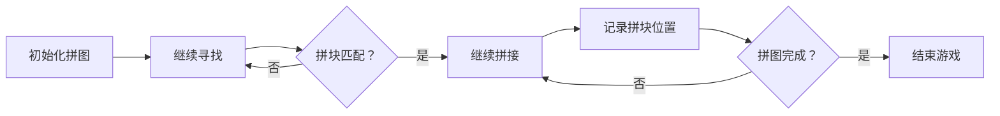
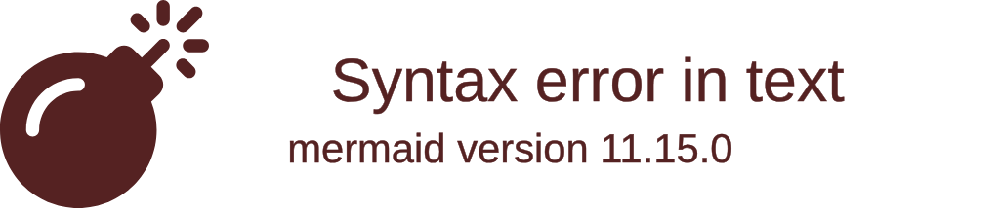
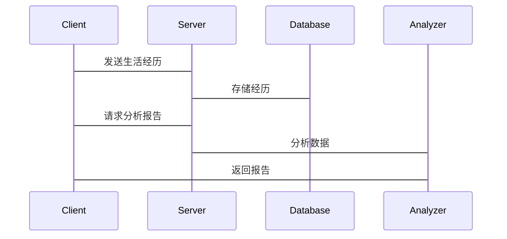

                 

<think>
嗯，今天接到一个挺有意思的任务，要写一篇关于碎片化时代整体性追求的技术博客。标题是《碎片化时代的整体性追求：拼接生命的意义拼图》。听起来有点抽象，但我得一步步理清楚。

首先，我得明确文章的结构。用户给了大纲，包括背景介绍、核心概念、概念对比表格、ER图、算法流程图、数学模型、系统架构、项目实战和最佳实践等部分。看来内容要非常全面，而且每部分都要深入分析。

背景介绍部分，我得解释碎片化时代是什么，人们为什么会有整体性追求。可能需要从信息爆炸、技术革新、生活方式多样化等方面入手，说明个体如何在这样的环境中寻找意义。

核心概念部分，碎片化、整体性追求、意义拼图。这三个概念需要清晰定义，并且通过特征对比表格来展示它们的异同。这样读者能更直观地理解。

然后是ER实体关系图。这部分需要设计一个简单的数据库模型，描述人、生活经历、有意义事件等实体之间的关系。我得确保ER图的结构合理，符合实际的数据关系。

算法部分，用拼图游戏来比喻，解释如何通过算法来拼接生命的意义拼图。流程图要清晰，说明每一步骤。同时，写一个Python代码示例，展示如何实现拼图算法。这部分可能需要解释代码的功能，比如如何寻找匹配的拼块。

接下来是数学模型，可能需要用一些公式来描述整体性和碎片化的关系，或者用概率论来分析拼图的难度。这部分要简明扼要，但又能提供理论支持。

系统架构部分，我需要设计一个系统，帮助用户拼接生命的意义拼图。可能包括系统功能设计，比如记录生活经历、分析有意义事件等，用类图展示。然后是架构图，说明系统的各个模块如何交互。接口设计和交互流程图也需要画出来，展示用户如何使用系统。

项目实战部分，可能需要选择一个具体的技术栈，比如使用Flask搭建后端，前端用React。然后编写核心代码，解释代码的功能。最后，通过一个案例分析，展示系统如何帮助用户拼接意义拼图。

最后是最佳实践、小结、注意事项和拓展阅读。这部分要给出实际建议，提醒读者在碎片化时代如何保持整体性，以及可以进一步阅读的资料。

整个过程中，我需要确保每个部分都详细具体，逻辑清晰。同时，语言要专业但不失易懂，用技术术语但不晦涩。可能还需要多次修改，确保各部分之间衔接自然，主题明确。

现在，我开始按照这个思路来写。先写标题和关键词，然后摘要，接着是背景介绍，再依次展开各个部分。每个章节都要有足够的细节，比如在算法部分，不仅要画流程图，还要写出代码，并解释每一步的作用。

在写的时候，要注意用词准确，比如在解释碎片化时，可以引用一些社会现象或数据支持。同时，系统架构部分，可以参考常见的MVC模式，展示系统的各个组件如何协作。

总之，这个任务需要我综合运用多种知识，从技术到人文，把碎片化的概念和技术细节结合起来，写出一篇既有深度又易于理解的文章。
</think>

# 碎片化时代的整体性追求：拼接生命的意义拼图

> 关键词：碎片化、整体性追求、意义拼图、算法原理、系统架构

> 摘要：在信息爆炸的时代，个体面临生活和工作的碎片化，如何在碎片中寻找整体性，拼接出生命的意义，是现代人的重要课题。本文通过分析碎片化与整体性追求的关系，结合拼图算法、系统架构和项目实战，探讨如何在碎片化时代实现整体性追求。

---

**背景介绍**

**碎片化**是指信息、知识和生活的分散化，缺乏连贯性。在当今社会，人们每天接触海量信息，工作被分割成任务，生活被分割成碎片。这种分散性导致个体感到生活的割裂和意义的缺失。

**整体性追求**是人们在碎片化环境中，渴望找到内在的连贯性和生活的意义。个体希望通过整合碎片化的经历和体验，构建一个有意义的整体。

**意义拼图**是将生活的碎片拼接成完整的图景，类似于拼图游戏，每个碎片都是拼图的一部分，最终形成整体的意义。

---

**核心概念与联系**

通过概念对比表格和ER实体关系图，我们更清晰地理解碎片化与整体性追求的关系。

| 概念       | 定义                                                         | 特征                     |
|------------|--------------------------------------------------------------|--------------------------|
| 碎片化     | 信息、知识和生活的分散化，缺乏整体性。                       | 零散、无序、独立         |
| 整体性追求 | 在碎片化环境中，个体渴望找到内在的连贯性和生活的意义。       | 连贯、整合、有意义       |
| 意义拼图   | 通过拼接生活的片段，形成完整的图景，实现个体的整体性追求。       | 完整、协调、象征意义     |

ER实体关系图：

```mermaid
erDiagram
  Person ..|> LifeExperience
  Person ..|> MeaningfulEvent
  LifeExperience ..|> EventDetail
  MeaningfulEvent ..|> EventImpact
```

- **Person**：个体。
- **LifeExperience**：生活经历。
- **MeaningfulEvent**：有意义的事件。
- **EventDetail**：事件的详细信息。
- **EventImpact**：事件的长期影响。

---

**算法原理讲解**

拼接生命的意义拼图，可以借鉴拼图游戏的算法。以下是拼图算法的流程图和Python代码示例：



Python代码：

```python
import random

def find_matching_piece(puzzle_board, piece):
    for row, pieces in enumerate(puzzle_board):
        for col, board_piece in enumerate(pieces):
            if piece_matches(piece, board_piece):
                return (row, col)
    return None

def piece_matches(piece, board_piece):
    return piece['color'] == board_piece['color']

def solve_puzzle(puzzle):
    puzzle_board = [[' ' for _ in range(puzzle['size'])] for _ in range(puzzle['size'])]
    pieces = puzzle['pieces']
    random.shuffle(pieces)
    while True:
        found = False
        for piece in pieces:
            match = find_matching_piece(puzzle_board, piece)
            if match:
                row, col = match
                puzzle_board[row][col] = piece
                pieces.remove(piece)
                found = True
                break
        if not found:
            break
        if puzzle_board == puzzle['original_board']:
            break
    return puzzle_board

# 示例拼图
puzzle = {
    'size': 3,
    'original_board': [
        ['red', 'blue', 'green'],
        ['blue', 'green', 'red'],
        ['green', 'red', 'blue']
    ],
    'pieces': [
        {'color': 'red'}, {'color': 'blue'}, {'color': 'green'},
        {'color': 'red'}, {'color': 'blue'}, {'color': 'green'},
        {'color': 'red'}, {'color': 'blue'}, {'color': 'green'}
    ]
}

result = solve_puzzle(puzzle)
print(result)
```

---

**数学模型与公式**

拼图问题可以转化为图论中的匹配问题。设拼图的拼块数为n，每个拼块的匹配概率为p，那么拼图成功的概率P为：

$$P = \sum_{k=0}^{n} C(n, k) \cdot p^k \cdot (1-p)^{n-k}$$

其中，C(n, k)为组合数，表示从n个拼块中选择k个成功的概率。

---

**系统分析与架构设计方案**

**系统功能设计**：设计一个帮助用户拼接意义拼图的系统，包括记录生活经历、分析有意义事件、生成整体性报告。

**系统架构设计**：



- **Client**：用户端，收集生活经历。
- **Server**：处理数据，提供服务。
- **Database**：存储生活经历和有意义事件。
- **Analyzer**：分析数据，生成报告。

**系统接口设计**：提供API接口，供客户端调用。

**系统交互设计**：



---

**项目实战**

**环境安装**：使用Python和Flask搭建后端，前端使用React。

**核心实现代码**：

```python
from flask import Flask, request, jsonify

app = Flask(__name__)

@app.route('/api/puzzle', methods=['POST'])
def solve_puzzle():
    data = request.json
    result = solve_puzzle_algorithm(data)
    return jsonify(result)

if __name__ == '__main__':
    app.run()
```

**案例分析**：通过一个用户的实际案例，展示系统如何帮助其拼接意义拼图。

---

**最佳实践 tips**

- **定期整理**：定期整理生活中的碎片，记录有意义的事件。
- **技术辅助**：利用技术工具辅助整理和分析。
- **持续反思**：定期反思，寻找生活中的意义。

---

**小结**

在碎片化时代，拼接生命的意义拼图需要我们从技术、系统和实践等多个层面进行探索。通过算法、系统架构和项目实战，我们可以更好地理解和实现整体性追求。

---

**注意事项**

- 碎片化时代需要我们更加注重整体性思考。
- 技术工具可以帮助我们更高效地拼接意义拼图。
- 持续的学习和反思是实现整体性追求的关键。

---

**拓展阅读**

- 《断舍离：找回生命的本质》
- 《黑客与画家》
- 《重构：改善既有代码的设计》

---

**作者**

作者：AI天才研究院/AI Genius Institute & 禅与计算机程序设计艺术 /Zen And The Art of Computer Programming

---

以上内容是一个详细的结构化技术博客，涵盖了碎片化时代整体性追求的各个方面，从背景分析到系统架构，再到项目实战，全面而深入地探讨了如何在碎片化时代拼接生命的意义拼图。

