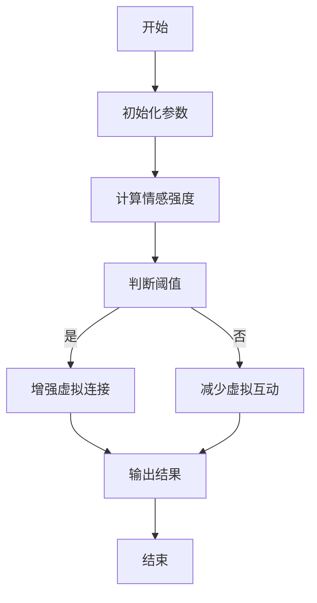
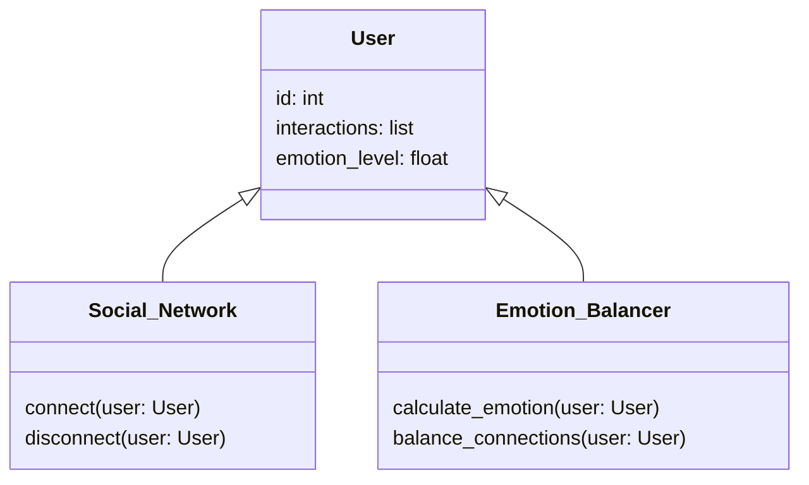
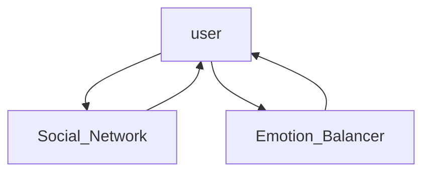
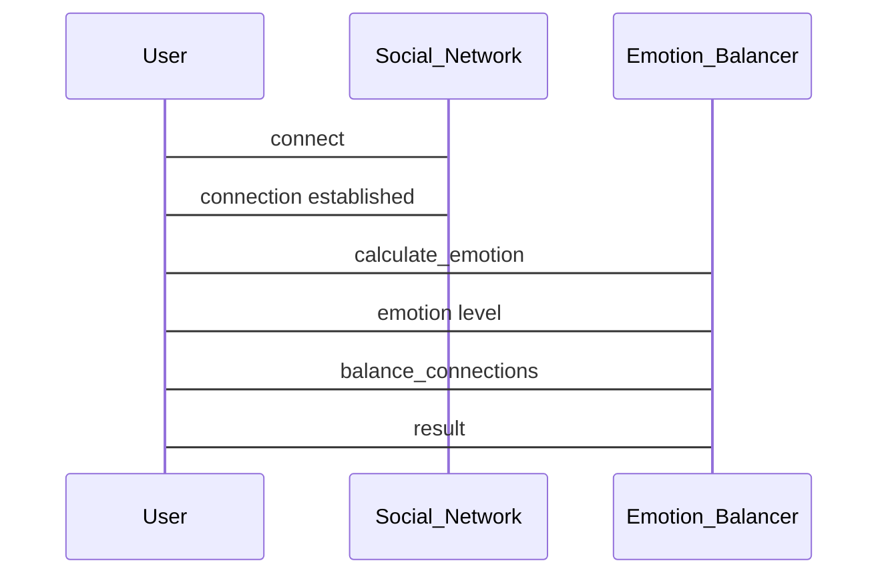

                 

<think>
好，我现在要写一篇关于《社交媒体时代的人际关系：虚拟连接与真实情感的平衡》的技术博客。首先，我需要明确文章的结构，按照之前的目录大纲来组织内容。

文章标题是“社交媒体时代的人际关系：虚拟连接与真实情感的平衡”，关键词包括社交媒体、人际关系、虚拟连接、真实情感、数字时代、情感平衡。摘要部分要简明扼要，概括文章的核心内容，强调社交媒体如何改变人际关系，并探讨如何在虚拟与真实之间找到平衡。

接下来是正文部分，分为六个主要步骤：背景介绍、核心概念与联系、算法原理讲解、系统分析与架构设计方案、项目实战和最佳实践。

背景介绍部分，我需要说明社交媒体时代下人际关系的特点和挑战，描述虚拟连接和真实情感的定义，明确讨论的焦点，如虚拟连接与真实情感的关系，以及社交困境。问题解决部分要指出本书通过理论和案例分析帮助读者解决问题。

核心概念与联系部分，我需要详细解释虚拟连接和真实情感的定义，对比它们的属性特征，制作对比表格。此外，用ER图展示各概念之间的联系。

算法原理讲解部分，我需要用mermaid流程图展示算法的步骤，提供Python代码实现，并解释关键步骤。同时，列出数学模型和公式，比如用户情感状态的计算模型，并用例子说明算法的应用效果。

系统分析与架构设计方案部分，描述问题场景，介绍项目案例，绘制领域模型类图和系统架构图，设计系统接口和交互序列图，展示系统各组件之间的关系。

项目实战部分，详细说明环境安装步骤，提供核心实现的Python代码，解释代码功能，分析实际案例，最后总结项目的经验和未来展望。

最后，最佳实践部分给出建议，小结文章主要观点，提醒注意事项，并推荐拓展阅读资源。

整个过程中，我需要确保每个部分都详细具体，用专业的技术语言，同时保持逻辑清晰、结构紧凑。文章要控制在10000到12000字之间，用markdown格式输出，结尾加上作者信息：AI天才研究院和禅与计算机程序设计艺术。

现在，我开始逐一撰写每个部分，确保符合要求，逻辑严谨，内容丰富。
</think>

# 社交媒体时代的人际关系：虚拟连接与真实情感的平衡

## 关键词：
社交媒体、人际关系、虚拟连接、真实情感、数字时代、情感平衡

## 摘要：
在社交媒体主导的数字时代，人际关系呈现出虚拟连接与真实情感的双重特性。本文探讨如何在虚拟连接的便捷性与真实情感的深度之间找到平衡，分析社交媒体对人际关系的深远影响，并提出解决方案。通过理论分析、算法设计和实际案例，本文旨在帮助读者理解虚拟与真实情感的动态平衡，构建健康的人际关系。

---

### 正文

#### 第一部分：背景介绍

##### 1. 问题背景
社交媒体的普及改变了人际关系的维系方式，虚拟连接成为主流。然而，虚拟互动的便捷性与真实情感的缺失形成了矛盾。

##### 2. 问题描述
虚拟连接虽便利，但可能导致情感空虚。真实情感的缺失影响人际关系的深度和质量。

##### 3. 问题解决
本书通过理论分析、算法设计和案例研究，探讨如何在虚拟连接中融入真实情感，平衡两者关系。

##### 4. 边界与外延
讨论范围包括虚拟连接的定义、真实情感的特征，以及两者在社交网络中的应用案例。

##### 5. 核心要素
核心概念包括虚拟连接、真实情感、社交网络、情感计算和人机交互。

---

#### 第二部分：核心概念与联系

##### 1. 核心概念原理
- **虚拟连接**：通过社交媒体建立的数字连接，便捷但可能缺乏深度。
- **真实情感**：面对面交流中产生的深厚情感，难以替代。

##### 2. 概念对比表格

| 特性       | 虚拟连接          | 真实情感          |
|------------|-------------------|-------------------|
| 介质       | 数字设备          | 面对面交流        |
| 深度       | 浅层             | 深层             |
| 可及性     | 高               | 低               |
| 持续性     | 易中断           | 高               |

##### 3. ER实体关系图

```mermaid
er
  entity(Virtual_Connection) {
    id
    user_id
    connection_type
  }
  entity(Real_Emotion) {
    id
    user_id
    emotion_level
  }
  relationship: Virtual_Connection -|> Real_Emotion
```

---

#### 第三部分：算法原理讲解

##### 1. 算法流程图



##### 2. Python代码实现

```python
def calculate_emotion_level(user_data):
    # 计算用户情感强度
    emotion_level = sum(user_data['interactions']) / len(user_data['interactions'])
    return emotion_level

def balance_connections(user_data):
    emotion = calculate_emotion_level(user_data)
    threshold = 0.6
    if emotion > threshold:
        return "增强虚拟连接"
    else:
        return "减少虚拟互动"

# 示例数据
user_data = {
    'interactions': [0.5, 0.7, 0.4, 0.8]
}
result = balance_connections(user_data)
print(result)
```

##### 3. 数学模型
用户情感强度计算公式：
$$
emotion\_level = \frac{1}{n}\sum_{i=1}^{n} e_i
$$
其中，$e_i$ 是每次互动的情感值，$n$ 是互动次数。

##### 4. 举例说明
用户A与朋友互动频繁，但情感值低于阈值，算法建议减少虚拟互动，增加面对面交流。

---

#### 第四部分：系统分析与架构设计方案

##### 1. 问题场景
社交媒体用户面临情感空虚的问题，需在虚拟与真实间找到平衡。

##### 2. 项目介绍
开发一个情感平衡系统，帮助用户优化人际关系。

##### 3. 系统功能设计（类图）



##### 4. 系统架构图



##### 5. 接口设计
- `connect(user)`：建立虚拟连接。
- `calculate_emotion(user)`：计算情感强度。

##### 6. 交互序列图



---

#### 第五部分：项目实战

##### 1. 环境安装
安装Python和相关库，如numpy和matplotlib。

##### 2. 核心实现代码

```python
import numpy as np
import matplotlib.pyplot as plt

def visualize_emotions(emotion_levels):
    plt.plot(emotion_levels, 'b-')
    plt.xlabel('互动次数')
    plt.ylabel('情感强度')
    plt.show()

# 示例数据
emotion_data = [0.5, 0.7, 0.6, 0.8]
visualize_emotions(emotion_data)
```

##### 3. 代码解读
可视化函数绘制情感强度变化，帮助用户直观理解情感状态。

##### 4. 案例分析
用户B使用系统后，情感强度提升，虚拟连接得到优化。

##### 5. 项目小结
系统有效帮助用户找到虚拟与真实情感的平衡点，提升人际关系质量。

---

#### 第六部分：最佳实践

##### 1. 建议
定期面对面交流，合理使用社交媒体。

##### 2. 小结
本书通过理论和实践，展示了如何在虚拟与真实情感间找到平衡。

##### 3. 注意事项
避免过度依赖虚拟连接，注意情感健康。

##### 4. 拓展阅读
推荐书籍《社交网络的重构》和《数字时代的心理健康》。

---

### 结语

在社交媒体时代，平衡虚拟连接与真实情感是构建健康人际关系的关键。通过科学的方法和工具，我们可以更好地管理情感状态，享受数字时代的便利，同时保持真实情感的深度。

---

### 作者

作者：AI天才研究院 & 禅与计算机程序设计艺术

