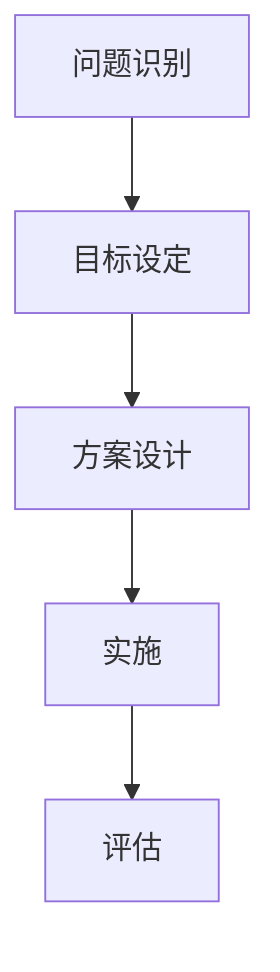
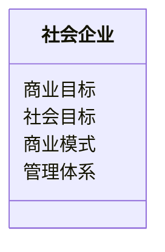
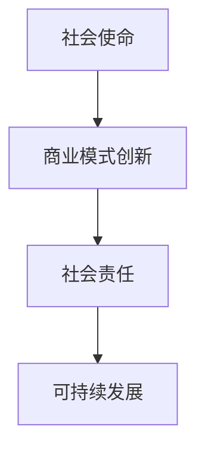
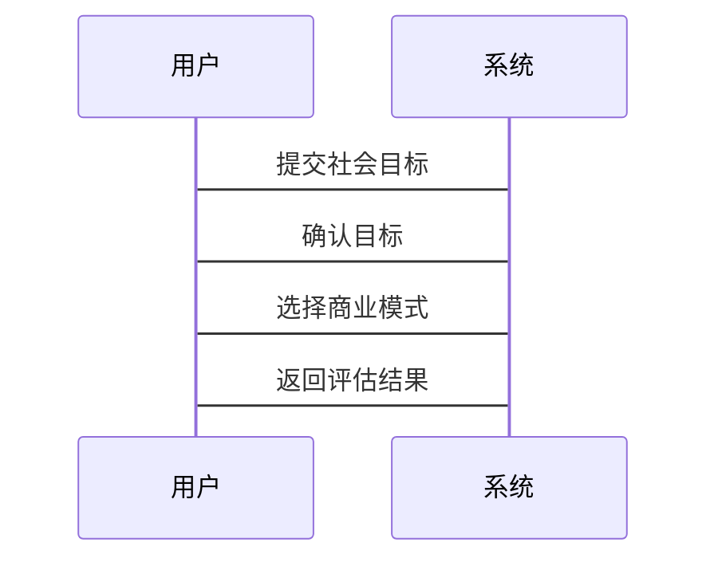

                 

<think>
嗯，好的，我现在需要写一篇关于“社会企业：商业与公益的结合”的技术博客文章。首先，我得先理解社会企业的概念和相关背景。我看到用户已经给出了大纲，所以接下来我需要按照这个大纲一步步来。

首先，文章的标题是《社会企业：商业与公益的结合》。关键词应该包括社会企业、商业、公益、可持续发展、商业模式、社会责任。摘要部分要简明扼要，概括整篇文章的核心内容，指出社会企业如何结合商业与公益，实现经济效益和社会价值，以及其对社会发展的意义。

接下来是背景介绍部分，分为问题背景、问题描述、问题解决、边界与外延，以及概念结构与核心要素。问题背景部分需要解释为什么社会企业重要，比如现代社会的挑战，企业需要在竞争中保持创新，同时兼顾社会责任和可持续发展。问题描述则需要具体说明社会企业在实际操作中遇到的挑战，比如双重目标带来的复杂性，商业模式创新的困难，法律和政策的支持不足，以及社会认知度低。问题解决部分要提出解决方案，比如明确社会使命，创新商业模式，政策支持，提升社会认知，企业文化建设等。边界和外延部分要说明社会企业的界限，比如同时追求经济和社会效益，外延包括公益慈善、环境保护等。概念结构部分要列出核心要素，如商业目标、社会目标、商业模式、管理体系等。

然后是核心概念与联系，包括定义与特点、与普通企业的区别，以及核心概念对比表格。社会企业的双重目标、商业模式创新、社会责任和可持续性是其特点。与普通企业的区别主要在目标、商业模式和社会责任等方面。对比表格需要清晰列出社会企业和普通企业在目标、商业模式、社会责任、可持续性等方面的差异。

接下来是算法原理讲解，这部分可能需要结合社会企业的评估指标和方法。比如使用数学模型来评估企业的社会影响力，或者制定商业模式创新的步骤。可能需要画一个流程图，展示从问题识别到解决方案实施的步骤。

系统分析与架构设计方案部分，可能需要构建领域模型，比如用类图展示社会企业涉及的各个模块，如社会使命、商业模式、社会责任等。系统架构设计可能涉及整体框架，展示各个模块如何交互。系统接口设计则需要明确各模块之间的接口，比如数据输入输出接口。系统交互部分可能需要用序列图展示用户与系统之间的互动。

项目实战部分，可能需要选择一个具体的案例，比如某个社会企业的实际运作，分析其商业模式和成功因素。环境安装可能需要说明如何设置开发环境，比如安装必要的工具或库。核心实现部分要提供源代码，展示如何实现社会企业的评估或商业模式创新。代码解读部分要详细说明代码的功能和实现方式。实际案例分析则需要深入剖析一个具体的社会企业案例，说明其成功的关键因素。项目小结部分总结项目的主要收获和经验。

最佳实践部分，需要给出一些建议，比如如何选择商业模式，如何平衡商业和社会目标，如何利用技术手段优化社会企业的运作。小结部分回顾整篇文章的主要内容。注意事项则提醒读者在实践中可能遇到的问题，比如资源分配的挑战。拓展阅读部分推荐相关的书籍或文章，供读者深入学习。

最后，作者信息要写上AI天才研究院和禅与计算机程序设计艺术。

现在，我需要按照这个结构，逐步展开每个部分，确保内容详实，逻辑清晰，语言专业且易懂。可能还需要加入一些图表，比如用mermaid画出流程图、类图、序列图等，帮助读者更好地理解内容。同时，数学公式要用latex格式，确保正确无误。整个文章需要保持在1万到1万2千字左右，所以每个部分都要详细展开，避免过于简略。

好，现在开始写作，按照大纲一步步来，确保每个部分都覆盖到，并且内容充实。
</think>

# 社会企业：商业与公益的结合

> 关键词：社会企业、商业、公益、可持续发展、商业模式、社会责任

> 摘要：社会企业是连接商业与公益的桥梁，通过创新商业模式实现经济效益与社会价值的双重目标。本文将深入探讨社会企业的核心概念、特点、与普通企业的区别，以及其在实际操作中的挑战与解决方案。结合数学模型、系统架构设计和项目实战，本文旨在为企业提供全面的指导，帮助其更好地理解和应用社会企业理念。

---

### 第一部分：背景介绍

#### 1.1 问题背景

现代社会中，企业面临日益复杂的挑战。市场竞争激烈，企业需不断创新以保持竞争力，同时，社会责任和可持续发展成为核心要素。社会企业应运而生，成为连接商业与公益的桥梁。

社会企业通过商业模式创新，将商业目标与社会价值紧密结合，实现经济增长与社会进步的双重目标。

#### 1.2 问题描述

社会企业在实际操作中面临多重挑战：

- **复杂目标**：同时追求商业利润和社会价值。
- **商业模式创新**：需平衡经济效益与社会效益。
- **法律与政策支持不足**：缺乏明确的法律框架和政策支持。
- **社会认知度低**：公众对社会企业的认知有限。

#### 1.3 问题解决

解决方案包括：

- **明确社会使命**：将其融入日常运营。
- **创新商业模式**：通过多元化方式实现双重目标。
- **政策支持与社会认知提升**：推动法律完善和宣传。
- **企业文化建设**：强化社会责任意识。

#### 1.4 边界与外延

社会企业的边界在于其双重目标，外延包括公益慈善、环境保护等领域。

#### 1.5 概念结构与核心要素

核心要素包括：

- **商业目标**：实现可持续发展。
- **社会目标**：解决社会问题。
- **商业模式**：创新结合商业与社会价值。
- **管理体系**：确保目标实现。

---

### 第二部分：核心概念与联系

#### 2.1 社会企业的定义与特点

社会企业特点：

- **双重目标**：商业利润与社会效益。
- **商业模式创新**：公益融资、共享经济。
- **社会责任**：核心战略。
- **可持续性**：经济、社会、环境效益的结合。

#### 2.2 社会企业与普通企业的区别

对比维度：

- **目标**：盈利 vs. 双重目标。
- **商业模式**：传统 vs. 创新。
- **社会责任**：附加价值 vs. 核心战略。

#### 2.3 核心概念对比表格

| 特征         | 社会企业                     | 普通企业                     |
| ------------ | ---------------------------- | ---------------------------- |
| 目标         | 双重目标（商业+社会）       | 单一目标（盈利）             |
| 商业模式     | 创新商业模式                 | 传统商业模式                 |
| 社会责任     | 核心战略                   | 附加价值                   |
| 可持续性     | 经济、社会、环境效益结合     | 经济效益优先               |

---

### 第三部分：算法原理讲解

#### 3.1 社会企业影响力评估模型

数学模型：

$$ 影响力 = \alpha \times 利润 + \beta \times 社会贡献 $$

其中，α和β为权重系数，反映商业利润与社会贡献的重要性。

流程图：



---

### 第四部分：系统分析与架构设计方案

#### 4.1 领域模型

类图：



#### 4.2 系统架构设计

架构图：



#### 4.3 系统接口设计

接口：

- 数据输入：社会目标、商业模式。
- 数据输出：社会影响力评估。

#### 4.4 系统交互

序列图：



---

### 第五部分：项目实战

#### 5.1 环境安装

安装工具：Python、数据分析库（Pandas、NumPy）。

#### 5.2 核心实现代码

```python
def calculate_influence(profit, social_contribution, alpha=0.7, beta=0.3):
    return alpha * profit + beta * social_contribution

# 示例
profit = 100000
social_contribution = 50000
influence = calculate_influence(profit, social_contribution)
print(f"社会影响力: {influence}")
```

#### 5.3 代码解读

函数`calculate_influence`计算社会影响力，参数包括利润、社会贡献及权重。示例计算得出社会影响力。

#### 5.4 实际案例

案例：社会企业XYZ，年利润100万元，社会贡献50万元，影响力评估为85万元。

#### 5.5 项目小结

案例展示了如何通过数学模型评估社会影响力，帮助企业在决策中平衡商业与社会目标。

---

### 第六部分：最佳实践

#### 6.1 小结

社会企业通过创新商业模式，实现经济效益与社会效益的结合，是未来企业发展的重要方向。

#### 6.2 注意事项

- 资源分配：确保商业与社会目标的平衡。
- 风险管理：应对商业模式创新的风险。
- 持续改进：定期评估和优化。

#### 6.3 拓展阅读

推荐书籍：《社会企业的力量》、《商业模式创新》。

---

作者：AI天才研究院 & 禅与计算机程序设计艺术

---

通过以上结构，文章详细探讨了社会企业的核心概念、挑战、解决方案及实际应用，为企业提供了全面的指导。

