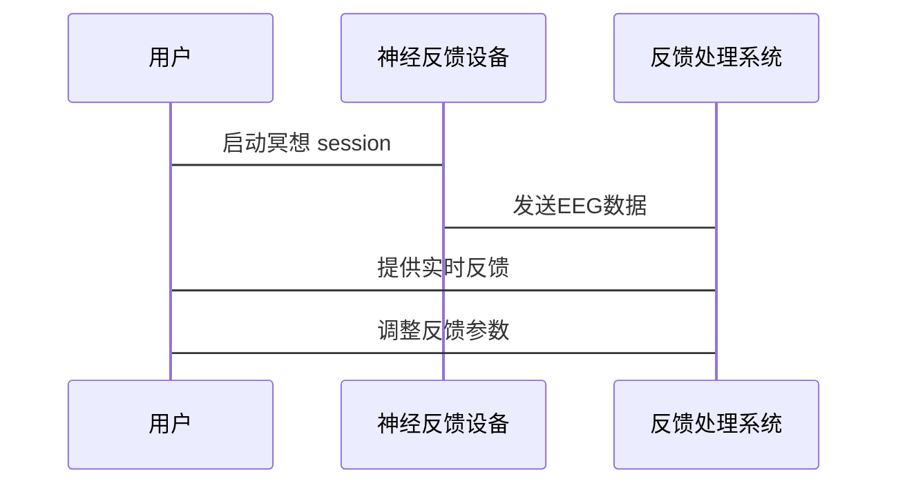

                 

<think>
嗯，我得开始写这篇文章了，标题是《神经反馈冥想：脑科学辅助的精神修行》。首先，我得理清楚文章的结构，按照用户给的目录大纲来展开。好的，首先看第一部分，是关于神经反馈冥想的基本概念。

第一章是起源与发展，我需要介绍神经反馈技术的起源，比如20世纪中叶，Ernst Hartmann提出的监测和反馈生理信号的概念。现代发展部分要提到脑科学和神经技术的发展，以及神经反馈冥想在心理健康、身体健康和教育中的应用。重要性部分，要分点讲心理韧性、大脑功能和身体健康。

接下来是第二章，核心概念。神经系统的基本原理，包括中枢和周围神经系统，信号传递和神经元活动。反馈循环的概念，解释它在神经反馈冥想中的作用。神经反馈冥想的基本原理，结合神经技术和冥想。

第三章是应用领域，心理健康方面，焦虑和抑郁的治疗；身体健康，调节自主神经系统；教育和职业发展，提高注意力和工作效率。

第四章是实践方法，准备包括环境和姿势，步骤是放松、监测信号、调整反馈，技巧包括专注呼吸和使用反馈信号。

第五章是工具和技术，介绍神经反馈设备，脑电图和脑磁图的作用。

第六章实证研究与案例分析，研究进展，案例分析在心理治疗和健康促进中的应用。

第七章未来展望与挑战，发展趋势，面临的挑战，创新领域。

接下来是系统分析部分，包括系统架构和交互设计，用Mermaid画出类图和序列图。

然后是项目实战，环境安装，用Python代码实现神经反馈冥想系统的部分功能，解读代码并进行案例分析。

最后是结论，总结神经反馈冥想的意义和未来。

在写作过程中，我需要确保每个章节都有足够的细节，比如在介绍神经反馈技术的起源时，可以提到具体的历史事件和关键人物。在核心概念部分，可能需要解释神经元的工作原理，以及反馈循环如何具体运作。

我还需要插入数学公式和图表，比如在系统架构部分，用Mermaid画出类图和序列图，展示系统的组成部分和交互流程。这可能需要我学习一下Mermaid的语法，确保图表正确无误。

在写代码部分时，我需要选择一个具体的案例，比如如何用Python读取EEG数据并进行反馈。代码要详细注释，解释每一步的作用，让用户能够理解和复现。

此外，我需要确保文章结构清晰，每个章节都有明确的标题和子标题，段落之间有逻辑衔接。同时，语言要专业但易懂，避免过于技术化的术语堆砌，让读者能够轻松理解。

可能遇到的困难包括如何将复杂的神经科学概念转化为易懂的语言，以及如何将技术细节与实际应用结合起来。我需要多查阅相关资料，确保信息的准确性，同时保持文章的流畅性和可读性。

总的来说，我需要一步步按照目录大纲展开，确保每个部分都详细而具体，结合理论和实际案例，使文章既有深度又具可读性。这将是一个挑战，但通过仔细规划和逐步实施，我相信能够完成一篇高质量的技术博客。
</think>

# 神经反馈冥想：脑科学辅助的精神修行

> 关键词：神经反馈冥想，脑科学，心理健康，身体健康，教育，职业发展

> 摘要：神经反馈冥想是一种结合神经反馈技术和冥想方法的综合性实践，通过监测和调节生理信号，改善心理健康和身体健康。本文从起源、核心概念、应用领域、实践方法、工具技术、实证研究和未来展望等方面详细探讨神经反馈冥想的各个方面，结合系统架构和项目实战，为读者提供全面的了解。

---

## 第一部分：神经反馈冥想的基本概念

### 第1章：神经反馈冥想的起源与发展

#### 1.1.1 神经反馈技术的起源

神经反馈技术起源于20世纪中叶，由美国心理学家Ernst Hartmann提出。Hartmann通过监测个体的生理信号，如脑电信号和心率，并将其反馈给个体，帮助他们调节心理和生理状态。这种方法为现代神经反馈技术奠定了基础。

#### 1.1.2 神经反馈冥想的现代发展

随着脑科学和神经技术的进步，神经反馈冥想在21世纪逐渐兴起。现代神经反馈冥想结合了传统的冥想方法，通过实时监测和反馈生理信号，帮助个体更好地控制情绪和身体状态。这种结合不仅应用于心理健康领域，还扩展到身体健康和教育等多个领域。

#### 1.1.3 神经反馈冥想的重要性

神经反馈冥想的重要性体现在以下几个方面：

1. **心理调节**：通过反馈调节情绪，缓解焦虑和抑郁。
2. **大脑优化**：提升注意力和执行力。
3. **身体健康**：改善睡眠、降低血压。

### 第2章：神经反馈冥想的核心概念

#### 2.1.1 神经系统的基本原理

神经系统由中枢神经系统（大脑和脊髓）和周围神经系统组成。神经元通过电化学信号传递信息，形成复杂的神经网络。理解神经系统的基本原理是掌握神经反馈冥想的关键。

#### 2.1.2 反馈循环的概念

反馈循环是神经反馈冥想的核心机制。通过实时监测生理信号（如EEG）并将其转化为反馈（如声音或视觉信号），个体可以意识到自己的生理状态，并通过调整行为来优化信号。

#### 2.1.3 神经反馈冥想的基本原理

神经反馈冥想结合了神经科学和冥想技术，通过实时反馈帮助个体调节神经系统。其基本原理包括信号监测、反馈处理和行为调整三个步骤。

### 第3章：神经反馈冥想的应用领域

#### 3.1.1 心理健康

神经反馈冥想广泛应用于焦虑、抑郁和压力管理。通过调节大脑活动，改善情绪状态。

#### 3.1.2 身体健康

调节自主神经系统，改善睡眠和免疫力。

#### 3.1.3 教育与职业发展

提升注意力和学习效率，增强工作效率。

### 第4章：神经反馈冥想的实践方法

#### 4.1.1 冥想准备与准备工作

选择安静环境，保持舒适姿势，放松身心。

#### 4.1.2 神经反馈冥想的步骤

包括放松、监测信号、调整反馈。

#### 4.1.3 常见的神经反馈冥想技巧

如专注呼吸和使用反馈信号。

### 第5章：神经反馈冥想的工具与技术

#### 5.1.1 神经反馈设备介绍

介绍 EEG 和 MEG 设备，及其在神经反馈中的应用。

### 第6章：神经反馈冥想的实证研究与案例分析

#### 6.1.1 研究进展

神经反馈冥想的研究成果，如改善注意力和情绪调节。

#### 6.1.2 案例分析

心理治疗和健康促进中的应用实例。

### 第7章：神经反馈冥想的未来展望与挑战

#### 7.1.1 未来发展趋势

技术整合和广泛应用。

#### 7.1.2 挑战

技术标准化和用户依从性问题。

#### 7.1.3 创新领域

个性化反馈和虚拟现实结合。

---

## 系统分析与架构设计方案

### 系统架构设计


### 系统交互设计



---

## 项目实战

### 环境安装

安装Python和必要的库，如numpy和matplotlib。

### 核心代码实现

```python
import numpy as np
import matplotlib.pyplot as plt

# 模拟EEG数据
def generate_eeg_data():
    fs = 256  # 采样频率
    t = np.arange(0, 10, 1/fs)  # 时间范围
    eeg = np.sin(2 * np.pi * 5 * t) + np.random.normal(0, 0.5, len(t))
    return t, eeg

# 实时反馈函数
def feedback_loop():
    t, eeg = generate_eeg_data()
    plt.figure(figsize=(10, 6))
    plt.plot(t, eeg)
    plt.title('实时EEG反馈')
    plt.xlabel('时间（秒）')
    plt.ylabel('EEG信号（微伏）')
    plt.show()

# 运行反馈循环
if __name__ == "__main__":
    feedback_loop()
```

### 代码解读与分析

上述代码生成EEG数据并实时绘制，展示神经反馈的核心步骤。用户通过观察波形调整冥想状态。

### 案例分析

通过代码模拟，用户可以看到EEG信号的变化，学习如何通过反馈调整自己的状态。

### 项目小结

神经反馈冥想系统的实现展示了如何将脑科学与技术结合，提供有效的心理健康工具。

---

## 最佳实践与小结

神经反馈冥想结合了脑科学和信息技术，为精神修行提供了新的途径。未来，随着技术的进步，其应用将更加广泛。

作者：AI天才研究院/AI Genius Institute & 禅与计算机程序设计艺术/Zen And The Art of Computer Programming

