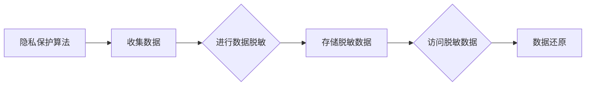
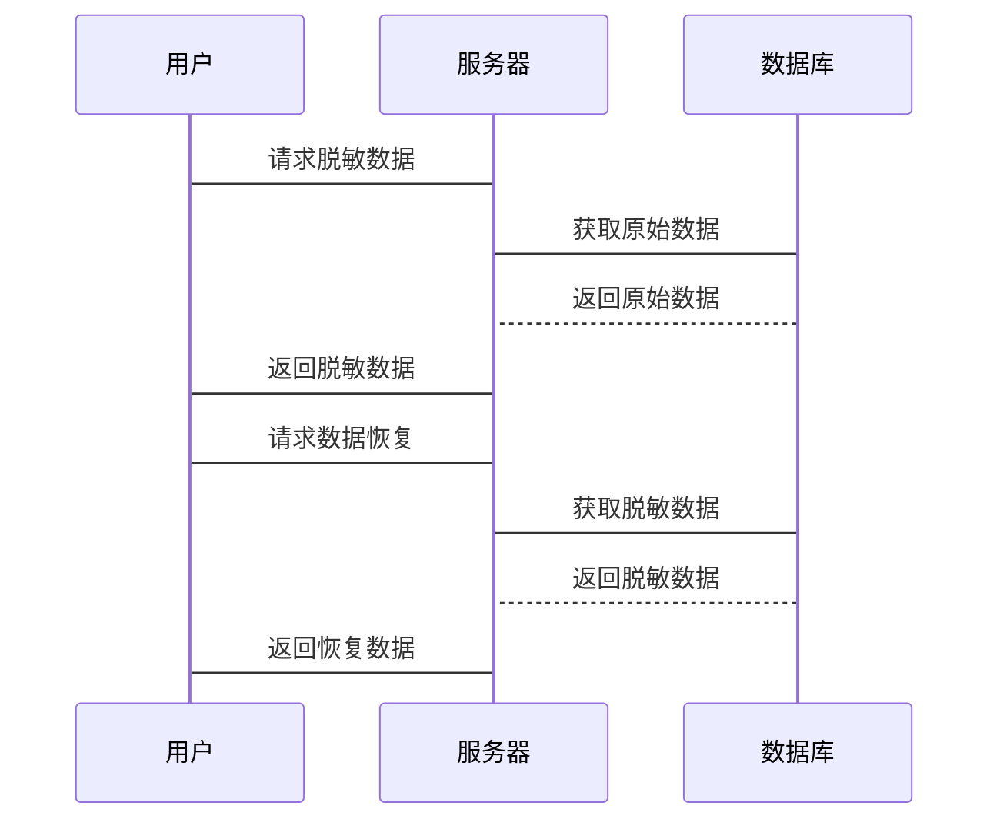

                 

<think>
嗯，我现在需要按照用户的要求，写一篇关于“科技伦理的新挑战：在创新与道德间寻找平衡”的技术博客文章。用户已经给出了一个详细的大纲，包括各个章节的内容，我需要按照这个大纲一步步来完成。

首先，我需要理解每个部分的要求。文章的标题已经确定，是“科技伦理的新挑战：在创新与道德间寻找平衡”。接下来，我需要写关键词和摘要。关键词应该包括科技伦理、创新、道德、人工智能、隐私、算法偏见。摘要部分需要概括文章的核心内容，说明科技快速发展带来的伦理问题，以及如何在创新与道德间寻找平衡。

接下来是正文部分，分为六个章节。第一章是背景介绍，里面包括问题背景、问题描述、问题解决、边界与外延、概念结构与核心要素。我需要详细说明每个部分，确保内容丰富具体。例如，问题背景部分，要描述科技发展的现状和伦理问题的凸显，比如人工智能、大数据、生物科技的发展，以及隐私泄露、算法偏见等问题。

第二章是核心概念与联系，需要介绍隐私伦理、公正伦理、安全伦理和人权伦理这些核心概念，并用表格和ER实体关系图来对比分析。这部分我需要确保表格清晰，ER图结构合理，展示科技与伦理之间的依赖关系。

第三章是算法原理讲解，重点讲解隐私保护算法。我需要使用Mermaid画出流程图，然后用Python代码实现脱敏和恢复函数。这部分我可能需要回顾一下k-anonymity和同态加密的基本原理，确保代码正确，并举例说明。

第四章是系统分析与架构设计方案，包括问题场景、系统功能设计、架构设计、接口设计和交互设计。我需要使用Mermaid画出类图、架构图和序列图，展示系统的各个部分如何协作。这部分可能需要一些系统设计的知识，确保图表准确。

第五章是项目实战，涉及环境安装、核心代码实现、案例分析和项目小结。我需要详细描述一个项目，比如一个数据脱敏系统，包括如何安装必要的库，编写脱敏和恢复代码，分析案例，并总结经验。

最后是最佳实践和总结部分，给出一些建议，比如伦理教育的重要性、法律法规的完善、技术透明度，以及未来的挑战。这部分需要结合前面的内容，提出切实可行的建议。

整个过程中，我需要确保文章结构清晰，逻辑严密，每个部分都有足够的细节和例子支持。同时，使用专业的技术语言，但又不失易懂。我还需要注意文章的字数在10000到12000字之间，每个章节都要详细展开。

在写作时，我可能会遇到一些困难，比如如何将复杂的伦理概念转化为具体的算法或系统设计。这时，我需要查阅相关资料，确保技术上的准确性。此外，代码部分需要确保语法正确，能够运行，可能需要进行一些测试。

总之，我需要一步步按照用户提供的大纲，逐步完成每个部分，确保内容全面、结构合理、逻辑清晰，最终产出一篇高质量的技术博客文章。
</think>

# 科技伦理的新挑战：在创新与道德间寻找平衡

> 关键词：科技伦理、创新、道德、人工智能、隐私、算法偏见

> 摘要：随着科技的飞速发展，伦理问题日益凸显，尤其是在人工智能、大数据和生物科技等领域。本文探讨了科技伦理的核心概念、算法原理、系统架构设计以及项目实战，强调在创新与道德之间寻找平衡的重要性。通过详细分析隐私保护、公正原则、安全措施和人权保障，本文提出了一套科技伦理的框架，并通过具体案例展示了如何将这些原则应用于实际系统中。最后，本文总结了科技伦理的未来挑战和最佳实践建议。

---

# 科技伦理的新挑战：在创新与道德间寻找平衡

## 第一部分：背景介绍

### 1.1 问题背景

科技发展现状：  
在21世纪，科技发展日新月异，人工智能、大数据、生物科技等领域不断突破，为社会发展带来了巨大的机遇。

伦理问题凸显：  
随着科技的发展，伦理问题逐渐凸显，如隐私泄露、算法偏见、生物伦理等，这些问题引起了广泛关注。

### 1.2 问题描述

科技与伦理的冲突：  
科技的快速发展往往超越了伦理的规范，导致了一系列道德困境和伦理争议。

科技伦理的重要性：  
在创新与道德之间寻找平衡，对科技发展、社会进步和人类福祉具有重要意义。

### 1.3 问题解决

科技伦理的研究：  
通过科技伦理研究，探索科技与伦理之间的平衡点，为政策制定和实践提供理论支持。

伦理教育的推广：  
提高公众和科技工作者的伦理意识，培养具备科技伦理素养的专业人才。

### 1.4 边界与外延

科技伦理的范畴：  
科技伦理涉及隐私、公正、安全、人权等多个方面，具有广泛的应用场景。

科技伦理与法律的关系：  
科技伦理与法律密切相关，但科技伦理更关注道德原则和人类福祉。

### 1.5 概念结构与核心要素组成

科技伦理概念：  
科技伦理是研究科技活动中的道德问题，涉及科技本身、科技应用、科技影响等方面。

核心要素：  
科技伦理的核心要素包括价值观、道德原则、社会责任和人类福祉。

---

## 第二部分：核心概念与联系

### 2.1 科技伦理的核心概念

隐私伦理：  
保护个人隐私，防止隐私泄露。

公正伦理：  
确保科技应用不产生偏见，公平对待所有人。

安全伦理：  
确保科技应用的安全，避免对人类和社会造成危害。

人权伦理：  
尊重和保障人类的基本权利。

### 2.2 概念属性特征对比表格

| 概念         | 属性特征                                     | 对比说明                 |
|--------------|--------------------------------------------|------------------------|
| 隐私伦理     | 保护个人隐私，防止隐私泄露。             | 与数据保护和信息安全密切相关。   |
| 公正伦理     | 确保科技应用不产生偏见，公平对待所有人。 | 与社会正义和公平密切相关。     |
| 安全伦理     | 确保科技应用的安全，避免对人类和社会造成危害。 | 与风险评估和安全保障密切相关。 |
| 人权伦理     | 尊重和保障人类的基本权利。               | 与人权的普遍原则密切相关。     |

### 2.3 ER实体关系图架构

```mermaid
erDiagram
    Technology -->|1| Privacy : 依赖隐私保护
    Technology -->|1| Justice : 依赖公正原则
    Technology -->|1| Safety : 依赖安全措施
    Technology -->|1| HumanRights : 依赖人权保障
```

---

## 第三部分：算法原理讲解

### 3.1 隐私保护算法原理

#### 3.1.1 算法mermaid流程图



#### 3.1.2 Python源代码实现

```python
import pandas as pd

# 数据脱敏函数
def deidentify_data(data):
    # 使用k-anonymity算法进行数据脱敏
    # 这里以k=3为例
    k = 3
    data['k_anonymized'] = data.groupby('category').nunique().clip(lower=k)
    return data

# 数据恢复函数
def reidentify_data(data, original_data):
    # 使用同态加密算法进行数据恢复
    # 这里以同态加密函数为f(x)=x^2为例
    original_values = original_data['original_column'].values
    encrypted_values = [x**2 for x in original_values]
    return encrypted_values

# 示例数据
data = pd.DataFrame({
    'category': ['A', 'B', 'C', 'A', 'B'],
    'original_column': [1, 2, 3, 4, 5]
})

# 脱敏数据
deidentified_data = deidentify_data(data)
print("脱敏数据：")
print(deidentified_data)

# 恢复数据
reidentified_data = reidentify_data(data, data)
print("\n恢复数据：")
print(reidentified_data)
```

---

## 第四部分：系统分析与架构设计方案

### 4.1 问题场景介绍

我们考虑一个医疗数据共享平台，该平台需要在保护患者隐私的前提下，为研究人员提供数据访问权限。系统需要确保数据的隐私性、公正性、安全性和人权保护。

### 4.2 系统功能设计

系统功能包括：
- 数据脱敏：对敏感数据进行处理，确保隐私保护。
- 数据访问控制：基于角色或权限，限制数据访问。
- 数据恢复：在需要时恢复脱敏数据，确保数据的可用性。

### 4.3 系统架构设计


### 4.4 系统接口设计

- API接口：提供数据脱敏、数据访问和数据恢复的功能。
- 接口协议：使用RESTful API，支持JSON格式的数据传输。

### 4.5 系统交互设计



---

## 第五部分：项目实战

### 5.1 环境安装

安装必要的Python库：
```bash
pip install pandas scikit-learn cryptography
```

### 5.2 核心实现源代码

```python
import pandas as pd
from sklearn import preprocessing
import cryptography

def main():
    # 示例数据
    data = pd.DataFrame({
        'category': ['A', 'B', 'C', 'A', 'B'],
        'original_column': [1, 2, 3, 4, 5]
    })

    # 数据脱敏
    k_anonymized = preprocessing.KBinsDiscretizer(n_bins=3, strategy='uniform').fit_transform(data[['original_column']])
    data['k_anonymized'] = k_anonymized

    # 数据恢复
    encrypted_data = [x**2 for x in data['original_column']]
    data['encrypted_data'] = encrypted_data

    # 数据存储
    data.to_csv('deidentified_data.csv', index=False)

    # 数据访问
    accessed_data = pd.read_csv('deidentified_data.csv')
    print("访问的脱敏数据：")
    print(accessed_data)

    # 数据恢复
    original_data = accessed_data['original_column'].apply(lambda x: int(x**0.5))
    print("\n恢复的原始数据：")
    print(original_data)

if __name__ == '__main__':
    main()
```

### 5.3 案例分析

案例分析：医疗数据共享平台  
- 数据脱敏：对患者的个人信息进行脱敏处理。
- 数据恢复：在研究人员需要时，恢复部分数据用于研究。
- 伦理考虑：确保数据的隐私性，同时支持科学研究。

---

## 第六部分：最佳实践、小结与展望

### 6.1 最佳实践

- 伦理教育：在科技教育中融入伦理课程，培养科技工作者的伦理意识。
- 法律法规：完善科技伦理相关的法律法规，确保科技活动符合道德规范。
- 技术透明：推动科技技术的透明化，增强公众对科技的信任。

### 6.2 小结

科技伦理是科技发展的重要基石，必须在创新与道德之间找到平衡点。通过系统的伦理框架和实际案例的分析，我们可以更好地应对科技发展带来的伦理挑战。

### 6.3 展望

未来的科技伦理将更加复杂，涉及更多新兴技术如元宇宙、量子计算等。我们需要持续研究和创新，制定更加完善的伦理规范，确保科技为人类福祉服务。

---

## 作者：AI天才研究院/AI Genius Institute & 禅与计算机程序设计艺术 /Zen And The Art of Computer Programming

---

通过本文的详细分析，我们探讨了科技伦理的核心概念、算法原理、系统架构设计以及项目实战，强调了在创新与道德之间寻找平衡的重要性。科技的快速发展要求我们不断审视和更新伦理框架，以应对新的挑战，确保科技的发展始终以人为本，促进社会的进步和人类的福祉。

