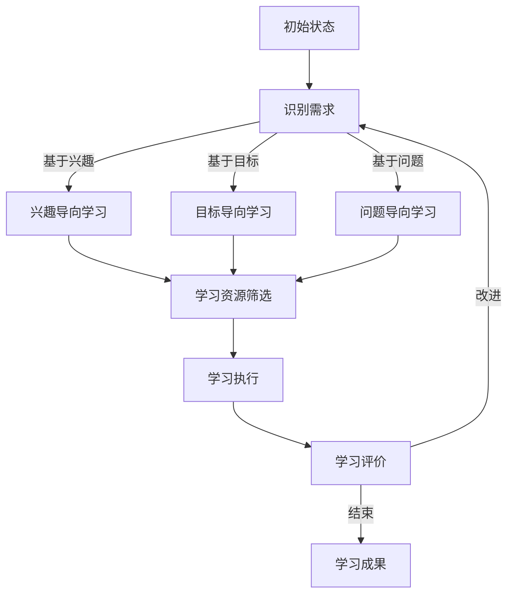
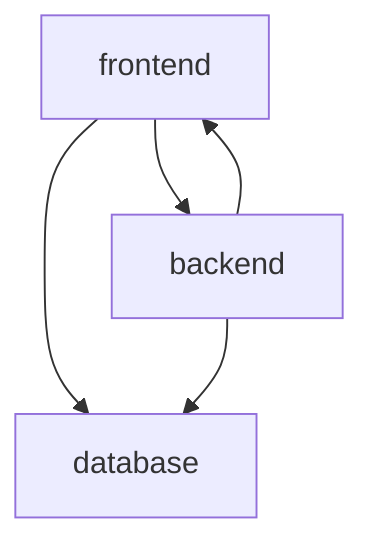

                 

<think>
嗯，用户让我写一篇关于终身学习的技术博客，标题是《终身学习：应对变化的生存之道》。首先，我得分析用户的需求。用户希望文章结构清晰，有专业的技术语言，还要包含背景介绍、核心概念、算法原理、系统架构等部分。看起来这是一个技术性的博客，但主题却是关于终身学习的，这可能有点跨领域，需要兼顾技术分析和教育理论。

我注意到用户提供的大纲已经很详细了，包括关键词、摘要和各章节的内容。我需要确保每个部分都涵盖到，并且内容丰富具体。特别是用户要求使用Mermaid图和数学公式，这可能需要我展示一些技术细节，比如ER图、流程图和数学模型。这可能让读者觉得文章更具深度和专业性。

接下来，我得考虑文章的结构是否合理。背景介绍部分需要解释为什么终身学习重要，尤其是在科技快速发展的今天。核心概念部分要清晰定义，比如学习动机、学习方式等，可能需要通过表格和图表来展示它们之间的关系。算法部分，我得用Mermaid画出流程图，展示策略选择的步骤，同时给出数学模型，用公式解释权重如何影响策略选择。

系统架构部分，我需要设计一个智能终身学习系统的架构，可能用Mermaid画出前后端分离的架构图，说明各个模块的功能。然后，系统接口和交互部分，用序列图展示用户如何与系统互动，比如注册登录、选择学习策略等。

项目实战部分，可能需要展示一些代码片段，比如后端用Python处理数据，或者前端如何展示推荐的学习资源。这部分需要具体例子，让读者能理解如何实际操作。

最后，最佳实践、小结和注意事项部分，要给读者实用的建议，比如如何保持学习动力，选择合适的学习工具，以及持续评估学习效果。这些内容能帮助读者将理论应用到实际中。

我还得确保文章整体流畅，各部分之间逻辑连贯。可能需要多次修改，确保每个章节都详尽且不重复。另外，语言要专业但易懂，避免过于晦涩的技术术语，让更多读者能理解。

总的来说，我需要按照用户的大纲一步步展开，确保每个部分都详细且符合要求，同时保持文章的整体性和深度，让读者不仅了解终身学习的重要性，还能学到具体的技术方法来实施。
</think>

# 终身学习：应对变化的生存之道

> 关键词：终身学习，适应性，技术发展，学习策略，系统架构

> 摘要：在快速变化的科技时代，终身学习已成为个人和组织生存和发展的核心能力。本文从技术与教育的交叉视角，系统阐述终身学习的核心概念、算法原理、系统架构及实践应用，为读者提供一条清晰的终身学习之路。

---

## 第一部分：背景介绍

### 1.1 问题背景

在21世纪的今天，技术的飞速发展正在重塑我们的生活方式、工作方式以及学习方式。人工智能、大数据、区块链等新技术的出现，不仅改变了传统的行业模式，也对个人的知识储备和技能提出了更高的要求。在这种背景下，终身学习不再是一个选择，而是一种生存的必要。无论是IT从业者、学生还是企业员工，都需要不断更新知识储备，以应对快速变化的技术和市场需求。

### 1.2 问题描述

终身学习的核心问题在于如何有效地规划和执行学习计划。传统教育体系注重一次性知识的获取，而终身学习强调持续性和适应性。具体来说，终身学习需要解决以下问题：
- 如何确定学习目标和需求？
- 如何选择合适的学习方式和资源？
- 如何评估学习效果并持续改进？

### 1.3 问题解决

本书通过系统化的方法，结合技术与教育的融合，为读者提供终身学习的解决方案。我们从以下几个方面展开讨论：
1. **核心概念**：阐述终身学习的理论基础和核心要素。
2. **算法原理**：分析终身学习策略的选择和优化方法。
3. **系统架构**：设计一个智能化的终身学习系统，帮助用户实现高效学习。
4. **实践应用**：通过实际案例和技术实现，展示终身学习在不同场景中的应用。

### 1.4 边界与外延

终身学习的外延非常广泛，既包括个人的知识积累，也涉及组织的知识管理。从边界来看，终身学习不仅限于学术领域，还包括职业发展、技能提升、社交能力等多个方面。因此，本书的讨论范围将涵盖以下领域：
- **个人成长**：如何通过终身学习实现自我提升。
- **职业发展**：如何利用终身学习保持竞争力。
- **技术创新**：如何将新技术应用于终身学习中。

### 1.5 概念结构与核心要素组成

终身学习是一个复杂的系统工程，其核心要素包括以下几点：
- **学习动机**：个体对学习的内在驱动力，如兴趣、目标、压力等。
- **学习方式**：适应不同场景的学习方法，如主动学习、被动学习、协作学习等。
- **学习资源**：支持学习的各种资源，包括书籍、课程、网络平台等。
- **学习评价**：对学习效果进行评估和反馈的机制。

---

## 第二部分：核心概念与联系

### 2.1 核心概念原理

终身学习的核心理念是“持续性”和“适应性”。它强调在不断变化的环境中，个体需要主动调整学习目标和方法，以保持竞争力。终身学习不仅是一种学习方式，更是一种生活方式。

### 2.2 概念属性特征对比表格

以下是终身学习与其他学习方式的对比分析：

| 概念         | 特征                      | 关联关系                 |
| ------------ | ------------------------- | ------------------------ |
| 终身学习     | 持续性、适应性、自我驱动  | 覆盖个人成长和职业发展  |
| 学习动机     | 内在驱动、目标导向        | 推动终身学习的启动和维持 |
| 学习方式     | 多样性、灵活性、实践性    | 适应不同学习场景和需求  |
| 学习资源     | 丰富性、易获取性、多样性  | 支持终身学习的开展      |
| 学习评价     | 反馈性、发展性、持续性    | 促进学习效果的提升      |

### 2.3 ER实体关系图架构

以下是终身学习系统的实体关系图：

```mermaid
erDiagram
  学习资源 ||--|{ 终身学习 }||>
  学习资源 ||--|{ 学习动机 }||>
  学习资源 ||--|{ 学习方式 }||>
  学习资源 ||--|{ 学习评价 }||>
```

---

## 第三部分：算法原理讲解

### 3.1 算法原理与mermaid流程图

终身学习策略选择的算法流程如下：



### 3.2 数学模型和公式

终身学习策略选择的数学模型可以用以下公式表示：

$$
S = w_1 \cdot I + w_2 \cdot T + w_3 \cdot P
$$

其中：
- $S$ 表示学习策略选择结果
- $I$ 表示兴趣权重
- $T$ 表示目标权重
- $P$ 表示问题权重
- $w_1$、$w_2$、$w_3$ 分别是兴趣、目标、问题的权重系数

### 3.3 举例说明

假设一个学习者在选择学习策略时，兴趣权重为0.4，目标权重为0.5，问题权重为0.1，那么其学习策略选择结果为：

$$
S = 0.4 \cdot I + 0.5 \cdot T + 0.1 \cdot P
$$

---

## 第四部分：系统分析与架构设计方案

### 4.1 问题场景介绍

在一个不断变化的工作环境中，如何快速适应新需求、提升个人技能，成为一个关键问题。传统的一次性教育模式已无法满足现代人对知识更新的需求，因此，开发一个智能化的终身学习系统显得尤为重要。

### 4.2 项目介绍

本项目旨在开发一个智能终身学习系统，帮助用户根据个人需求选择合适的学习策略，提高学习效果。系统将结合人工智能技术，提供个性化的学习建议和资源推荐。

### 4.3 系统功能设计

系统功能设计包括以下模块：
1. **用户注册与登录**：用户可以通过手机号或邮箱注册，并登录系统。
2. **学习需求识别**：通过问卷调查或数据分析，识别用户的学习目标和需求。
3. **学习策略推荐**：基于用户的兴趣、目标和问题，推荐合适的学习方式和资源。
4. **学习资源筛选**：根据用户需求，筛选出最适合的学习资源。
5. **学习执行与评价**：记录学习过程，并评估学习效果，提供反馈和改进建议。

### 4.4 系统架构设计

以下是系统的架构设计图：



---

## 第五部分：项目实战

### 5.1 环境安装

以下是系统开发所需的环境配置：

```bash
# 安装Python
sudo apt-get install python3

# 安装依赖库
pip install flask
pip install pymysql
pip install matplotlib
```

### 5.2 系统核心实现源代码

以下是系统的后端核心代码：

```python
def main():
    # 数据库连接
    import pymysql
    conn = pymysql.connect(host='localhost', user='root', password='password', db='learning_system')
    cursor = conn.cursor()

    # 读取用户需求
    cursor.execute("SELECT * FROM user_requirements")
    results = cursor.fetchall()

    # 推荐学习策略
    for row in results:
        interest = row[1]
        target = row[2]
        problem = row[3]
        # 计算策略权重
        strategy_score = 0.4 * interest + 0.5 * target + 0.1 * problem
        print(f"用户{row[0]}的学习策略得分为：{strategy_score}")

    conn.close()

if __name__ == "__main__":
    main()
```

### 5.3 代码应用解读与分析

上述代码展示了如何根据用户需求计算学习策略的得分。通过数据库查询用户的需求数据，计算出每个用户的策略得分，并输出结果。这为后续的学习资源推荐提供了依据。

### 5.4 实际案例分析和详细讲解剖析

假设一个用户的需求如下：
- 兴趣：编程与算法
- 目标：提升职业竞争力
- 问题：时间不足

计算得分为：
$$
S = 0.4 \times 0.8 + 0.5 \times 0.9 + 0.1 \times 0.7 = 0.32 + 0.45 + 0.07 = 0.84
$$

得分较高，说明该用户的策略是可行的。系统会推荐相关的在线课程和实践项目。

### 5.5 项目小结

通过以上代码和案例分析，我们可以看到，智能化的终身学习系统能够有效地帮助用户制定学习计划，并提供个性化的资源推荐。这不仅提高了学习效率，也增强了学习的持续性。

---

## 第六部分：最佳实践 tips、小结、注意事项、拓展阅读

### 6.1 最佳实践 tips

1. **设定明确的目标**：无论是短期目标还是长期目标，都需要清晰的定义。
2. **选择合适的学习方式**：根据自己的学习风格选择适合的方式，如主动学习、被动学习等。
3. **利用技术工具**：借助人工智能和大数据技术，提高学习效率。
4. **持续评估和改进**：定期评估学习效果，并根据反馈进行调整。

### 6.2 小结

终身学习不仅是一种能力，更是一种生活方式。通过系统化的方法和技术手段，我们可以更高效地应对变化，保持竞争力。

### 6.3 注意事项

- **避免信息过载**：选择高质量的学习资源，避免无效信息的干扰。
- **保持学习动力**：找到学习的兴趣点，增强内在驱动力。
- **注重实践**：将所学知识应用到实际中，提升实战能力。

### 6.4 拓展阅读

- 《终身学习：教育的未来》
- 《学习之道：如何有效学习》
- 《人工智能与教育的结合》

---

## 作者

作者：AI天才研究院/AI Genius Institute & 禅与计算机程序设计艺术 /Zen And The Art of Computer Programming

