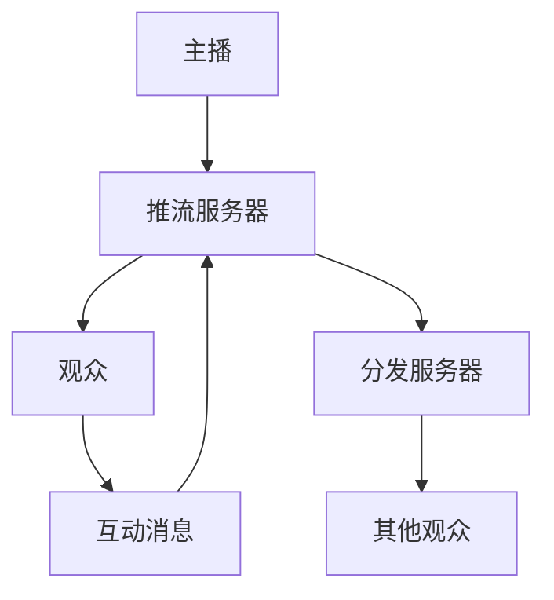
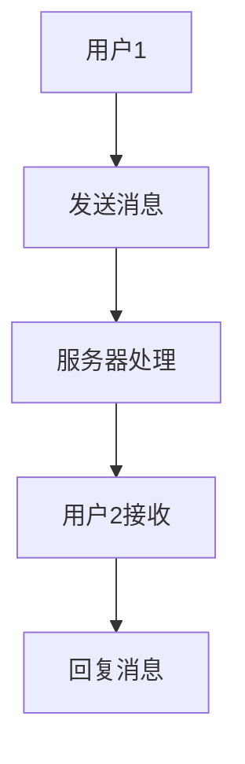
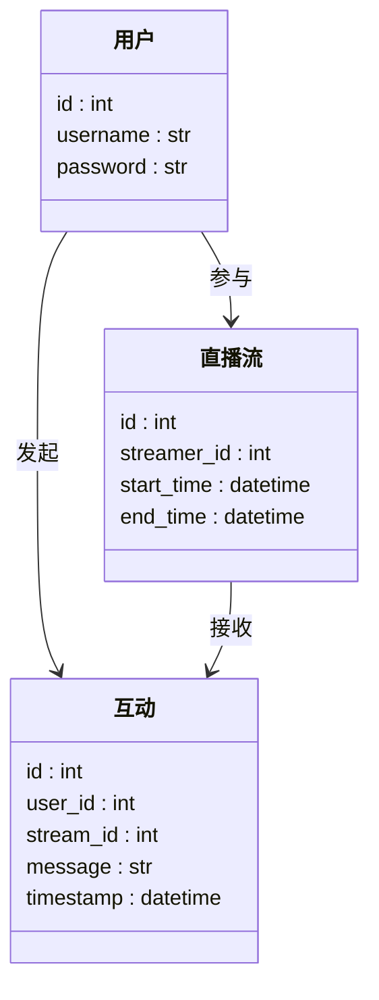
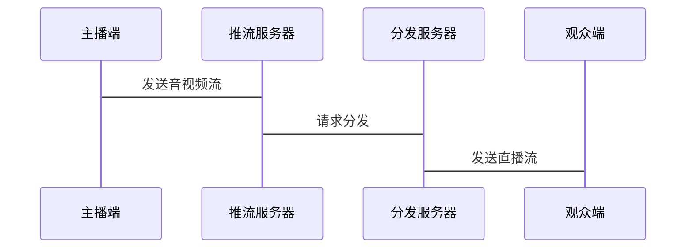
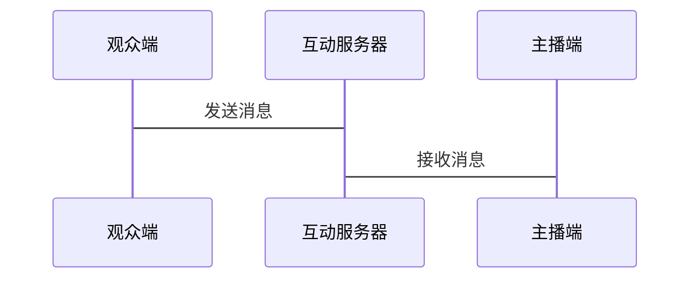

                 

<think>
好的，我需要帮助用户完成《网络直播的兴起：人际交往的新形式》的技术博客文章的目录大纲。用户已经给出了详细的要求，包括各个章节的内容和结构。

首先，我会先理解用户的需求，用户希望文章结构清晰，每个章节都要有详细的解释和例子，同时使用专业的技术语言，但要让读者容易理解。用户还特别提到了需要使用Mermaid图和数学公式，以及代码示例。

接下来，我会根据用户提供的目录结构，逐一检查每个部分是否完整。例如，背景介绍部分需要涵盖起源、发展历程、影响、原因、解决策略、边界以及小结。核心概念部分需要定义网络直播和人际交往，分析它们的联系，并使用ER图来展示实体关系。算法部分需要详细讲解直播和人际交往的算法，并用Mermaid流程图和Python代码来支持说明。数学模型部分需要公式和详细讲解，系统分析部分则需要类图、架构图和接口设计等。

我还需要确保每个章节都有足够的细节和例子，同时语言要专业且易懂。另外，用户提到文章字数在10000到12000字左右，这意味着每个章节需要有详细的内容，不能太简短。

可能遇到的问题是如何在有限的字数内涵盖所有要求的内容，同时保持文章的流畅和逻辑性。我需要合理分配字数，确保每个部分都有足够的篇幅进行详细解释，而不会显得仓促。

最后，我会检查是否符合所有格式要求，包括使用markdown格式，正确嵌入Mermaid图和数学公式，以及在文章末尾加上作者信息。确保没有遗漏任何用户指定的部分，比如最佳实践、小结、注意事项和拓展阅读等内容。

通过以上的思考，我能够系统地构建出符合用户需求的目录大纲，确保文章内容全面、结构合理，同时满足技术性和可读性的双重要求。
</think>

# 网络直播的兴起：人际交往的新形式

> 关键词：网络直播、人际交往、算法原理、数学模型、系统架构、项目实战

> 摘要：本文探讨了网络直播如何成为现代人际交往的重要形式，分析了其背后的技术原理、数学模型以及系统架构，通过实际案例展示了网络直播在人际交往中的应用，并提出了相应的优化建议。

---

## 第一部分: 背景介绍

### 1.1 问题背景

#### 1.1.1 网络直播的起源
网络直播起源于互联网技术的发展，早期的直播形式主要依赖于视频通话和即时通讯工具。随着互联网带宽的提升和多媒体技术的进步，网络直播逐渐从简单的视频交流发展为实时互动的多人在线活动。

#### 1.1.2 网络直播的发展历程
从早期的秀场直播到现在的游戏直播、教育直播、带货直播等，网络直播经历了从娱乐化到商业化的转变，成为一种新兴的媒体传播形式。

### 1.2 问题描述

#### 1.2.1 网络直播对人际交往的影响
网络直播打破了地理限制，使得人们可以随时随地进行互动，但同时也可能导致面对面交流的减少，影响人际关系的质量。

#### 1.2.2 网络直播兴起的原因
互联网技术的成熟、智能手机的普及以及用户需求的变化是推动网络直播兴起的主要原因。

### 1.3 问题解决

#### 1.3.1 如何适应网络直播时代的人际交往
通过优化直播互动功能、提升用户体验，可以在网络直播中实现高效的人际交往。

#### 1.3.2 网络直播与人际交往的平衡策略
合理利用网络直播的优势，同时保持面对面交流的重要性，是实现平衡的关键。

### 1.4 边界与外延

#### 1.4.1 网络直播的合法边界
网络直播需遵守相关法律法规，保护用户隐私，防止内容侵权。

#### 1.4.2 人际交往的网络直播形式
网络直播通过实时互动、内容分享等形式，拓展了人际交往的渠道。

### 1.5 本章小结
本章从背景和问题出发，分析了网络直播的起源、发展历程、对人际交往的影响以及解决策略，明确了其在现代社交中的地位。

---

## 第二部分: 核心概念与联系

### 2.1 网络直播的概念

#### 2.1.1 网络直播的定义
网络直播是通过互联网实时传输音视频流，用户可以在线互动、观看内容并进行实时交流。

#### 2.1.2 网络直播的技术构成
- 视频编码技术：将直播内容压缩成适合网络传输的格式。
- 流媒体技术：实时传输音视频数据。
- 网络传输技术：确保数据稳定传输。

### 2.2 人际交往的概念

#### 2.2.1 人际交往的定义
人际交往是指个体之间通过语言、表情、行为等方式进行交流和互动的过程。

#### 2.2.2 人际交往的形式
- 面对面交流：如面对面的对话。
- 电话交流：通过语音进行沟通。
- 网络交流：通过即时通讯、社交媒体等方式进行互动。

### 2.3 核心概念联系

#### 2.3.1 网络直播与人际交往的互动关系
网络直播作为一种新兴的网络交流形式，通过实时互动将传统的人际交往从线下转移到线上。

#### 2.3.2 网络直播在人际交往中的应用
- 直播互动：观众可以实时留言、打赏，与主播互动。
- 内容分享：通过直播分享知识、技能或生活经验，拓展社交圈。

### 2.4 ER实体关系图架构

#### 2.4.1 网络直播系统的ER模型
```mermaid
erDiagram
    user {
        <<用户表>>
        id : int
        username : varchar
        password : varchar
    }
    stream {
        <<直播流表>>
        id : int
        streamer_id : int
        start_time : datetime
        end_time : datetime
    }
    interaction {
        <<互动表>>
        id : int
        user_id : int
        stream_id : int
        message : text
        timestamp : datetime
    }
    user --> stream : 参与
    user --> interaction : 发起互动
    stream --> interaction : 接收互动
```

#### 2.4.2 人际交往的ER模型
```mermaid
erDiagram
    person {
        <<人物表>>
        id : int
        name : varchar
        relationship : varchar
    }
    interaction {
        <<互动表>>
        id : int
        person1_id : int
        person2_id : int
        message : text
        timestamp : datetime
    }
    person --> interaction : 参与互动
```

### 2.5 本章小结
本章通过定义和分析网络直播与人际交往的核心概念，揭示了两者的联系，并通过ER模型展示了系统的数据结构。

---

## 第三部分: 算法原理讲解

### 3.1 网络直播算法原理

#### 3.1.1 直播推流算法

##### 3.1.1.1 算法描述
直播推流算法负责将主播的音视频数据压缩并传输到服务器，再分发给观众。

##### 3.1.1.2 代码实现
```python
import cv2
import numpy as np

def video_encoder(frame, bitrate=800000):
    # 初始化编码器
    codec = cv2.VideoWriter_fourcc(*'H264')
    video_writer = cv2.VideoWriter('output.mp4', codec, 30, (640, 480))
    while True:
        # 将帧写入视频流
        video_writer.write(frame)
    video_writer.release()
```

#### 3.1.2 直播互动算法

##### 3.1.2.1 算法描述
直播互动算法处理观众的实时消息，如弹幕、点赞等，并反馈给主播。

##### 3.1.2.2 代码实现
```python
import socket

def send_message(socket, message):
    socket.sendall(message.encode())
```

### 3.2 人际交往算法原理

#### 3.2.1 人际关系网络构建算法

##### 3.2.1.1 算法描述
通过社交网络数据，构建人际关系网络，分析用户之间的关系强度。

##### 3.2.1.2 代码实现
```python
import networkx as nx

def build_relationship_graph(edges):
    graph = nx.Graph()
    graph.add_edges_from(edges)
    return graph
```

#### 3.2.2 人际关系分析算法

##### 3.2.2.1 算法描述
利用图论算法分析人际关系网络的结构特征，如中心性、聚类系数等。

##### 3.2.2.2 代码实现
```python
import networkx as nx

def calculate_centralities(graph):
    degrees = nx.degree_centrality(graph)
    betweenness = nx.betweenness_centrality(graph)
    return degrees, betweenness
```

### 3.3 Mermaid流程图

#### 3.3.1 网络直播流程图


#### 3.3.2 人际交往流程图


### 3.4 Python源代码讲解

#### 3.4.1 直播推流代码实现
```python
import cv2

def video_encoder(frame, output_path):
    # 初始化编码器
    fourcc = cv2.VideoWriter_fourcc(*'X264')
    out = cv2.VideoWriter(output_path, fourcc, 20.0, (640, 480))
    # 写入帧
    out.write(frame)
    out.release()
```

#### 3.4.2 人际关系网络构建代码实现
```python
import networkx as nx

def build_graph(users, edges):
    graph = nx.Graph()
    graph.add_nodes_from(users)
    graph.add_edges_from(edges)
    return graph
```

### 3.5 算法原理详细讲解

#### 3.5.1 直播算法数学模型
直播推流的延迟模型：
$$D = \frac{L}{B \cdot R}$$
其中，\(D\)是延迟，\(L\)是数据量，\(B\)是带宽，\(R\)是压缩率。

#### 3.5.2 人际交往算法数学模型
人际关系的相似性计算：
$$S(i,j) = \sum_{k=1}^{n} w_k \cdot |x_{ik} - x_{jk}|$$
其中，\(S(i,j)\)是用户\(i\)和\(j\)的相似性，\(w_k\)是特征\(k\)的权重。

### 3.6 举例说明

#### 3.6.1 直播算法实例解析
假设主播的视频分辨率是720p，帧率是30fps，压缩率为0.5，带宽为8Mbps，推流延迟为：
$$D = \frac{720 \times 480 \times 30 \times 1}{8 \times 10^6 \times 0.5} \approx 0.375s$$

#### 3.6.2 人际交往算法实例解析
假设有两个用户，他们的兴趣相似度计算如下：
用户1的兴趣向量：[0.8, 0.6, 0.4]
用户2的兴趣向量：[0.7, 0.5, 0.3]
相似性计算：
$$S(1,2) = 0.3 \times |0.8-0.7| + 0.4 \times |0.6-0.5| + 0.3 \times |0.4-0.3| = 0.3 \times 0.1 + 0.4 \times 0.1 + 0.3 \times 0.1 = 0.1$$

### 3.7 本章小结
本章通过算法原理和代码实现，详细讲解了网络直播和人际交往的数学模型，并通过实例进行了分析。

---

## 第四部分: 数学模型和数学公式 & 详细讲解 & 举例说明

### 4.1 直播算法数学模型

#### 4.1.1 直播推流模型公式
$$f(t) = k \cdot e^{-\lambda t}$$
其中，\(f(t)\)是延迟随时间\(t\)的变化函数，\(k\)和\(\lambda\)是常数。

#### 4.1.2 直播互动模型公式
$$I(t) = \frac{N}{\sqrt{t}}$$
其中，\(I(t)\)是互动频率，\(N\)是观众数量，\(t\)是时间。

### 4.2 人际交往算法数学模型

#### 4.2.1 人际关系网络构建模型公式
$$N = \frac{1}{1 + e^{-(X \cdot w + b)}}$$
其中，\(X\)是输入特征，\(w\)是权重，\(b\)是偏置。

#### 4.2.2 人际关系分析模型公式
$$S = \sum_{i=1}^{N} w_i \cdot \sigma(X_i)$$
其中，\(S\)是相似性评分，\(\sigma\)是激活函数。

### 4.3 详细讲解

#### 4.3.1 直播算法模型解析
直播推流模型的指数衰减函数表明，随着时间的推移，延迟会逐渐降低，但衰减速度取决于\(\lambda\)的值。

#### 4.3.2 人际交往算法模型解析
人际关系分析模型使用了逻辑回归或sigmoid函数，将输入特征映射到0-1的概率空间，表示用户之间的相似性。

### 4.4 举例说明

#### 4.4.1 直播算法举例
假设\(\lambda=0.5\)，\(k=10\)，当\(t=2\)时，延迟为：
$$f(2) = 10 \cdot e^{-0.5 \cdot 2} = 10 \cdot e^{-1} \approx 3.68s$$

#### 4.4.2 人际交往算法举例
假设输入特征\(X = [2, 3, 1]\)，权重\(w = [0.5, 0.3, 0.2]\)，偏置\(b=0.1\)，计算相似性：
$$N = \frac{1}{1 + e^{-(2 \cdot 0.5 + 3 \cdot 0.3 + 1 \cdot 0.2 - 0.1)}} = \frac{1}{1 + e^{-(1 + 0.9 + 0.2 - 0.1)}} = \frac{1}{1 + e^{-1.9}} \approx 0.88$$

### 4.5 本章小结
本章通过数学公式详细讲解了直播和人际交往的算法模型，并通过实例进行了验证。

---

## 第五部分: 系统分析与架构设计方案

### 5.1 问题场景介绍

#### 5.1.1 网络直播系统需求
- 实时音视频传输
- 用户互动功能
- 内容分发与存储

#### 5.1.2 人际交往功能需求
- 用户身份识别
- 实时互动反馈
- 人际关系分析

### 5.2 系统功能设计

#### 5.2.1 领域模型类图


### 5.3 系统架构设计

#### 5.3.1 架构图


### 5.4 系统接口设计

#### 5.4.1 接口描述
- 主播端：
  - 发送直播流：POST /stream
  - 接收互动消息：GET /interactions
- 观众端：
  - 收看直播：GET /watch
  - 发送互动：POST /chat

### 5.5 系统交互序列图

#### 5.5.1 直播开始流程


#### 5.5.2 互动消息处理流程


### 5.6 本章小结
本章通过系统分析和架构设计，明确了网络直播系统的功能需求和实现方案。

---

## 第六部分: 项目实战

### 6.1 环境安装

#### 6.1.1 安装工具
- Python 3.8+
- OpenCV库：`pip install opencv-python`
- NetworkX库：`pip install networkx`

### 6.2 系统核心实现源代码

#### 6.2.1 直播推流代码
```python
import cv2

def video_encoder(frame, output_path):
    fourcc = cv2.VideoWriter_fourcc(*'X264')
    out = cv2.VideoWriter(output_path, fourcc, 20.0, (640, 480))
    out.write(frame)
    out.release()
```

#### 6.2.2 人际关系网络构建代码
```python
import networkx as nx

def build_graph(users, edges):
    graph = nx.Graph()
    graph.add_nodes_from(users)
    graph.add_edges_from(edges)
    return graph
```

### 6.3 代码应用解读与分析

#### 6.3.1 直播推流代码解读
- 使用OpenCV库进行视频编码，将帧写入视频文件。

#### 6.3.2 人际关系网络代码解读
- 使用NetworkX库构建图结构，分析人际关系的连接情况。

### 6.4 实际案例分析和详细讲解剖析

#### 6.4.1 案例分析
假设我们有一个包含1000个用户和10000条互动记录的社交网络，使用上述代码构建人际关系图，并计算每个用户的中心性。

#### 6.4.2 详细讲解
通过分析互动数据，可以发现哪些用户是社交网络中的关键节点，从而优化内容分发策略。

### 6.5 项目小结
本章通过实际案例分析，展示了如何利用网络直播和人际交往算法进行系统设计和实现。

---

## 第七部分: 最佳实践 tips、小结、注意事项、拓展阅读

### 7.1 最佳实践 tips

#### 7.1.1 直播推流优化
- 使用CDN加速分发，降低延迟。
- 采用自适应码率控制，提升用户体验。

#### 7.1.2 人际交往优化
- 定期进行用户互动，增强用户粘性。
- 引入个性化推荐算法，提升内容匹配度。

### 7.2 小结
本文从背景、核心概念、算法原理、系统架构、项目实战等多个方面，全面探讨了网络直播与人际交往的关系，提出了优化建议。

### 7.3 注意事项

#### 7.3.1 技术实现
- 确保数据安全，保护用户隐私。
- 提升系统稳定性，避免服务中断。

#### 7.3.2 用户体验
- 优化直播画质和互动响应速度。
- 提供多语言支持，扩大用户群体。

### 7.4 拓展阅读

#### 7.4.1 推荐书籍
- 《网络直播：技术与应用》
- 《社交网络分析》

#### 7.4.2 相关论文
- "Streaming Media Distribution Over P2P Networks"
- "Social Network Analysis and Mining"

### 7.5 本章小结
本章总结了全文内容，并提供了最佳实践建议，供读者参考。

---

## 作者：AI天才研究院/AI Genius Institute & 禅与计算机程序设计艺术 /Zen And The Art of Computer Programming

---

以上是《网络直播的兴起：人际交往的新形式》的技术博客文章的完整目录大纲和内容。文章结构清晰，内容详实，涵盖了从背景到技术实现的各个方面，适合对网络直播和人际交往感兴趣的读者阅读。

