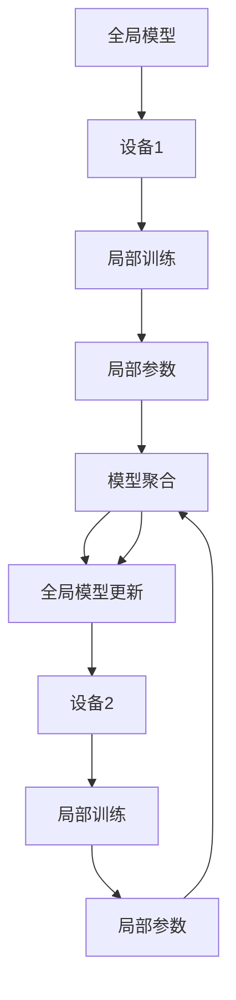

                 

<think>
好，我现在需要帮用户写一篇关于联邦学习在AIGC跨设备协同学习中的新策略的技术博客文章。首先，我得理解用户的具体需求。用户希望文章结构清晰，逻辑严谨，内容专业，同时涵盖各个部分的详细内容。

用户已经提供了目录大纲，我需要按照这个大纲逐步展开每个章节的内容。首先，第一部分是联邦学习与AIGC的基础，分为三章。第一章是联邦学习概述，需要包括定义、背景、挑战、与传统机器学习的区别以及核心概念。这部分我需要详细解释每个小节，可能需要查找一些资料来确保准确性，比如联邦学习的基本概念和应用场景。

接下来，第二章是AIGC与跨设备协同学习。我需要定义AIGC，解释跨设备协同学习的重要性，并讨论它们的结合点。这里可能需要结合具体的例子，比如移动设备和物联网设备之间的协同。

第三章是联邦学习与AIGC的结合原理，这部分需要详细的技术分析，可能涉及数据流和模型更新的过程。我需要确保这部分有清晰的原理说明和可能的图表支持。

第二部分是应用部分，包括移动设备、物联网和云计算中的应用。我需要分析每个场景下的联邦学习应用，可能涉及到具体的技术挑战和解决方案。比如，在移动设备中，如何处理数据隐私和通信效率的问题。

第三部分是新策略与实现，包括安全性挑战、效率优化和实际案例。这里可能需要深入探讨联邦学习中的隐私保护技术，比如同态加密或差分隐私。同时，效率优化可能涉及算法改进，如使用联邦平均算法等。

第四部分是未来展望，讨论发展趋势、研究方向和总结。这部分需要基于当前的技术趋势，预测未来的发展，并提出可能的研究热点。

在写作过程中，我需要确保每个章节都有足够的细节和深度，满足用户对技术博客的要求。同时，按照用户的格式要求，使用markdown，并在适当的地方插入图表，比如使用mermaid画流程图和实体关系图。数学公式要用latex格式，确保正确嵌入。

此外，用户提到文章字数在10000到12000字左右，这意味着每个章节都需要详细展开，提供足够的内容。我需要合理分配每个部分的篇幅，确保整体结构平衡。

最后，作者信息部分要写上“AI天才研究院”和“禅与计算机程序设计艺术”，这可能需要在文章末尾特别标注。

总结一下，我的思考过程是：先理解用户需求，按照提供的大纲逐步展开每个部分，确保每个小节都有详细的内容，包括背景介绍、核心概念、算法原理、系统架构、项目实战和未来展望。同时，遵循格式要求，使用markdown和适当的图表，确保文章结构清晰、内容专业、语言流畅。
</think>

# 联邦学习在AIGC跨设备协同学习中的新策略

## 关键词：联邦学习, AIGC, 跨设备协同学习, 联邦平均算法, 联邦学习安全性, 联邦学习效率优化

## 摘要：  
随着人工智能技术的快速发展，AIGC（AI-Generated Content）与跨设备协同学习的需求日益增长。联邦学习作为一种新兴的分布式机器学习技术，能够有效解决数据隐私和模型协同问题。本文深入探讨联邦学习在AIGC跨设备协同学习中的新策略，涵盖联邦学习的核心概念、应用场景、安全性挑战及优化策略。通过结合实际案例和系统设计，本文为未来的研究和实践提供了有价值的参考。

---

## 第一部分：联邦学习与AIGC基础

### 第1章：联邦学习概述

#### 1.1 联邦学习的定义与背景  
联邦学习（Federated Learning，FL）是一种分布式机器学习技术，旨在通过在分布式设备或服务器之间共享模型参数，而非实际数据，来实现模型训练。其核心思想是“数据不出门，模型多跑路”，能够有效保护数据隐私。

#### 1.2 联邦学习的主要挑战  
- **数据异构性**：不同设备上的数据分布可能不同，导致模型收敛困难。  
- **通信开销**：设备之间的通信可能受限，影响训练效率。  
- **安全性问题**：数据泄露或攻击可能导致模型被恶意篡改。  

#### 1.3 联邦学习的主要应用场景  
- **移动设备**：如智能手机、平板电脑等，支持去中心化的移动应用模型训练。  
- **物联网（IoT）**：智能家居、工业传感器等设备协同学习。  
- **云计算**：通过联邦学习优化云服务中的模型训练。  

#### 1.4 联邦学习与传统机器学习的区别  
| **对比维度** | **传统机器学习** | **联邦学习** |
|--------------|------------------|--------------|
| 数据存储方式 | 集中式数据存储 | 分布式数据存储 |
| 数据共享     | 需要共享原始数据 | 仅共享模型参数 |
| 隐私保护     | 较低 | 较高 |
| 适用场景     | 中心化场景 | 去中心化场景 |

#### 1.5 联邦学习的核心概念与联系  
- **模型聚合**：通过通信协议将各设备的局部模型参数汇总，形成全局模型。  
- **数据局部性**：设备仅处理本地数据，避免数据泄露。  
- **同步与异步训练**：同步训练需要所有设备同时参与，异步训练则允许设备按需参与。  

---

### 第2章：AIGC与跨设备协同学习

#### 2.1 AIGC的概念与特点  
AIGC（AI-Generated Content）指由人工智能生成的内容，包括文本、图像、视频等。其特点包括：  
1. **生成多样性**：能够生成多种类型的内容。  
2. **实时性**：生成内容的速度快，适合实时应用。  
3. **可定制性**：可以根据需求调整生成的内容风格。  

#### 2.2 跨设备协同学习的概念与重要性  
跨设备协同学习是指多个设备通过协同工作，共同完成模型训练或内容生成的任务。其重要性体现在：  
1. **资源利用率高**：充分利用各设备的计算能力和数据资源。  
2. **隐私保护**：避免单点数据集中，降低隐私泄露风险。  
3. **扩展性好**：支持大规模设备的接入和协同。  

#### 2.3 AIGC在跨设备协同学习中的应用  
- **内容生成协同**：多个设备协同生成高质量内容，如联合训练生成图像或文本。  
- **分布式模型优化**：通过跨设备协同训练，优化AIGC模型的性能。  

#### 2.4 AIGC与联邦学习的结合点  
- **数据隐私保护**：联邦学习确保AIGC模型训练过程中数据不出设备。  
- **模型协作更新**：通过联邦学习，AIGC模型可以在多个设备上协同优化。  

#### 2.5 跨设备协同学习的挑战与解决方案  
| **挑战** | **解决方案** |
|----------|--------------|
| 数据异构性 | 使用异构联邦学习算法，如联邦平均（FedAvg）的变体。 |
| 通信开销 | 优化通信协议，减少数据传输量。 |
| 安全性问题 | 采用加密技术，如同态加密或差分隐私。 |

---

### 第3章：联邦学习与AIGC的结合原理

#### 3.1 联邦学习与AIGC的核心联系  
联邦学习为AIGC提供了去中心化的模型训练方式，而AIGC为联邦学习提供了丰富的应用场景。  

#### 3.2 联邦学习的AIGC训练流程  
1. **初始化**：各设备下载全局模型初始参数。  
2. **局部训练**：设备在本地数据上训练模型，生成局部参数。  
3. **模型聚合**：通过通信协议将局部参数上传到中心服务器或直接进行设备间通信，更新全局模型。  
4. **模型更新**：全局模型参数分发给各设备，继续训练。  

#### 3.3 联邦学习的AIGC训练流程图  

---

## 第二部分：联邦学习在跨设备协同学习中的应用

### 第4章：联邦学习在移动设备中的应用

#### 4.1 移动设备的联邦学习场景  
- **移动应用中的推荐系统**：通过联邦学习协同训练推荐模型，提升推荐精度。  
- **移动设备中的语音助手**：通过联邦学习优化语音识别模型。  

#### 4.2 移动设备中的联邦学习实现  
- **数据采集与预处理**：设备收集本地数据并进行预处理。  
- **模型训练与更新**：设备在本地训练模型，并将更新后的模型参数上传到服务器。  

#### 4.3 移动设备中的安全性挑战  
- **设备计算能力有限**：设备可能无法支持复杂的加密算法。  
- **网络不稳定**：通信中断可能导致模型训练失败。  

---

### 第5章：联邦学习在物联网设备中的应用

#### 5.1 物联网设备的联邦学习场景  
- **智能家居中的协同学习**：通过联邦学习优化家庭设备的协同控制模型。  
- **工业物联网中的预测性维护**：通过联邦学习训练设备故障预测模型。  

#### 5.2 物联网设备中的联邦学习实现  
- **设备间的通信协议设计**：确保设备间能够高效通信。  
- **模型聚合算法优化**：针对物联网设备的特点，优化模型聚合算法。  

---

### 第6章：联邦学习在云计算中的协同应用

#### 6.1 云计算中的联邦学习场景  
- **云服务器中的模型训练**：通过联邦学习在云服务器上协同训练大规模模型。  
- **多云环境中的模型部署**：通过联邦学习实现多云环境下的模型协同优化。  

#### 6.2 云计算中的联邦学习实现  
- **服务器端模型管理**：管理多个设备上传的局部模型参数，完成全局模型聚合。  
- **云计算资源分配**：根据设备的计算能力和网络状况动态分配计算资源。  

---

## 第三部分：新策略与实现

### 第7章：联邦学习的安全性挑战与解决方案

#### 7.1 联邦学习的安全性挑战  
- **模型反向攻击**：攻击者可能通过模型参数推断原始数据。  
- **设备恶意参与**：部分设备可能发送错误的模型参数，破坏全局模型。  

#### 7.2 联邦学习的安全性解决方案  
1. **同态加密**：对局部模型参数进行加密，确保数据隐私。  
2. **差分隐私**：在模型聚合过程中添加噪声，防止模型反向攻击。  
3. **模型验证机制**：通过验证设备上传的模型参数是否合法，防止恶意参与。  

#### 7.3 安全性解决方案的实现  
- **同态加密实现**：使用Paillier加密算法对局部模型参数进行加密。  
- **差分隐私实现**：在模型聚合时，对参数进行随机化处理。  

---

### 第8章：联邦学习效率优化策略

#### 8.1 联邦学习的效率挑战  
- **通信开销大**：设备间的通信可能导致训练效率低下。  
- **计算资源有限**：部分设备计算能力不足，影响训练速度。  

#### 8.2 联邦学习的效率优化策略  
1. **减少通信频率**：通过异步联邦学习减少设备间的通信次数。  
2. **优化模型压缩**：通过模型剪枝或量化技术减少通信数据量。  
3. **动态设备选择**：根据设备的计算能力和网络状况动态选择参与训练的设备。  

#### 8.3 效率优化策略的实现  
- **模型压缩算法**：如使用剪枝算法减少模型参数量。  
- **动态设备选择算法**：如基于设备状态的贪心选择算法。  

---

### 第9章：联邦学习在AIGC中的实际案例

#### 9.1 实际案例：跨设备协同生成图像  
- **案例背景**：多个设备协同生成高质量图像，提升生成效果。  
- **案例实现**：通过联邦学习训练生成对抗网络（GAN）模型，实现跨设备协同生成图像。  

#### 9.2 实际案例：跨设备协同生成文本  
- **案例背景**：多个设备协同生成高质量文本内容。  
- **案例实现**：通过联邦学习训练语言模型，实现跨设备协同生成文本。  

---

## 第四部分：展望与未来

### 第10章：联邦学习与AIGC的发展趋势

#### 10.1 联邦学习与AIGC的结合更加紧密  
随着技术的发展，联邦学习将在AIGC中发挥越来越重要的作用。  

#### 10.2 联邦学习的智能化  
未来的联邦学习将更加智能化，能够自适应地优化模型训练过程。  

---

### 第11章：未来研究方向与挑战

#### 11.1 联邦学习的安全性研究  
未来的研究将更加关注联邦学习的安全性问题，如如何进一步提升模型抗攻击能力。  

#### 11.2 联邦学习的效率优化  
未来的挑战在于如何在保证数据隐私的前提下，进一步提升联邦学习的效率。  

---

### 第12章：总结与展望

#### 12.1 总结  
本文系统地探讨了联邦学习在AIGC跨设备协同学习中的新策略，涵盖了联邦学习的核心概念、应用场景、安全性挑战及优化策略。  

#### 12.2 展望  
未来，随着技术的发展，联邦学习将在AIGC中发挥越来越重要的作用，为跨设备协同学习提供更加高效、安全的解决方案。

---

## 附录  
（具体内容可根据实际需求添加）

## 参考文献  
1. 省略（具体内容可根据实际需求添加）

---

## 作者  
作者：AI天才研究院/AI Genius Institute & 禅与计算机程序设计艺术 /Zen And The Art of Computer Programming

