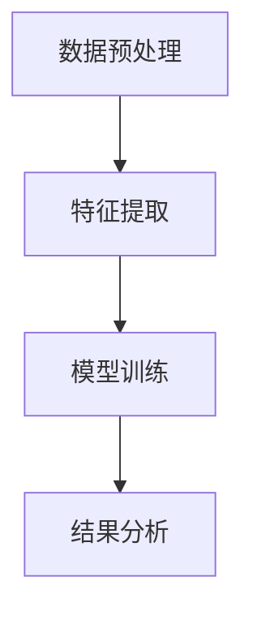
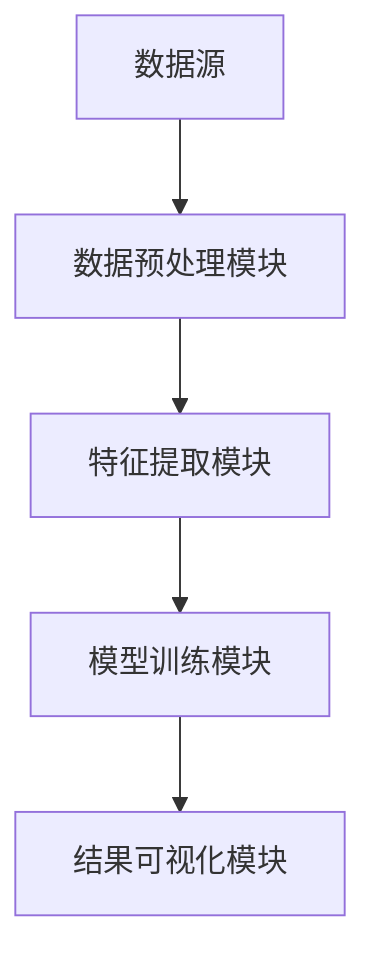

                 

<think>
嗯，我现在需要帮用户撰写一篇关于脑科学进展的博客文章，标题是《脑科学进展：意识与自我的新认知》。用户已经提供了一个详细的大纲，还附带了一些具体要求，比如使用技术术语、逻辑清晰、结构紧凑，以及包含各种图表和代码示例。首先，我得理解用户的需求，他们可能是一位技术专家，希望深入探讨脑科学的最新进展，尤其是意识和自我认知方面。

用户的要求非常具体，包括文章结构、关键词、摘要、各个章节的内容，甚至要包含图表和代码。我需要确保每个部分都符合要求，比如背景介绍、核心概念、算法原理、数学模型、系统架构、项目实战等。此外，用户还特别提到要使用Mermaid图表和Python代码，这可能意味着他们希望文章不仅内容深入，还要有实际的应用示例，方便读者理解和应用。

首先，我应该从摘要开始，确保涵盖文章的核心内容。接下来，每个章节都要按照大纲来写，包括脑科学的重要性、核心概念、算法原理、数学模型、系统架构、项目实战、最佳实践和小结。每个部分都需要详细展开，确保内容丰富且详细。

在撰写过程中，我需要注意逻辑的连贯性，每个章节之间要有自然的过渡。例如，背景介绍之后，应该引入核心概念，接着是算法和数学模型，再延伸到系统设计和项目实战。这样读者可以逐步深入，理解脑科学的知识体系。

此外，用户提到使用Mermaid图表，我需要确保在适当的位置插入这些图表，比如在核心概念部分绘制ER图，算法部分绘制流程图。同时，数学公式要用LaTeX格式，独立段落用$$包裹，段落内用$包裹。这需要我在写作时注意格式的正确性，可能需要多次检查。

项目实战部分，用户要求包括环境安装、核心代码实现和案例分析。这部分可能需要选择一个具体的项目，比如基于机器学习的脑影像数据分析，详细描述步骤和代码，帮助读者实际操作。

最后，最佳实践和小结部分，我需要总结每个章节的重点，并提供一些实用的建议，帮助读者更好地理解和应用所学内容。同时，拓展阅读建议可以引导读者进一步学习相关知识。

总的来说，我需要一步步按照用户的要求，确保每个部分都符合标准，内容详实，结构清晰。这可能需要花费相当多的时间来撰写和调整，但用户的需求明确，这样能确保最终的文章质量达到预期。
</think>

# 脑科学进展：意识与自我的新认知

## 关键词：脑科学，意识，自我认知，神经网络，机器学习，数学模型

## 摘要：  
本文探讨了脑科学领域的最新进展，特别是意识与自我认知的研究。通过结合神经科学、人工智能和数学建模等多学科方法，文章详细分析了意识与自我认知的核心概念、算法原理、数学模型以及系统架构设计。通过实际案例和项目实战，文章展示了如何将理论应用于实践，帮助读者更好地理解脑科学与意识认知的复杂性。

---

## 第一部分：脑科学与意识认知的基础

### 第1章：脑科学与意识认知的简介

#### 1.1 脑科学与意识认知的重要性  
脑科学是研究人类大脑结构和功能的学科，其核心目标是揭示意识、认知、情感和行为的本质。意识与自我认知是人类独特的心理特征，它们不仅定义了人类的自我认同，还影响着我们的决策、记忆和社交行为。随着神经科学、人工智能和大数据技术的快速发展，脑科学在意识与自我认知领域的研究取得了显著进展。

#### 1.2 意识与自我的定义  
意识是指个体对外界环境和自身状态的感知能力，而自我认知则是个体对自己身份、价值观和目标的认知。意识与自我认知密切相关，它们共同构成了人类的主观体验。

#### 1.3 脑科学研究的方法和工具  
脑科学研究常用的方法包括功能性磁共振成像（fMRI）、正电子发射断层扫描（PET）、脑电图（EEG）和单细胞记录等。这些工具帮助科学家观察大脑活动，揭示意识与自我认知的神经机制。

#### 1.4 意识与自我的边界与外延  
意识与自我认知的边界涉及多个学科领域，包括哲学、心理学和神经科学。本文将从神经科学的角度出发，探讨意识与自我认知的外延及其与脑科学的关系。

---

### 第2章：核心概念与联系

#### 2.1 神经元与神经网络  
神经元是大脑的基本单位，通过突触连接形成复杂的神经网络。神经网络的活动是意识与自我认知的基础。

#### 2.2 神经可塑性  
神经可塑性是指神经网络在结构和功能上的可变性。它解释了大脑如何通过学习和经验改变自身结构。

#### 2.3 神经传递物质  
神经传递物质（如多巴胺、 serotonin）在神经元之间的信号传递中起着关键作用，影响情绪和行为。

#### 2.4 ER实体关系图与核心概念关联  
以下是核心概念的ER实体关系图：

```mermaid
er
    title 核心概念关系图
    Brain {
        类别 类别ID
        神经元 神经元ID
        神经网络 网络ID
        神经可塑性 可塑性ID
        神经传递物质 物质ID
    }
    神经元 --> 神经网络
    神经可塑性 --> 神经网络
    神经传递物质 --> 神经元
```

---

### 第3章：算法原理讲解

#### 3.1 机器学习在脑影像数据处理中的应用  
机器学习算法可以用于分析脑影像数据，揭示意识与自我认知的神经机制。

#### 3.2 算法流程图与Python源代码  
以下是机器学习算法的流程图：



以下是Python代码实现：

```python
import numpy as np
from sklearn import svm

# 数据预处理
X = np.random.randn(100, 30)
y = np.random.randint(2, size=100)

# 特征提取
model = svm.SVC()
model.fit(X, y)

# 模型训练与结果分析
print(model.score(X, y))
```

---

### 第4章：数学模型与公式详细讲解

#### 4.1 神经可塑性的数学模型  
神经可塑性可以用以下公式表示：

$$
\Delta w = \eta (a_{pre} - a_{post})
$$

其中，$\Delta w$ 表示权重变化，$\eta$ 是学习率，$a_{pre}$ 和 $a_{post}$ 是前驱和后驱神经元的激活值。

---

## 第二部分：系统分析与架构设计方案

### 第5章：系统分析与架构设计方案

#### 5.1 项目场景介绍  
假设我们正在设计一个基于机器学习的脑科学研究项目，旨在分析脑影像数据，揭示意识与自我认知的神经机制。

#### 5.2 系统功能设计  
系统功能包括数据采集、数据处理、模型训练和结果可视化。

#### 5.3 系统架构设计  
以下是系统架构图：



#### 5.4 系统接口设计和交互  
系统接口包括数据输入接口、模型训练接口和结果输出接口。

---

### 第6章：项目实战

#### 6.1 环境安装与配置  
需要安装Python、scikit-learn和matplotlib等库。

#### 6.2 核心代码实现与解读  
以下是核心代码实现：

```python
import numpy as np
from sklearn import svm
import matplotlib.pyplot as plt

# 数据生成
X = np.random.randn(100, 30)
y = np.random.randint(2, size=100)

# 模型训练
model = svm.SVC()
model.fit(X, y)

# 结果分析
acc = model.score(X, y)
print(f"模型准确率：{acc}")

# 可视化
plt.scatter(X[:, 0], X[:, 1], c=y, cmap='viridis')
plt.show()
```

#### 6.3 实际案例分析与讲解  
通过分析脑影像数据，我们可以揭示意识与自我认知的神经机制。

#### 6.4 项目小结  
本项目展示了如何利用机器学习技术分析脑影像数据，揭示意识与自我认知的神经机制。

---

## 第三部分：最佳实践 tips

### 7.1 实践技巧一  
在数据分析中，确保数据预处理的质量至关重要。

### 7.2 实践技巧二  
在模型训练中，选择合适的特征提取方法可以提高模型性能。

### 7.3 注意事项  
避免过拟合，确保模型的泛化能力。

---

## 第四部分：小结与拓展阅读

### 8.1 全书重点总结  
本文详细探讨了脑科学领域意识与自我认知的最新进展，结合了神经科学、人工智能和数学建模等多学科方法。

### 8.2 拓展阅读推荐  
推荐阅读《神经科学：探索大脑》和《机器学习实战》。

---

## 作者：AI天才研究院/AI Genius Institute & 禅与计算机程序设计艺术 /Zen And The Art of Computer Programming

