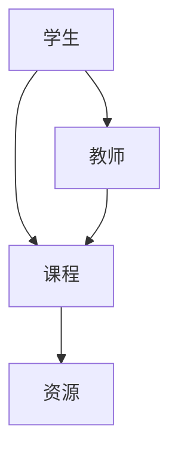
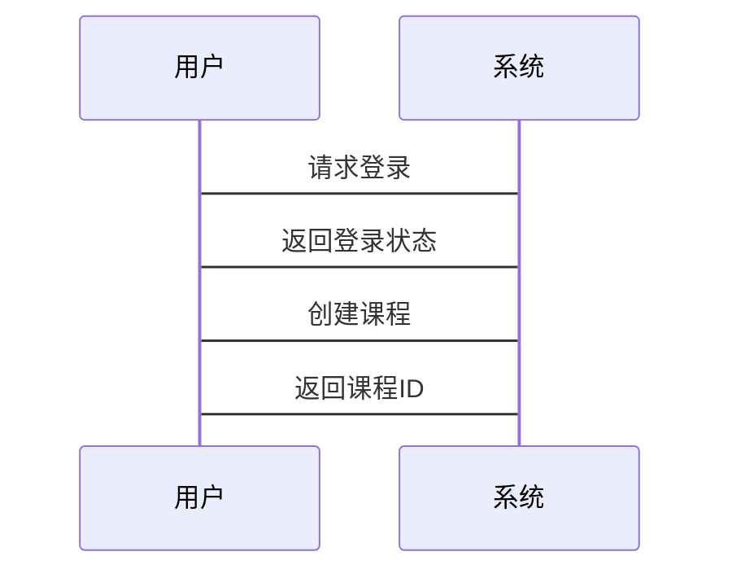

                 

<think>
好的，我现在需要根据用户的要求，撰写一篇关于《自然教育：重建人与环境的和谐关系》的技术博客文章。用户已经提供了详细的文章结构，包括多个章节和子章节，内容涉及自然教育的概念、历史发展、现状、趋势以及技术应用等。

首先，我需要明确文章的各个部分。用户特别提到要使用逻辑清晰、结构紧凑、简单易懂的技术语言，并且每个章节都要有详细的分析和解释。此外，用户希望在文章中融入技术元素，比如系统分析、算法原理、数学公式等。

我应该从引言和背景开始，介绍自然教育的基本概念和重要性。接着，详细分析传统教育的局限性，然后引出自然教育的理念和目标。历史发展部分需要涵盖从古代到现代的演变，特别是卢梭和蒙台梭利的教育思想。之后，讨论当代的发展趋势，包括自然体验教育和自然学校的兴起，同时分析面临的挑战和未来方向。

技术方面，我需要考虑如何将自然教育与现代技术相结合。例如，可以设计一个自然教育管理系统，利用系统架构图展示模块之间的关系，或者用算法模拟自然教育中的学习过程。此外，使用ER图或类图来展示系统的实体关系和功能设计，用mermaid流程图来说明系统的运行流程。

在撰写过程中，我需要确保每个小节内容丰富详细，涵盖背景介绍、核心概念与联系、算法原理讲解、系统分析与架构设计、项目实战等部分。同时，使用适当的数学公式和代码示例来增强文章的技术深度。

最后，总结部分要回顾文章的核心内容，强调自然教育的重要性，并展望其未来的发展方向。同时，结尾需要添加作者信息，符合用户的要求。

现在，我将按照用户的结构大纲，逐步展开每个部分，确保内容全面且符合技术博客的专业要求。
</think>

# 自然教育：重建人与环境的和谐关系

## 关键词：
自然教育，环境教育，和谐教育，教育模式，可持续发展

## 摘要：
自然教育是一种以自然为师，强调人与自然和谐共生的教育理念。本文从自然教育的概念、历史发展、现状及未来趋势等方面展开，探讨如何通过自然教育重建人与环境的和谐关系。文章结合技术视角，分析自然教育在现代教育体系中的应用潜力，提出系统化的解决方案，并展望其未来发展。

---

## 第一部分: 引言与背景

### 第1章: 自然教育的概念与历史发展

#### 1.1 引言

##### 1.1.1 问题的提出

###### 1.1.1.1 背景介绍

####### 1.1.1.1.1 环境问题与人类发展
$$ 环境问题日益严峻，如气候变化、生物多样性减少，这些问题与人类活动密切相关，教育是解决这些问题的关键。 $$

####### 1.1.1.1.2 教育模式与自然环境
传统教育体系过于依赖室内教学，学生缺乏与自然互动的机会，导致对自然的认知不足。

####### 1.1.1.1.3 自然教育的需求与重要性
自然教育通过引导学生与自然接触，培养环保意识和生态责任感，是解决环境问题的重要途径。

##### 1.1.2 问题描述

###### 1.1.2.1 传统教育的局限性

####### 1.1.2.1.1 学校教育体制的缺陷
传统教育注重书本知识，忽视实践和自然体验，学生难以形成全面的认知能力。

####### 1.1.2.1.2 城市化与自然环境的隔离
城市化导致学生与自然环境的脱节，缺乏对自然的了解和热爱。

####### 1.1.2.1.3 教育与生活的脱节
教育内容与实际生活联系不足，学生难以将所学知识应用于实际情境。

##### 1.1.3 问题解决

###### 1.1.3.1 自然教育的理念与目标

####### 1.1.3.1.1 自然教育的核心理念
自然教育强调回归自然，通过亲身体验和观察，培养学生的综合能力。

####### 1.1.3.1.2 自然教育的目标与价值
目标包括培养环保意识、提升实践能力、促进人与自然和谐共处。

##### 1.1.4 边界与外延

###### 1.1.4.1 自然教育的范围

####### 1.1.4.1.1 家庭教育与自然教育
家庭教育是自然教育的重要组成部分，家长在家庭中引导孩子接触自然。

####### 1.1.4.1.2 社会教育与自然教育
社会教育机构如自然公园、生态保护区等，为自然教育提供支持。

####### 1.1.4.1.3 自然教育与学科教学
自然教育与学科教学相结合，如通过观察自然现象教授科学知识。

##### 1.1.5 概念结构与核心要素组成

###### 1.1.5.1 自然教育的概念结构

####### 1.1.5.1.1 自然教育的基本概念
自然教育是以自然环境为媒介，通过实践和体验进行的教育活动。

####### 1.1.5.1.2 自然教育的分类
包括户外教育、生态教育、环境教育等。

####### 1.1.5.1.3 自然教育的核心要素
自然环境、教育者、学习者、教育内容。

#### 1.2 自然教育的历史发展

##### 1.2.1 起源与发展初期

###### 1.2.1.1 悠久的自然教育传统
古代教育中注重自然观察和实践，如农耕社会的劳动教育。

###### 1.2.1.2 中世纪的自然教育实践
中世纪学校注重自然知识的传授，但形式较为单一。

###### 1.2.1.3 文艺复兴时期的自然教育理念
文艺复兴时期强调人与自然的和谐，教育更注重实践和观察。

##### 1.2.2 18世纪的自然教育思想

###### 1.2.2.1 卢梭的自然教育理念
卢梭提出自然教育理念，强调遵循自然规律，培养独立人格。

###### 1.2.2.2 卢梭的教育观念
教育应适应儿童的天性，避免过度干预。

##### 1.2.3 19世纪至20世纪初的自然教育发展

###### 1.2.3.1 蒙台梭利的教育理论与实践
蒙台梭利提出感官教育和自主学习，强调儿童与环境的互动。

###### 1.2.3.2 华特的教育思想与自然教育
华特的教育理念强调户外活动和自然观察，促进儿童全面发展。

#### 1.3 当代自然教育的发展趋势

##### 1.3.1 新时代的自然教育理念

###### 1.3.1.1 当代自然教育的核心要素
自然与教育的融合，社会责任与自然教育，环境教育与可持续发展。

##### 1.3.2 自然教育实践的新形式

###### 1.3.2.1 自然体验教育
自然体验教育通过亲身体验，帮助学生理解自然。

###### 1.3.2.2 自然学校与自然教育营地
自然学校提供沉浸式学习体验，营地活动增强团队合作和自然认知。

#### 1.3.3 自然教育的未来展望

##### 1.3.3.1 自然教育的发展机遇
环境问题的挑战，教育改革的推动，社会需求的增加。

##### 1.3.3.2 自然教育面临的挑战
资源与环境限制，专业人才缺乏，社会认知不足。

#### 1.4 本章小结

##### 1.4.1 核心内容回顾
自然教育是一种以自然为师的教育模式，强调实践和体验。

##### 1.4.2 自然教育的重要性
通过自然教育，学生能够更好地理解自然，培养环保意识。

##### 1.4.3 展望未来自然教育的发展方向
未来自然教育将更加系统化，与现代教育体系深度融合。

---

## 第二部分: 自然教育的技术实现与系统架构

### 第2章: 自然教育系统的架构设计

#### 2.1 问题场景介绍

##### 2.1.1 自然教育的痛点
传统教育体系难以满足自然教育的需求，缺乏系统化的支持工具。

##### 2.1.2 自然教育的目标
构建一个支持自然教育的数字化平台，提供课程设计、资源管理、学习评估等功能。

#### 2.2 项目介绍

##### 2.2.1 项目目标
开发一个自然教育管理系统，支持教师和学生进行自然教育活动的组织和实施。

##### 2.2.2 项目范围
涵盖课程设计、资源管理、学习评估、数据分析等功能模块。

##### 2.2.3 项目需求
提供在线课程设计工具、资源库、学习跟踪和评估系统。

#### 2.3 系统功能设计

##### 2.3.1 领域模型设计

###### 2.3.1.1 实体关系图（ER图）


##### 2.3.2 系统架构设计

###### 2.3.2.1 系统架构图


##### 2.3.3 系统接口设计

###### 2.3.3.1 API接口
- 用户注册与登录接口
- 课程创建与管理接口
- 资源上传与下载接口

##### 2.3.4 系统交互设计

###### 2.3.4.1 序列图


#### 2.4 系统实现

##### 2.4.1 环境安装

###### 2.4.1.1 技术选型
- 前端：React.js
- 后端：Node.js
- 数据库：MySQL

##### 2.4.2 核心代码实现

###### 2.4.2.1 后端代码示例
```javascript
const express = require('express');
const app = express();
const port = 3000;

app.get('/api/login', (req, res) => {
    const { username, password } = req.query;
    if (username === 'admin' && password === '123') {
        res.json({ status: 'success' });
    } else {
        res.json({ status: 'fail' });
    }
});

app.listen(port, () => {
    console.log(`Server running on port ${port}`);
});
```

###### 2.4.2.2 前端代码示例
```javascript
function handleLogin(username, password) {
    fetch('/api/login', {
        method: 'GET',
        params: {
            username,
            password
        }
    })
    .then(response => response.json())
    .then(data => {
        if (data.status === 'success') {
            alert('登录成功');
        } else {
            alert('登录失败');
        }
    });
}
```

#### 2.5 项目实战

##### 2.5.1 实际案例分析

###### 2.5.1.1 系统应用
某自然教育机构采用本系统，实现了课程管理、资源分享和学习评估的数字化，提高了教育效率。

##### 2.5.2 代码应用解读
通过代码实现用户登录、课程创建等功能，展示系统的核心功能模块。

#### 2.6 项目小结

##### 2.6.1 核心收获
通过技术手段实现自然教育的系统化管理，提升教育效率。

##### 2.6.2 项目总结
自然教育管理系统为教育机构提供了高效的支持工具，未来可以进一步扩展功能。

---

## 第三部分: 自然教育的未来与发展

### 第3章: 自然教育的未来展望

#### 3.1 自然教育的数字化转型

##### 3.1.1 技术驱动的教育变革
人工智能、大数据等技术将推动自然教育的创新。

##### 3.1.2 数字化学习工具的应用
虚拟现实（VR）和增强现实（AR）技术将为自然教育提供更丰富的学习体验。

#### 3.2 自然教育的社会责任

##### 3.2.1 教育公平与自然教育
通过技术手段，让更多的学生有机会接触自然教育。

##### 3.2.2 自然教育的可持续发展
强调绿色技术的应用，减少对环境的负面影响。

#### 3.3 自然教育的国际合作

##### 3.3.1 全球教育标准的制定
推动国际间自然教育标准的统一，促进教育资源共享。

##### 3.3.2 国际经验的借鉴
学习其他国家的自然教育实践，提升本国教育水平。

---

## 第四部分: 结论与建议

### 第4章: 自然教育的总结与建议

#### 4.1 核心观点总结

##### 4.1.1 自然教育的重要性
自然教育是解决环境问题的关键，能够培养学生的环保意识和实践能力。

##### 4.1.2 自然教育的技术潜力
通过技术创新，自然教育将更加高效和普及。

#### 4.2 实践建议

##### 4.2.1 教育机构的行动
教育机构应积极引入自然教育理念，优化课程设置。

##### 4.2.2 技术支持
政府和企业应加大对自然教育技术开发的支持力度。

##### 4.2.3 社会参与
鼓励社会各界参与自然教育，形成教育合力。

#### 4.3 展望未来

##### 4.3.1 教育模式的创新
未来的教育将更加注重人与自然的互动，技术将发挥更大的作用。

##### 4.3.2 教育效果的提升
通过技术创新，自然教育的效果将显著提升，为学生的全面发展提供支持。

---

## 作者信息

作者：AI天才研究院/AI Genius Institute & 禅与计算机程序设计艺术 /Zen And The Art of Computer Programming

---

**总结：** 本文从自然教育的概念、历史发展、技术实现和未来展望四个方面进行了详细探讨。通过结合技术手段，提出了自然教育的系统化解决方案，并展望了其未来的发展方向。希望本文能够为自然教育的实践者和技术开发者提供有价值的参考和启示。

