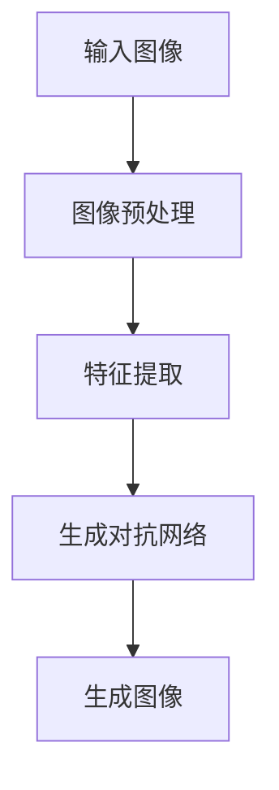
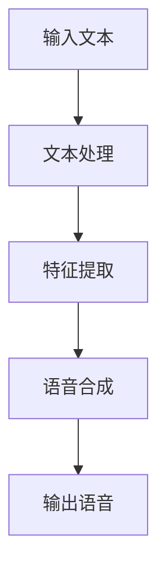
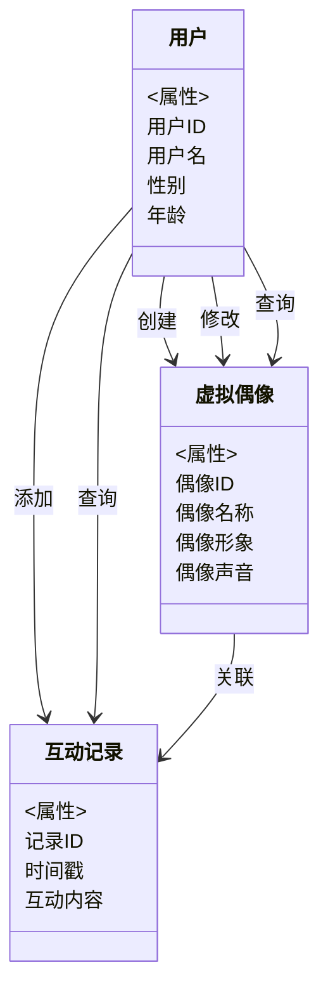
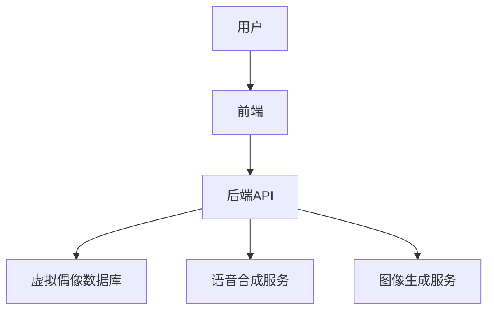
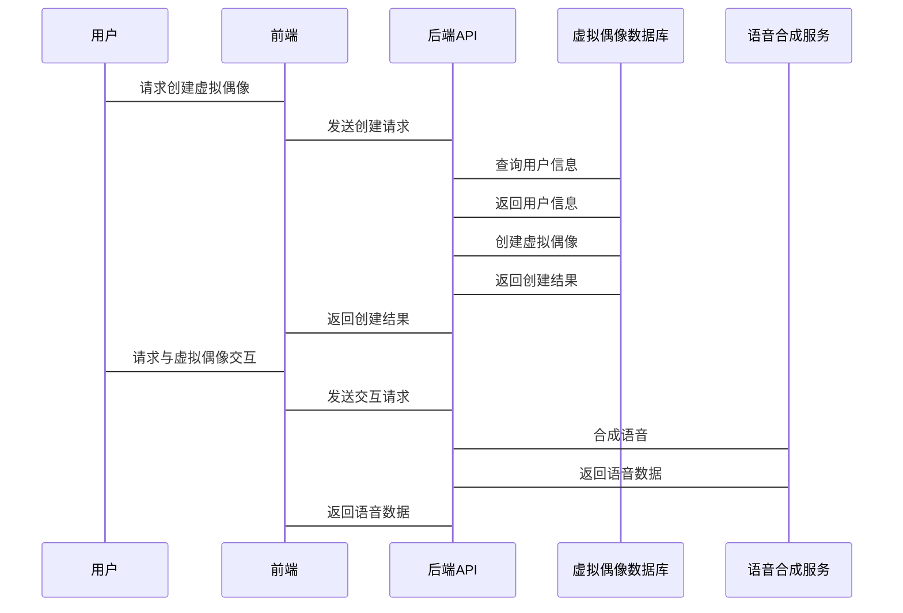

                 

<think>
嗯，用户让我写一篇关于“虚拟偶像：数字时代的情感寄托”的技术博客文章。首先，我得理解用户的需求。用户希望文章结构清晰，逻辑严谨，用专业的技术语言，同时要有深度和见解。看起来用户可能是一位技术专家或者对虚拟偶像技术感兴趣的人，想深入了解其中的技术细节。

用户提供了详细的大纲，包括前言、各章的结构，以及具体的技术点，比如图像处理、语音合成、情感表达等。我需要确保每个部分都涵盖这些内容，并且每个小节都要详细具体。同时，文章字数要求在1万到1.2万字之间，这意味着我需要每个部分都写得比较深入，不能太简略。

接下来，我得考虑每个章节的具体内容。比如，第1章是虚拟偶像的兴起，需要定义虚拟偶像，历史背景，发展现状，以及社会影响。这部分要让读者明白虚拟偶像是什么，为什么现在这么流行，以及它对社会有什么影响。

然后是技术原理部分，包括图像处理和生成、语音合成与交互，以及情感表达。这些部分需要详细讲解每个技术的原理，可能需要使用Mermaid绘制流程图，以及用Python代码举例。数学公式要用LaTeX，确保准确无误。

系统分析与架构设计部分，需要介绍系统设计的各个方面，包括领域模型、架构图和交互图。这部分可能需要绘制类图、架构图和序列图，帮助读者理解系统的运作流程。

项目实战部分，用户可能需要实际操作，所以要详细指导环境安装，核心代码实现，以及案例分析。这部分要实用，让读者能跟着步骤一步步实现。

最后，总结与展望，包括书籍总结、最佳实践、注意事项和拓展阅读，帮助读者巩固所学知识，并引导他们进一步学习。

在写作过程中，我需要确保每个部分都符合用户的要求，特别是使用markdown格式，正确嵌入Mermaid图表和LaTeX公式。同时，语言要专业但易懂，避免过于晦涩的技术术语，确保读者能够顺畅地理解内容。

现在，我需要检查每个章节是否都涵盖了用户提到的要点，并且内容是否连贯，是否有遗漏的部分。比如，在技术原理部分，是否详细解释了每个算法，是否有足够的代码示例和数学模型。系统设计部分是否有完整的图表支持，项目实战是否有实际的操作步骤和代码分析。

最后，确保文章结构完整，每个章节都有明确的小标题，内容丰富，详细具体。这样，读者才能获得有价值的信息，真正理解虚拟偶像背后的技术和情感寄托。
</think>

# 虚拟偶像：数字时代的情感寄托

---

## 关键词：虚拟偶像、数字情感、人工智能、图像处理、语音合成、情感表达

---

## 摘要：

在数字技术高速发展的今天，虚拟偶像作为一种新兴的文化现象，正在成为人们情感寄托的重要载体。本文将从技术角度深入剖析虚拟偶像的核心原理，探讨其在图像处理、语音合成和情感表达等方面的技术实现，并结合实际案例，分析其在数字时代中的社会影响和未来发展。

---

## 第一部分 虚拟偶像的兴起

### 第1章 虚拟偶像的兴起

#### 1.1 虚拟偶像的定义与历史背景

虚拟偶像是一种通过数字技术生成的虚拟人物，具有形象、声音和行为表现力，能够在虚拟空间中与用户互动。其历史可以追溯到20世纪末，随着计算机图形学和人工智能技术的发展，虚拟偶像逐渐从简单的2D动画形象演变为高度智能化的3D虚拟人物。

#### 1.2 虚拟偶像的发展现状

目前，虚拟偶像主要应用于娱乐、教育、品牌营销等领域。随着深度学习和生成对抗网络（GAN）技术的突破，虚拟偶像的图像生成和语音合成能力得到了显著提升。例如，日本的初音未来和中国的洛天依都是成功的虚拟偶像案例。

#### 1.3 虚拟偶像在社会文化中的影响

虚拟偶像不仅改变了人们的娱乐方式，还为品牌营销提供了新的可能性。它们能够以高度定制化的形象和个性化的表达，满足不同用户的情感需求，成为数字时代中人们情感寄托的重要载体。

---

## 第二部分 虚拟偶像的技术原理

### 第2章 虚拟偶像的技术原理

#### 2.1 图像处理与生成技术

##### 2.1.1 图像识别与生成算法

图像处理是虚拟偶像技术的核心之一。基于深度学习的图像生成算法，如GAN（生成对抗网络），能够生成高质量的虚拟形象。以下是GAN的基本原理：

1. **生成器（Generator）**：通过神经网络生成图像。
2. **判别器（Discriminator）**：判断生成图像与真实图像的区别。
3. **损失函数**：衡量生成图像与真实图像的差异。

##### 2.1.2 虚拟形象的创建与定制

虚拟形象的创建通常涉及以下步骤：
1. **用户需求分析**：确定虚拟偶像的形象风格、颜色、发型等。
2. **图像生成**：基于GAN等算法生成初步图像。
3. **图像优化**：通过图像处理技术（如风格迁移、超分辨率）提升图像质量。

#### 2.2 语音合成与交互技术

##### 2.2.1 语音识别与合成技术

语音合成技术基于Tacotron等模型，能够将文本转换为自然流畅的语音。以下是Tacotron的基本流程：
1. **编码器（Encoder）**：将输入文本转换为特征向量。
2. **解码器（Decoder）**：将特征向量转换为语音波形。

##### 2.2.2 虚拟偶像的语音交互实现

语音交互技术结合了语音识别和语音合成，能够实现与用户的实时对话。例如，用户可以通过语音指令控制虚拟偶像的行动或与之互动。

#### 2.3 虚拟偶像的情感表达

##### 2.3.1 情感识别与生成

情感表达技术基于情感识别算法，能够分析用户的情感状态并生成相应的情感内容。例如，虚拟偶像可以根据用户的语气和表情调整自己的表达方式。

##### 2.3.2 情感表达的实现方法

情感表达可以通过以下方式实现：
1. **面部表情**：通过面部肌肉的动态变化表现情感。
2. **语音语调**：通过语音的音调、速度和停顿表现情感。
3. **肢体语言**：通过手势和动作表现情感。

#### 2.4 虚拟偶像的关联知识体系

##### ER实体关系图架构

```mermaid
erDiagram
    actor 用户 {
        <属性>
        用户ID
        用户名
        性别
        年龄
    }
    actor 虚拟偶像 {
        <属性>
        偶像ID
        偶像名称
        偶像形象
        偶像声音
    }
    actor 互动记录 {
        <属性>
        记录ID
        时间戳
        互动内容
    }
    用户 -> 虚拟偶像 : 创建
    用户 -> 虚拟偶像 : 修改
    用户 -> 虚拟偶像 : 查询
    用户 -> 互动记录 : 添加
    用户 -> 互动记录 : 查询
    虚拟偶像 -> 互动记录 : 关联
```

---

## 第三部分 图像处理与生成技术

### 第3章 图像处理与生成技术

#### 3.1 算法原理讲解

##### 算法原理Mermaid流程图



##### 数学模型与公式讲解

生成对抗网络（GAN）的目标是最小化生成图像与真实图像的差异。其损失函数可以表示为：

$$ \mathcal{L} = \mathbb{E}_{x,y}[\log(D(x,y))] + \mathbb{E}_{x,z}[\log(1-D(x,G(z)))] $$

其中：
- \( D(x,y) \) 表示判别器对真实图像的判断概率。
- \( G(z) \) 表示生成器生成的图像。

##### 举例说明

以下是一个简单的GAN实现代码示例：

```python
import torch
import torch.nn as nn

class Generator(nn.Module):
    def __init__(self, latent_dim=100):
        super(Generator, self).__init__()
        self.latent_dim = latent_dim
        self.model = nn.Sequential(
            nn.Linear(latent_dim, 256),
            nn.ReLU(),
            nn.Linear(256, 784),
            nn.Tanh()
        )
    
    def forward(self, x):
        return self.model(x)

class Discriminator(nn.Module):
    def __init__(self):
        super(Discriminator, self).__init__()
        self.model = nn.Sequential(
            nn.Linear(784, 256),
            nn.ReLU(),
            nn.Linear(256, 1),
            nn.Sigmoid()
        )
    
    def forward(self, x):
        return self.model(x)

# 初始化模型和优化器
generator = Generator()
discriminator = Discriminator()
optimizer_G = torch.optim.Adam(generator.parameters(), lr=0.0002)
optimizer_D = torch.optim.Adam(discriminator.parameters(), lr=0.0002)
```

---

## 第四部分 语音合成与交互技术

### 第4章 语音合成与交互技术

#### 4.1 算法原理讲解

##### 算法原理Mermaid流程图



##### 数学模型与公式讲解

Tacotron模型的损失函数可以表示为：

$$ \mathcal{L} = \mathcal{L}_\text{MSE} + \lambda \mathcal{L}_\text{KL} $$

其中：
- \( \mathcal{L}_\text{MSE} \) 是均方误差损失。
- \( \mathcal{L}_\text{KL} \) 是KL散度损失。
- \( \lambda \) 是超参数，用于平衡两个损失项。

##### 举例说明

以下是一个Tacotron模型的实现代码示例：

```python
import torch
import torch.nn as nn

class Tacotron(nn.Module):
    def __init__(self, input_size, hidden_size, output_size):
        super(Tacotron, self).__init__()
        self.encoder = nn.LSTM(input_size, hidden_size, batch_first=True)
        self.decoder = nn.LSTM(hidden_size, hidden_size, batch_first=True)
        self.linear = nn.Linear(hidden_size, output_size)
    
    def forward(self, x):
        encoder_output, _ = self.encoder(x)
        decoder_output, _ = self.decoder(encoder_output)
        output = self.linear(decoder_output)
        return output

# 初始化模型和优化器
model = Tacotron(input_size=256, hidden_size=256, output_size=160)
optimizer = torch.optim.Adam(model.parameters(), lr=0.001)
```

---

## 第五部分 虚拟偶像系统的设计与实现

### 第5章 虚拟偶像系统的设计与实现

#### 5.1 问题场景介绍

虚拟偶像系统需要支持用户创建、定制和交互虚拟形象。系统需要具备高度的可扩展性和定制化能力，以满足不同用户的需求。

#### 5.2 项目介绍

##### 领域模型Mermaid类图



#### 5.3 系统架构设计

##### 系统架构设计Mermaid架构图



#### 5.4 系统接口设计

系统接口设计包括以下内容：
1. 用户认证接口。
2. 虚拟偶像创建接口。
3. 虚拟偶像查询接口。
4. 语音交互接口。

#### 5.5 系统交互

##### 系统交互Mermaid序列图



---

## 第六部分 虚拟偶像项目实战

### 第6章 虚拟偶像项目实战

#### 6.1 环境安装

需要安装以下环境：
1. Python 3.6+
2. PyTorch
3. TensorFlow
4. OpenCV

#### 6.2 系统核心实现源代码

##### 代码应用解读与分析

以下是一个简单的虚拟偶像系统实现代码示例：

```python
import torch
import torch.nn as nn
import torch.optim as optim

class VirtualIdolSystem:
    def __init__(self):
        self.image_generator = GAN()
        self.voice_synthesizer = Tacotron()
        self.interaction_manager = InteractionManager()

    def create_v

