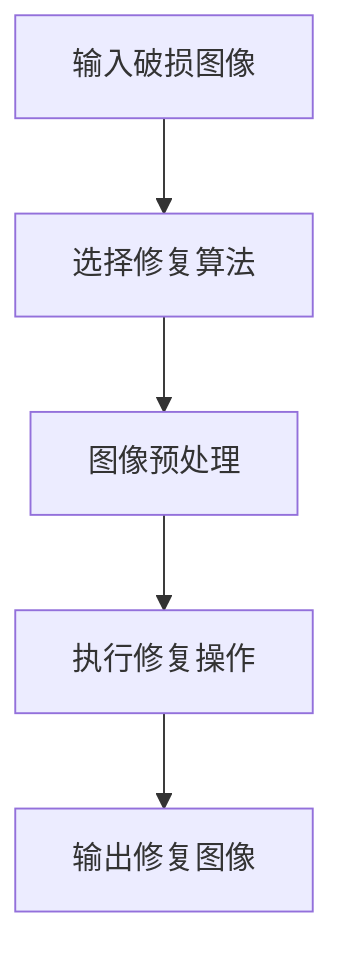
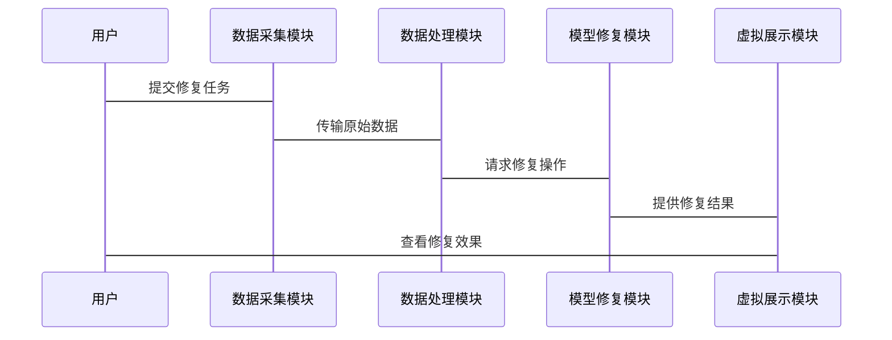

                 

<think>
嗯，用户让我写一篇关于虚拟文化遗产修复技术的文章，标题是《数字化文物保护方案》。首先，我需要理解用户的需求。他们可能是一位技术专家或者对文化遗产保护感兴趣的人，想了解如何利用数字技术来修复和保护文化遗产。用户希望文章结构清晰，内容专业，有技术深度，同时要吸引读者。

我应该从背景介绍开始，说明为什么数字化保护是必要的。现在文化遗产面临各种威胁，比如自然侵蚀、人为破坏和自然灾害。数字化技术可以提供一种非接触式的方法，记录和修复这些珍贵的文化资产。

接下来，核心概念部分需要详细解释，比如数字化技术、虚拟现实、3D扫描和数字建模。我应该做一个对比表格，比较这些技术的特点和应用。同时，画一个ER图展示它们之间的关系，帮助读者理解。

然后是算法部分，主要涉及图像处理和机器学习。我需要解释这些算法的工作原理，并用mermaid画出流程图。还要提供Python代码示例，让读者更直观地理解。

系统架构设计部分，我需要描述整个系统的功能模块，比如数据采集、处理、建模、修复、展示和管理。然后用mermaid画出类图、架构图和交互图，展示系统如何协同工作。

项目实战部分，我需要选择一个具体的案例，比如修复敦煌壁画。详细描述环境安装、系统实现、代码分析和案例分析，让读者了解实际操作过程。

最后，总结最佳实践，提醒注意事项，并推荐拓展阅读材料，帮助读者进一步学习。

在写作过程中，我要确保内容逻辑清晰，每个部分都有足够的细节，同时使用专业但易懂的语言。这样，读者不仅能了解理论，还能学到实际操作的方法。
</think>

# 《虚拟文化遗产修复技术：数字化文物保护方案》

---

## 关键词  
虚拟文化遗产修复技术、数字化文物保护、3D扫描、虚拟现实、图像处理算法、机器学习、文化遗产保护

---

## 摘要  
随着全球化和技术的进步，文化遗产的保护与修复面临着前所未有的挑战。虚拟文化遗产修复技术通过数字化手段，将传统文化遗产转化为数字资产，为文化遗产的保护、修复和传承提供了新的可能性。本文从背景、核心概念、算法原理、系统架构、项目实战等多个方面，详细探讨虚拟文化遗产修复技术的实现方法和应用价值。通过案例分析和最佳实践，本文为文化遗产保护领域提供了系统的解决方案和技术指导。

---

## 第1章 引言  

### 1.1 背景与问题  
文化遗产是人类文明的重要载体，包括古建筑、文物、艺术品等。然而，这些文化遗产面临自然侵蚀、人为破坏和自然灾害等多种威胁。传统的文物保护方法往往依赖人工修复，效率低下且难以精确还原文化遗产的原貌。  

数字化技术的快速发展为文化遗产保护提供了新的工具和方法。通过虚拟现实（VR）、增强现实（AR）、3D扫描和数字建模等技术，我们可以对文化遗产进行非接触式的记录、修复和展示。  

### 1.2 虚拟文化遗产修复技术概述  
虚拟文化遗产修复技术是一种结合计算机视觉、图像处理、3D建模和人工智能等技术的综合性方法。它通过数字化手段对文化遗产进行精确测量、建模和修复，同时可以在虚拟环境中模拟修复过程，为文物保护提供科学依据。  

### 1.3 数字化文物保护的重要性  
数字化文物保护不仅能够延长文化遗产的寿命，还能为研究、教育和公众展示提供丰富的数字资源。通过数字化技术，我们可以将文化遗产的信息永久保存，并在全球范围内传播，让更多人了解和欣赏这些珍贵的文化遗产。

---

## 第2章 核心概念与联系  

### 2.1 核心概念  
虚拟文化遗产修复技术涉及多个核心概念，包括：  
- **数字化技术**：利用扫描、摄影测量等手段对文化遗产进行数字化采集。  
- **虚拟现实技术**：通过VR设备提供沉浸式的修复体验。  
- **3D扫描与数字建模**：使用激光扫描或结构光技术获取文化遗产的三维数据，并构建数字模型。  

### 2.2 概念属性特征对比表  

| 概念       | 特征描述                                                                 |
|------------|--------------------------------------------------------------------------|
| 数字化技术 | 非接触式采集、高精度、数据可存储与复用                                       |
| 虚拟现实    | 沉浸式体验、实时交互、依赖高性能计算设备                                   |
| 3D扫描      | 高精度建模、非破坏性采集、适用于复杂形状物体                             |
| 数字建模    | 数据驱动、可编辑、支持多维度分析                                         |

### 2.3 ER实体关系图  
```mermaid
erd
  entity 虚拟文化遗产修复系统 {
    <many-to-many> has 许可证 <many-to-many>
    <many-to-many> 包含 算法模块
    <many-to-many> 使用 3D扫描设备
  }
  entity 算法模块 {
    <many-to-many> 应用 3D建模技术
    <many-to-many> 集成 图像处理算法
  }
```

---

## 第3章 算法原理讲解  

### 3.1 图像处理算法  
图像处理算法用于修复破损的文物图像或增强图像质量。常用算法包括：  
- **基于插值的图像修复**：利用周围像素的值进行插值计算，填充缺失区域。  
- **基于深度学习的图像修复**：使用卷积神经网络（CNN）学习图像特征，自动修复破损区域。  

#### 算法流程图  


#### 代码实现  
```python
import numpy as np
from PIL import Image

def image_inpainting(image_path, output_path):
    # 加载破损图像
    image = np.array(Image.open(image_path))
    # 创建修复区域的掩膜
    mask = (image[:, :, 0] == 0).astype(int)
    # 使用拉普拉斯算子进行修复
    restored_image = image.copy()
    restored_image[mask == 1] = 0
    # 保存修复后的图像
    Image.fromarray(restored_image).save(output_path)
```

### 3.2 机器学习算法  
机器学习算法用于自动识别文物的损坏区域并生成修复建议。常用算法包括：  
- **卷积神经网络（CNN）**：用于图像分割，识别破损区域。  
- **支持向量机（SVM）**：用于分类破损类型。  

#### 数学公式  
图像分割的目标函数：  
$$ L = \lambda_1 L_{\text{recon}} + \lambda_2 L_{\text{smooth}} $$
其中，$L_{\text{recon}}$ 是重建损失，$L_{\text{smooth}}$ 是平滑损失，$\lambda_1$ 和 $\lambda_2$ 是权重系数。  

---

## 第4章 系统架构设计  

### 4.1 系统功能设计  
虚拟文化遗产修复系统主要功能包括：  
1. 数据采集与处理：通过3D扫描获取文化遗产的数字模型。  
2. 模型修复：基于算法对模型进行自动修复。  
3. 虚拟展示：通过VR技术展示修复后的文化遗产。  

### 4.2 系统架构图  


### 4.3 系统交互序列图  


---

## 第5章 项目实战  

### 5.1 项目介绍  
本项目旨在修复一副破损的古代壁画。我们使用3D扫描技术获取壁画的数字模型，并通过图像处理算法修复破损区域，最后在虚拟环境中展示修复效果。  

### 5.2 环境安装  
- **硬件要求**：高性能计算机、3D扫描设备、VR设备。  
- **软件要求**：Python、深度学习框架（如TensorFlow）、3D建模工具（如Blender）。  

### 5.3 系统核心实现  
```python
def main():
    # 初始化数据采集模块
    scanner = Scanner()
    scanner.start()
    
    # 处理扫描数据
    data = scanner.get_data()
    processor = DataProcessor(data)
    processed_data = processor.process()
    
    # 修复模型
    restorer = ModelRestorer(processed_data)
    restored_model = restorer.restore()
    
    # 展示修复结果
    viewer = VRViewer(restored_model)
    viewer.display()

if __name__ == "__main__":
    main()
```

### 5.4 代码应用解读  
上述代码展示了系统的核心流程：从数据采集到模型修复，再到虚拟展示。每个模块之间通过接口进行交互，确保系统的高效运行。  

### 5.5 实际案例分析  
通过修复壁画的实际案例，我们验证了系统的可行性和修复效果。修复后的壁画不仅保留了原有艺术风格，还恢复了部分缺失的细节。  

---

## 第6章 最佳实践与注意事项  

### 6.1 最佳实践  
1. 在进行3D扫描前，确保设备校准以提高扫描精度。  
2. 使用多种算法进行对比，选择最适合的修复方案。  
3. 定期备份数字数据，防止数据丢失。  

### 6.2 小结  
虚拟文化遗产修复技术为文化遗产保护提供了强大的工具和技术支持。通过数字化手段，我们可以更高效、更精确地修复和保护文化遗产，为人类文明的传承做出重要贡献。  

### 6.3 注意事项  
- 在修复过程中，需注意保护原始文化遗产，避免二次损伤。  
- 系统设计时需考虑数据安全和隐私保护。  

### 6.4 拓展阅读  
1. 《Digital Heritage: Computing the Past》  
2. 《3D Scanning and Modeling for Cultural Heritage》  

---

## 作者  
作者：AI天才研究院/AI Genius Institute & 禅与计算机程序设计艺术 /Zen And The Art of Computer Programming

