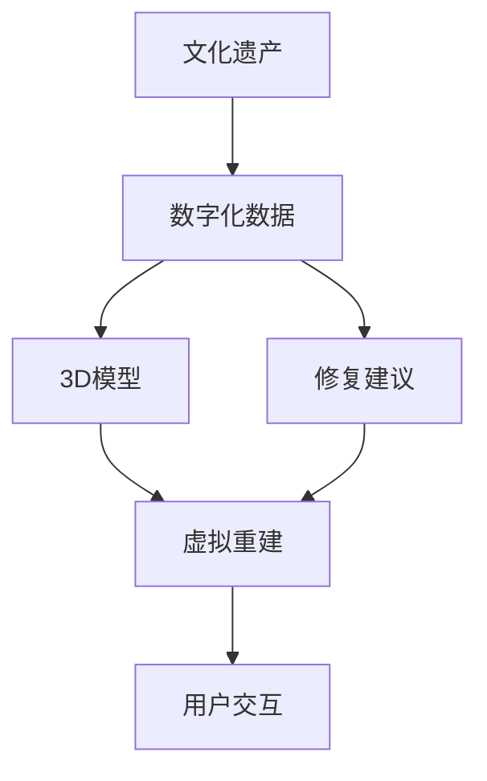
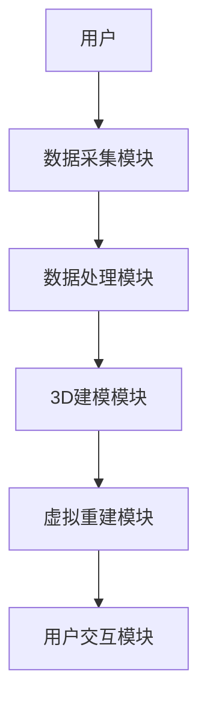

                 

<think>
好的，我现在要帮用户撰写一篇关于《虚拟文化遗产修复项目：数字技术在文物保护中的应用》的技术博客。首先，我需要仔细分析用户的需求。用户希望这篇文章结构清晰，内容专业，涵盖背景、核心技术、应用案例、系统设计和未来展望。

我应该从背景开始，介绍为什么虚拟文化遗产修复重要，以及数字技术在其中的作用。接着，详细讲解核心技术，比如3D扫描、VR、AR和AI，每个技术都需要解释原理和应用案例。然后，分析具体的应用案例，展示实际的成功项目，讨论挑战和解决方案。接下来，讨论系统设计，包括架构和接口，以及如何实现这些技术。最后，展望未来的发展趋势和潜在应用。

在写的时候，我要确保每个部分都有足够的细节，比如使用mermaid图来展示系统架构和流程，数学公式来解释算法原理，代码示例来展示实现。同时，要注意用专业的技术术语，但保持语言简洁易懂。

我还需要确保文章结构符合用户的要求，包括关键词和摘要部分，然后按照目录大纲展开。最后，加上作者信息，满足格式要求。整个过程需要系统地思考，逐步构建每个部分的内容，确保完整性和逻辑性。
</think>

# 虚拟文化遗产修复项目：数字技术在文物保护中的应用

## 关键词：
虚拟文化遗产, 数字技术, 文物保护, 3D扫描, 人工智能, 虚拟现实

## 摘要：
本文探讨了数字技术在虚拟文化遗产修复中的应用，详细介绍了3D扫描、虚拟现实、增强现实和人工智能等核心技术，并通过具体案例分析展示了这些技术在文物保护中的实际应用。同时，本文还讨论了系统设计与实现的关键环节，并展望了未来的发展趋势。

---

## 第一部分：背景与核心概念

### 1.1 背景介绍

#### 虚拟文化遗产的概念
虚拟文化遗产是指通过数字技术对文化遗产进行虚拟化处理后形成的数字化文化遗产，包括3D模型、虚拟重建、数字档案等。这些数字化成果能够帮助我们更好地保护和研究文化遗产。

#### 文化遗产修复的重要性
文化遗产是人类历史的见证，具有不可替代的价值。然而，由于自然老化、人为破坏等因素，许多文化遗产面临损毁甚至消失的风险。传统的修复方法往往耗时费力，且难以完全恢复原貌。因此，利用数字技术进行虚拟修复成为一种高效、可重复且非破坏性的解决方案。

#### 数字技术在文物保护中的应用
数字技术在文物保护中的应用主要体现在以下几个方面：
1. **数据采集与处理**：通过3D扫描、摄影测量等技术获取文化遗产的数字化数据。
2. **虚拟重建与修复**：利用计算机图形学技术对损毁的文化遗产进行虚拟修复和重建。
3. **交互与展示**：通过虚拟现实（VR）、增强现实（AR）等技术，让用户与数字化文化遗产进行交互，提升文化遗产的传播与教育价值。

### 1.2 核心概念

#### 数字文化遗产修复的技术基础
数字文化遗产修复的核心技术包括：
1. **3D扫描与建模**：通过激光扫描、结构光扫描等技术获取文化遗产的三维数据，并通过建模算法生成高精度的3D模型。
2. **虚拟现实与增强现实**：利用VR和AR技术，将数字化文化遗产与现实世界相结合，提供沉浸式的体验。
3. **人工智能与机器学习**：通过AI技术分析文化遗产的特征，辅助修复工作，识别损坏区域并提出修复建议。

#### 核心概念与联系

##### 概念属性特征对比表格
| 技术 | 数据采集方式 | 数据处理方式 | 应用场景 |
|------|--------------|--------------|----------|
| 3D扫描 | 激光扫描、结构光 | 建模算法生成3D模型 | 文物修复、虚拟重建 |
| VR/AR | 多传感器融合 | 实时渲染 | 沉浸式体验、交互展示 |
| AI/ML | 数据分析、特征提取 | 自动修复、智能识别 | 辅助修复、修复建议 |

##### ER实体关系图

---

## 第二部分：核心技术介绍

### 2.1 3D扫描与建模

#### 技术原理
3D扫描通过激光、相机等传感器采集文化遗产的表面几何信息和纹理信息，生成高精度的3D模型。建模算法（如ICP、Meshlab）对扫描数据进行处理，生成可用于修复和展示的3D模型。

#### 应用案例
某古代雕像的3D扫描与修复案例：
1. 通过激光扫描获取雕像的表面数据。
2. 使用ICP算法对数据进行配准和去噪处理。
3. 基于深度学习的模型修复算法修复雕像的缺失部分。

#### 技术挑战与解决方案
- **挑战**：扫描数据不完整、模型精度不足。
- **解决方案**：结合AI算法优化模型精度，使用多传感器融合技术提高数据采集的可靠性。

### 2.2 虚拟现实与增强现实

#### 技术原理
VR通过头显设备和计算机生成的虚拟环境，提供沉浸式的体验；AR则通过摄像头和投影技术将虚拟内容叠加到现实场景中。

#### 应用案例
某古战场遗址的VR重建案例：
1. 使用VR技术将遗址的3D模型渲染为虚拟场景。
2. 用户可以通过VR设备“穿越”到古代，体验遗址的原貌。

#### 技术挑战与解决方案
- **挑战**：实时渲染性能不足、用户交互体验差。
- **解决方案**：优化渲染算法，采用轻量化设计，提升交互响应速度。

### 2.3 人工智能与机器学习

#### 技术原理
AI技术通过深度学习模型（如卷积神经网络）对文化遗产的图像、文本等数据进行分析，提取特征并生成修复建议。

#### 应用案例
某古籍修复案例：
1. 使用深度学习模型识别古籍的破损区域。
2. 生成修复建议并辅助修复人员完成修复工作。

#### 技术挑战与解决方案
- **挑战**：模型训练数据不足、修复效果不够精确。
- **解决方案**：采用迁移学习技术，利用公开数据集进行预训练，提升模型的泛化能力。

---

## 第三部分：具体应用案例分析

### 3.1 案例一：某古代城堡的虚拟修复

#### 项目背景
某古代城堡因战乱和自然侵蚀而严重损毁，修复工作难度大且成本高。

#### 技术应用
1. 使用激光扫描技术获取城堡的三维数据。
2. 基于3D建模技术生成城堡的虚拟重建模型。
3. 通过VR技术让用户沉浸式体验城堡的原貌。

#### 项目成果与评价
- 成功还原了城堡的原始结构。
- 提供了沉浸式的文化遗产体验，提升了公众对文化遗产保护的关注度。

### 3.2 案例二：某古代书法作品的数字化修复

#### 项目背景
某古代书法作品因年代久远，部分文字模糊不清。

#### 技术应用
1. 使用AI技术识别模糊文字。
2. 通过图像处理技术修复文字边缘。
3. 生成高清数字版书法作品，用于文化遗产的数字化保存。

#### 项目成果与评价
- 成功识别并修复了模糊文字。
- 数字化成果为后续研究提供了宝贵的数据。

---

## 第四部分：系统设计与实现

### 4.1 系统设计思路

#### 需求分析
- 数据采集与处理模块：支持多种传感器数据的采集和处理。
- 虚拟重建模块：基于3D建模算法生成高精度模型。
- 用户交互模块：支持VR/AR设备的用户交互。

#### 技术架构设计

### 4.2 关键实现环节

#### 3D扫描数据处理
- 使用ICP算法对扫描数据进行配准。
- 通过Meshlab工具优化模型精度。

#### 虚拟现实与增强现实界面设计
- 使用Unity引擎开发VR/AR应用。
- 设计直观的用户界面，提升用户体验。

#### 人工智能算法应用
- 使用深度学习模型进行图像识别和修复。
- 通过TensorFlow框架实现模型训练和部署。

---

## 第五部分：未来展望

### 5.1 技术发展趋势

#### 数字技术在文物保护中的应用前景
- 更高的精度和实时性。
- 更广泛的应用场景。

#### 新技术的潜在影响
- 新型传感器技术的引入将提升数据采集的精度。
- 更先进的AI算法将推动文化遗产修复的自动化和智能化。

### 5.2 潜在应用领域

#### 其他文化遗产的数字化修复
- 传统建筑、雕塑等的数字化修复。

#### 数字技术在教育、旅游等领域的应用
- 通过AR技术增强文化遗产的教育功能。
- 提供虚拟旅游服务，让更多人足不出户即可体验文化遗产。

### 5.3 结论与展望

#### 项目总结
本文详细探讨了数字技术在虚拟文化遗产修复中的应用，展示了多种技术在文物保护中的实际价值。

#### 未来研究方向
- 开发更高效的数据采集技术。
- 研究更智能的AI算法，推动文化遗产修复的自动化。

---

## 参考文献
（此处可根据实际需要添加相关文献）

## 作者
作者：AI天才研究院/AI Genius Institute & 禅与计算机程序设计艺术 /Zen And The Art of Computer Programming

