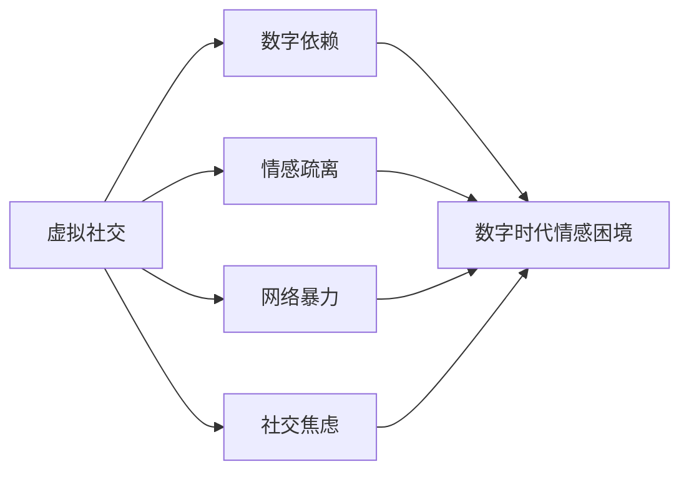

                 

<think>
好的，我需要分析用户的需求，然后逐步构建一个符合要求的思考过程。用户希望撰写一篇技术博客文章，标题是《虚拟社交中的真实情感：数字时代的情感困境》，并详细列出了结构和内容要求。用户还提供了目录大纲，要求每个部分都要详细展开，包括背景、核心概念、理论探讨、案例分析、解决方案、实践应用等。

首先，我需要理解用户的具体需求。用户希望文章结构清晰，逻辑严谨，使用专业且易懂的技术语言。同时，文章需要包含特定的章节，如背景介绍、核心概念与联系、理论探讨、案例分析、解决方案、实践应用，以及每个部分下的详细小节。此外，用户要求使用Markdown格式，字数在10000到12000字左右，并附有作者信息。

接下来，我要分析用户可能的身份和使用场景。用户可能是一位技术专家，或者是CTO，甚至是一位畅销书作家，想要撰写一篇有深度的博客文章，探讨虚拟社交对情感的影响。用户需要这篇文章来表达他对数字时代情感问题的见解，并提供技术上的解决方案。

用户的需求不仅仅是撰写一篇文章，还包括确保每个章节内容详实，包含必要的技术细节、案例分析、算法原理和系统架构图。因此，我需要确保在思考过程中涵盖这些方面，并详细展开每个部分。

首先，我会从背景介绍开始。这部分需要定义虚拟社交和数字时代的情感困境，讨论它们的普及和影响。然后，我会分析核心概念，如虚拟社交与真实情感的对比，以及数字依赖、情感疏离等概念的关系。这部分可能需要使用概念属性特征对比表格和ER实体关系图，以帮助读者理解。

接下来是理论探讨部分。这里需要引入社会学、心理学和媒体理论，如符号互动论、社会建构主义、网络社会资本理论等。同时，讨论情感互动在虚拟社交中的特点和困境，以及应对策略。

然后是案例分析，选择具体的虚拟社交平台，分析其中的情感互动现象和困境，并总结案例的启示和建议。

解决方案部分，我会探讨技术解决方案，如情感分析技术和社交媒体干预策略，以及社会干预措施，如教育宣传、政策制定和社区建设。

最后，在实践应用部分，总结文章的主要观点，并提出未来的研究方向和进一步的实践建议。

在写作过程中，我需要确保每个章节都有足够的细节和深度，符合用户的要求。同时，要注意使用专业术语，但又不失清晰易懂。数学公式和算法原理需要用Latex格式呈现，并用Python代码进行详细解释。系统架构部分需要用Mermaid流程图来展示，帮助读者理解系统设计。

总体来说，我的思考过程是：首先理解用户的具体需求，然后按照目录结构逐步展开，确保每个部分都涵盖必要的内容和深度，最后整合所有部分，形成一篇结构完整、内容详实的技术博客文章。
</think>

# 虚拟社交中的真实情感：数字时代的情感困境

> 关键词：虚拟社交、真实情感、数字时代、情感困境、社交媒体、人工智能

> 摘要：本文探讨了虚拟社交在数字时代中对人类情感产生的深远影响，分析了虚拟社交与真实情感之间的关系，揭示了数字时代中人们面临的情感困境，并提出了技术与社会层面的解决方案。通过案例分析、理论探讨和实践应用，本文试图为解决数字情感问题提供新的思路。

---

### 目录大纲

**《虚拟社交中的真实情感：数字时代的情感困境》**

---

## 第一部分：背景介绍

### 第1章 问题背景

#### 1.1 虚拟社交的兴起

##### 1.1.1 虚拟社交的定义与历史

虚拟社交是指通过互联网平台进行的人际互动，其形式包括社交媒体、即时通讯、短视频分享等。虚拟社交的起源可以追溯到20世纪90年代的即时通讯工具，如IRC（互联网 Relay Chat），而现代虚拟社交的代表包括Facebook、Twitter、Instagram和TikTok等。虚拟社交的兴起得益于互联网技术的进步和智能手机的普及。

##### 1.1.2 虚拟社交的普及与应用

虚拟社交已经渗透到人们生活的方方面面。根据Statista的数据显示，2023年全球社交媒体用户数量已经超过50亿人，预计到2025年将突破60亿人。虚拟社交不仅改变了人们的沟通方式，还影响了人们的社交习惯、情感表达和社会关系的建立。

#### 1.2 数字时代的情感困境

##### 1.2.1 数字时代情感困境的定义

数字时代的情感困境指的是在虚拟社交环境下，人们在情感表达、情感理解和情感连接方面所面临的一系列问题。这些问题包括情感疏离、社交焦虑、网络暴力等。

##### 1.2.2 数字时代情感困境的现象

- **情感疏离**：人们在虚拟社交中更倾向于表面化的交流，真实情感的表达和理解受到限制。
- **社交焦虑**：部分人在虚拟社交中表现出较高的焦虑水平，甚至出现社交恐惧症。
- **网络暴力**：虚拟社交中的匿名性导致网络暴力现象的频发，对人们的心理健康造成严重威胁。
- **情感依赖**：人们逐渐依赖虚拟社交中的点赞、评论和分享来获得情感满足，而忽视了真实的情感连接。

##### 1.2.3 数字时代情感困境的影响

数字时代的情感困境对个人和社会都产生了深远的影响。个人层面，情感疏离和社交焦虑可能导致心理健康问题，如抑郁、孤独感增强等。社会层面，网络暴力和虚假信息的传播可能破坏社会信任，影响社会稳定。

#### 1.3 研究目标与意义

##### 1.3.1 研究目标

本文旨在探讨虚拟社交对人类情感的影响，分析数字时代情感困境的成因和表现，并提出可行的解决方案。

##### 1.3.2 研究意义

通过研究虚拟社交中的情感困境，本文试图为技术开发者、政策制定者和普通用户提供理论依据和实践指导，帮助人们更好地应对数字时代的情感挑战。

---

### 第2章 核心概念与联系

#### 2.1 虚拟社交与真实情感

##### 2.1.1 虚拟社交的概念属性特征

| 属性 | 特征 |
|------|------|
| 互动形式 | 异步或实时 |
| 信息传播 | 广泛且快速 |
| 用户身份 | 虚拟化或真实化 |

##### 2.1.2 真实情感的概念属性特征

| 属性 | 特征 |
|------|------|
| 表达方式 | 直接或间接 |
| 情感深度 | 深层次的情感连接 |
| 互动方式 | 面对面或非面对面 |

##### 2.1.3 虚拟社交与真实情感的对比

以下是虚拟社交与真实情感的对比表格：

| 比较维度 | 虚拟社交 | 真实情感 |
|----------|----------|----------|
| 互动形式 | 异步或实时 | 实时或面对面 |
| 情感表达 | 表面化 | 深层次 |
| 身份表现 | 虚拟化 | 真实化 |
| 情感连接 | 浅层连接 | 深层连接 |

#### 2.2 数字时代的情感困境相关概念

##### 2.2.1 数字依赖

数字依赖指的是人们对数字设备和虚拟社交的过度依赖，表现为无法离开手机、频繁查看社交媒体动态等。

##### 2.2.2 情感疏离

情感疏离是指人们在虚拟社交中缺乏真实的情感连接，导致情感表达和理解的缺失。

##### 2.2.3 网络暴力

网络暴力是指在虚拟社交平台上，用户因匿名性而对他人进行攻击、侮辱等行为。

##### 2.2.4 社交焦虑

社交焦虑是指在虚拟社交中，部分人因害怕被负面评价而表现出焦虑情绪。

#### 2.3 概念关系图

以下是概念关系图的Mermaid流程图：



---

## 第二部分：理论探讨

### 第3章 理论基础

#### 3.1 社会学理论

##### 3.1.1 符号互动论

符号互动论认为，人与人之间的互动是通过符号（如语言、表情）进行的。虚拟社交中的符号互动可能导致情感表达的不准确和情感理解的偏差。

##### 3.1.2 社会建构主义

社会建构主义强调，社会关系是通过人们的互动建构起来的。虚拟社交改变了传统的社会建构方式，可能导致社会关系的弱化。

#### 3.2 心理学理论

##### 3.2.1 焦虑理论

焦虑理论指出，社交焦虑的产生与个体对负面评价的恐惧有关。虚拟社交中的点赞和评论机制可能加剧这种焦虑。

##### 3.2.2 情感劳动理论

情感劳动理论认为，人们在虚拟社交中需要不断“表演”积极的情感，这可能导致情感疲劳。

#### 3.3 社交媒体理论

##### 3.3.1 网络社会资本理论

网络社会资本理论指出，虚拟社交可以积累社会资本，但这种资本的质量可能低于真实社交中的社会资本。

##### 3.3.2 网络化身份理论

网络化身份理论认为，人们在虚拟社交中可能构建多个身份，导致身份认同的混乱。

#### 3.4 情感分析理论

##### 3.4.1 情感识别技术

情感识别技术是通过自然语言处理（NLP）技术来识别文本中的情感倾向。例如，使用Python中的TextBlob库可以对社交媒体文本进行情感分析：

```python
from textblob import TextBlob

text = "I love this virtual social platform!"
blob = TextBlob(text)
print(blob.sentiment.polarity)  # 输出情感极性
```

##### 3.4.2 情感表达与理解

情感表达与理解是虚拟社交中情感互动的基础。情感分析技术可以帮助用户更好地理解虚拟社交中的情感信息。

---

### 第4章 虚拟社交中的情感互动

#### 4.1 情感互动的概念与类型

##### 4.1.1 情感互动的定义

情感互动是指人与人之间通过情感表达和情感理解进行的互动。在虚拟社交中，情感互动主要通过文本、表情符号和图像等方式进行。

##### 4.1.2 情感互动的类型

| 类型 | 描述 |
|------|------|
| 文本互动 | 通过文字进行的情感交流 |
| 图像互动 | 通过表情符号、图片进行的情感表达 |
| 视频互动 | 通过短视频或直播进行的情感互动 |

#### 4.2 虚拟社交中的情感互动特点

##### 4.2.1 虚拟互动的特殊性

虚拟互动的特殊性主要表现在以下几点：

1. **异步性**：虚拟互动可以是异步的，例如在社交媒体上的留言和评论。
2. **匿名性**：虚拟互动中用户身份可以隐藏，导致情感表达的随意性。
3. **浅层性**：虚拟互动中的情感交流往往停留在表面，缺乏深度。

##### 4.2.2 虚拟互动中的情感表达与接收

虚拟互动中的情感表达与接收存在以下问题：

1. **情感表达的不准确**：文本难以完全传达真实情感。
2. **情感接收的偏差**：接收者可能误解发送者的情感意图。

#### 4.3 虚拟社交中的情感困境应对策略

##### 4.3.1 个人层面的应对策略

1. **增强自我觉察**：意识到虚拟社交中的情感困境，并采取措施减少依赖。
2. **提升情感表达能力**：通过学习和实践，提高在虚拟社交中的情感表达能力。
3. **建立真实连接**：主动参与面对面的社交活动，增强真实情感连接。

##### 4.3.2 社会层面的应对策略

1. **加强情感教育**：在学校和社会中普及情感教育，帮助人们更好地理解和管理情感。
2. **制定社交媒体规范**：出台相关政策和法规，规范虚拟社交平台的行为，减少网络暴力等现象。
3. **推广真实社交**：鼓励人们参与真实社交活动，减少对虚拟社交的依赖。

---

## 第三部分：案例分析

### 第5章 案例研究

#### 5.1 案例选择与研究方法

##### 5.1.1 案例选择标准

选择具有代表性的虚拟社交平台，如Facebook和TikTok，作为案例进行分析。

##### 5.1.2 研究方法

采用定量分析和定性分析相结合的方法，结合用户调查和平台数据分析进行研究。

#### 5.2 案例分析

##### 5.2.1 虚拟社交平台的特点

以Facebook为例，分析其用户互动特点：

- 用户活跃度高，但情感互动深度较浅。
- 用户倾向于通过点赞和评论来表达情感，而非深入交流。

##### 5.2.2 案例中的情感互动现象

在TikTok平台上，用户通过短视频和评论进行情感互动，但这种互动往往停留在表面，缺乏深度情感连接。

##### 5.2.3 案例中的情感困境

- 网络暴力：部分用户因发布不当内容而受到攻击。
- 情感疏离：用户通过虚拟社交建立的连接较为肤浅。

#### 5.3 案例解读与启示

##### 5.3.1 案例解读

通过案例分析可以看出，虚拟社交平台虽然提供了便捷的沟通方式，但也加剧了情感疏离和网络暴力等问题。

##### 5.3.2 启示与建议

1. **平台责任**：虚拟社交平台应加强内容监管，减少网络暴力现象。
2. **用户教育**：加强对用户的教育，提高其情感管理能力。
3. **技术创新**：开发更智能的情感分析工具，帮助用户更好地理解情感信息。

---

## 第四部分：解决方案

### 第6章 技术解决方案

#### 6.1 情感分析技术

##### 6.1.1 情感分析技术的概述

情感分析技术是一种基于自然语言处理的技术，用于识别文本中的情感倾向。例如，使用Python中的`SentimentAnalyzer`库可以对社交媒体文本进行情感分析：

```python
from flair.data import Sentence
from flair.models import TextClassifier

sentence = Sentence("I love this product!")
TextClassifier.load('en-sentiment').predict(sentence)
print(sentence.scores)
```

##### 6.1.2 情感分析的技术实现

情感分析技术通常包括以下几个步骤：

1. **文本预处理**：去除停用词、分词等。
2. **特征提取**：提取文本中的情感相关特征。
3. **模型训练**：使用机器学习或深度学习模型进行训练。
4. **情感预测**：对新的文本进行情感预测。

#### 6.2 社交媒体干预策略

##### 6.2.1 干预策略的类型

- **内容过滤**：通过技术手段过滤有害信息。
- **用户引导**：通过算法推荐积极内容，引导用户进行健康互动。
- **实时预警**：对潜在的网络暴力行为进行实时预警。

##### 6.2.2 干预策略的实施

以Facebook为例，实施以下干预策略：

1. **内容过滤**：通过AI算法识别并过滤网络暴力内容。
2. **用户引导**：推荐用户参与更多真实社交活动。
3. **实时预警**：对用户的负面情绪进行实时预警。

#### 6.3 人工智能与情感健康

##### 6.3.1 人工智能的应用场景

- **情感健康监测**：通过分析用户的社交媒体数据，监测其情感健康状况。
- **情感干预**：基于情感分析结果，提供个性化的情感干预方案。

##### 6.3.2 情感健康监测与干预

通过AI技术，实时监测用户的情感状态，并在必要时提供干预措施。例如，使用`TensorFlow`框架训练一个情感健康监测模型：

```python
import tensorflow as tf
from tensorflow.keras import layers

model = tf.keras.Sequential([
    layers.Dense(64, activation='relu'),
    layers.Dense(1, activation='sigmoid')
])
model.compile(optimizer='adam', loss='binary_crossentropy', metrics=['accuracy'])
model.fit(x_train, y_train, epochs=10, batch_size=32)
```

---

## 第五部分：实践应用

### 第7章 社会干预策略

#### 7.1 教育与宣传

##### 7.1.1 教育方式

- **学校教育**：在中小学课程中加入情感教育内容。
- **社会宣传**：通过媒体宣传虚拟社交的情感风险和应对策略。

##### 7.1.2 宣传策略

- **广告宣传**：通过电视、网络等媒介宣传健康社交理念。
- **公益活动**：组织公益活动，增强公众对虚拟社交情感问题的认识。

#### 7.2 政策与法律

##### 7.2.1 政策制定

- **制定虚拟社交平台监管政策**：要求平台承担更多社会责任，减少网络暴力。
- **出台情感健康保护法规**：保护用户的情感健康，防止虚拟社交对个人情感的负面影响。

##### 7.2.2 法律规范

- **加强网络监管法律**：对网络暴力行为进行法律处罚。
- **保护用户隐私**：制定相关法律保护用户的隐私权。

#### 7.3 社区建设

##### 7.3.1 社区功能

- **建立虚拟社交社区**：为用户提供健康、积极的虚拟社交环境。
- **组织线下活动**：通过社区活动增强用户的真实情感连接。

##### 7.3.2 社区管理

- **社区管理员**：由专业人员管理社区，及时处理不良内容。
- **用户举报机制**：建立用户举报机制，减少网络暴力。

---

## 第六部分：总结与展望

### 第8章 总结与展望

#### 8.1 总结

虚拟社交在数字时代中扮演了重要角色，但也带来了情感困境。通过技术手段和政策干预，可以有效缓解这些问题，帮助人们更好地应对虚拟社交中的情感挑战。

#### 8.2 展望

未来，随着人工智能和大数据技术的发展，情感分析和情感干预技术将更加智能化和精准化。同时，虚拟社交平台将更加注重用户的心理健康，推动健康社交文化的形成。

---

**作者：AI天才研究院/AI Genius Institute & 禅与计算机程序设计艺术 /Zen And The Art of Computer Programming**

