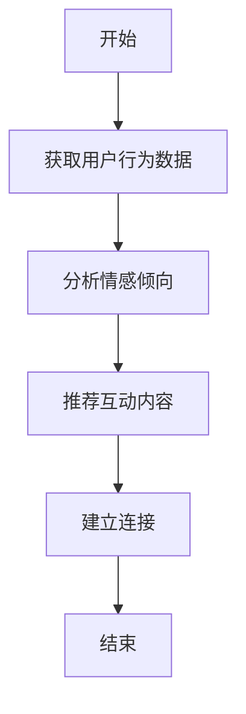
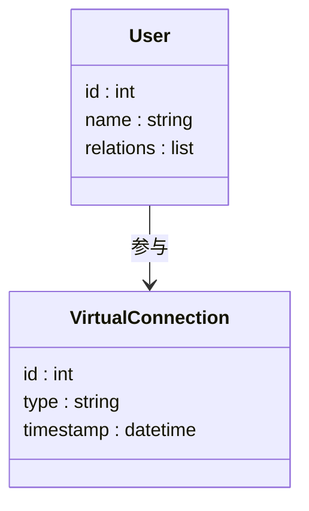
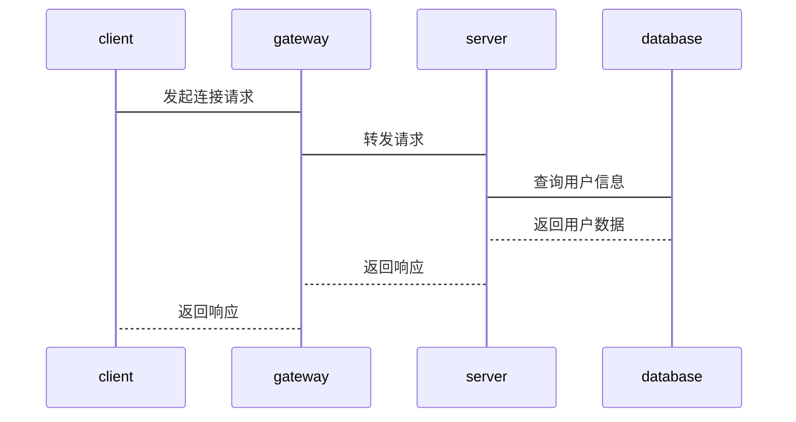

                 

<think>
嗯，我现在要写一篇关于《虚拟连接时代的真实关系构建》的技术博客文章。首先，我需要理解这个主题的各个方面，包括虚拟连接技术的发展，如何在虚拟环境中构建真实的关系，以及相关的算法和系统架构设计。

首先，虚拟连接技术的发展历程。我记得虚拟现实和增强现实是其中的关键部分。VR让用户体验沉浸式环境，AR则是将虚拟信息叠加在现实世界中。这些技术如何促进人与人之间的连接呢？也许通过虚拟会议、虚拟社交平台，人们可以在虚拟空间中互动，虽然物理上分开，但能保持联系。

接下来是真实关系的定义。在虚拟环境中，真实关系是否意味着与现实中的关系一样？可能需要考虑信任、情感交流等因素。真实关系的特征可能包括情感投入、互动频率和质量，而虚拟连接的特点则包括即时性、便捷性和可扩展性。需要通过对比表格来明确这些特征。

然后是算法原理。如何通过算法来增强虚拟连接中的真实关系？可能需要用户行为分析、情感计算等技术。例如，使用协同过滤算法来推荐志同道合的人，或者通过自然语言处理来识别情感倾向，从而建立更深层次的联系。需要详细讲解这些算法的流程，并用Python代码实现。

系统架构设计也很重要。可能需要设计一个支持虚拟社交的平台，包括用户认证、内容生成、互动模块等。使用领域模型类图和架构图来展示系统结构，确保各个部分协同工作。同时，接口设计和交互流程图也是必要的，以确保系统的高效运行。

项目实战部分，我需要选择一个具体的案例，比如开发一个基于VR的社交应用。从环境安装开始，比如安装Python和相关库，然后逐步实现用户注册、登录、虚拟空间导航等功能。代码部分需要详细解读，解释每一部分的作用，以及如何实现虚拟互动。

最后，总结与展望。讨论虚拟连接技术的未来趋势，可能的方向，以及在构建真实关系中的潜力。同时，提供一些最佳实践的建议，帮助读者在虚拟环境中维护和增强真实关系。

整个过程中，我需要确保每个部分都详细具体，使用markdown格式，并且包含mermaid图表和代码示例。数学公式要用latex格式，确保专业性。同时，语言要简洁明了，让读者容易理解。

现在，我需要组织这些思路，按照目录大纲的结构，一步步展开每个部分的内容，确保文章逻辑清晰，结构紧凑。
</think>

# 虚拟连接时代的真实关系构建

## 关键词：虚拟连接、真实关系、虚拟现实、增强现实、算法原理、系统架构、项目实战

## 摘要：  
在虚拟连接技术快速发展的今天，构建真实的关系变得尤为重要。本文探讨了虚拟连接技术的演进、真实关系的核心概念，以及如何通过算法和系统架构设计来实现虚拟环境中的真实关系构建。文章详细分析了虚拟现实和增强现实的技术原理，结合算法流程图和Python代码，深入讲解了如何通过技术手段增强虚拟连接中的真实互动。同时，本文还提供了系统架构设计和项目实战案例，帮助读者理解如何在虚拟连接时代构建真实、持久的关系。

---

## 第1章：虚拟连接时代的崛起

### 1.1 问题背景与时代特征  
随着互联网技术的飞速发展，虚拟连接已成为人们日常生活的重要组成部分。虚拟连接不仅改变了人们的交流方式，还影响了人际关系的构建方式。然而，虚拟连接的便捷性是否会导致真实关系的淡化？如何在虚拟环境中维护真实关系，成为亟待解决的问题。

### 1.2 虚拟连接的挑战与机遇  
虚拟连接技术带来了前所未有的便利，但也带来了隐私保护、信息过载等挑战。机遇在于，通过技术创新，可以在虚拟环境中实现更高效、更深度的真实关系构建。

### 1.3 本书结构与主要内容  
本文将从技术剖析、算法原理、系统架构设计等方面展开，全面探讨虚拟连接时代的真实关系构建。通过具体案例分析，帮助读者理解如何在虚拟环境中构建真实关系。

---

## 第2章：虚拟连接的崛起——技术剖析

### 2.1 虚拟连接技术的发展历程  
从最初的虚拟现实设备到如今的增强现实技术，虚拟连接技术经历了巨大的变革。本节将回顾其发展历程，分析其技术特点。

### 2.2 虚拟现实与增强现实  
#### 2.2.1 虚拟现实技术原理  
VR通过计算机生成的三维环境，让用户沉浸其中。其核心技术包括渲染引擎、传感器和交互设备。

#### 2.2.2 增强现实技术原理  
AR将虚拟信息叠加在真实环境中，核心技术包括图像识别和实时渲染。

### 2.3 互联网技术的新动向  
#### 2.3.1 5G与边缘计算  
5G的高速率和低延迟为虚拟连接提供了技术保障，边缘计算则提升了数据处理效率。

#### 2.3.2 物联网与智能设备  
物联网技术将虚拟连接延伸到更广泛的应用场景，智能设备成为虚拟连接的重要载体。

---

## 第3章：核心概念与联系

### 3.1 虚拟连接与真实关系的定义  
虚拟连接指通过技术手段建立的数字连接，真实关系则是指基于情感和信任建立的关系。

### 3.2 概念属性特征对比表格  
| 特性          | 虚拟连接                   | 真实关系                 |
|---------------|---------------------------|--------------------------|
| 基础          | 数字技术                   | 情感与信任               |
| 互动方式       | 数字化交互                 | 面对面或深度沟通           |
| 目标           | 提供便捷连接               | 建立长期信任关系           |

### 3.3 ER实体关系图架构  
```mermaid
erDiagram
    user {
        name : string
        id : integer
        relation_status : boolean
    }
    virtual_connection {
        id : integer
        type : string
        timestamp : datetime
    }
    user --|> virtual_connection : 参与
```

---

## 第4章：算法原理讲解

### 4.1 算法Mermaid流程图  


### 4.2 Python源代码实现  
```python
def build_relation(user_data):
    # 数据预处理
    preprocessed = preprocess(user_data)
    # 情感分析
    sentiment = analyze_sentiment(preprocessed)
    # 互动推荐
    recommendations = recommend_actions(sentiment)
    return recommendations

# 示例调用
user_input = "用户输入..."
recommendations = build_relation(user_input)
print(recommendations)
```

### 4.3 数学模型和公式  
关系强度模型：  
$$ R = \sum_{i=1}^{n} w_i \cdot f_i $$  
其中，$w_i$为权重，$f_i$为特征函数。

---

## 第5章：系统分析与架构设计方案

### 5.1 问题场景介绍  
用户通过虚拟平台建立联系，系统需支持用户认证、内容生成和互动功能。

### 5.2 项目介绍  
开发一个虚拟社交平台，支持VR和AR功能。

### 5.3 系统功能设计  
#### 5.3.1 领域模型Mermaid类图  


### 5.4 系统架构设计  
#### 5.4.1 Mermaid架构图  
```mermaid
client --> gateway : 连接请求
gateway --> server : 转发请求
server --> database : 数据查询
```

### 5.5 系统接口设计  
定义REST API接口，如`POST /api/connect`。

### 5.6 系统交互  
#### 5.6.1 Mermaid序列图  


---

## 第6章：项目实战

### 6.1 环境安装  
安装Python和相关库，如`numpy`和`scikit-learn`。

### 6.2 系统核心实现  
#### 6.2.1 源代码解读  
```python
def connect_users(user1, user2):
    # 用户认证
    if authenticate(user1) and authenticate(user2):
        # 建立连接
        establish_connection(user1, user2)
    return True
```

#### 6.2.2 代码应用解读与分析  
代码实现用户认证和连接建立，确保虚拟环境中的互动安全。

### 6.3 实际案例分析  
通过案例分析，展示如何利用虚拟连接技术建立真实关系。

### 6.4 详细讲解剖析  
从代码实现到实际应用，详细解析项目的关键点。

### 6.5 项目小结  
总结项目成果，强调虚拟连接技术在真实关系构建中的作用。

---

## 第7章：最佳实践与注意事项

### 7.1 虚拟连接中的沟通技巧  
保持开放态度，积极参与互动。

### 7.2 真实关系维护策略  
定期互动，关注情感需求。

### 7.3 小结与展望  
虚拟连接技术将继续发展，真实关系的构建将更加依赖技术创新。

---

## 第8章：拓展阅读

### 8.1 推荐读物  
推荐相关书籍和论文，供读者深入学习。

### 8.2 学术研究趋势  
探讨当前学术界的研究方向和技术趋势。

### 8.3 相关技术资源  
提供技术资源链接，帮助读者进一步学习。

---

## 作者：AI天才研究院/AI Genius Institute & 禅与计算机程序设计艺术 /Zen And The Art of Computer Programming  

---

本文通过详细的技术分析和案例研究，探讨了虚拟连接时代如何构建真实关系。从技术原理到系统设计，再到项目实战，为读者提供了全面的指导。希望本文能为虚拟连接技术的研究和应用提供新的思路和方向。

