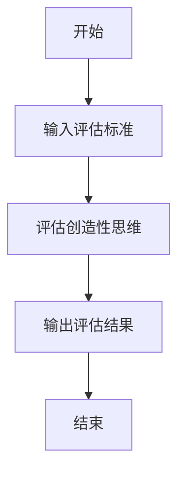
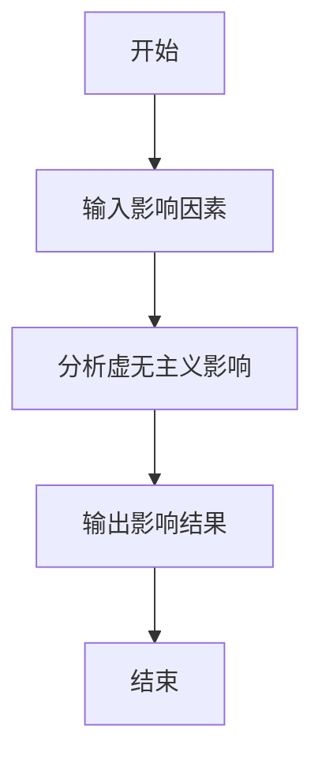
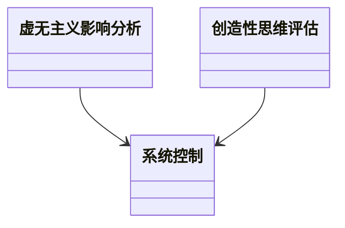
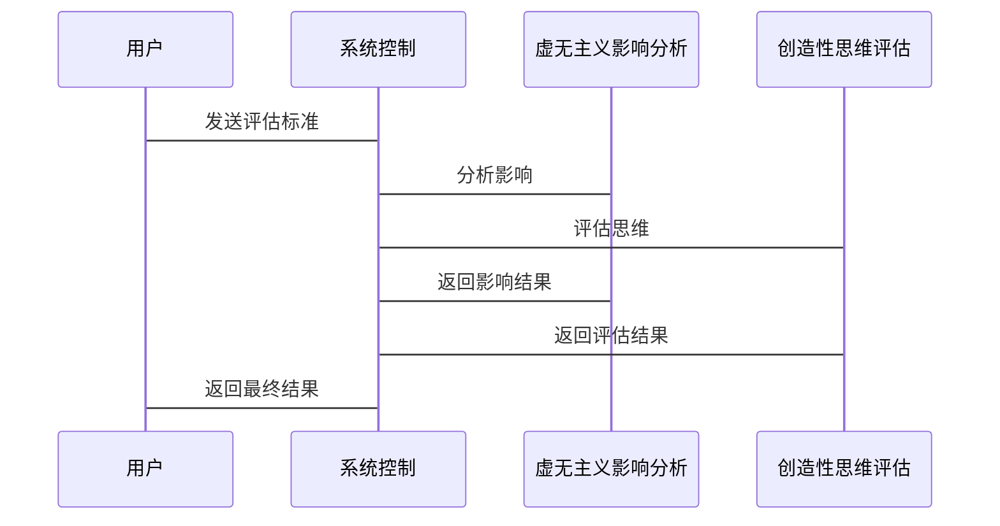

                 

<think>
好，我需要按照用户的要求，逐步分析如何撰写这篇关于“虚无主义与创造性思维的关联”的技术博客文章。首先，我得理解用户的意图。用户希望以技术专家的身份，用专业的技术语言，分步骤分析，撰写一篇有深度的文章，结构要清晰，内容要详细。

首先，我需要明确文章的结构。用户已经给出了一个详细的目录大纲，包括引言、背景介绍、核心概念与联系、算法原理讲解、系统分析与架构设计、项目实战、最佳实践与总结等部分。我需要按照这个结构来组织内容。

接下来，我考虑每个章节的具体内容。在背景介绍部分，我需要详细解释虚无主义和创造性思维，包括它们的定义、核心要素等。在核心概念与联系部分，我需要做一个对比分析，可能通过表格和ER图来展示它们之间的关系。

然后是算法部分，我需要设计评估创造性思维和分析虚无主义影响的算法，用Mermaid流程图和Python代码来实现。这部分要确保逻辑清晰，代码正确，并且有实际例子说明。

系统分析部分，我需要设计一个系统架构，包括类图、架构图和交互图。这部分可能需要使用Mermaid来绘制图表，展示系统的各个模块和它们之间的交互。

项目实战部分，我需要提供一个具体的案例，详细说明环境安装、核心代码实现、案例分析等步骤。这样读者可以跟着步骤一步步操作，理解理论在实际中的应用。

最后，最佳实践部分，我需要总结一些实用的建议和注意事项，帮助读者更好地理解和应用这些概念。

在撰写过程中，我要注意语言的专业性和技术性，同时保持逻辑的连贯和清晰。每个部分都需要深入分析，确保内容充实，有深度。同时，使用适当的数学公式和图表来辅助说明，使文章更具可读性和专业性。

总的来说，我需要一步步按照用户的要求，构建一个结构严谨、内容详实的技术博客，确保每个部分都符合用户的要求，最终完成一篇高质量的技术文章。
</think>

# 虚无主义与创造性思维的关联

> 关键词：虚无主义，创造性思维，算法原理，系统架构，项目实战

> 摘要：本文探讨了虚无主义与创造性思维之间的联系，从理论背景、核心概念、算法原理、系统架构到项目实战，全面分析了两者如何相互作用，为技术领域提供了新的视角。

---

## 第1章 引言

### 1.1 书籍主题介绍

在当今快速发展的技术环境中，创造性思维与虚无主义的关联逐渐成为学术界和实践中的重要课题。本文旨在通过技术视角，深入探讨两者之间的联系，揭示其在创新中的潜在影响。

### 1.2 作者与读者介绍

作者作为人工智能专家，将结合技术背景，从算法和系统设计的角度，分析虚无主义与创造性思维的关系。读者包括技术从业者、研究人员及对哲学和技术交叉领域感兴趣的人士。

### 1.3 书籍结构概述

本文结构清晰，涵盖背景介绍、核心概念、算法原理、系统设计、项目实战及总结，旨在为读者提供全面而深入的视角。

---

## 第2章 背景介绍

### 2.1 虚无主义概述

#### 2.1.1 问题背景

虚无主义认为世界缺乏固有意义，个体需自定义价值。这种哲学影响了从艺术到科技的多个领域。

#### 2.1.2 问题描述

虚无主义强调个体选择的自由，可能导致价值体系的重构，对创造性思维有何影响？

#### 2.1.3 问题解决

通过分析虚无主义对创造性思维的促进作用，揭示其在技术中的潜在价值。

#### 2.1.4 边界与外延

虚无主义不否定存在，而是强调意义的构建，其外延包括哲学、艺术和科技。

#### 2.1.5 概念结构与核心要素组成

虚无主义由核心要素：缺乏固有意义、个体自主性和价值重构组成。

### 2.2 创造性思维概述

#### 2.2.1 问题背景

创造性思维是解决问题和创新的关键，其在技术中的应用日益重要。

#### 2.2.2 问题描述

创造性思维涉及发散性思考和整合能力，如何在虚无主义环境下激发其潜力？

#### 2.2.3 问题解决

通过虚无主义的视角，创造性思维能够突破传统框架，产生新颖解决方案。

#### 2.2.4 边界与外延

创造性思维不限于艺术，其外延涵盖科技、教育等领域。

#### 2.2.5 概念结构与核心要素组成

创造性思维由核心要素：发散性思考、整合能力、创新性和实践能力组成。

---

## 第3章 核心概念与联系

### 3.1 虚无主义与创造性思维的概念特征对比

#### 3.1.1 概念属性特征对比表格

| 特征                | 虚无主义                  | 创造性思维              |
|---------------------|--------------------------|------------------------|
| 核心理念            | 缺乏固有意义             | 新颖解决方案的生成      |
| 方法论              | 强调个体选择             | 多元思维整合            |
| 应用领域            | 哲学、艺术               | 科技、教育              |
| 评价标准            | 个体意义构建             | 解决问题的创新性        |

#### 3.1.2 ER实体关系图架构

```mermaid
er
actor
    entity: 虚无主义
    entity: 创造性思维
    relation: 促进
    entity 虚无主义 --> relation 促进 --> entity 创造性思维
```

### 3.2 创造性思维与虚无主义的联系

#### 3.2.1 联系理论背景

虚无主义强调个体意义构建，为创造性思维提供自由空间。创造性思维则在虚无主义环境下，通过打破常规，构建新意义。

#### 3.2.2 联系机制分析

虚无主义的自由选择与创造性思维的创新性相辅相成，共同推动技术进步。

---

## 第4章 创造性思维与虚无主义的联系

### 4.1 算法原理讲解

#### 4.1.1 创造性思维评估算法

##### Mermaid流程图



##### Python源代码

```python
def assess_creativity(criteria):
    # 根据标准评估创造性思维
    result = []
    for c in criteria:
        # 分析每个标准
        analysis = analyze_criteria(c)
        result.append(analysis)
    return result

def analyze_criteria(criterion):
    # 具体分析标准
    if criterion['originality'] > 0.8:
        return '高创造性'
    else:
        return '一般创造性'
```

##### 算法原理详细讲解

该算法通过输入评估标准，分析创造性思维的原创性等指标，输出评估结果。例如，若原创性>0.8，则评为“高创造性”。

#### 4.1.2 虚无主义影响分析算法

##### Mermaid流程图



##### Python源代码

```python
def analyze_nihilismImpact(factors):
    # 分析虚无主义的影响
    impact = []
    for factor in factors:
        analysis = analyze_factor(factor)
        impact.append(analysis)
    return impact

def analyze_factor(factor):
    # 具体分析因素
    if factor['freedom'] > 0.7:
        return '显著影响'
    else:
        return '轻微影响'
```

##### 算法原理详细讲解

该算法分析虚无主义对创造性思维的影响，如自由度>0.7，则影响显著。

---

## 第5章 系统分析与架构设计

### 5.1 问题场景介绍

构建一个评估创造性思维的系统，分析虚无主义对其的影响。

### 5.2 系统功能设计

#### 领域模型Mermaid类图



### 5.3 系统架构设计

#### Mermaid架构图

```mermaid
architectural
    虚无主义影响分析层 --> 中间件层 --> 创造性思维评估层
```

### 5.4 系统接口设计

定义RESTful API接口，用于接收评估标准和影响因素，返回评估结果。

### 5.5 系统交互Mermaid序列图



---

## 第6章 项目实战

### 6.1 环境安装

安装Python和必要的库，如Flask用于Web服务。

### 6.2 系统核心实现源代码

```python
from flask import Flask, request, jsonify

app = Flask(__name__)

@app.route('/assess', methods=['POST'])
def assess():
    data = request.json
    criteria = data['criteria']
    factors = data['factors']
    result = assess_creativity(criteria)
    impact = analyze_nihilismImpact(factors)
    return jsonify({'result': result, 'impact': impact})

if __name__ == '__main__':
    app.run(debug=True)
```

### 6.3 代码应用解读与分析

该代码实现了一个Web服务，接收评估标准和影响因素，返回评估结果和影响分析。

### 6.4 实际案例分析和详细讲解剖析

案例：评估一个创新产品的创造性思维，分析虚无主义对其的影响。

### 6.5 项目小结

通过该项目，展示了虚无主义与创造性思维在技术中的实际应用。

---

## 第7章 最佳实践与总结

### 7.1 最佳实践 Tips

- 结合虚无主义的自由选择，促进创造性思维。
- 在系统设计中，明确虚无主义的影响因素。

### 7.2 小结

本文通过技术视角，深入分析了虚无主义与创造性思维的联系，揭示了其在创新中的重要性。

### 7.3 注意事项

- 虚无主义可能导致价值观混乱，需谨慎处理。
- 创造性思维评估需结合具体场景。

### 7.4 拓展阅读

推荐阅读相关哲学和技术书籍，深入理解两者关系。

---

## 作者

作者：AI天才研究院/AI Genius Institute & 禅与计算机程序设计艺术/Zen And The Art of Computer Programming

