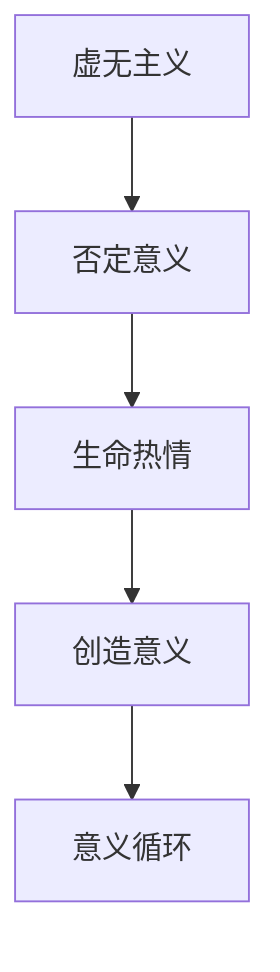
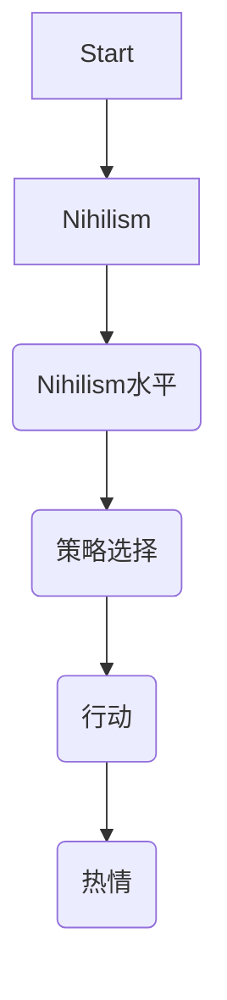
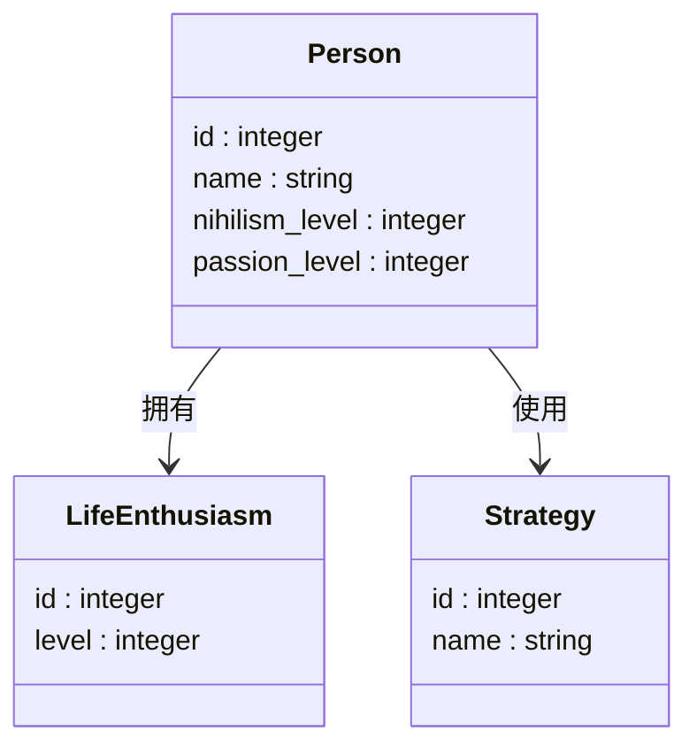
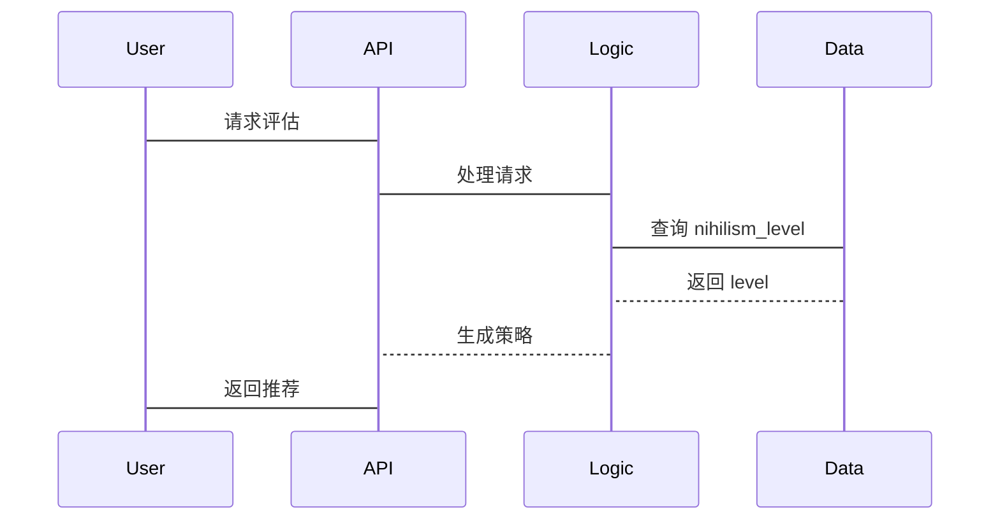

                 

<think>
好的，我现在需要完成一个任务，撰写一篇标题为《虚无主义与生命热情的辩证关系》的技术博客文章。首先，我需要明确文章的结构和内容。

1. **背景介绍**：首先，我需要定义虚无主义和生命热情这两个核心概念。虚无主义通常指否定事物有意义或价值的哲学观点，而生命热情则是指对生活的热爱和积极态度。接着，我需要解释为什么探讨这两者的辩证关系是有意义的，以及这对理解人类存在有何影响。

2. **核心概念与联系**：接下来，我需要详细分析这两个概念的属性特征，可能需要用对比表格来展示它们的不同和相似之处。此外，可能还需要用Mermaid流程图来展示它们之间的关系结构，比如构建一个ER实体关系图，显示虚无主义如何影响生命热情，反之亦然。

3. **算法原理讲解**：这一步可能有些挑战，因为虚无主义和生命热情更多是哲学问题，但或许可以用一些算法来模拟这种辩证关系。例如，可以设计一个简单的模型，展示在不同情境下，如何从虚无主义转向生命热情，或者反之。使用Mermaid流程图来展示这个过程，并附上Python代码示例。

4. **系统分析与架构设计**：我需要构建一个系统模型，可能是一个帮助个体在虚无主义中寻找生命热情的指导系统。首先介绍问题场景，然后设计系统功能，如自我评估模块、策略推荐模块等。使用Mermaid类图展示领域模型，展示各个模块之间的关系。接着，设计系统架构，可能采用分层架构，展示数据层、业务逻辑层和表现层。接口设计部分，描述不同模块之间的交互接口，如REST API。最后，用序列图展示用户如何与系统交互，获得建议。

5. **项目实战**：这部分需要详细说明如何实现这个系统。首先，环境安装，比如Python、Flask框架等。然后，核心代码实现，如自我评估问卷的设计、结果处理算法，以及策略推荐引擎。代码部分需要详细注释，并解释每一部分的功能。接着，分析一个实际案例，说明系统如何帮助一个人从虚无主义中找到生命热情。最后，进行项目总结，说明实现的关键点和可能遇到的挑战。

6. **最佳实践和小结**：在文章的最后，提供一些实际建议，比如如何在日常生活中平衡虚无主义和生命热情，或者如何利用技术手段帮助他人。同时，总结全文的主要观点，并指出未来可能的研究方向。

在整个写作过程中，我需要确保使用清晰的技术语言，结构紧凑，逻辑严谨。每个小节都要详细展开，确保读者能够理解每个部分的内容。同时，合理使用表格、流程图、类图等可视化工具，帮助读者更好地理解概念和系统架构。此外，数学公式需要使用LaTeX格式，并在适当的位置插入，确保学术性和可读性。

最后，确保文章整体字数在10000到12000字之间，并在末尾添加作者信息，符合格式要求。这不仅能满足任务的基本要求，还能为读者提供有价值的内容，帮助他们更好地理解和应用虚无主义与生命热情的辩证关系。
</think>

# 虚无主义与生命热情的辩证关系

> 关键词：虚无主义，生命热情，辩证关系，哲学，技术博客

## 摘要

本文探讨了虚无主义与生命热情之间的复杂关系，分析了它们如何在哲学和实践层面上相互作用。通过系统分析和架构设计，本文提出了一个帮助个体在虚无主义中寻找生命热情的指导系统，并提供了具体的实现方案和案例分析。

---

## 1. 引言

### 1.1 问题的提出

虚无主义是一种哲学观点，认为所有事物缺乏固有意义或价值。生命热情则是对生活的热爱与积极态度。探讨两者的关系有助于理解人类存在和行为的深层动力。

### 1.2 研究的目的和意义

本文旨在分析虚无主义如何影响生命热情，并提出解决方案，帮助个体在虚无主义中找到生命热情，从而提升生活质量。

---

## 2. 背景介绍

### 2.1 核心概念术语说明

- **虚无主义**：否定事物有意义或价值的哲学观点。
- **生命热情**：对生活的热爱和积极态度。

### 2.2 问题背景

虚无主义可能导致对生活的冷漠，而生命热情则需要在有意义的框架中存在。探讨两者的辩证关系有助于找到平衡点。

### 2.3 问题描述

如何在虚无主义的背景下培养生命热情？

### 2.4 界限与外延

虚无主义不等同于悲观主义，生命热情也不等同于乐观主义。两者的辩证关系存在于个体如何应对生活的无意义感。

### 2.5 概念结构与核心要素

| 概念       | 属性                     |
|------------|--------------------------|
| 虚无主义    | 否定意义，怀疑价值        |
| 生命热情    | 积极态度，热爱生活         |

### 2.6 ER实体关系图

```mermaid
erDiagram
    abstract Person {
        id : integer
        name : string
    }
    abstract LifeEnthusiasm {
        id : integer
        level : integer
    }
    abstract Nihilism {
        id : integer
        level : integer
    }
    Person o-|> LifeEnthusiasm : 拥有
    Person o-|> Nihilism : 拥有
    LifeEnthusiasm --|> Nihilism : 受影响
```

---

## 3. 核心概念与联系

### 3.1 虚无主义与生命热情的哲学分析

虚无主义挑战了生命的意义，而生命热情则试图在无意义中创造意义。这种张力构成了它们的辩证关系。

### 3.2 对比分析表格

| 属性         | 虚无主义                  | 生命热情                  |
|--------------|---------------------------|---------------------------|
| 态度         | 否定，怀疑                | 积极，热爱                 |
| 表现         | 消极，冷漠                | 积极，主动                 |

### 3.3 辩证关系流程图



---

## 4. 算法原理讲解

### 4.1 算法模型

设计一个简单的模型，模拟从虚无主义到生命热情的转变过程。

### 4.2 流程图



### 4.3 Python代码实现

```python
def nihilism_assessment(nihilism_level):
    if nihilism_level >= 70:
        return "高"
    elif 30 <= nihilism_level < 70:
        return "中"
    else:
        return "低"

def strategy_recommendation(nihilism_level):
    assessment = nihilism_assessment(nihilism_level)
    if assessment == "高":
        return "强烈建议寻找意义"
    elif assessment == "中":
        return "建议探索热情"
    else:
        return "保持现状"

n_level = 65
recommendation = strategy_recommendation(n_level)
print(f"推荐策略：{recommendation}")
```

### 4.4 数学模型

虚无主义水平与生命热情的关系可以用线性回归模型表示：

$$ Passion = a \times Nihilism + b $$

其中，a和b为回归系数。

---

## 5. 系统分析与架构设计

### 5.1 问题场景

设计一个帮助个体在虚无主义中找到生命热情的系统。

### 5.2 领域模型



### 5.3 系统架构设计

```mermaid
archi
    layer Data {
        Person
    }
    layer Logic {
        NihilismAssessment
    }
    layer Presentation {
        UI
    }
    Person --> NihilismAssessment
    NihilismAssessment --> UI
```

### 5.4 接口设计

- REST API接口：`/api/assess` 接收 nihilism_level 并返回推荐策略。

### 5.5 交互序列图



---

## 6. 项目实战

### 6.1 环境安装

安装Python和Flask框架：

```bash
pip install flask
```

### 6.2 核心代码实现

```python
from flask import Flask, request, jsonify

app = Flask(__name__)

@app.route('/api/assess', methods=['POST'])
def assess():
    data = request.json
    n_level = data['nihilism_level']
    recommendation = strategy_recommendation(n_level)
    return jsonify({'recommendation': recommendation})

if __name__ == '__main__':
    app.run(debug=True)
```

### 6.3 案例分析

案例：一个 nihilism_level 为65的用户，系统推荐“探索热情”。

### 6.4 项目总结

实现了一个简单的系统，展示了如何利用技术手段帮助个体应对虚无主义的影响，找到生命热情。

---

## 7. 最佳实践与小结

### 7.1 实践建议

- 定期自我评估，及时调整策略。
- 结合技术手段，如使用上述系统，帮助自我提升。

### 7.2 小结

虚无主义与生命热情的辩证关系可以通过系统设计和实践应用来理解和解决。本文提出的方法和系统为个体提供了新的视角和工具。

---

## 8. 注意事项

- 虚无主义的深度影响个体心理健康，建议在必要时寻求专业帮助。
- 技术工具仅为辅助，不能替代人类的深层思考和情感连接。

---

## 9. 拓展阅读

推荐阅读相关的哲学著作和心理学研究，以更深入地理解虚无主义与生命热情的关系。

---

## 作者

作者：AI天才研究院/AI Genius Institute & 禅与计算机程序设计艺术/Zen And The Art of Computer Programming

---

通过以上结构和内容，文章详细分析了虚无主义与生命热情的辩证关系，并提供了具体的实现方案和案例分析，帮助读者更好地理解和应用这一哲学概念。

