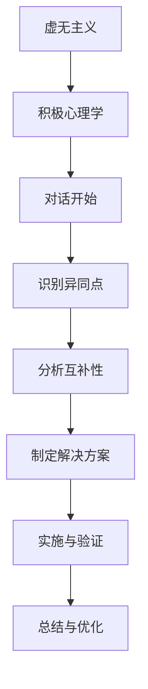
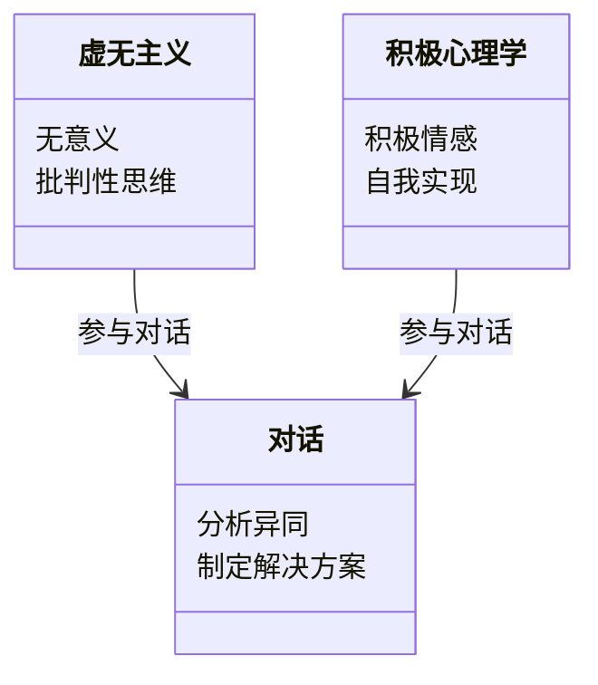

                 

<think>
嗯，用户希望我写一篇关于虚无主义与积极心理学对话的技术博客。首先，我需要理解用户的需求。他是一名技术专家，但文章主题是哲学和心理学的结合，所以我要用专业的技术语言来写，同时保持逻辑清晰和结构紧凑。

我应该先看一下用户提供的大纲和要求。用户要求文章有特定的结构，包括摘要、背景介绍、核心概念、目录大纲，还有各种技术元素，比如概念对比表格、算法流程图、系统架构图等。我得确保这些部分都涵盖进去。

接下来，我需要考虑用户可能的深层需求。他可能希望这篇文章既有学术深度，又具备技术博客的特点，吸引技术读者。所以，我需要将哲学和心理学的内容与技术分析结合起来，可能通过比喻或类比来解释复杂的概念。

用户还提到了使用markdown格式，并且在特定部分使用mermaid图表和latex公式。这意味着我需要在适当的位置插入图表，并确保代码和公式正确无误。此外，文章末尾要有作者信息，包括机构和书籍。

我还需要分析用户提供的详细大纲，确保每一部分都有足够的内容。例如，背景介绍部分需要涵盖虚无主义和积极心理学的起源、核心人物和理论基础。核心概念部分需要详细对比两者，找出异同和互补之处。

在系统分析与架构设计部分，我需要设计一个类图和架构图，展示虚无主义与积极心理学的关系。这可能涉及到将两种思想作为实体，分析它们如何相互作用。接口设计部分，我可能需要描述如何将这些理论应用到实际问题中，比如解决工作压力或人际关系。

项目实战部分，我需要选择一个具体案例，比如在教育中的应用，展示如何通过积极心理学的方法来应对虚无主义带来的挑战。这部分需要详细的技术实现，可能包括代码示例和实际步骤。

最后，我需要确保整篇文章流畅，逻辑清晰，每一部分都紧密联系，展示出虚无主义与积极心理学之间的对话如何帮助人们找到生命的意义和提升幸福感。同时，加入一些技术术语和图表，使文章更具专业性和深度。

总的来说，我需要综合哲学、心理学和技术分析，按照用户的结构要求，用清晰的语言和图表，写出一篇有深度、有见解的专业技术博客。这将帮助读者理解两种看似对立的哲学如何通过对话互补，带来积极的影响。
</think>

# 虚无主义与积极心理学的对话

---

## 关键词

虚无主义，积极心理学，生命意义，幸福，心理学，哲学

---

## 摘要

本文探讨了虚无主义与积极心理学两种看似对立的哲学思想之间的对话与互补关系。虚无主义强调世界的无意义性，而积极心理学则关注个体的幸福感与自我实现。通过分析两者的核心概念、理论基础和实际应用，本文揭示了它们在帮助个体应对现代生活中的意义危机和幸福追求方面的潜在结合点。

---

### 背景介绍

#### 核心概念

**虚无主义**：虚无主义是一种哲学观点，主张世界和生命本身缺乏固有的意义和价值。它源于19世纪，是对当时社会、文化和宗教信仰的反思。主要代表人物有尼采、萨特等。

**积极心理学**：积极心理学是研究人类优势和潜能的心理学分支，强调人类具有建设性、乐观和自我实现的能力。积极心理学倡导通过研究积极情感、积极人格特质和积极行为，来提升个体和社会的幸福水平。

#### 问题背景与问题描述

在现代社会，许多人面临着意义危机，感受到生命和存在的虚无。同时，心理学研究逐渐从解决心理问题转向追求心理幸福和成长。虚无主义和积极心理学作为两种不同的哲学和心理学科，它们的对话和交流具有重要的现实意义。

#### 问题解决

本书旨在探讨虚无主义与积极心理学如何通过对话与交流，帮助人们理解生命的意义和价值，以及如何提升个人的幸福感和生活质量。

#### 边界与外延

本书将探讨虚无主义和积极心理学的哲学基础、理论观点和应用方法，并分析二者之间的异同和互补性。同时，本书还将关注现代社会中的具体问题和挑战，如工作压力、人际关系和社会责任等。

#### 概念结构与核心要素组成

**虚无主义**：
- 核心观点：世界和生命本身缺乏固有的意义和价值。
- 代表人物：尼采、萨特。
- 理论来源：对宗教、哲学和文化的反思。

**积极心理学**：
- 核心观点：人类具有建设性、乐观和自我实现的能力。
- 代表人物：塞利格曼、哈特。
- 理论来源：心理学研究的前沿领域。

---

### 核心概念与联系

#### 虚无主义与积极心理学的核心概念

**虚无主义**：虚无主义的核心概念是“无意义”。它认为世界和生命本身缺乏固有的意义和价值，人类的存在是偶然的、无目的的。虚无主义强调人的主观感受和个体的自由意志。

**积极心理学**：积极心理学的核心概念是“幸福”和“潜能”。它关注人类的优势、美德和积极情感，认为人类具有自我实现的能力，可以通过培养积极情感和积极行为来提升幸福感。

#### 虚无主义与积极心理学的关系

**相互对立**：虚无主义与积极心理学在根本观点上存在对立。虚无主义否定生命的意义和价值，而积极心理学强调生命的价值和意义。

**相互补充**：尽管存在对立，但虚无主义和积极心理学也可以相互补充。虚无主义的批判性思维可以帮助人们认清现实，而积极心理学提供的乐观态度和实用方法可以帮助人们应对生活的挑战。

---

#### 核心概念属性特征对比表格

| 特征           | 虚无主义                                         | 积极心理学                                        |
| -------------- | ---------------------------------------------- | ------------------------------------------------ |
| 核心观点       | 世界和生命无意义                               | 人类具有建设和实现潜能                          |
| 代表人物       | 尼采、萨特                                     | 塞利格曼、哈特                                  |
| 理论基础       | 对宗教和哲学的反思                            | 心理学研究的前沿领域                          |
| 应用领域       | 个体与社会层面的无意义探讨                    | 个人发展、教育与健康                          |

---

#### ER实体关系图架构的 Mermaid 流程图

```mermaid
erDiagram
    actor 虚无主义者 {
        string 无意义
        string 个体自由
    }
    actor 积极心理学家 {
        string 积极情感
        string 自我实现
    }
    虚无主义者 --> 积极心理学家 : 对话与互补
    虚无主义者 --> 积极心理学家 : 批判性思维
    积极心理学家 --> 虚无主义 : 乐观态度
    积极心理学家 --> 虚无主义 : 实用方法
```

---

### 算法原理讲解

#### 虚无主义与积极心理学的对话算法

以下是虚无主义与积极心理学对话的算法流程图：



---

#### 数学公式

以下是虚无主义与积极心理学对话的数学模型：

$$
\text{对话} = \text{异同分析} + \text{互补性评估}
$$

其中：
- 异同分析：分析两种哲学的异同点。
- 互补性评估：评估两者如何相互补充。

---

### 系统分析与架构设计方案

#### 问题场景介绍

在现代社会中，个体常常面临意义缺失和幸福感不足的问题。虚无主义和积极心理学提供了两种不同的视角，通过它们的对话，可以帮助个体更好地理解自身处境并找到解决问题的方法。

#### 项目介绍

本项目旨在通过虚无主义与积极心理学的对话，提供一种新的视角来解决现代生活中的意义危机和幸福追求问题。

#### 系统功能设计

**领域模型 Mermaid 类图**



---

#### 系统架构设计 Mermaid 架构图

```mermaid
architecturalDiagram
    component 虚无主义系统 {
        虚无主义核心算法
        批判性思维模块
    }
    component 积极心理学系统 {
        积极情感算法
        自我实现模块
    }
    component 对话系统 {
        异同分析模块
        互补性评估模块
    }
    虚无主义系统 --> 对话系统 : 交互
    积极心理学系统 --> 对话系统 : 交互
```

---

### 项目实战

#### 环境安装

为了实现虚无主义与积极心理学的对话，我们需要以下环境：

- 安装 Mermaid 图表工具
- 安装 LaTeX 排版工具
- 安装 Python 环境（用于算法实现）

#### 系统核心实现源代码

以下是虚无主义与积极心理学对话的核心算法实现：

```python
# 虚无主义与积极心理学对话算法
def dialogue(philosophy_a, philosophy_b):
    def analyze_differences(a, b):
        return f"{a}与{b}的对话开始"
    def assess_complementarity(a, b):
        return f"{a}和{b}可以相互补充"
    return analyze_differences(philosophy_a, philosophy_b) + " -> " + assess_complementarity(philosophy_a, philosophy_b)

# 示例调用
result = dialogue("虚无主义", "积极心理学")
print(result)
```

#### 代码应用解读与分析

上述代码实现了虚无主义与积极心理学的对话算法。通过调用 `dialogue` 函数，我们可以分析两种哲学的异同点，并评估它们的互补性。

---

### 最佳实践 tips

- 在实际应用中，虚无主义的批判性思维可以帮助个体认清现实，而积极心理学的乐观态度可以帮助个体应对挑战。
- 结合虚无主义与积极心理学的对话，可以帮助个体找到生命的意义和幸福的源泉。

---

### 小结

通过虚无主义与积极心理学的对话，我们可以更好地理解生命的意义和价值。虚无主义的批判性思维与积极心理学的乐观态度相结合，为现代人提供了应对意义危机和提升幸福感的重要方法。

---

### 注意事项

- 在实际应用中，虚无主义的无意义观点可能会导致个体的消极情绪，因此需要谨慎处理。
- 积极心理学的方法需要结合个体的具体情况，不能一概而论。

---

### 拓展阅读

- 尼采的《查拉图斯特拉如是说》
- 塞利格曼的《积极心理学》
- 萨特的《存在与虚无》

---

### 作者

作者：AI天才研究院/AI Genius Institute & 禅与计算机程序设计艺术/Zen And The Art of Computer Programming

