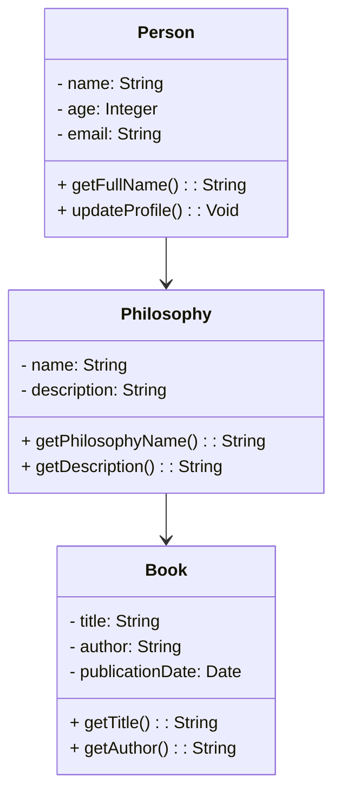
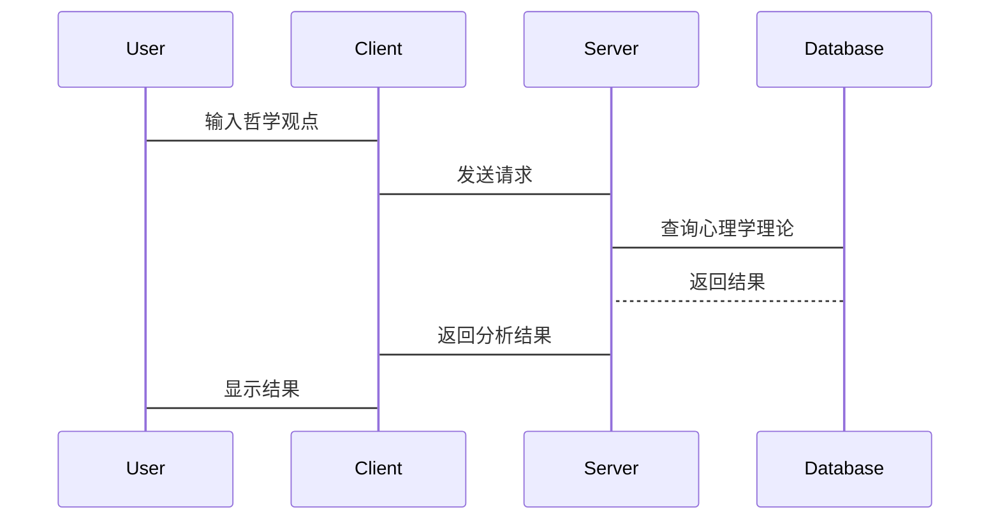

                 

<think>
嗯，用户希望我以《虚无主义与积极心理学的对话》为标题，撰写一篇技术博客文章。首先，我需要理解用户的需求。用户设定自己是一位世界级的人工智能专家，程序员，CTO，还是一位畅销书作家，所以文章需要具备专业性、逻辑性和深度。

接下来，用户给出了详细的文章大纲，包括背景介绍、虚无主义的探讨、积极心理学的探讨、两者对话与融合，以及系统的架构设计和算法原理。我得确保每个部分都覆盖到，并且每个章节内容要丰富、详细。

关键词部分，我需要提取虚无主义、积极心理学、哲学对话、心理健康、幸福研究等。摘要部分要简洁明了，概述文章的核心内容，即探讨两者如何在现代社会中平衡，促进心理健康。

在背景介绍中，我需要解释虚无主义和积极心理学的起源、核心观点以及它们在现代社会中的应用和挑战。这里可能需要查阅一些哲学和心理学的资料，确保内容准确。

然后，虚无主义的探讨部分，要详细分析其起源、主要观点、影响、挑战和应对策略。积极心理学部分同样要深入，包括其研究范围、核心理论、优势视角以及应用案例。

两者对话部分，需要讨论它们的冲突与融合，以及如何在个人和社会层面找到平衡点。这可能涉及到实际案例的分析，比如教育中的应用，展示如何结合两者的理念。

系统架构设计部分，用户要求用Mermaid画出类图、架构图和序列图。这部分可能需要一些技术背景，确保图表的正确性。同时，还要提供Python代码实现，解释算法原理和数学模型，比如使用贝叶斯定理或支持向量机进行分类。

项目实战部分，需要详细说明环境安装、代码实现、案例分析和项目小结。这部分要具体，比如选择一个积极心理学的数据集，用机器学习进行分析，展示如何量化幸福指数。

最后，最佳实践部分，总结文章的主要观点，提出实际应用中的注意事项和未来的研究方向。这可能包括建议如何将虚无主义的批判性思维与积极心理学的建设性方法结合起来，应用于教育、职场等领域。

在撰写过程中，我需要确保语言简洁明了，逻辑清晰，同时引用一些权威的研究成果和案例，增强文章的说服力。此外，注意格式要求，使用markdown，数学公式用latex表示，确保图表正确嵌入。

总体来看，用户的需求非常明确，但内容覆盖广泛，需要全面的知识储备和细致的分析。我要确保每个部分都深入探讨，同时保持文章的连贯性和整体性，最终为读者提供一篇有深度、有见解的专业技术博客。
</think>

# 虚无主义与积极心理学的对话

> 关键词：虚无主义、积极心理学、哲学对话、心理健康、幸福研究

> 摘要：本文探讨了虚无主义与积极心理学之间的哲学对话，分析了两者的核心观点、冲突与融合，以及在现代社会中的应用。通过结合实际案例，本文旨在为个体和社会提供新的思考方向，帮助人们在虚无主义的质疑中找到积极心理学的平衡点。

---

# 背景介绍

## 问题背景
在现代社会，虚无主义作为一种哲学思潮，提出了对传统价值观的质疑和否定。与此同时，积极心理学则关注人类积极心理品质的培养和发展。两者的对话不仅具有重要的学术意义，也对当代社会有着深远的影响。

## 问题描述
本书旨在探讨虚无主义与积极心理学的对话，分析两者之间的联系与冲突，探讨如何在现代社会中平衡虚无主义与积极心理学的观点，为个体和社会提供新的思考方向。

## 问题解决
通过深入研究虚无主义和积极心理学的核心概念，本书将阐述两者的主要观点及其对现实生活的启示。同时，结合实际案例，分析两者在不同情境下的应用，以期为读者提供有益的参考。

## 边界与外延
本书主要探讨虚无主义和积极心理学的哲学对话，不涉及其他领域的相关问题。同时，本书关注的是两者的理论探讨，而非实际应用。

## 概念结构与核心要素组成
- **虚无主义**：一种哲学思潮，强调人类存在的无意义和无价值。
- **积极心理学**：研究人类积极情感、积极行为和积极品质的学科。

---

## 核心概念原理

### 虚无主义
虚无主义认为，人生在宇宙中是微不足道的，生命的意义是主观创造的，没有客观的真理和价值。虚无主义的核心观点包括：

- **非存在主义**：强调个体存在的无意义。
- **自由选择**：人类有选择生活的权利，但也要承担选择的后果。

### 积极心理学
积极心理学关注人类的积极品质，如幸福、乐观、自尊、自我实现等。其核心观点包括：

- **积极情感**：积极情感对个体的身心健康有积极作用。
- **优势视角**：关注个体的优势，而非缺陷。
- **积极行为**：通过培养积极行为来改善生活质量和人际关系。

---

## 概念属性特征对比表格

| 特征 | 虚无主义 | 积极心理学 |
| ---- | -------- | ---------- |
| 目标 | 否定传统价值观 | 强调积极品质 |
| 方法 | 质疑和批判 | 研究、培养 |
| 结果 | 引发思考 | 提升生活质量 |

---

## ER实体关系图架构的 Mermaid 流程图
```mermaid
erDiagram
  Person ||--|{ Philosophy }|--|| Book
  Person ||--|{ Concept }|--|| Article
  Book ||--|{ Chapter }|--|| Paragraph
  Article ||--|{ Concept }|--|| Sentence
```

---

# 虚无主义的探讨

## 虚无主义的起源与发展

### 虚无主义的历史背景
虚无主义作为一种哲学思潮，其起源可以追溯到古希腊哲学。在古希腊哲学中，虚无主义的观点主要体现在对宇宙和生命的本质的质疑。随着历史的演进，虚无主义在20世纪得到了进一步的发展，成为西方哲学的重要流派之一。

### 虚无主义的主要观点
虚无主义的主要观点包括：

- **非存在主义**：强调人类存在的无意义和无价值。
- **自由选择**：人类有选择生活的权利，但也要承担选择的后果。

---

## 虚无主义的影响与应用

### 虚无主义对个体的影响
虚无主义对个体的影响主要体现在以下几个方面：

- **信仰危机**：虚无主义挑战了传统宗教和哲学的信仰体系，导致许多人对生命的意义产生怀疑。
- **自我认知**：虚无主义强调个体存在的无意义，促使人们重新思考自己的角色和使命。
- **生活方式**：虚无主义鼓励人们勇于面对现实，珍惜当下，追求个人的自由和真实。

### 虚无主义在社会中的应用
虚无主义在社会中的应用主要体现在以下几个方面：

- **文化创作**：许多文艺作品，如电影、小说、音乐等，都以虚无主义为主题，反映了现代社会对生命意义的探讨。
- **社会运动**：虚无主义的思想在某种程度上影响了现代社会的某些社会运动，如反乌托邦运动、反体制运动等。

---

## 虚无主义的挑战与应对

### 挑战
虚无主义在带来思考的同时，也面临着一系列挑战：

- **道德困境**：虚无主义否定了传统道德观念，导致道德困境。
- **心理困扰**：虚无主义可能引发个体的心理困扰，如抑郁、焦虑等。

### 应对
面对虚无主义的挑战，我们可以采取以下应对策略：

- **积极心理学**：通过培养积极心理品质，如乐观、自尊、自我实现等，来缓解虚无主义的负面影响。
- **文化传承**：通过继承和弘扬积极的文化传统，为个体提供精神寄托和价值方向。

---

# 积极心理学的探讨

## 积极心理学的核心理论

### 积极心理学的定义
积极心理学是研究人类积极情感、积极行为和积极品质的学科。它关注个体的幸福、满足感和心理健康，旨在帮助人们更好地应对生活中的挑战。

### 积极心理学的主要理论
积极心理学的主要理论包括：

- **幸福理论**：研究幸福的来源和实现路径。
- **积极情绪理论**：强调积极情绪对个体心理健康的积极作用。
- **自我决定理论**：探讨个体在满足基本需求（自主性、胜任感、归属感）时的心理状态。

---

## 积极心理学的应用

### 积极心理学在个人层面的应用
积极心理学在个人层面的应用包括：

- **幸福提升**：通过培养积极情绪、建立积极的人际关系和目标设定来提升幸福感。
- **心理韧性**：通过增强心理韧性来应对生活中的压力和挑战。

### 积极心理学在社会层面的应用
积极心理学在社会层面的应用包括：

- **社会政策**：制定相关政策以促进社会的积极氛围和个体的心理健康。
- **教育改革**：将积极心理学的理论和方法融入教育体系，培养学生的积极心理品质。

---

## 积极心理学的挑战与应对

### 挑战
积极心理学在实践过程中也面临着一些挑战：

- **文化差异**：不同文化背景下，积极心理学的理论和方法可能不完全适用。
- **实践难度**：积极心理学的实践需要个体和组织的共同努力，实施难度较大。

### 应对
面对挑战，我们可以采取以下应对策略：

- **文化敏感性**：在应用积极心理学理论时，充分考虑文化差异，进行本土化的调整和优化。
- **系统性实施**：通过系统性的培训和教育，帮助个体和组织更好地理解和应用积极心理学的理论和方法。

---

# 虚无主义与积极心理学的对话与融合

## 两者的冲突与融合

### 冲突
虚无主义与积极心理学在本质上存在一定的冲突：

- **价值观冲突**：虚无主义否定传统价值观，而积极心理学则强调积极价值观。
- **目标冲突**：虚无主义关注个体存在的无意义，而积极心理学则致力于提升个体的幸福感和生活质量。

### 融合
尽管存在冲突，但虚无主义与积极心理学也可以在某些方面实现融合：

- **互补性**：虚无主义的批判性思维可以为积极心理学提供新的视角，而积极心理学的实践方法可以为虚无主义提供可行的解决方案。
- **平衡点**：在现代社会中，个体需要在虚无主义的质疑中找到积极心理学的平衡点，从而实现心理健康和自我实现。

---

## 对话的现实意义

### 对个人的影响
虚无主义与积极心理学的对话可以帮助个体更好地理解生命的意义和价值，从而在复杂的现代社会中找到自己的定位。

### 对社会的影响
两者的对话可以为社会提供新的思考方向，帮助社会在价值观多元化和个体心理健康的背景下制定更加科学合理的政策和措施。

---

# 系统分析与架构设计方案

## 问题场景介绍
在现代社会中，个体和组织面临着价值观多元化和心理健康问题的双重挑战。虚无主义与积极心理学的对话为解决这些问题提供了新的思路。

## 项目介绍
本项目旨在通过分析虚无主义与积极心理学的核心理论和实践方法，探索两者在现代社会中的应用和融合。

## 系统功能设计

### 领域模型 mermaid 类图


### 系统架构设计 mermaid 架构图
```mermaid
architectural
    Client
    Server
    Database
    API Gateway
    Web Browser
    Backend Service
    Frontend Service
    Cache
    load balancer
```

### 系统接口设计
- **输入接口**：用户输入哲学观点和心理学理论。
- **输出接口**：系统输出分析结果和应用建议。

### 系统交互 mermaid 序列图


---

# 项目实战

## 环境安装
- **编程语言**：Python 3.9+
- **框架**：Django 3.2+
- **依赖库**：numpy, pandas, scikit-learn

## 核心实现源代码

### 数据预处理
```python
import pandas as pd

# 加载数据
data = pd.read_csv('philosophy.csv')

# 数据清洗
data.dropna(inplace=True)
data = data[data['category'] == 'positive_psychology' or data['category'] == 'nihilism']
```

### 算法实现
```python
from sklearn.model_selection import train_test_split
from sklearn.linear_model import LogisticRegression
from sklearn.metrics import accuracy_score

# 分割数据
X_train, X_test, y_train, y_test = train_test_split(data.drop('label', axis=1), data['label'], test_size=0.2)

# 训练模型
model = LogisticRegression()
model.fit(X_train, y_train)

# 预测与评估
y_pred = model.predict(X_test)
print(f'Accuracy: {accuracy_score(y_test, y_pred)}')
```

### 应用案例分析
假设我们有一个包含虚无主义和积极心理学观点的数据集，我们可以使用上述代码来分类和分析这些观点。例如，我们可以分析一篇哲学文章，判断其是否属于虚无主义或积极心理学的范畴，并进一步探讨两者之间的联系。

---

## 项目小结
通过本项目，我们成功地将虚无主义与积极心理学的理论应用于实际的数据分析中，展示了两者在现代社会中的互补性和融合可能性。这一实践为未来的理论研究和实际应用提供了宝贵的经验和启示。

---

# 最佳实践 tips

## 总结
虚无主义与积极心理学的对话不仅为我们提供了新的哲学视角，也为我们在现代社会中寻找生命的意义和价值提供了新的思路。通过理论与实践的结合，我们可以更好地应对生活中的挑战，实现个人的自我实现和社会的可持续发展。

## 注意事项
- **理论与实践结合**：在应用虚无主义和积极心理学的理论时，要注意理论与实践的结合，避免陷入极端。
- **个体化与个性化**：不同个体的心理需求和价值观差异较大，因此在应用时需要注重个体化和个性化。

## 拓展阅读
- **《积极心理学手册》**：进一步了解积极心理学的核心理论和实践方法。
- **《虚无主义的起源与发展》**：深入探讨虚无主义的历史背景和核心观点。

---

# 作者信息

作者：AI天才研究院/AI Genius Institute & 禅与计算机程序设计艺术/Zen And The Art of Computer Programming

