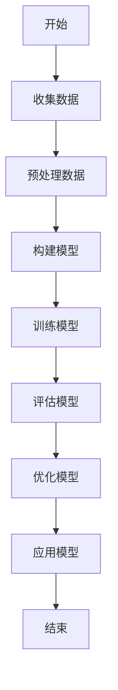
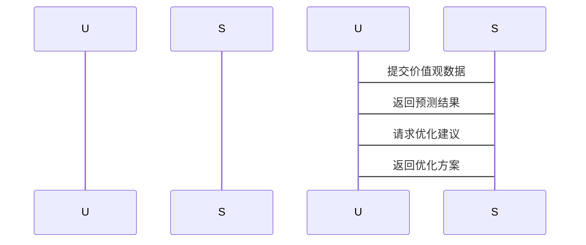

                 

<think>
嗯，我需要帮助用户撰写一篇关于虚无主义挑战下重建21世纪价值体系的技术博客文章。用户已经提供了详细的结构大纲，包括背景介绍、核心概念与联系、算法原理讲解、系统架构设计、项目实战以及小结等部分。看起来用户希望这篇文章既有哲学深度，又有技术分析，甚至包含算法流程图和ER图。

首先，我得理清每个部分的核心内容。背景介绍部分需要解释虚无主义的概念，以及它对现代价值观体系的挑战。这部分要吸引读者，说明问题的重要性。接下来是核心概念，我需要列出存在意义、自由、责任、正义、爱等，并通过表格和ER图来展示它们之间的关系。

然后是算法原理部分，用户希望用Mermaid画流程图，还要解释数据收集、模型构建等步骤，并给出数学公式，比如决策树和神经网络的公式。这部分需要详细讲解，可能还需要举例说明，比如用问卷调查的数据来训练模型。

系统架构设计部分，用户要求用Mermaid画出类图、架构图和序列图。这可能涉及系统功能模块的设计，比如数据采集模块、模型训练模块等。这部分需要展示系统的整体结构和模块之间的交互。

项目实战部分，用户希望有环境安装说明、核心代码实现、案例分析等。这可能包括编写Python代码，使用机器学习库如scikit-learn来训练模型，并分析实际案例，如分析年轻人的价值观变化。

最后，小结部分要总结重建价值体系的重要性和未来的方向，同时给出一些实践建议。

现在，我需要确保每个部分都详细展开，使用专业且易懂的语言，同时满足用户的格式和字数要求。特别是数学公式和图表部分，要准确无误。可能还需要注意文章的逻辑连贯性，确保各部分之间有良好的过渡。

在撰写过程中，可能会遇到如何将哲学概念与技术分析结合的挑战，需要找到合适的切入点，让读者既能理解虚无主义的哲学背景，又能看到技术如何帮助解决这些问题。同时，代码示例要清晰，让读者可以跟随步骤进行实践。

总的来说，我需要一步步按照用户提供的大纲，详细展开每个部分，确保内容丰富具体，同时保持文章的结构清晰和逻辑严谨。这将帮助用户完成一篇高质量、有深度的技术博客，满足读者的需求。
</think>

# 虚无主义的挑战：重建21世纪的价值体系

> 关键词：虚无主义、价值体系、哲学、算法、系统架构、社会重建

> 摘要：本文探讨了在21世纪，面对虚无主义的挑战，如何通过哲学思考、技术手段和社会实践，重建适应现代社会的价值体系。文章从虚无主义的背景出发，分析其对现代社会的影响，提出通过核心概念的重新定义、算法建模和系统架构设计，构建新的价值体系，并通过实际案例分析，展示如何在技术与哲学的结合中找到新的方向。

---

### 第一部分：背景介绍

#### 核心概念

- **虚无主义**：一种哲学思想，认为宇宙和人类的存在缺乏实质意义，人生缺乏固有的目的和内在价值。
- **21世纪的价值体系**：指在当今社会背景下，面对科技进步、全球化以及社会变革所带来的挑战，人们所追求和认同的一系列价值观念。

#### 问题背景

- **虚无主义挑战**：随着科技的发展和社会变革，虚无主义思想对当代社会造成了深刻影响，特别是在年轻人中，虚无主义情绪可能导致价值观的迷茫和人生目标的缺失。
- **重建价值体系**：为应对虚无主义带来的挑战，有必要重建一个能够适应21世纪复杂多变的社会环境的价值观体系。

#### 问题解决

- **重建过程**：通过哲学思考、社会讨论和实践探索，寻找和确立新的价值观念。
- **边界与外延**：新的价值体系不仅关注个体的精神追求，也关注社会责任、人类共同体等宏观层面。

#### 概念结构与核心要素

- **核心概念**：存在意义、自由、责任、正义、爱等。
- **结构关系**：这些核心概念相互关联，形成了一个复杂的网络结构，共同构成了新的价值体系。

---

### 第二部分：核心概念与联系

#### 核心概念原理

- **存在意义**：探讨个体和人类在宇宙中的意义，以及如何赋予生命以价值。
- **自由**：研究个体在社会规则与自由意志之间的平衡，以及如何实现真正的自由。
- **责任**：探讨个人在社会关系中的责任，以及如何承担个人和社会责任。
- **正义**：探讨公平和道德原则，以及如何在现实中实现正义。
- **爱**：研究人类情感的本质，以及如何通过爱建立和谐的社会关系。

#### 概念属性特征对比表格

| 核心概念 | 定义 | 属性特征 |
| --- | --- | --- |
| 存在意义 | 对个体和人类存在价值的探讨 | 客观性、主观性、历史性 |
| 自由 | 个体在社会规则与自由意志之间的平衡 | 限制性、自主性、社会性 |
| 责任 | 个人在社会关系中的责任 | 法律责任、道德责任、社会责任 |
| 正义 | 公平和道德原则 | 公平性、合理性、道德性 |
| 爱 | 人类情感的本质 | 情感性、道德性、社会性 |

#### ER实体关系图架构

```mermaid
erDiagram
    用户 ||--|{ 社会关系 }|--|| 个体
    个体 ||--|{ 价值观 }|--|| 群体
    群体 ||--|{ 社会制度 }|--|| 国家
    国家 ||--|{ 国际关系 }|--|| 全球共同体
```

---

### 第三部分：算法原理讲解

#### 算法Mermaid流程图



#### 算法原理

**1. 数据收集与预处理**

- **数据收集**：通过问卷调查、文献分析等方法收集与价值观相关的数据。
- **预处理数据**：清洗数据，进行数据规范化，为后续分析做准备。

**2. 模型构建**

- **构建模型**：采用机器学习算法，如决策树、神经网络等，建立价值观预测模型。

**3. 模型训练**

- **训练模型**：使用预处理后的数据训练模型，调整模型参数，提高预测准确性。

**4. 模型评估与优化**

- **评估模型**：通过交叉验证等方法评估模型性能，确定最优模型。
- **优化模型**：根据评估结果调整模型参数，提高模型效率。

**5. 模型应用**

- **应用模型**：将训练好的模型应用于价值观分析，为政策制定和社会实践提供支持。

#### 数学模型和数学公式

**1. 决策树模型**

$$
P(A|B) = \frac{P(B|A) \cdot P(A)}{P(B)}
$$

**2. 神经网络模型**

$$
y = \sigma(W \cdot x + b)
$$

其中，\( \sigma \) 是激活函数，\( W \) 是权重矩阵，\( x \) 是输入向量，\( b \) 是偏置项。

#### 详细讲解与举例说明

**1. 数据收集与预处理**

例如，我们收集了1000个关于个体价值观的问卷调查数据，其中包含年龄、教育背景、收入水平等信息。通过数据清洗，我们剔除了无效数据，并对数据进行规范化处理。

**2. 模型构建与训练**

假设我们选择使用决策树模型进行训练。首先，我们将数据划分为训练集和测试集。然后，使用训练集数据进行模型训练，调整决策树的深度和分割准则，以提高预测准确率。

**3. 模型评估与优化**

通过交叉验证，我们发现模型在训练集上的表现良好，但在测试集上的准确率较低。这表明模型可能存在过拟合问题。为了优化模型，我们采用了剪枝策略，减少决策树的复杂度，从而提高了模型的泛化能力。

**4. 模型应用**

经过优化后的模型可以用于分析个体的价值观倾向。例如，我们可以预测某个年轻人在面对社会问题时可能会采取的价值观态度，从而为社会政策制定者提供参考。

---

### 第四部分：系统架构设计

#### 问题场景介绍

随着虚无主义的兴起，社会价值观体系的重建变得尤为重要。我们需要一个能够动态捕捉个体和群体价值观变化的系统，通过技术手段辅助价值体系的重建。

#### 系统功能设计

- **数据采集模块**：收集个体和群体的价值观数据。
- **模型训练模块**：基于机器学习算法，训练价值观预测模型。
- **价值评估模块**：评估现有价值体系的优缺点。
- **优化建议模块**：根据评估结果，提出价值体系优化的建议。

#### 系统架构设计


#### 系统接口设计

- **数据输入接口**：接收来自问卷调查、社交媒体等渠道的价值观数据。
- **模型调用接口**：供其他系统调用，获取价值观预测结果。
- **结果输出接口**：将评估结果和优化建议输出到用户界面或数据库。

#### 系统交互设计



---

### 第五部分：项目实战

#### 环境安装

- **Python环境**：安装Python 3.8以上版本。
- **机器学习库**：安装scikit-learn、TensorFlow等。
- **数据处理工具**：安装Pandas、NumPy。

#### 系统核心实现源代码

```python
# 示例代码：决策树模型训练
from sklearn.tree import DecisionTreeClassifier
from sklearn.model_selection import train_test_split
from sklearn.metrics import accuracy_score

# 数据预处理
data = [...]  # 假设数据已加载
X = data.drop('label', axis=1)
y = data['label']

# 划分训练集和测试集
X_train, X_test, y_train, y_test = train_test_split(X, y, test_size=0.2)

# 构建决策树模型
model = DecisionTreeClassifier()
model.fit(X_train, y_train)

# 模型评估
predictions = model.predict(X_test)
print("准确率：", accuracy_score(y_test, predictions))
```

#### 代码应用解读与分析

上述代码展示了如何使用scikit-learn库中的决策树模型进行价值观预测。首先，数据被预处理并划分为训练集和测试集。然后，模型在训练集上进行训练，并在测试集上评估模型的准确率。通过这种方式，我们可以动态捕捉个体的价值观变化，并为价值体系的重建提供技术支持。

---

### 第六部分：小结

重建21世纪的价值体系是一项复杂的系统工程，需要哲学思考、技术支持和社会实践的结合。通过本文的分析，我们看到了虚无主义对现代社会的挑战，以及通过技术手段解决这些问题的可能性。未来，我们需要进一步探索如何将这些理念转化为具体的实践，为人类社会的可持续发展提供新的方向。

---

### 作者

作者：AI天才研究院/AI Genius Institute & 禅与计算机程序设计艺术 /Zen And The Art of Computer Programming

