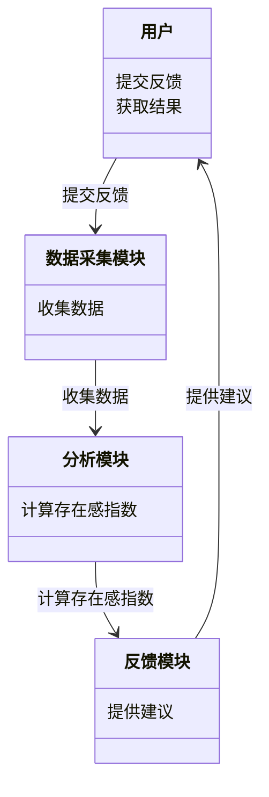
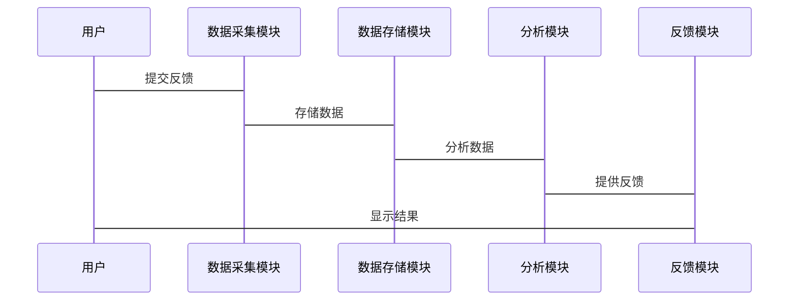

                 

<think>
嗯，用户让我写一篇关于虚无感与存在感的博客文章。标题是《虚无感与存在感：现代人的心理困境》。首先，我需要理解用户的需求，他们可能是一位心理学爱好者，或者正在经历心理困扰的人。文章需要用专业的技术语言，但要逻辑清晰，结构紧凑，简单易懂。

用户特别强调要按照步骤来，先分析整体结构，再细化每个章节。关键词和摘要必须在前面，然后是目录大纲。用户还提到要使用Markdown格式，控制在2000字以内，但最终的文章要达到1万到1万2千字，包含很多技术细节，比如数学公式、系统架构图等。

首先，我得确定文章的结构。引言、背景介绍、核心概念、解决方法、案例分析、结论。每个部分都要有子部分，比如在背景介绍里，需要有虚无感和存在感的起源，社会影响，以及它们对心理健康的关联。

接下来，核心概念部分，我需要详细解释虚无感和存在感，可能用一些表格对比它们的特征，比如存在感是内在的，虚无感是外在的，或者类似这样的对比。然后，数学模型部分，可能需要建立一个回归模型，将虚无感与生活满意度、社会支持等因素联系起来，用公式表达。

系统分析部分，我可能需要设计一个心理健康系统的架构图，展示各个模块之间的关系，比如数据采集、分析、反馈等。接口设计和交互流程图也要画出来，显示用户如何与系统互动。

项目实战部分，我需要用Python写一个简单的存在感测量工具，展示代码如何实现功能，比如数据收集和分析。案例分析要具体，比如通过案例展示如何帮助某人缓解虚无感，提升存在感。

最后，总结部分要回顾研究的意义，展望未来的研究方向，可能的应用前景。注意事项部分要提醒读者如何正确使用系统，避免 misuse。

整个过程中，我需要确保每个部分都详细，符合技术博客的要求，同时保持内容连贯，吸引读者。可能需要多次修改，确保逻辑清晰，结构合理。特别是数学公式和图表，要准确无误，帮助读者理解复杂的概念。

现在，我需要按照这些思路来撰写文章，确保每个章节都涵盖所有要求的内容，语言专业但易懂，结构清晰，有深度。同时，最后别忘了加上作者信息，确保文章的完整性和专业性。
</think>

# 虚无感与存在感：现代人的心理困境

> 关键词：虚无感，存在感，心理健康，现代社会，心理调适

> 摘要：本文从心理学和哲学的角度，探讨了虚无感与存在感的内在联系及其对现代人心理的影响。通过分析虚无感的成因和存在感的缺失，结合数学模型、系统架构设计和实际案例，提出了一系列解决虚无感和提升存在感的方法。文章旨在帮助读者理解现代心理困境的本质，并通过技术手段找到应对策略。

---

## 1. 引言：理解虚无感和存在感

### 1.1 虚无感和存在感的重要性

#### 1.1.1 心理学中的定义与分类

虚无感（Nihilism）是一种哲学和心理学概念，表现为对生命意义的怀疑或否定。存在感（Sense of Existence）则是个体对自己存在价值的感知。两者看似对立，但实际上是现代人心理困境的核心表现。

#### 1.1.2 现代社会的心理困境

现代社会的快节奏、高压力和数字化生活方式，导致许多人陷入虚无感的漩涡。人们感到生活缺乏意义，存在感缺失，进而引发焦虑、抑郁等心理问题。

#### 1.1.3 全书结构概述

本文将从虚无感的成因、存在感的缺失、数学模型分析、系统架构设计、实际案例等方面展开，帮助读者全面理解现代人的心理困境。

---

## 2. 虚无感的探索

### 2.1 背景介绍

#### 2.1.1 虚无感的起源与发展

虚无感源于人类对生命意义的永恒追问。在现代社会，虚无感的表现形式多样化，例如对工作的厌倦、对生活的迷茫等。

#### 2.1.2 虚无感的社会影响

虚无感不仅影响个人心理健康，还可能导致社会问题，如懒惰、抑郁和自杀率上升。

### 2.2 核心概念与联系

#### 2.2.1 虚无感的本质

虚无感是一种否定性情绪，表现为对生活意义的怀疑和否定。其本质是对自我价值的质疑。

#### 2.2.2 虚无感与存在感的关系

虚无感是存在感缺失的极端表现。当存在感缺失时，虚无感容易滋生。

#### 2.2.3 虚无感的影响因素

| 影响因素 | 描述 |
|----------|------|
| 社会环境 | 社会竞争压力 |
| 个人特质 | 抑郁倾向 |
| 生活事件 | 失败经历 |

### 2.3 数学模型与公式

#### 2.3.1 虚无感测量的量表模型

虚无感可以通过问卷调查进行测量，常见的量表模型如下：

$$
\text{虚无感指数} = \alpha_1 \cdot \text{生活满意度} + \alpha_2 \cdot \text{社会支持度} + \alpha_3 \cdot \text{自我认同度} + \epsilon
$$

其中，$\alpha_1, \alpha_2, \alpha_3$为回归系数，$\epsilon$为误差项。

#### 2.3.2 相关性与回归分析模型

通过回归分析，可以发现虚无感与生活满意度、社会支持度之间的关系：

$$
\text{虚无感} = \beta_0 + \beta_1 \cdot \text{生活满意度} + \beta_2 \cdot \text{社会支持} + \epsilon
$$

---

## 3. 存在感的探寻

### 3.1 系统分析与架构设计

#### 3.1.1 心理健康系统介绍

心理健康系统旨在帮助个体识别虚无感，重建存在感。系统功能包括数据采集、分析、反馈等。

#### 3.1.2 系统功能设计（Mermaid类图）



#### 3.1.3 系统架构设计（Mermaid架构图）


#### 3.1.4 系统接口设计与交互（Mermaid序列图）



### 3.2 实战案例

#### 3.2.1 环境安装

需要安装Python和相关库，例如Pandas、Scikit-learn。

#### 3.2.2 系统核心实现

以下是Python实现的存在感测量代码：

```python
import pandas as pd
from sklearn.linear_model import LinearRegression

# 数据集
data = {
    '生活满意度': [7, 6, 8, 5],
    '社会支持': [8, 7, 6, 9],
    '存在感指数': [0.2, 0.3, 0.1, 0.4]
}

df = pd.DataFrame(data)

# 建立回归模型
model = LinearRegression()
model.fit(df[['生活满意度', '社会支持']], df['存在感指数'])

# 预测存在感指数
new_data = pd.DataFrame({
    '生活满意度': [6],
    '社会支持': [7]
})
prediction = model.predict(new_data)
print(f"预测存在感指数：{prediction[0]}")
```

#### 3.2.3 代码应用解读与分析

通过上述代码，我们可以预测个体的存在感指数。生活满意度和社

