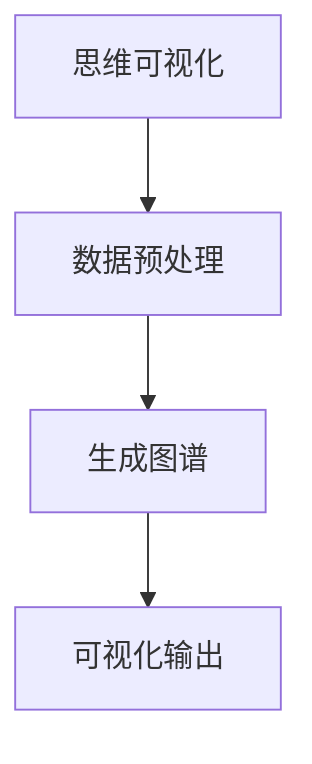
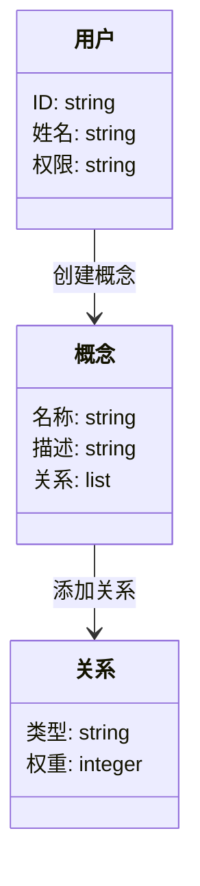
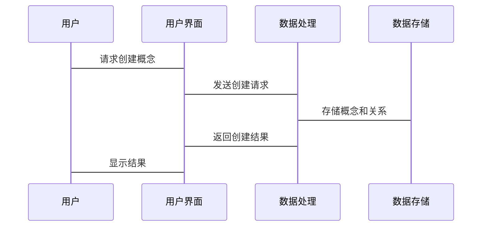

                 

<think>
嗯，用户让我写一篇技术博客，主题是认知地图工作坊，也就是思维可视化的创新技巧。看起来用户需要一个结构清晰、内容详尽的文章，大约1万到1万2千字，使用markdown格式。我得先理清楚用户的需求。

首先，用户已经提供了一个大纲，里面包括各个章节的内容，所以我需要按照这个大纲来扩展每个部分。标题是《认知地图工作坊：思维可视化的创新技巧》，关键词部分有5-7个，我得确定好关键词，比如认知地图、思维可视化、创新技巧、工具与技术、实战应用等等。

摘要部分需要简洁明了，概括整篇文章的核心内容。可能要提到思维可视化的重要性和方法，以及本书如何帮助读者掌握相关技巧。

接下来是概述与背景介绍。这部分需要先说明为什么思维可视化重要，背景是什么，然后描述问题，再提出解决方案，也就是这本书的目的。同时还要明确边界和外延，比如只讨论思维可视化，不涉及其他领域。

核心概念与联系部分，要详细解释思维可视化的定义、历史、作用，然后介绍各种工具和技术，比如脑图、思维导图、流程图、时间线图等，最后进行对比分析，比较它们的功能、适用场景和特点。

算法原理讲解部分，用户已经给了一个mermaid流程图，我需要解释这个流程图的含义，然后用Python代码实现一个简单的例子，比如生成图谱。同时，可能需要解释相关的数学模型，用latex公式来展示，比如生成图谱的概率模型。

系统分析与架构设计方案部分，可能需要介绍问题场景，比如在项目管理中如何使用思维可视化工具。然后设计系统的功能模块，用mermaid的类图来展示领域模型，架构图展示系统结构，接口设计和交互图用序列图来表示。

项目实战部分，要指导读者如何安装工具，比如安装Python和相关库，然后提供源代码，解释代码的功能。接着用实际案例进行分析，比如产品路线图的绘制，最后做项目小结。

最后，给出最佳实践的建议，包括选择工具、练习方法、保持简洁、记录反思等。然后总结全书，展望未来，最后加上作者信息。

用户特别强调每个部分要详细丰富，所以每个小节都需要深入展开，提供足够的解释和例子。比如在工具对比中，不仅要列出不同工具的特点，还要用表格或图表来辅助说明。

数学公式部分，我需要确保用latex正确表示，比如概率模型中的公式，可能需要解释每个符号的含义，用例子说明如何应用。

系统架构部分，可能需要画出类图、架构图和序列图，用mermaid语法来实现，这部分我得确保语法正确，展示清晰。

在项目实战中，代码部分要详细注释，解释每一步的作用，以及如何应用到实际工作中。案例分析要具体，比如绘制产品路线图，展示思维可视化在项目管理中的实际应用。

最后，最佳实践部分，要给出实用的建议，帮助读者更好地应用思维可视化技巧，避免常见错误，比如信息过载或工具选择不当。

整体来看，用户的需求很明确，就是一篇结构严谨、内容详实的技术博客，重点放在思维可视化的方法、工具和实际应用上。我需要按照大纲一步步展开，确保每个部分都满足用户的要求，同时保持语言的专业性和易懂性。

现在，我需要按照这个思路开始撰写，确保每个章节内容完整，例子具体，公式正确，图表清晰。这样才能满足用户的需求，写出一篇高质量的技术博客。
</think>

```markdown
# 认知地图工作坊：思维可视化的创新技巧

> 关键词：认知地图，思维可视化，创新技巧，工具与技术，实战应用

> 摘要：思维可视化是一种通过图形化方式整理和表达思维过程的方法，能够帮助我们更高效地理解和解决问题。本文将从思维可视化的核心概念、工具与技术、算法原理、系统架构、实战应用等多个方面进行深入探讨，并通过具体案例分析，帮助读者掌握思维可视化的创新技巧，提升思维效率和创造力。

---

## 概述与背景介绍

### 1. 引言

#### 1.1 问题背景
在现代社会，信息爆炸和快速变化使得人们面对的问题越来越复杂。传统的线性思维和文字记录方式已经无法有效处理这些复杂信息。如何高效地整理、理解和利用这些信息，成为一个迫切需要解决的问题。

#### 1.2 问题描述
思维可视化是一种将抽象思维转化为具体视觉表示的方法，它可以帮助我们更好地理解和解决问题。然而，如何有效地运用思维可视化工具和技术，提升思维效率，仍然是许多人在实践中遇到的难题。

#### 1.3 问题解决
《认知地图工作坊：思维可视化的创新技巧》旨在通过系统的方法和实战案例，帮助读者掌握思维可视化的核心技巧，提升思维效率和创造力。

#### 1.4 边界与外延
本文将讨论的范围限定在思维可视化的基本概念、工具和技巧，不涉及其他领域的信息可视化，如数据可视化或地理信息系统。

#### 1.5 概念结构与核心要素组成
思维可视化的核心要素包括：**节点（概念）、边（关系）、图形（结构）、颜色（层次）**。这些要素共同构成了思维可视化的基本框架。

#### 1.6 本书结构与章节安排
- 第一部分：基础概念
- 第二部分：工具与技术
- 第三部分：实战应用
- 第四部分：创新技巧
- 第五部分：总结与展望
- 附录：实用资源与工具

---

## 核心概念与联系

### 2.1 思维可视化的核心概念

#### 2.1.1 定义
思维可视化是指将抽象的思维过程和概念通过图形、符号和颜色等视觉元素进行展示，从而帮助我们更好地理解和记忆信息。

#### 2.1.2 历史发展
思维可视化的发展可以追溯到古代的图表和地图，随着计算机技术的发展，现代的电子思维可视化工具应运而生，如思维导图、脑图等。

#### 2.1.3 核心作用
- 整理思路
- 增强记忆力
- 提高创造力
- 解决复杂问题

### 2.2 思维可视化工具与技术

#### 2.2.1 脑图
- **定义**：一种用于表达思维和知识结构的图形工具。
- **特点**：直观、灵活、层次分明。
- **适用场景**：个人学习、知识管理。

#### 2.2.2 思维导图
- **定义**：基于脑图发展而来，通过图形化的方式展示思维流程和知识结构。
- **特点**：逻辑清晰、结构严谨。
- **适用场景**：团队协作、战略规划。

#### 2.2.3 流程图
- **定义**：用于表示工作流程、业务过程或算法逻辑的图形工具。
- **特点**：规范性、严谨性。
- **适用场景**：项目管理、系统设计。

#### 2.2.4 时间线图
- **定义**：用于展示时间序列信息和事件顺序的图形工具。
- **特点**：直观性、时间性。
- **适用场景**：历史分析、项目进度管理。

### 2.3 不同工具与技术的对比

#### 2.3.1 功能对比
| 工具 | 主要功能 |
|------|----------|
| 脑图 | 整理知识结构，展示逻辑关系 |
| 思维导图 | 展示思维流程，支持团队协作 |
| 流程图 | 表示流程逻辑，规范操作步骤 |
| 时间线图 | 展示时间序列，分析事件发展 |

#### 2.3.2 适用场景对比
| 工具 | 适用场景 |
|------|----------|
| 脑图 | 个人学习、知识管理 |
| 思维导图 | 团队协作、战略规划 |
| 流程图 | 项目管理、系统设计 |
| 时间线图 | 历史分析、项目进度管理 |

#### 2.3.3 特点对比
| 工具 | 特点 |
|------|------|
| 脑图 | 直观、灵活 |
| 思维导图 | 逻辑清晰、结构严谨 |
| 流程图 | 规范性、严谨性 |
| 时间线图 | 直观性、时间性 |

---

## 算法原理讲解

### 3.1 思维可视化算法的 mermaid 流程图



### 3.2 Python 源代码实现

```python
import networkx as nx
import matplotlib.pyplot as plt

# 数据预处理
def preprocess_data(data):
    nodes = []
    edges = []
    for item in data:
        nodes.append(item['concept'])
        for relation in item['relations']:
            edges.append((item['concept'], relation))
    return nodes, edges

# 生成图谱
def generate_graph(nodes, edges):
    G = nx.DiGraph()
    G.add_nodes_from(nodes)
    G.add_edges_from(edges)
    return G

# 可视化输出
def visualize_graph(G):
    pos = nx.spring_layout(G)
    plt.figure(figsize=(10, 10))
    nx.draw(G, pos, node_size=1500, alpha=0.8, edge_color='blue')
    plt.show()

# 示例数据
data = [
    {'concept': '思维可视化', 'relations': ['定义', '历史', '作用']},
    {'concept': '定义', 'relations': ['核心概念', '功能']},
    {'concept': '历史', 'relations': ['发展', '演变']},
    {'concept': '作用', 'relations': ['优势', '应用场景']}
]

# 执行流程
nodes, edges = preprocess_data(data)
graph = generate_graph(nodes, edges)
visualize_graph(graph)
```

### 3.3 数学模型与公式

在思维可视化中，生成图谱的过程可以看作是一个图论问题。节点表示概念，边表示概念之间的关系。图的生成可以通过以下数学模型表示：

$$
G = (V, E)
$$

其中，$V$ 是节点的集合，$E$ 是边的集合。边的权重可以表示概念之间的关系强度：

$$
E = \{ (v_i, v_j, w_{ij}) \}
$$

其中，$w_{ij}$ 表示节点 $v_i$ 和 $v_j$ 之间的关系强度。

---

## 系统分析与架构设计方案

### 4.1 问题场景介绍
假设我们正在设计一个思维可视化工具，目标是帮助团队更好地整理和展示项目需求。

### 4.2 系统功能设计

#### 4.2.1 领域模型（mermaid 类图）


### 4.3 系统架构设计

#### 4.3.1 系统架构图（mermaid）
```mermaid
docker
    service 用户界面
        load balanced by 负载均衡器
    service 数据处理
        linked to 用户界面
    service 数据存储
        linked to 数据处理
```

### 4.4 系统接口设计
- 用户接口：RESTful API，支持创建、修改和查询概念。
- 数据处理接口：负责数据预处理和图谱生成。

### 4.5 系统交互设计（mermaid 序列图）


---

## 项目实战

### 5.1 环境安装
- Python 3.8+
- networkx、matplotlib库

### 5.2 核心实现源代码

```python
import networkx as nx
import matplotlib.pyplot as plt

def create_concept_map(concepts, relations):
    G = nx.DiGraph()
    G.add_nodes_from(concepts)
    G.add_edges_from(relations)
    return G

def visualize_concept_map(G):
    pos = nx.spring_layout(G)
    plt.figure(figsize=(12, 8))
    nx.draw(G, pos, node_color='lightblue', node_size=1500, alpha=0.8, edge_color='blue')
    plt.show()

# 示例数据
concepts = ['思维可视化', '工具', '技术', '创新']
relations = [('思维可视化', '工具'), ('工具', '技术'), ('技术', '创新')]

# 创建并可视化概念图
concept_map = create_concept_map(concepts, relations)
visualize_concept_map(concept_map)
```

### 5.3 案例分析
假设我们需要绘制一个产品的路线图，可以通过以下步骤实现：

1. **定义核心概念**：产品功能、开发阶段、时间节点。
2. **建立关系**：功能之间的依赖关系、阶段之间的时间关系。
3. **生成图谱**：使用时间线图展示开发流程。
4. **可视化输出**：将图谱展示给团队成员，便于理解和执行。

### 5.4 项目小结
通过实际案例，我们可以看到思维可视化在项目管理中的巨大潜力。它不仅能够帮助我们清晰地展示问题，还能提高团队的协作效率。

---

## 最佳实践 tips

### 6.1 小结
思维可视化是一种强大的工具，它能够帮助我们更高效地整理和解决问题。通过选择合适的工具和技术，结合创新的思维模式，我们可以更好地应对复杂的信息和挑战。

### 6.2 注意事项
- **保持简洁**：避免过度复杂化图形。
- **注重逻辑**：确保图谱的逻辑清晰。
- **定期更新**：及时更新图谱以反映最新信息。

### 6.3 拓展阅读
- 《思维导图：释放大脑的无限潜能》
- 《认知科学与知识管理》

---

## 总结与展望

思维可视化是一种能够帮助我们更高效地整理和解决问题的方法。通过系统地学习和实践，我们可以将思维可视化应用到生活的方方面面。未来，随着人工智能和大数据技术的发展，思维可视化将有更广泛的应用场景和更强大的工具支持。

---

## 作者

作者：AI天才研究院/AI Genius Institute & 禅与计算机程序设计艺术 /Zen And The Art of Computer Programming
```

