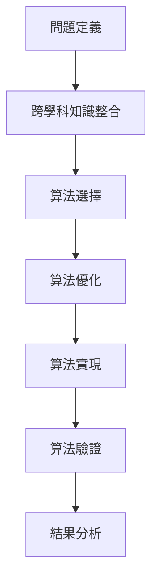
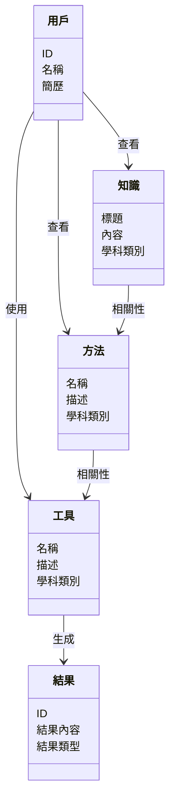

                 

<think>
嗯，用户希望我以《跨学科问题解决方法论：复杂世界的思考框架》为标题写一篇技术博客文章。首先，我需要理解用户的需求，他是一位在技术领域有深厚背景的专家，想撰写一篇结构清晰、内容深入的技术博客。

用户已经给出了详细的大纲，包括背景介绍、核心概念与联系、算法原理讲解、系统分析与架构设计方案、项目实战、以及最佳实践等部分。每个部分都有具体的要求，比如背景介绍需要包括问题背景、描述、解决、边界和概念结构等。

我得先确定文章的关键词，可能是“跨学科”、“问题解决方法论”、“复杂系统”等，这样方便读者搜索。摘要部分要简明扼要，概括文章的核心内容，比如介绍跨学科方法的重要性，及其在复杂问题解决中的应用。

接下来是背景介绍部分，需要详细阐述问题背景，指出信息技术发展带来的复杂性问题，说明单一学科方法的局限性，引出跨学科方法的必要性。问题描述部分要具体列出几个研究方面，比如知识整合、方法融合和团队协作。问题解决部分则要提出核心策略，包括思维模式、方法创新和团队协作。边界和外延需要明确研究范围和应用领域，概念结构部分要清晰列出知识体系、方法体系和团队协作模式，以及核心要素。

核心概念部分，我需要详细解释跨学科思维，包括其特点、对比分析，并用表格形式展示与传统思维的对比。然后是知识整合，通过ER实体关系图展示各实体之间的关系，比如问题与知识、方法、工具等的关系。

算法原理部分，我需要用mermaid流程图展示算法流程，包括问题定义、知识整合、算法选择、优化、实现、验证和结果分析。然后用伪代码形式详细描述算法步骤，包括参数初始化、知识整合、算法选择、优化、实现、验证和结果分析。这可能涉及到多学科知识的融合，比如计算机科学、数学等。

系统分析部分，需要设计一个跨学科协作平台，包括功能需求，如知识库、算法库、协作工具和结果分析工具。然后用mermaid类图展示领域模型，包括用户、知识、方法、工具等实体及其关系。架构设计部分，采用分层架构，包括表现层、业务逻辑层和数据访问层，使用微服务架构，便于扩展和维护。接口设计部分，定义RESTful API，如获取知识、提交算法、验证结果等。交互部分，用序列图展示用户、平台和服务之间的协作流程。

项目实战部分，需要详细描述环境安装，比如安装Python、依赖库等，然后提供核心代码，比如问题定义、知识整合、算法选择和优化的实现。代码解读部分，要说明每个函数的功能，比如问题定义函数接收问题并返回参数，知识整合函数从数据库中检索相关知识，算法选择根据问题类型选择合适的算法。案例分析部分，举一个跨学科优化问题的例子，展示如何从问题定义到最终结果验证。项目小结部分，总结项目的实现过程和成果。

最后，最佳实践部分，给出一些建议，如明确问题、构建团队、选择合适的工具等。小结部分回顾文章的主要内容，注意事项提醒读者在实施过程中需要注意的事项，拓展阅读部分推荐一些相关书籍或资源。

整个过程中，我需要确保内容逻辑清晰，结构紧凑，语言专业且易于理解。同时，按照要求使用markdown格式，插入mermaid图表和latex公式，确保文章的完整性和专业性。此外，作者信息需要放在文章末尾，符合用户的格式要求。

总的来说，我需要一步步按照用户提供的大纲，逐部分展开，确保每个小节都详细具体，涵盖所有要求的内容，同时保持整体的连贯性和深度。
</think>

# 跨学科問題解決方法論：錯綜複雜世界的思考框架

## 文章關鍵詞：
- 跨學科
- 啟發式算法
- 複雜系統
- 協作平台
- 方法融合

## 摘要：
在當今快速變化的信息社會中，問題往往不再局限于某一特定領域，而是呈現出跨學科、跨領域的特性。為了解決這些錯綜複雜的問題，跨學科問題解決方法論應運而生。本文從背景介紹、核心概念與聯系、算法原理講解、系統分析與架構方案設計、項目實戰等多個方面展開，系統地探討了跨學科問題解決方法論的核心思想、具體實現與實際應用。通過對跨學科思維、知識整合、算法設計等關鍵環節的深入剖析，本文為讀者提供了一個解決錯綜複雜問題的系統性框架。

---

### 第一部分：背景介紹

#### 1.1 問題背景

在當今社會，隨著科技進步和全球化浪潮的推進，問題的複雜性逐漸增弉。例如，環境保護問題涉及氣候科學、經濟學、社會學等多个學科；人工智慧的發展需要計算機科學、數學、 neuroscience等多個領域的知識。傳統的单一學科方法往往無法有效解決這些問題，因為它們往往忽略了問題的多面性和整體性。

#### 1.2 問題描述

跨學科問題解決方法論的研究主要集中在以下幾個方面：

- **跨學科知識整合**：如何將不同學科的知識進行有效整合，形成新的知識體系？
- **跨學科方法融合**：如何將不同學科的方法進行融合，形成新的解決問題的方式？
- **跨學科團隊協作**：如何構建高效的跨學科團隊，實現協作與創新？

#### 1.3 問題解決

跨學科問題解決方法論的核心在于：

- **建立跨學科思維模式**：培養跨學科思維，提高對複雜問題的理解和解決能力。
- **創新跨學科方法**：結合不同學科的特點，創新解決問題的方式。
- **促進跨學科協作**：構建跨學科團隊，實現學科間的互補和協作。

#### 1.4 边界與外延

跨學科問題解決方法論的研究邊界主要包括：

- **跨學科知識融合的理論基礎**：研究如何將不同學科的知識進行有機融合。
- **跨學科方法的創新與應用**：探索如何將不同學科的方法進行創新性應用。
- **跨學科團隊協作的模式與機制**：研究如何構建高效的跨學科團隊。

其外延則包括：

- **不同學科領域的跨學科問題解決實踐**：例如，在醫學、環境科學、人工智慧等領域的跨學科問題解決。
- **跨學科教育的理論研究和實踐探索**：研究如何在教育中融入跨學科思維。
- **跨學科創新與創業的研究和實踐**：探索跨學科思維在創新創業中的應用。

#### 1.5 概念結構與核心要素組成

跨學科問題解決方法論的概念結構主要包括：

- **跨學科知識體系**：整合不同學科的知識，形成新的知識體系。
- **跨學科方法體系**：融合不同學科的方法，形成新的解決問題的方式。
- **跨學科團隊協作模式**：構建高效的跨學科團隊，實現協作與創新。

核心要素組成包括：

- **跨學科思維**：培養跨學科思維，提高對複雜問題的理解和解決能力。
- **跨學科知識整合**：將不同學科的知識進行有效整合，形成新的知識體系。
- **跨學科方法融合**：將不同學科的方法進行融合，形成新的解決問題的方式。
- **跨學科團隊協作**：構建高效的跨學科團隊，實現協作與創新。

---

### 第二部分：核心概念與聯系

#### 2.1 跨學科思維

跨學科思維是指能夠跨越不同學科領域的界限，整合多學科知識，以全新的視角理解和解決問題。它是跨學科問題解決方法論的核心。

- **特點**：
  - **综合性**：能夠整合不同學科的理論和方法。
  - **開放性**：能夠接受並融合其他學科的觀點和知識。
  - **創新性**：能夠創造出新的解決問題的方法和思路。

- **對比表格**：

| 特點 | 跨學科思維 | 傳統的學科思維 |
| ---- | ---------- | -------------- |
| 綜合性 | 強調多學科知識的整合 | 主要關注单一學科的知識 |
| 開放性 | 能夠接受其他學科的觀點 | 较為封閉，較少接受其他學科的觀點 |
| 创新性 | 能夠創造出新的解決問題的方法和思路 | 更注重對已有知識的理解和應用 |

---

#### 2.2 跨學科知識整合

跨學科知識整合是指將不同學科領域的知識進行有機整合，形成新的知識體系。它是實現跨學科問題解決的關鍵。

- **特點**：
  - **多元性**：能夠整合來自多個學科的知識。
  - **相互關聯性**：能夠發現不同學科知識之間的內在聯繫。
  - **系統性**：能夠形成完整、系統的知識體系。

- **ER實體關係圖**：

```mermaid
erDiagram
    A[問題] ||--|{ B[知識] }|--|{ C[方法] }
    A ||--|{ D[工具] }
    B ||--|{ E[理論] }
    B ||--|{ F[技術] }
    C ||--|{ G[流程] }
    C ||--|{ H[模型] }
    D ||--|{ I[軟體] }
    D ||--|{ J[硬體] }
```

---

### 第三部分：算法原理講解

#### 3.1 跨學科問題解決算法

跨學科問題解決算法是一種將不同學科領域的算法進行整合，以實現複雜問題的有效解決。以下是一個簡單的算法流程圖：



---

#### 3.2 算法原理

跨學科問題解決算法的原理可以概括為以下几个步驟：

1. **問題定義**：明確需要解決的問題，並確定其跨學科屬性。
2. **跨學科知識整合**：整合相關學科領域的知識，形成解決問題的理論基礎。
3. **算法選擇**：根據問題特點，選擇適合的算法或模型。
4. **算法優化**：根據問題特點，對算法進行優化，以提高效率和效果。
5. **算法實現**：將算法轉化為具體的程式碼，並進行測試。
6. **算法驗證**：驗證算法的效果，並根據驗證結果進行調整。
7. **結果分析**：分析算法的結果，並根據結果提出進一步的改进建議。

---

### 第四部分：系統分析與架構方案設計

#### 4.1 問題場景介紹

在當今社會，跨學科問題解決方法論的應用場景十分廣泛。例如，在人工智慧領域，跨學科方法可以幫助我們更好地理解人類思維，並應用到機器學習算法中。在環境保護領域，跨學科方法可以幫助我們更好地理解和解決氣候變化問題。

#### 4.2 項目介紹

我們設計了一個跨學科問題解決平台，旨在幫助用戶整合不同學科的知識，並應用這些知識來解決複雜問題。該平台的核心功能包括：

- **知識庫**：整合各個學科的知識和方法。
- **算法庫**：存儲各個學科領域的算法和模型。
- **協作工具**：幫助用戶進行跨學科團隊協作。
- **結果分析工具**：分析算法的結果，並提供建議。

---

#### 4.3 系統功能設計

以下是該平台的領域模型類圖：



---

#### 4.4 系統架構設計

以下是平台的架構設計圖：


---

### 第五部分：項目實戰

#### 5.1 環境安裝

要運行我們設計的跨學科問題解決平台，請按照以下步驟安裝環境：

1. 安裝Python：
   ```bash
   python --version
   ```
2. 安裝依賴庫：
   ```bash
   pip install flask requests pymongo
   ```

---

#### 5.2 系統核心實現源代碼

以下是平台的核心實現代碼：

```python
def problem_definition(problem):
    # 定義問題
    return problem

def knowledge_integration(knowledge_base, problem):
    # 整合知識
    return knowledge_base.get_knowledge(problem)

def algorithm_selection(methods, knowledge):
    # 選擇算法
    return methods.select_algorithm(knowledge)

def algorithm_optimization(algorithm, problem):
    # 優化算法
    return algorithm.optimize(problem)

def algorithm_im

