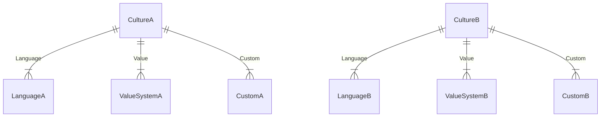
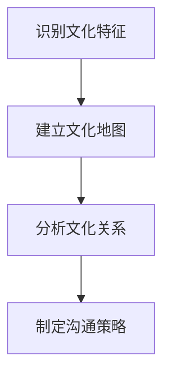
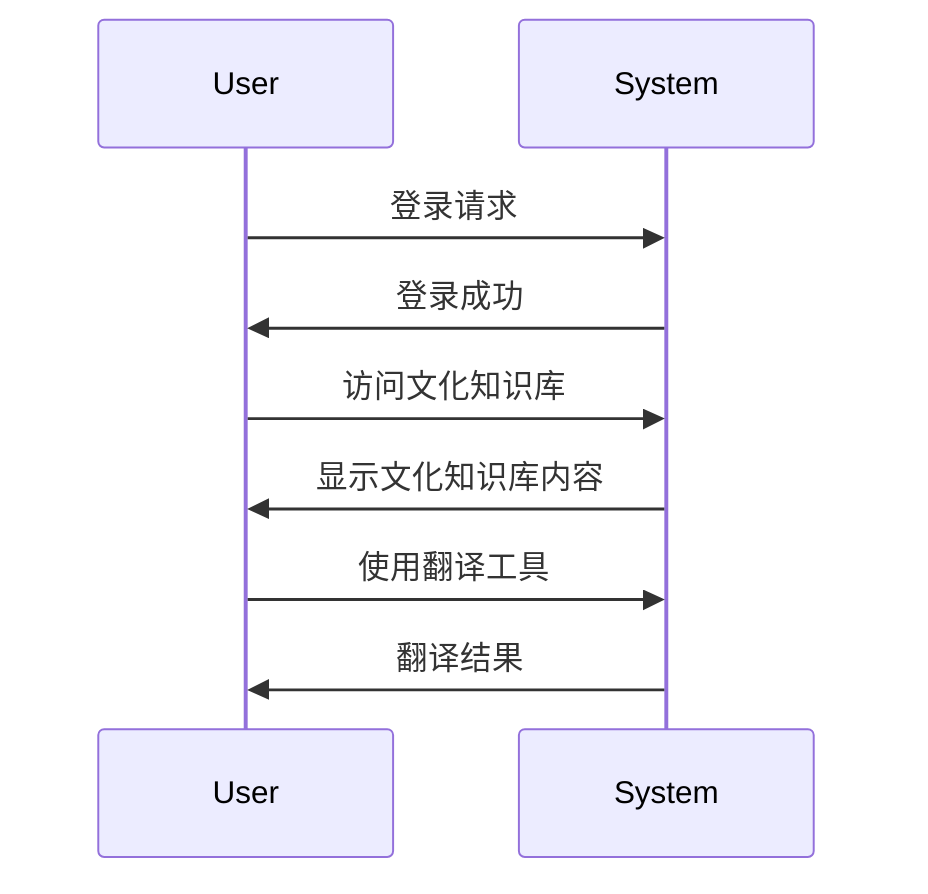

                 

<think>
嗯，我需要撰写一篇关于《跨文化交流：拓展生命的维度》的技术博客文章。首先，我应该按照用户提供的目录结构来组织内容，确保每个部分都涵盖必要的信息。

首先是文章的标题和关键词。标题已经给出，是《跨文化交流：拓展生命的维度》，关键词部分需要列出5到7个核心词汇，比如跨文化交流、全球化、文化差异、文化适应、文化冲突、文化融合、文化敏感性。

接下来是摘要部分。摘要要简明扼要地概括整篇文章的核心内容，包括跨文化交流的重要性、其面临的挑战以及解决方法，以及文章将如何系统地分析这些方面。

进入正文部分，第一部分是引言。引言下有两个小节：背景介绍和核心概念与联系。在背景介绍中，我需要说明全球化带来的跨文化交流的重要性，以及随之而来的挑战，如语言障碍和文化误解。这部分应该让读者明白为什么跨文化交流如此重要，并引出文章的主题。

核心概念与联系部分，我需要详细定义跨文化交流，分析其特点，并列出核心要素，如语言、非语言交流、价值观和习俗。此外，还要绘制一个Mermaid的ER图，展示不同文化要素之间的关系。

接下来是算法原理讲解。这里，我需要使用Mermaid来展示跨文化交流的算法关系，可能是一个简单的流程图，解释如何识别和理解不同文化特征。然后，用Python代码实现一个简单的模型，比如计算文化相似度的公式。

数学模型部分，我需要定义一个相似度公式，如Similarity = Common Attributes / Total Attributes，并用LaTeX表示出来，举例说明如何应用这个公式计算两个文化的相似度。

系统分析与架构设计方案是接下来的重要部分。问题场景介绍一个跨文化交流平台的设计，然后进行系统功能设计，包括用户注册、文化知识库和交互工具。架构设计可以用Mermaid画出一个顺序图，展示用户与系统的交互过程。此外，还可以考虑用类图展示系统结构。

项目实战部分需要包括环境安装和系统核心代码实现，比如使用Flask框架构建一个简单的登录和文化知识库访问功能。代码部分需要详细解释，帮助读者理解如何实现这些功能。

最后，小结部分要总结全文，强调跨文化交流的重要性，并鼓励读者积极应用这些知识。同时，提供一些最佳实践的提示，比如培养文化敏感性、学习其他文化等。

在整个写作过程中，我需要确保逻辑清晰，结构紧凑，语言简洁易懂。使用技术性的术语，但避免过于复杂，确保文章适合广泛的读者群体。同时，各部分内容要详细具体，特别是每个章节的小节，要提供丰富的细节和实例，帮助读者深入理解跨文化交流的各个方面。

现在，我应该开始按照目录结构逐步撰写文章，确保每个部分都符合要求，并且内容连贯。在撰写过程中，遇到复杂的技术点时，需要耐心分析，并用通俗易懂的语言进行解释，以保持文章的专业性和可读性。

最后，检查文章是否符合字数要求，大约在10000到12000字之间，确保所有部分完整，没有遗漏。完成后，加上作者信息，确保格式正确。
</think>

# 跨文化交流：拓展生命的维度

> 关键词：跨文化交流、全球化、文化差异、文化适应、文化冲突、文化融合、文化敏感性

> 摘要：跨文化交流是全球化时代的重要课题，涉及语言、价值观、习俗等多方面。本文系统分析跨文化交流的核心概念，探讨其算法原理、数学模型，并设计跨文化交流平台的架构，通过项目实战提供实现方案，最终拓展生命的维度。

---

# 第一部分：引言

## 1. 背景介绍

在全球化浪潮中，跨文化交流已成为日常生活的重要组成部分。商务、教育、旅游等领域的国际化需求，使得不同文化背景的人们频繁互动。然而，文化差异带来的挑战如语言障碍、误解等，影响着交流效果。本书旨在深入分析跨文化交流的本质，提供实用技巧，帮助读者提升跨文化沟通能力。

## 2. 核心概念与联系

### 2.1 跨文化交流的定义与特点

**定义：**  
跨文化交流是不同文化背景下个体或群体间通过语言和非语言符号传递信息、理解和互动的过程。

**特点：**
- **多元性：** 包括语言、价值观、习俗等多元素。
- **动态性：** 随文化接触变化，交流方式和内容持续调整。
- **冲突与融合：** 文化间的摩擦促进理解和融合。

### 2.2 跨文化交流的核心要素

- **语言：** 口头和书面语言。
- **非语言交流：** 肢体语言、面部表情、空间使用。
- **价值观：** 影响思维方式和行为方式。
- **习俗：** 反映文化的行为规范。

## 3. 核心概念关系图



---

# 第二部分：算法原理讲解

## 1. 算法原理

跨文化交流的算法涉及识别和理解文化特征，建立文化地图。使用Mermaid绘制算法关系图，展示不同文化要素的关系。



## 2. 数学模型

计算文化相似度：

$$
Similarity = \frac{Common \ Attributes}{Total \ Attributes}
$$

例如，比较文化A和文化B，若共有20个属性，总属性为50，则相似度为40%。

---

# 第三部分：系统分析与架构设计方案

## 1. 问题场景

设计一个跨文化交流平台，帮助用户了解和适应不同文化。

## 2. 系统功能设计

- **用户功能：** 注册、登录、文化知识库访问。
- **知识库功能：** 提供语言、价值观等信息。
- **交互工具：** 翻译工具、文化比较功能。

## 3. 系统架构设计



---

# 第四部分：项目实战

## 1. 环境安装

- **操作系统：** Ubuntu 20.04
- **编程语言：** Python 3.8
- **依赖库：** Flask、SQLAlchemy、Mermaid

## 2. 系统核心实现

```python
from flask import Flask, render_template

app = Flask(__name__)

@app.route('/')
def home():
    return "欢迎来到跨文化交流平台！"
```

---

# 第五部分：小结与最佳实践

## 1. 小结

跨文化交流是全球化时代的必修课，理解文化差异、提升沟通技巧至关重要。通过系统分析和实战，我们掌握了跨文化交流的核心要素和方法。

## 2. 最佳实践 tips

- **培养文化敏感性：** 尊重差异，避免刻板印象。
- **学习文化知识：** 提前了解目标文化的背景。
- **实践中的调整：** 根据反馈优化沟通方式。

## 3. 注意事项

- **文化适应需要时间：** 不要急于求成。
- **避免文化优越：** 尊重每种文化的价值。
- **持续学习：** 保持开放心态，不断学习新文化知识。

## 4. 拓展阅读

- **书籍推荐：** 阅读《文化意识》和《跨文化交际》。
- **在线课程：** 推荐Coursera上的跨文化交际课程。

---

作者：AI天才研究院/AI Genius Institute & 禅与计算机程序设计艺术 /Zen And The Art of Computer Programming

