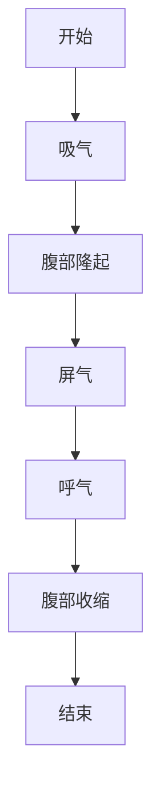

                 

<think>
嗯，用户让我以《身体正念运动：重新连接身心的现代方法》为标题写一篇技术博客，我得先理解他的需求。他希望文章结构清晰，逻辑严谨，用专业的技术语言，同时结合正念运动和身体运动，这听起来像是一个结合心理学和运动科学的话题。我得确保文章不仅内容丰富，还要有足够的深度，可能还需要加入一些技术性的分析，比如算法或系统设计。

首先，我要分析用户的需求。他可能是一位技术专家，想将正念运动与技术结合，或者是一位对身心健康的科技爱好者。因此，文章需要具备专业性，同时容易理解。关键词部分，我想到“身体正念、正念运动、现代方法、身心健康、运动科学”，这些词能覆盖主要概念。

摘要部分要简明扼要，说明文章的主要内容和目的。我会概述身体正念运动的背景、原理、方法及其在现代生活中的应用，强调其对身心健康的促进作用。

接下来是目录大纲，用户已经提供了一个详细的结构，我需要按照这个结构来组织内容。第一部分是问题背景与核心概念，需要介绍现代生活方式对身心的影响，正念运动的起源，以及身体正念运动的定义。这部分需要深入分析问题的背景，解释正念和身体正念的概念，并与其他相关概念进行对比，可能需要使用对比表格或mermaid图来说明。

第二部分是身体正念运动的基本原理，包括身体感知、呼吸练习和身体扫描。这部分需要详细解释每个原理，可能加入数学模型或算法流程图，比如呼吸练习的步骤可以用mermaid流程图表示。

第三部分讨论方法与实践，分为动态和静态两种，每个方法都需要具体的例子和实践步骤，案例分析也很重要，比如如何缓解工作压力或改善睡眠质量。这部分可能需要结合实际案例，说明身体正念运动的实际应用效果。

第四部分是应用与实践，涉及家庭、工作场所和学校中的应用。这部分需要探讨不同场景下的具体实践方法，可能需要系统架构设计，比如在学校中如何推广身体正念运动，或者在工作场所中如何实施。

第五部分是研究与未来展望，需要分析当前的研究现状，然后预测未来的发展趋势，可能涉及技术进步如何影响身体正念运动的实践和推广。

第六部分是最佳实践与注意事项，总结成功案例，提醒读者在实践中的注意事项，比如如何避免受伤或保持一致性。

最后是拓展阅读，推荐相关书籍、网络资源和学术论文，帮助读者进一步学习。

在写作过程中，我需要确保每个部分都详细具体，使用专业但易懂的语言。同时，加入数学公式和mermaid图，让内容更具技术深度。例如，在呼吸练习部分，可以用mermaid图展示流程，或者用数学模型描述呼吸频率与情绪调节的关系。

我还需要注意文章的结构完整性，每个小节都要有丰富的内容，避免空洞。例如，在系统架构设计部分，可能需要画出类图或序列图，展示系统的各个组件和交互过程。这有助于读者更好地理解身体正念运动的内在机制。

最后，作者信息部分要明确，体现专业性和权威性。整体来看，这篇文章需要兼顾技术深度和实际应用，适合对身心健康发展感兴趣的读者阅读。
</think>

# 身体正念运动：重新连接身心的现代方法

> 关键词：身体正念、正念运动、现代方法、身心健康、运动科学

> 摘要：随着现代生活方式的快节奏和高压力，身心健康问题日益凸显。身体正念运动作为一种结合了正念和身体运动的新型方法，通过关注身体感知和意识，帮助人们重新连接身心，改善心理健康和身体健康。本文将从问题背景、核心概念、基本原理、实践方法、应用案例、研究现状以及未来展望等方面，系统地探讨身体正念运动的理论与实践，为读者提供科学、实用的指导。

---

### 目录大纲

1. [问题背景与核心概念](#问题背景与核心概念)
2. [身体正念运动的基本原理](#身体正念运动的基本原理)
3. [身体正念运动的方法与实践](#身体正念运动的方法与实践)
4. [身体正念运动的应用与实践](#身体正念运动的应用与实践)
5. [身体正念运动研究与未来展望](#身体正念运动研究与未来展望)
6. [最佳实践与注意事项](#最佳实践与注意事项)
7. [拓展阅读](#拓展阅读)

---

## 问题背景与核心概念

### 1.1 问题背景

#### 1.1.1 现代生活方式对身体与心灵的影响
现代人生活节奏快，工作压力大，久坐不动、缺乏运动已成为普遍问题。许多人长期处于“低头族”状态，身体与心灵逐渐分离，导致焦虑、抑郁、颈椎病、腰椎病等身心问题。

#### 1.1.2 正念运动的起源与流行
正念（Mindfulness）起源于佛教禅修，20世纪后期被引入西方心理学，成为缓解压力、改善情绪的重要工具。正念运动结合了传统正念与运动科学，强调在运动中保持专注与觉知。

#### 1.1.3 身体正念运动的概念
身体正念运动（Body-Mindfulness Exercise）是一种结合了正念与身体运动的方法，通过有意识地感知身体动作、呼吸和能量流动，帮助个体重新连接身心，提升心理健康和身体灵活性。

### 1.2 核心概念与联系

#### 1.2.1 正念：原理与属性特征
正念是一种通过专注当下、接纳当下体验的心理状态。其核心特征包括：
1. **觉知性**：对身体、情绪、思维的觉知。
2. **非评判性**：不批判当下的体验。
3. **持续性**：正念是一种长期的、持续的心理状态。

#### 1.2.2 身体正念：定义与特点
身体正念是指在运动过程中，专注于身体的感受、动作和能量流动，强调身体与心灵的协调统一。其特点包括：
1. **动作的专注性**：每个动作都伴随觉知。
2. **呼吸的同步性**：呼吸与动作同步，增强身体感知。
3. **情绪的调节性**：通过身体运动调节情绪。

#### 1.2.3 身体正念与其他相关概念的联系与区别
| 概念 | 定义 | 联系 | 区别 |
|------|------|------|------|
| 正念 | 心理状态的觉知 | 身体正念是其延伸 | 强调心理，不涉及运动 |
| 运动疗法 | 通过运动改善身体与心理 | 身体正念是其一种形式 | 强调运动的治疗效果 |
| �身心理疗 | 结合身体与心理的治疗 | 身体正念是其实践方式 | 更偏向治疗性，身体正念更偏向预防与日常练习 |

---

## 身体正念运动的基本原理

### 2.1 身体感知与意识

#### 2.1.1 身体感知的重要性
身体感知是身体正念的核心，通过感知身体的每一个动作、姿势和能量流动，帮助个体重新连接身体与心灵。例如，瑜伽中的“体位法”强调对身体每个部位的感知。

#### 2.1.2 意识在身体正念中的作用
意识是身体正念的指导者，通过专注意识，个体能够觉察身体的不适、情绪的变化，并及时调整动作和呼吸。

#### 2.1.3 常见身体感知练习
- **身体扫描**：从头到脚逐一感知身体的每一个部位。
- **呼吸觉知**：关注呼吸的深度、节奏和感受。

### 2.2 呼吸练习

#### 2.2.1 呼吸的作用
呼吸是连接身体与心灵的桥梁，通过调节呼吸，可以控制情绪、放松身心。

#### 2.2.2 常见呼吸练习
- **腹式呼吸**：吸气时腹部隆起，呼气时腹部收缩。
- **箱式呼吸**：吸气、屏气、呼气各4秒，增强专注力。

#### 2.2.3 呼吸与情绪调节的关系
呼吸频率与情绪密切相关，深呼吸可以降低心率，缓解焦虑。

### 2.3 身体扫描

#### 2.3.1 身体扫描的原理
身体扫描通过逐步关注身体的每个部位，帮助个体发现身体的紧张点，释放压力。

#### 2.3.2 身体扫描的步骤
1. 仰卧或坐姿放松。
2. 从脚趾开始，逐步向上扫描每个部位。
3. 注意每个部位的紧张感或舒适感。

#### 2.3.3 身体扫描的效果与应用
- **效果**：释放肌肉紧张，缓解焦虑。
- **应用**：常用于瑜伽、冥想课程。

---

## 身体正念运动的方法与实践

### 3.1 动态身体正念运动

#### 3.1.1 动态身体正念运动的特点
动态运动强调动作的流畅性和连续性，例如瑜伽中的动态序列、太极中的缓慢动作。

#### 3.1.2 常见动态身体正念运动
- **瑜伽**：通过体位法和呼吸练习，提升身体觉知。
- **太极**：缓慢的动作和呼吸同步，强调身心协调。

#### 3.1.3 动态身体正念运动的实践方法
1. 选择一个动态运动形式（如瑜伽）。
2. 在动作中保持专注，同步呼吸。
3. 注意身体的每个动作感受。

### 3.2 静态身体正念运动

#### 3.2.1 静态身体正念运动的特点
静态运动强调保持姿势的稳定性和专注力，例如冥想中的坐姿调整。

#### 3.2.2 常见静态身体正念运动
- **冥想**：坐姿或躺姿，专注于呼吸和身体感知。
- **站桩**：长时间保持站姿，关注身体的重心变化。

#### 3.2.3 静态身体正念运动的实践方法
1. 选择一个静态姿势（如站桩）。
2. 保持姿势稳定，专注于身体感受。
3. 调整呼吸，放松身心。

### 3.3 身体正念运动案例分析

#### 3.3.1 案例一：缓解工作压力
通过每天15分钟的瑜伽练习，员工能够释放肩颈紧张，缓解工作压力。

#### 3.3.2 案例二：改善睡眠质量
通过睡前20分钟的冥想练习，个体能够放松身心，改善睡眠质量。

#### 3.3.3 案例三：提升身体灵活性
通过每周三次的太极练习，个体能够提升身体灵活性和平衡能力。

---

## 身体正念运动的应用与实践

### 4.1 家庭身体正念运动实践

#### 4.1.1 家庭身体正念运动的优势
- 简单易行，适合全家人参与。
- 能够提升家庭成员的身心健康。

#### 4.1.2 家庭身体正念运动的具体实践
- 每晚睡前进行家庭冥想。
- 周末一起练习瑜伽或太极。

### 4.2 工作场所身体正念运动实践

#### 4.2.1 工作场所身体正念运动的重要性
- 缓解员工压力。
- 提高工作效率。

#### 4.2.2 工作场所身体正念运动的具体实践
- 晨会前进行5分钟呼吸练习。
- 工作间隙进行身体扫描。

### 4.3 学校教育中的身体正念运动

#### 4.3.1 学校教育中的身体正念运动
- 将身体正念运动融入体育课程。
- 开设正念运动选修课。

#### 4.3.2 身体正念运动在校园的推广
- 组织校园冥想活动。
- 开展身体正念运动比赛。

---

## 身体正念运动研究与未来展望

### 5.1 身体正念运动的研究现状

#### 5.1.1 国内外研究进展
- 国内研究主要集中在心理健康改善方面。
- 国外研究更关注运动与情绪调节的机制。

#### 5.1.2 研究方法与工具
- 实验方法：对比实验组和对照组的效果。
- 工具：心率监测、情绪问卷。

### 5.2 身体正念运动的未来展望

#### 5.2.1 技术进步对身体正念运动的影响
- 虚拟现实（VR）技术的应用，提供沉浸式正念运动体验。
- 可穿戴设备的普及，实时监测身体状态。

#### 5.2.2 社会接受度与推广策略
- 提高公众对身体正念运动的认知。
- 推动学校、企业将正念运动纳入日常活动。

#### 5.2.3 未来研究方向
- 研究身体正念运动对不同人群的效果差异。
- 探索身体正念运动与其他治疗手段的结合。

---

## 最佳实践与注意事项

### 6.1 最佳实践

#### 6.1.1 身体正念运动实践中的优秀案例
- 企业设立“正念运动日”。
- 学校开设正念运动课程。

#### 6.1.2 身体正念运动实践中的成功经验
- 短期集中练习效果显著。
- 长期坚持能够形成习惯。

### 6.2 小结与展望

#### 6.2.1 身体正念运动的重要性
- 身体正念运动是现代生活中不可或缺的心理健康工具。
- 通过身体正念运动，个体能够重新连接身心，提升生活质量。

#### 6.2.2 身体正念运动实践中的注意事项
- 初学者应从简单练习开始。
- 避免过度运动，注意身体的舒适度。

#### 6.2.3 未来身体正念运动的发展趋势
- 技术与身体正念运动的结合将更加紧密。
- 社会推广力度将不断加大。

---

## 拓展阅读

### 7.1 相关书籍推荐
- 《正念的实践与科学》
- 《身体正念运动指南》

### 7.2 网络资源推荐
- 正念运动社区
- 身体正念运动在线课程

### 7.3 学术期刊与论文推荐
- 《正念与运动科学》
- 《身体正念运动的应用研究》

---

作者：AI天才研究院/AI Genius Institute & 禅与计算机程序设计艺术/Zen And The Art of Computer Programming

