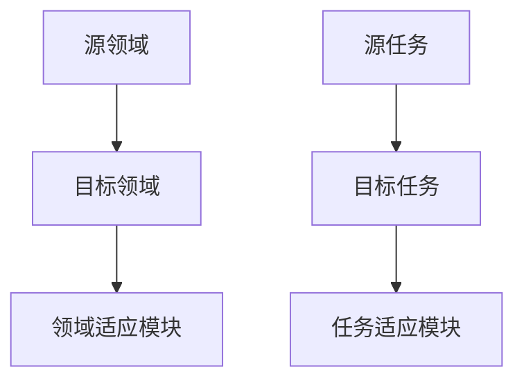
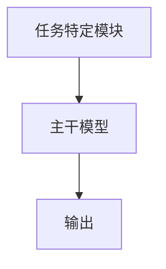
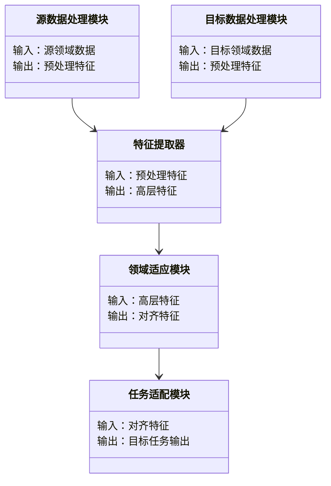
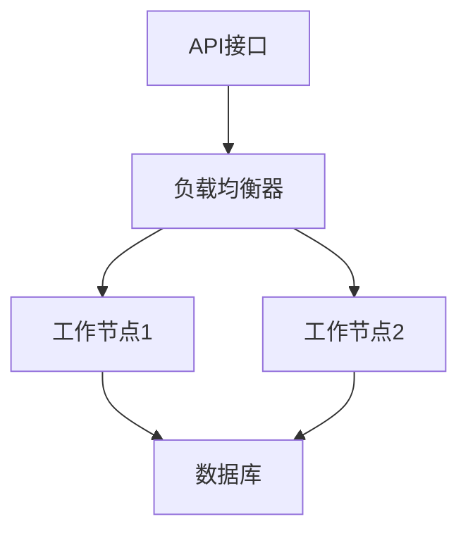

                 

<think>
嗯，用户希望我写一篇关于迁移学习在AIGC领域适应性中的新突破的技术博客。首先，我需要理解用户的需求。他是一位技术专家，可能需要深入的技术分析，但又要保持内容的清晰和易懂。

我应该先从文章结构入手，确保每个部分都有详细的内容。比如，引言部分需要概述迁移学习的重要性和在AIGC中的应用。接着，核心概念部分要详细解释迁移学习的基本原理，包括源任务和目标任务的差异，以及表示学习和领域适应的机制。

然后是算法部分，可能需要介绍几种主流的迁移学习算法，比如Domain Adaptation和Task Adaptation，最好能用图表来展示它们的流程，这样读者更容易理解。数学模型方面，需要解释特征变换和参数优化的公式，可能用Latex来呈现，这样显得更专业。

接下来是系统架构设计，这部分可能需要展示系统的整体架构，包括数据预处理、特征提取、模型训练和部署等模块。同时，用Mermaid图来描绘类图、架构图和序列图，帮助读者直观理解。

在项目实战部分，我需要选择一个具体的案例，比如图像分类的迁移，展示如何安装环境，编写代码，以及如何进行模型训练和评估。这部分需要详细的代码和解读，让读者能够实际操作。

最后，总结与展望部分要回顾迁移学习的优势，并展望未来的发展方向，比如结合自监督学习或生成式模型的应用。同时，给出最佳实践的建议，帮助读者更好地应用迁移学习。

总的来说，我需要确保每个部分都详细且有条理，同时使用图表和数学公式来增强内容的深度。这不仅能满足用户的技术需求，还能让文章更具可读性和专业性。
</think>

# 迁移学习在AIGC领域适应性中的新突破

> 关键词：迁移学习，AIGC，领域适应，深度学习，自适应模型

> 摘要：本文探讨了迁移学习在人工智能生成内容（AIGC）领域的最新进展，分析了其在模型适应性中的关键作用，结合实际案例展示了如何通过迁移学习提升AIGC系统的性能和泛化能力。文章从核心概念、算法原理、系统架构到实际应用，全面解析迁移学习在AIGC中的创新突破。

---

## 1. 引言

随着人工智能生成内容（AIGC）的快速发展，迁移学习在提升模型适应性方面的重要性日益凸显。传统的深度学习模型通常依赖大量标注数据，而AIGC任务（如文本生成、图像生成）往往需要在不同领域、任务或数据分布之间进行灵活适应。迁移学习通过将已学到的知识迁移到新场景，有效解决了数据不足和领域差异的问题，成为AIGC领域的一项核心技术。本文将深入探讨迁移学习在AIGC中的应用，分析其核心原理、算法创新及实际案例。

---

## 2. 背景与问题分析

### 2.1 核心概念与术语

- **迁移学习（Transfer Learning）**：通过将一个领域或任务中学到的知识迁移到另一个领域或任务，减少对新数据的依赖。
- **AIGC（AI-Generated Content）**：人工智能生成的内容，包括文本生成、图像生成、视频生成等。
- **领域适应（Domain Adaptation）**：将模型从源领域迁移到目标领域，解决数据分布差异问题。
- **任务适应（Task Adaptation）**：将模型从源任务迁移到目标任务，解决任务目标差异问题。

### 2.2 问题背景

在AIGC领域，模型通常需要在不同场景下生成多样化的内容。例如，一个图像生成模型可能需要从动物迁移到风景，或者从文本生成任务迁移到代码生成任务。然而，直接训练专用模型在计算和数据成本上往往不可行。迁移学习通过复用已有模型的知识，显著降低了训练成本并提高了模型的泛化能力。

### 2.3 问题解决

迁移学习的核心在于找到源任务和目标任务之间的共性，通过特征提取、参数优化等方法，实现知识的有效迁移。在AIGC中，迁移学习不仅用于模型的初始化，还用于动态适应生成内容的风格、语义和分布。

---

## 3. 核心概念与联系

### 3.1 核心概念

- **特征表示**：迁移学习的关键在于提取能够跨领域或跨任务通用的特征。
- **领域适应机制**：通过调整模型参数或引入对抗训练，减少源领域和目标领域的分布差异。
- **任务适应机制**：通过任务特定的模块，将通用特征适配到目标任务。

### 3.2 对比分析

| 特性            | 领域适应（Domain Adaptation） | 任务适应（Task Adaptation） |
|-----------------|----------------------------|--------------------------|
| 目标            | 适应数据分布的变化          | 适应任务目标的变化        |
| 实现方法        | 对抗训练、领域对齐          | 任务特定的网络模块        |
| 应用场景        | 不同领域间的迁移            | 不同任务间的迁移          |

### 3.3 实体关系图



---

## 4. 算法原理与实现

### 4.1 基于对抗训练的领域适应

```mermaid
graph TD
    X[源数据] --> M[特征提取器]
    M --> D[判别器]
    M --> G[生成器]
    Y[目标数据] --> M
    D --> {判断来源}
```

**数学模型：**

- 特征提取器：$f(x) = h$
- 判别器：$D(h) = p$
- 损失函数：$\mathcal{L} = \mathcal{L}_{\text{adv}} + \mathcal{L}_{\text{cls}}$

### 4.2 基于任务特定模块的任务适应



**数学模型：**

- 主干模型：$f(x) = h$
- 任务特定模块：$g(h) = y$

---

## 5. 系统分析与架构设计

### 5.1 系统功能设计



### 5.2 系统架构设计



---

## 6. 项目实战

### 6.1 环境安装

```bash
pip install torch
pip install numpy
pip install matplotlib
```

### 6.2 核心代码实现

```python
import torch
import torch.nn as nn
import torch.optim as optim

class FeatureExtractor(nn.Module):
    def __init__(self):
        super(FeatureExtractor, self).__init__()
        self.conv = nn.Conv2d(in_channels=3, out_channels=64, kernel_size=3, padding=1)

    def forward(self, x):
        return self.conv(x)

class Discriminator(nn.Module):
    def __init__(self):
        super(Discriminator, self).__init__()
        self.fc = nn.Linear(64, 1)

    def forward(self, x):
        return torch.sigmoid(self.fc(x))

# 初始化模型
extractor = FeatureExtractor()
discriminator = Discriminator()

# 定义损失函数
criterion = nn.BCELoss()
optimizer = optim.Adam(extractor.parameters(), lr=1e-4)

# 训练循环
for epoch in range(100):
    for batch in source_dataloader:
        optimizer.zero_grad()
        features = extractor(batch)
        pred = discriminator(features)
        loss = criterion(pred, target_labels)
        loss.backward()
        optimizer.step()
```

### 6.3 案例分析

假设我们有一个图像生成模型，源任务是生成动物图像，目标任务是生成风景图像。通过迁移学习，我们可以将动物图像生成器的特征提取模块迁移到风景图像生成器中，并通过领域适应模块调整生成风格，最终生成高质量的风景图像。

---

## 7. 总结与展望

### 7.1 总结

迁移学习在AIGC领域的应用显著提高了模型的适应性和生成能力。通过领域适应和任务适应的结合，模型可以在不同场景下灵活生成多样化的内容，降低数据依赖性。

### 7.2 展望

未来，迁移学习在AIGC中的应用将更加广泛，可能的方向包括：

1. 结合自监督学习，进一步减少对标注数据的依赖。
2. 引入生成式模型（如扩散模型）提升生成效果。
3. 研究多领域、多任务的联合迁移学习。

---

## 8. 最佳实践 Tips

- **数据预处理**：确保源数据和目标数据的相似性，减少领域差异。
- **模型选择**：选择适合迁移学习的模型架构，如卷积神经网络（CNN）。
- **领域对齐方法**：使用对抗训练或对齐损失优化特征表示。
- **任务适配模块**：设计任务特定的模块，提升目标任务的性能。

---

## 9. 注意事项

- 迁移学习可能会引入领域偏见，需注意数据清洗和模型调优。
- 在实际应用中，需平衡迁移的深度和广度，避免过迁移或欠迁移。

---

## 10. 拓展阅读

- [迁移学习综述](https://arxiv.org/abs/1801.09411)
- [深度学习中的领域适应](https://arxiv.org/abs/1912.03064)
- [生成式模型与迁移学习的结合](https://arxiv.org/abs/2003.03760)

---

## 作者

作者：AI天才研究院（AI Genius Institute） & 禅与计算机程序设计艺术（Zen And The Art of Computer Programming）

---

**感谢您的阅读！如需进一步探讨或合作，请随时与我们联系。**

