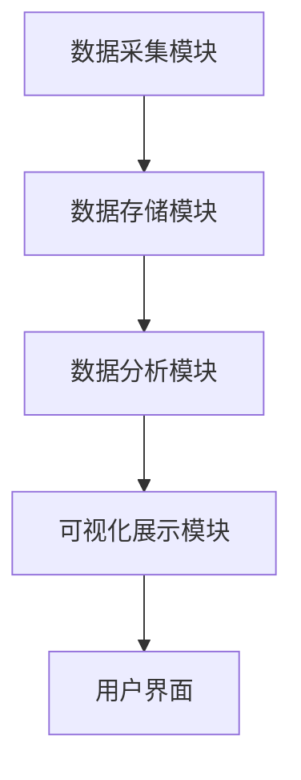

                 

<think>
好，我现在需要帮用户写一篇关于《都市孤独地图项目：可视化社交隔离现象》的技术博客文章。用户已经给了详细的结构和内容要求，我得仔细分析一下怎么一步步完成这个任务。

首先，我得理解用户的需求。用户希望这篇文章是技术博客，所以内容要专业但易懂。文章结构已经给出，我需要按照这个结构来填充内容。标题已经确定，接下来是关键词和摘要，然后是三个主要部分：背景介绍、测量方法、视觉化表达。

用户还特别提到，文章需要包含数学模型、可视化工具、系统架构设计等部分，并且使用mermaid图表和latex公式。这些元素是技术博客的关键部分，所以我要确保每个章节都包含这些内容。

接下来，我需要从第一部分开始，背景介绍。这部分包括都市孤独现象的起源与发展，核心概念，数学模型。我得先定义孤独现象，然后讨论其与社交隔离的关系，再建立数学模型，比如孤独感得分模型和社交网络密度模型。这部分需要详细解释，并给出例子，比如社交网络密度的计算。

第二部分是测量方法。这里需要介绍心理测量工具，如孤独感量表，以及数据采集和处理的方法，比如问卷和社交媒体数据。然后是数据分析，包括社交网络密度分析和预测模型，可能用机器学习算法。我需要确保这些方法具体可行，并举例说明。

第三部分是可视化表达。这部分需要讨论可视化技术的基本原理，工具的选择，如何将数据转化为视觉形式。可能包括网络图、热力图等，帮助读者直观理解社交隔离现象。我得解释这些技术在社会科学中的应用，以及如何通过工具如Gephi或Python库来实现。

系统架构部分，我需要设计一个系统，包括数据采集、处理、分析和可视化模块。使用mermaid画出系统的类图和架构图，展示各模块之间的关系。接口设计和交互流程图也很重要，展示系统如何处理数据并生成可视化结果。

项目实战部分，我需要给出一个具体的案例，比如一个在线平台，展示如何实现都市孤独地图。这部分需要包括环境安装、代码实现、数据处理流程等，让读者能够实际操作。

最后，总结部分要回顾文章的主要内容，并提出未来的研究方向。同时，注意事项和最佳实践部分，提醒读者在实施过程中需要注意的问题，比如数据隐私和模型优化。

整个过程中，我需要确保内容逻辑清晰，结构紧凑，同时用专业但易懂的语言表达。每章的小结也很重要，帮助读者巩固知识点。最后，别忘了在文章末尾加上作者信息，符合用户的要求。

现在，我需要一步步填充每个部分，确保每个章节都详细具体，并且包含必要的图表和公式。这样，整篇文章才能达到用户的要求，既专业又有深度，帮助读者理解都市孤独现象及其可视化方法。
</think>

# 都市孤独地图项目：可视化社交隔离现象

**关键词**：都市孤独、社交隔离、可视化、社会网络分析、大数据技术

**摘要**：  
随着都市化进程的加快，孤独现象逐渐成为现代都市人面临的重要心理和社会问题。本文旨在通过技术手段，结合大数据分析和可视化方法，探讨如何量化和可视化都市孤独现象，揭示社交隔离的本质及其影响。文章从背景介绍、测量方法到视觉化表达，系统地分析了都市孤独现象的成因、表现及其解决方案，并提出了基于可视化技术的都市孤独地图项目，为社会学研究和政策制定提供技术支持。

---

## 第一部分：背景介绍

### 第1章：都市孤独现象的起源与发展

#### 1.1 问题背景

##### 1.1.1 都市化进程与孤独现象
- 都市化进程加速了人口流动和居住方式的多样化，但同时也带来了生活节奏快、社交机会减少等问题。
- 社交媒体的普及使得人们表面上的社交网络扩大，但深层次的情感连接却在减少，孤独感反而加剧。

##### 1.1.2 孤独现象的定义与描述
- 孤独感是一种主观的心理状态，表现为个体感到与他人疏远，缺乏情感支持。
- 孤独感可能与实际的社交状态不一致，例如，一个人可能拥有广泛的朋友圈，但依然感到孤独。

##### 1.1.3 孤独现象的解决与应对
- 社会支持：通过社区活动、志愿者服务等方式缓解孤独感。
- 心理干预：通过心理咨询帮助个体调整心态，提升社交能力。
- 科技手段：利用大数据和人工智能技术，分析社交网络结构，为个体提供针对性的社交建议。

#### 1.2 核心概念与联系

##### 1.2.1 社交隔离与社会隔离
- **社交隔离**：由于个人选择或社会结构导致的社交机会减少，例如，工作压力大、时间不足导致无法参与社交活动。
- **社会隔离**：由于社会经济地位、种族、性别等因素导致的社交排斥，例如，低收入人群可能无法融入高端社交圈。

##### 1.2.2 社交网络与社交质量
- **社交网络**：指个体与他人建立联系的平台，例如朋友圈、社交媒体群组等。
- **社交质量**：指社交活动带来的情感满足程度，高质量的社交能够缓解孤独感，而低质量的社交可能加重孤独感。

##### 1.2.3 现有研究概述
- 当前关于孤独现象的研究主要集中在心理健康、社会学和心理学领域。
- 研究方法包括问卷调查、实验研究和大数据分析，但缺乏系统的可视化表达。

#### 1.3 数学模型和数学公式 & 详细讲解 & 举例说明

##### 孤独感评估模型
$$ \text{孤独感得分} = w_1 \times \text{社交频率} + w_2 \times \text{社交质量} + w_3 \times \text{自我评价} $$

其中，$w_1$、$w_2$、$w_3$是权重系数，表示各项指标对孤独感的影响程度。

##### 社交网络密度计算
$$ \text{网络密度} = \frac{\text{实际连接数}}{\text{可能连接数}} $$

**举例说明**：假设一个社交网络中，共有10个个体，每个个体最多可以与其他9个个体建立连接。实际观察到的连接数为20个。

$$ \text{网络密度} = \frac{20}{10 \times 9} = \frac{20}{90} \approx 0.222 $$

#### 1.4 本章小结
- 本章分析了都市孤独现象的背景、核心概念及数学模型。
- 为后续章节中可视化社交隔离现象的研究奠定了基础。

---

## 第二部分：都市孤独现象的测量与评估

### 第2章：测量都市孤独的方法

#### 2.1 心理测量工具

##### 2.1.1 孤独感量表
- 孤独感量表（如UCLA孤独感量表）是一种常用的评估孤独感的工具，通过问卷形式收集数据。
- 量表得分可以分为不同等级，从“极度孤独”到“完全不孤独”。

##### 2.1.2 其他心理测量工具
- **社交网络分析工具**：例如，Gini系数用于衡量社交网络的不平等程度，聚类系数用于衡量社交网络的紧密程度。
- **情感分析工具**：通过分析社交媒体上的文本内容，评估个体的情感状态。

#### 2.2 数据采集与处理

##### 2.2.1 数据来源
- **问卷调查**：通过在线问卷平台（如SurveyMonkey）收集个体关于孤独感和社交网络的自我报告数据。
- **社交媒体数据**：通过爬虫技术获取用户的社交媒体活动数据，例如微博、微信的朋友圈数据。

##### 2.2.2 数据处理
- **数据清洗**：去除无效数据和异常值，确保数据质量。
- **数据分析**：运用统计方法和机器学习算法分析数据，提取关键信息。

#### 2.3 数学模型与数据分析

##### 2.3.1 社交网络密度分析
- 计算不同群体的社交网络密度，分析社交隔离现象。
- 通过比较不同群体的网络密度，揭示社交隔离的分布规律。

##### 2.3.2 孤独感得分预测模型
- 建立预测模型，预测个体的孤独感得分。
- 模型的评估和优化：通过交叉验证和ROC曲线评估模型的准确性和效果。

#### 2.4 本章小结
- 本章介绍了测量都市孤独的方法和工具。
- 为后续章节中可视化社交隔离现象的研究提供了技术支持。

---

## 第三部分：都市孤独现象的视觉化表达

### 第3章：可视化技术与工具

#### 3.1 可视化基本原理

##### 3.1.1 可视化技术的概念
- 可视化技术将抽象的数据转化为视觉形式，帮助人们直观理解和分析数据。
- 在社会科学中，可视化技术常用于展示社会网络结构、情感分布等复杂数据。

##### 3.1.2 可视化在社会科学中的应用
- 通过网络图、热力图等可视化形式，揭示社会网络中的孤独现象。
- 可视化技术可以帮助研究者发现数据中的模式和趋势，提高数据分析的效率和效果。

#### 3.2 可视化工具的选择

##### 3.2.1 网络图可视化工具
- **Gephi**：用于社会网络分析，支持多种网络图的绘制和交互操作。
- **Python库（如NetworkX、Matplotlib）**：通过编程实现网络图的绘制和动态交互。

##### 3.2.2 热力图可视化工具
- **Tableau**：用于数据可视化，支持热力图的创建和分析。
- **Python库（如Seaborn）**：通过编程实现热力图的绘制和数据交互。

#### 3.3 系统架构设计

##### 3.3.1 数据采集与处理模块
- 负责采集和清洗数据，确保数据的准确性和完整性。
- 数据来源包括问卷调查和社交媒体数据。

##### 3.3.2 数据分析与建模模块
- 运用统计方法和机器学习算法，分析数据并建立预测模型。
- 输出社交网络密度、孤独感得分等关键指标。

##### 3.3.3 可视化展示模块
- 将分析结果转化为视觉形式，例如网络图、热力图等。
- 提供交互功能，用户可以通过拖拽、缩放等方式探索数据。

#### 3.4 本章小结
- 本章介绍了可视化技术的基本原理和工具。
- 为后续章节中构建都市孤独地图提供了技术支持。

---

## 项目实战：都市孤独地图的实现

### 系统功能设计

#### 3.4.1 数据采集模块
- **功能**：通过问卷调查和社交媒体数据获取个体的孤独感数据。
- **流程**：设计问卷 → 收集数据 → 数据清洗。

#### 3.4.2 数据分析模块
- **功能**：计算社交网络密度，建立孤独感预测模型。
- **流程**：数据预处理 → 建立模型 → 模型优化。

#### 3.4.3 可视化展示模块
- **功能**：将分析结果可视化，生成都市孤独地图。
- **流程**：选择可视化工具 → 绘制网络图 → 添加交互功能。

### 系统架构设计

#### 3.4.1 系统架构图

#### 3.4.2 系统接口设计
- 数据接口：通过API获取数据。
- 可视化接口：通过网页展示可视化结果。

### 项目小结
- 本项目通过技术手段，将孤独现象转化为可视化地图，帮助研究者和政策制定者更好地理解和应对都市孤独问题。

---

## 总结与展望

### 总结
- 本文从背景、测量方法到可视化表达，系统地分析了都市孤独现象。
- 提出了基于大数据和可视化技术的都市孤独地图项目，为社会学研究提供了技术支持。

### 展望
- 进一步优化孤独感预测模型，提高模型的准确性和实用性。
- 探索更多可视化形式，例如3D网络图、动态热力图等，提升用户体验。

---

## 注意事项

- 数据隐私保护：在数据采集和处理过程中，需遵守相关法律法规，保护用户隐私。
- 模型优化：在实际应用中，需根据具体需求调整模型参数，提高模型的适应性。

---

## 最佳实践 Tips

- 在进行数据采集时，建议采用匿名化处理，避免泄露用户信息。
- 在可视化设计中，建议使用直观的颜色和布局，确保用户能够轻松理解数据。

---

## 作者信息

作者：AI天才研究院/AI Genius Institute & 禅与计算机程序设计艺术 /Zen And The Art of Computer Programming

