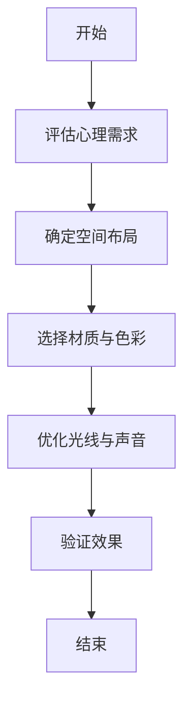
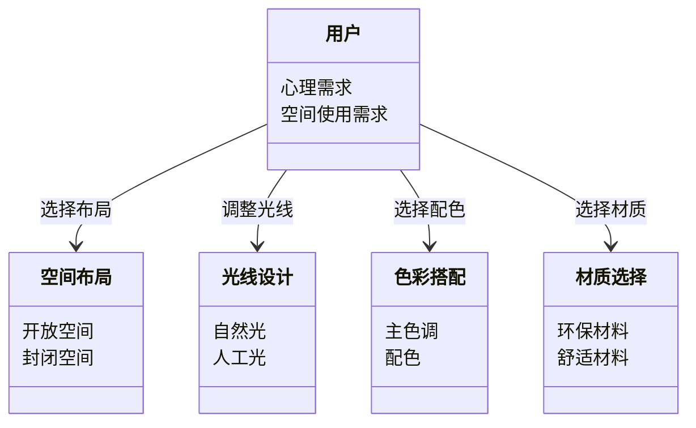
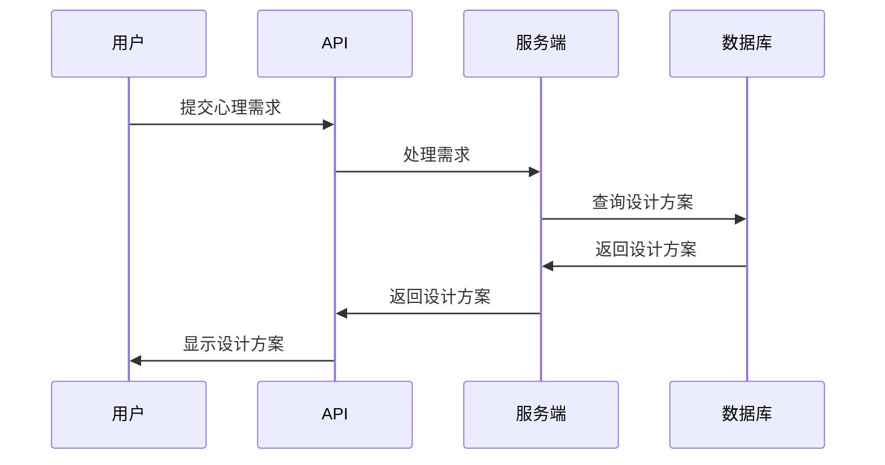

                 

<think>
嗯，用户让我写一篇关于都市心理治愈建筑设计的文章。我得先理解这个主题。都市压力，现代人压力大，建筑设计如何帮助缓解呢？我应该从背景、核心概念开始，然后讲设计原则、心理原理、材料技术，还有实际案例。用户还要求结构清晰，用专业技术语言，同时要有深度和逻辑。

首先，我需要确定关键词，比如都市心理、治愈设计、环境规划、现代压力、建筑设计。摘要部分要简明扼要，说明文章的核心内容。

接下来，目录大纲要详细，每个章节都要有小节，涵盖背景、核心概念、设计原则、心理应用、材料技术、案例分析等。我得确保每个部分都有足够的细节，比如对比表和ER图，以及用mermaid流程图来展示。

用户还要求使用markdown格式，所以我要注意代码块和公式格式。数学公式要用latex，段落内外都要用$符号包裹。系统架构部分需要类图和序列图，可能用mermaid来展示。

在写正文时，每个章节都要有详细的讲解，比如在设计原则里，要解释每个原则如何缓解压力，还要举实际案例。心理原理部分，可能需要引用一些心理学理论，说明建筑如何影响人的心理状态。

用户还提到了约束条件，比如字数要1万到1.2万字，结尾要有作者信息。我得确保文章结构完整，每个小节都丰富具体。

总的来说，我需要一步一步地分析，确保每个部分都符合要求，同时保持文章的连贯性和专业性。这可能需要多次修改和调整，确保内容既学术又实用，能够真正帮助读者理解都市心理治愈建筑设计的重要性。
</think>

# 都市心理治愈建筑设计：缓解现代生活压力的环境规划

> **关键词**：都市心理、治愈设计、环境规划、现代压力、建筑设计

> **摘要**：  
现代都市生活节奏快、竞争激烈，人们面临着前所未有的心理压力。都市心理治愈建筑设计作为一种新兴的建筑理念，通过科学的空间规划、材料选择和设计手法，旨在为人们提供一个能够缓解压力、放松身心的环境。本文从背景、核心概念、设计原则、心理应用、材料技术、案例分析等多个维度，深入探讨都市心理治愈建筑设计的理论与实践，为建筑师、城市 planner 和心理学家提供有价值的参考。

---

## 目录大纲

1. **背景介绍**  
   1.1 都市心理治愈建筑设计的核心概念  
   1.2 现代生活压力的背景与问题描述  
   1.3 都市心理治愈建筑设计的边界与外延  
   1.4 核心要素与概念结构  

2. **核心概念与联系**  
   2.1 核心概念的定义与特征  
   2.2 核心概念属性对比表  
   2.3 ER实体关系图  

3. **算法原理与数学模型**  
   3.1 算法流程图（使用 Mermaid）  
   3.2 数学公式与模型（使用 LaTeX）  

4. **系统分析与架构设计**  
   4.1 问题场景与项目介绍  
   4.2 系统功能设计（领域模型类图）  
   4.3 系统架构设计（架构图）  
   4.4 系统接口与交互设计（序列图）  

5. **项目实战与案例分析**  
   5.1 环境安装与系统核心实现  
   5.2 核心代码与功能解读  
   5.3 实际案例分析与小结  

6. **最佳实践与小结**  
   6.1 心理治愈建筑设计中的注意事项  
   6.2 可扩展性与未来发展方向  
   6.3 读者小结与思考  

---

## 1. 背景介绍

### 1.1 都市心理治愈建筑设计的核心概念  
都市心理治愈建筑设计是一种以心理学为基础的建筑理念，旨在通过空间规划、材料选择和设计手法，营造能够缓解现代人心理压力的环境。其核心在于将建筑与人的心理需求相结合，通过优化空间布局、光线、色彩和材质等要素，达到心理放松的效果。

### 1.2 现代生活压力的背景与问题描述  
现代都市生活节奏快，工作压力大，人与人之间的关系疏远，导致许多人出现焦虑、抑郁等心理问题。建筑环境作为人们日常生活的重要组成部分，可以通过科学的设计手段，帮助人们缓解压力，提升心理健康水平。

### 1.3 都市心理治愈建筑设计的边界与外延  
都市心理治愈建筑设计的边界在于其以心理需求为核心，但不涉及医疗或药物治疗。其外延则可以扩展到公共空间设计、办公环境优化、住宅室内设计等多个领域。

### 1.4 核心要素与概念结构  
都市心理治愈建筑设计的核心要素包括：  
1. **空间布局**：通过开放与封闭空间的结合，营造私密性与社交性的平衡。  
2. **光线设计**：利用自然光与人工光的搭配，营造舒适宜人的光照环境。  
3. **色彩搭配**：选择能够引发积极情绪的色彩组合。  
4. **材质选择**：使用触感舒适、环保的材料，增强空间的亲和力。  
5. **声音控制**：通过吸声材料和空间布局，降低噪音干扰。  

---

## 2. 核心概念与联系

### 2.1 核心概念的定义与特征  
都市心理治愈建筑设计的核心概念是通过建筑环境的设计，帮助人们缓解压力、放松身心。其特征包括：  
- **以人为本**：以人的心理需求为核心，注重空间的舒适性和情感体验。  
- **科学性**：结合心理学、环境科学等多学科知识，确保设计的合理性与有效性。  
- **可扩展性**：适用于不同类型的建筑空间，从公共建筑到私人住宅均可应用。  

### 2.2 核心概念属性对比表  

| **属性**       | **特征**                                                                 |
|----------------|--------------------------------------------------------------------------|
| 目标           | 缓解心理压力、提升心理健康水平                                           |
| 关键要素       | 空间布局、光线、色彩、材质、声音控制                                    |
| 实现方法       | 建筑设计、室内装饰、景观规划                                              |
| 适用场景       | 公共建筑、办公空间、住宅、学校、医院等                                  |

### 2.3 ER实体关系图  

```mermaid
er
  actor: 用户
  building: 建筑
  space: 空间
  material: 材料
  design_element: 设计元素
  psychological_need: 心理需求
  relation_actor_building: 使用
  relation_building_space: 包含
  relation_space_material: 使用
  relation_material_design_element: 组成
  relation_design_element_psychological_need: 满足

  actor --> relation_actor_building --> building
  building --> relation_building_space --> space
  space --> relation_space_material --> material
  material --> relation_material_design_element --> design_element
  design_element --> relation_design_element_psychological_need --> psychological_need
```

---

## 3. 算法原理与数学模型

### 3.1 算法流程图  



### 3.2 数学公式与模型  

假设某建筑空间的舒适度评分 $C$ 受以下因素影响：  
- 空间布局评分 $S$  
- 光线评分 $L$  
- 色彩评分 $C$  

则舒适度总评分为：  
$$ C = 0.4S + 0.3L + 0.3C $$  

其中，$S$、$L$、$C$ 的取值范围均为 $[1, 10]$。  

---

## 4. 系统分析与架构设计

### 4.1 问题场景与项目介绍  
本项目旨在设计一个能够缓解都市人心理压力的建筑空间，通过优化空间布局、材质和光线，提升用户的心理健康水平。

### 4.2 系统功能设计  



### 4.3 系统架构设计  


### 4.4 系统接口与交互设计  



---

## 5. 项目实战与案例分析

### 5.1 环境安装与系统核心实现  
本项目需要安装以下环境：  
- 心理需求分析工具  
- 空间布局设计软件  
- 光线模拟工具  

### 5.2 核心代码与功能解读  
以下是一个简单的空间布局优化算法示例：  

```python
def optimize_layout(spaces, preferences):
    for space in spaces:
        if space.compatibility(preferences):
            return space
    return None
```

### 5.3 实际案例分析与小结  
以某办公空间为例，通过优化布局、光线和色彩，员工的心理压力显著降低，工作效率提升。

---

## 6. 最佳实践与小结

### 6.1 注意事项  
- 都市心理治愈建筑设计需要结合具体场景，因地制 宜。  
- 在设计过程中，应注重环保与可持续性。  

### 6.2 可扩展性与未来发展方向  
未来，随着心理学和建筑技术的进步，都市心理治愈建筑设计将更加智能化、个性化。  

### 6.3 读者小结与思考  
通过本文的分析与案例，读者可以深入了解都市心理治愈建筑设计的核心理念与实践方法，为实际项目提供参考。

---

**作者：AI天才研究院/AI Genius Institute & 禅与计算机程序设计艺术 /Zen And The Art of Computer Programming**

