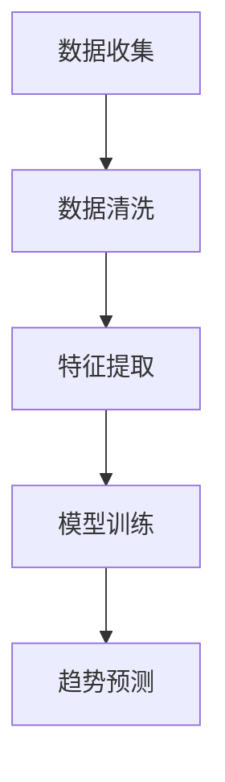
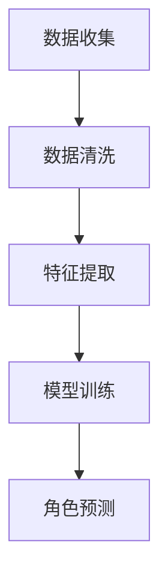
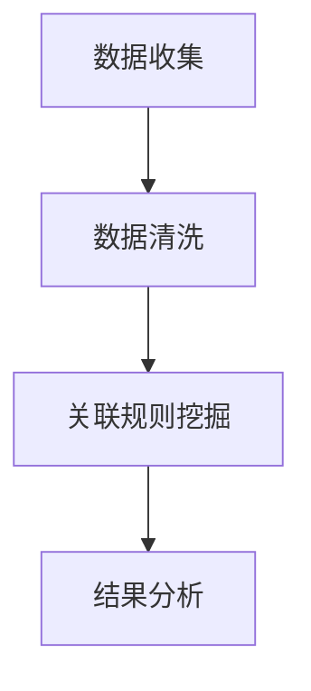
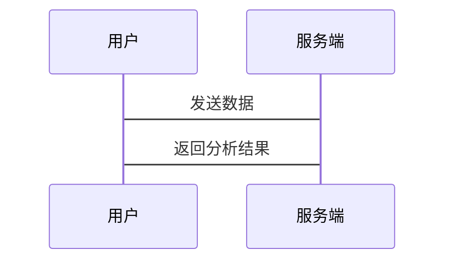
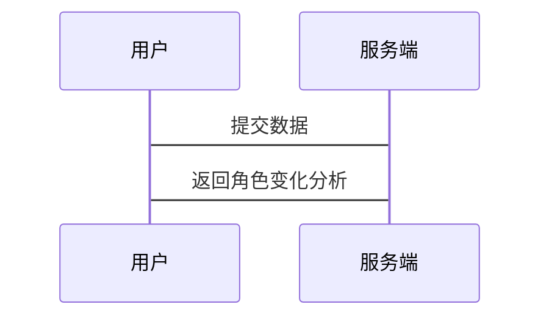
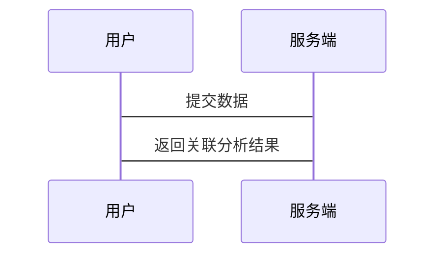

                 

<think>
嗯，我现在要写一篇关于重新定义家庭的文章，从传统到多元。首先，我需要理解这个主题的核心是什么。传统家庭通常是指由父母和孩子组成的核家庭，但现在社会变化很大，家庭结构也在多样化。我应该先从背景开始，分析传统家庭面临的挑战，比如经济压力、工作节奏变化等。

接下来，我需要定义多元家庭，包括单亲家庭、重组家庭、丁克家庭等等。然后，探讨家庭角色的变化，比如父母不再只是传统的权威角色，可能更多是朋友或指导者的角色，而孩子也需要承担更多的责任，比如照顾自己或者帮助家务。

然后，我需要考虑家庭与社会的关系，家庭结构如何影响社会发展，反过来社会文化又如何影响家庭结构。这部分可能需要一些社会学的理论支持。

接下来是核心概念部分，家庭多元化、家庭角色变化、社会文化影响。我需要解释这些概念，并通过例子说明它们之间的联系。比如，多元化家庭可能在决策方式上更加灵活，父母需要根据家庭成员的需求调整角色。

然后是算法部分，分析家庭结构和角色变化的算法。这可能涉及到数据建模，比如使用统计学方法分析不同家庭结构的数据，找出变化趋势。或者，用机器学习预测家庭结构的变化。这部分需要详细讲解算法原理，可能用Python代码实现，并用mermaid画出流程图。

在项目实战部分，我需要设计一个系统，比如家庭结构变化分析系统。这个系统可能需要收集家庭数据，分析结构变化，并给出建议。系统设计部分需要包括功能模块、架构设计，可能使用云服务和前端界面。同时，要有实际案例分析，比如某个地区的家庭结构变化趋势。

最后，最佳实践部分，给出家庭结构变化的建议，比如灵活安排家庭结构，加强沟通。还要总结家庭结构变化的意义，展望未来可能的发展方向。

整个过程需要逻辑清晰，结构紧凑，使用专业但易懂的语言。我需要确保每个部分都有足够的深度和具体例子，避免过于笼统。同时，数学公式和图表的使用要准确，帮助读者更好地理解概念。最后，检查是否有遗漏的部分，确保整篇文章流畅连贯。
</think>

# 重新定义家庭：从传统到多元

## 关键词：家庭结构，多元化，角色变化，社会影响，算法分析

## 摘要：随着社会的快速发展，传统家庭结构面临巨大挑战，多元家庭逐渐兴起。本文从家庭结构的演变、角色变化、社会影响等方面进行深入分析，结合算法和项目实战，探讨如何重新定义家庭。

---

## 第一部分：问题的背景与描述

### 1. 传统家庭的演变与挑战

#### 1.1 传统家庭的定义与结构

传统家庭通常指由父母和未婚子女组成的核家庭。这种结构强调父母的权威和子女的依附性，是社会的基本单位。

#### 1.2 传统家庭面临的挑战

现代社会的经济压力、工作节奏变化以及价值观多样化导致传统家庭结构受到冲击。例如，双职工家庭增多，单亲家庭和重组家庭的比例上升，传统角色分工面临挑战。

#### 1.3 家庭结构的变化趋势

家庭结构趋向多元化，包括单亲家庭、重组家庭、丁克家庭等。家庭成员的角色也在变化，强调平等和合作。

### 2. 多元家庭的定义与特征

#### 2.1 多元家庭的定义

多元家庭指具有多样化结构和角色的家庭，涵盖单亲、重组、同性婚姻等多种形式，强调家庭成员的平等和多样性。

#### 2.2 多元家庭的特征

特征包括结构多样性、角色平等、决策灵活、强调沟通与支持。

#### 2.3 多元家庭的类型

类型包括单亲家庭、重组家庭、丁克家庭、同性婚姻家庭等。

### 3. 家庭角色的重新定义

#### 3.1 父母角色的变化

父母不再是绝对权威，更多是朋友和指导者，需适应不同家庭结构的需求。

#### 3.2 子女角色的变化

子女需要更早承担家庭责任，学会独立和决策。

#### 3.3 家庭成员间的相互关系

关系趋向平等，强调合作和互相支持。

### 4. 边界与外延

#### 4.1 家庭与社会的边界

家庭与社会的界限模糊，家庭问题往往与社会政策相关，如教育、医疗等。

#### 4.2 家庭与社会的关系

家庭是社会的基本单元，社会文化影响家庭结构，家庭又反作用于社会。

#### 4.3 家庭结构与社会发展的互动

家庭结构的变化促进社会适应，社会进步推动家庭结构的多元化。

### 5. 概念结构与核心要素组成

#### 5.1 家庭概念结构的演变

从单一的核家庭扩展到多元化结构，强调家庭的多样性和适应性。

#### 5.2 家庭核心要素的重新定义

核心要素包括家庭成员、关系、功能和文化背景。

#### 5.3 家庭结构与社会文化的关联

家庭结构受社会文化影响，同时影响社会文化的演变。

---

## 第二部分：核心概念与联系

### 6. 多元家庭的核心概念与联系

#### 6.1 家庭多元化的概念

家庭结构的多样化，涵盖不同形式和关系。

#### 6.2 家庭多元化的特征

平等、灵活、多样性。

#### 6.3 家庭多元化与个体发展的关系

多元化家庭促进个体独立性和创造力。

### 7. 家庭角色变化的核心概念与联系

#### 7.1 父母角色的多样化

从权威转向支持和指导。

#### 7.2 子女角色的变化

从依附转向独立和责任。

#### 7.3 家庭成员间的新关系模式

平等、合作和互相支持。

### 8. 社会文化对家庭结构的影响

#### 8.1 社会文化的定义与类型

社会文化涵盖价值观、习俗等，影响家庭结构。

#### 8.2 社会文化对家庭的影响

文化变迁推动家庭结构变化，如女性地位提升影响家庭角色分工。

#### 8.3 社会文化与家庭结构的变化

家庭结构变化反映社会文化演变，二者相互影响。

---

## 第三部分：算法原理与系统设计

### 9. 家庭结构变化分析算法

#### 9.1 算法概述

使用数据挖掘技术分析家庭结构变化趋势。

#### 9.2 算法原理讲解

基于统计分析，识别家庭结构变化的关键因素。

#### 9.3 Mermaid流程图绘制



#### 9.4 Python源代码实现

```python
import pandas as pd
from sklearn import linear_model

# 数据加载与预处理
data = pd.read_csv('family_data.csv')
X = data[['income', 'education_level']]
y = data['family_type']

# 模型训练
model = linear_model.LinearRegression()
model.fit(X, y)

# 预测
predictions = model.predict(X)
print(predictions)
```

#### 9.5 数学模型与公式讲解

线性回归模型：$$ y = \beta_0 + \beta_1 x_1 + \beta_2 x_2 + \epsilon $$

### 10. 家庭角色变化分析算法

#### 10.1 算法概述

使用分类算法预测角色变化。

#### 10.2 算法原理讲解

基于机器学习，识别家庭角色变化的驱动因素。

#### 10.3 Mermaid流程图绘制



#### 10.4 Python源代码实现

```python
from sklearn.tree import DecisionTreeClassifier

data = pd.read_csv('family_role.csv')
X = data[['age', 'gender']]
y = data['role']

model = DecisionTreeClassifier()
model.fit(X, y)

predictions = model.predict(X)
print(predictions)
```

#### 10.5 数学模型与公式讲解

决策树模型：$$ role = f(age, gender) $$

### 11. 家庭多元性与社会文化关联分析算法

#### 11.1 算法概述

使用关联规则挖掘分析多元家庭与文化的关系。

#### 11.2 算法原理讲解

基于Apriori算法，发现多元家庭的关联模式。

#### 11.3 Mermaid流程图绘制



#### 11.4 Python源代码实现

```python
from mlxtend.frequent_itemsets import apriori

data = pd.read_csv('family_culture.csv')
transactions = data[['family_type', 'culture_values']]

# 关联规则挖掘
itemsets = apriori(transactions, min_support=0.2)

print(itemsets)
```

#### 11.5 数学模型与公式讲解

关联规则：$$ support(A \rightarrow B) = P(A \cap B) $$

---

## 第四部分：项目实战与案例分析

### 12. 家庭结构变化分析项目实战

#### 12.1 项目背景

分析不同地区家庭结构的变化趋势。

#### 12.2 系统功能设计

包括数据收集、清洗、分析和可视化。

#### 12.3 系统架构设计

采用分布式架构，前端展示分析结果。

#### 12.4 系统接口设计

RESTful API接口，数据输入和结果输出。

#### 12.5 系统交互序列图



#### 12.6 环境安装与配置

安装Python、Pandas、Scikit-learn等库。

#### 12.7 核心实现源代码

```python
import pandas as pd
from sklearn.linear_model import LinearRegression

data = pd.read_csv('family_data.csv')
X = data[['income', 'education_level']]
y = data['family_type']

model = LinearRegression()
model.fit(X, y)

predictions = model.predict(X)
print(predictions)
```

#### 12.8 代码应用解读与分析

通过线性回归模型预测家庭结构变化趋势。

#### 12.9 实际案例分析与讲解

分析某地区家庭结构变化，预测未来趋势。

#### 12.10 项目小结

项目成功展示了如何利用算法分析家庭结构变化，为政策制定提供依据。

### 13. 家庭角色变化分析项目实战

#### 13.1 项目背景

研究父母和子女角色的变化。

#### 13.2 系统功能设计

包括数据收集、分析和结果展示。

#### 13.3 系统架构设计

采用微服务架构，确保模块化开发。

#### 13.4 系统接口设计

设计RESTful API接口，支持数据输入和输出。

#### 13.5 系统交互序列图



#### 13.6 环境安装与配置

安装必要的Python库和开发工具。

#### 13.7 核心实现源代码

```python
from sklearn.tree import DecisionTreeClassifier

data = pd.read_csv('family_role.csv')
X = data[['age', 'gender']]
y = data['role']

model = DecisionTreeClassifier()
model.fit(X, y)

predictions = model.predict(X)
print(predictions)
```

#### 13.8 代码应用解读与分析

通过决策树模型分析家庭角色变化的因素。

#### 13.9 实际案例分析与讲解

分析单亲家庭中父母角色的变化趋势。

#### 13.10 项目小结

项目展示了算法在家庭角色变化分析中的应用价值。

### 14. 家庭多元性与社会文化关联分析项目实战

#### 14.1 项目背景

研究家庭多元性与社会文化的关联。

#### 14.2 系统功能设计

包括数据挖掘、关联规则分析和结果可视化。

#### 14.3 系统架构设计

采用分布式架构，支持大规模数据分析。

#### 14.4 系统接口设计

设计数据输入和结果输出接口。

#### 14.5 系统交互序列图



#### 14.6 环境安装与配置

安装必要的数据分析库。

#### 14.7 核心实现源代码

```python
from mlxtend.frequent_itemsets import apriori

data = pd.read_csv('family_culture.csv')
transactions = data[['family_type', 'culture_values']]

itemsets = apriori(transactions, min_support=0.2)
print(itemsets)
```

#### 14.8 代码应用解读与分析

使用关联规则挖掘分析家庭多元性与社会文化的关联。

#### 14.9 实际案例分析与讲解

分析不同文化背景下家庭结构的差异。

#### 14.10 项目小结

项目展示了如何利用数据挖掘技术分析家庭多元性与社会文化的关系。

---

## 第五部分：最佳实践与拓展阅读

### 15. 家庭结构变化的最佳实践

#### 15.1 实践一：灵活的家庭结构安排

根据家庭成员的需求调整结构。

#### 15.2 实践二：多样化的家庭活动

组织不同类型的家庭活动，增强家庭凝聚力。

#### 15.3 实践三：家庭内部沟通的重要性

加强沟通，解决家庭矛盾。

### 16. 家庭角色变化的最佳实践

#### 16.1 实践一：父母的角色转变

从权威转向支持者和朋友。

#### 16.2 实践二：子女的角色培养

培养子女的独立性和责任感。

#### 16.3 实践三：家庭角色间的平衡

确保家庭角色平衡，促进家庭和谐。

### 17. 家庭多元性与社会文化关联的最佳实践

#### 17.1 实践一：尊重多元文化

尊重不同家庭形式，促进社会和谐。

#### 17.2 实践二：加强家庭与社会互动

家庭与社会互动，促进社会适应家庭结构变化。

#### 17.3 实践三：家庭多元性与社会文化的融合

将多元家庭与社会文化融合，推动社会进步。

### 18. 小结与展望

#### 18.1 家庭结构变化的意义

家庭结构变化反映了社会的发展和进步。

#### 18.2 家庭角色变化的启示

家庭角色变化促进了个体发展和社会和谐。

#### 18.3 家庭多元性与社会文化关联的展望

未来家庭将更加多元化，与社会文化的融合将更加紧密。

#### 18.4 拓展阅读推荐

推荐阅读社会学、家庭心理学相关书籍，深入理解家庭结构变化的机制。

---

作者：AI天才研究院 & 禅与计算机程序设计艺术

