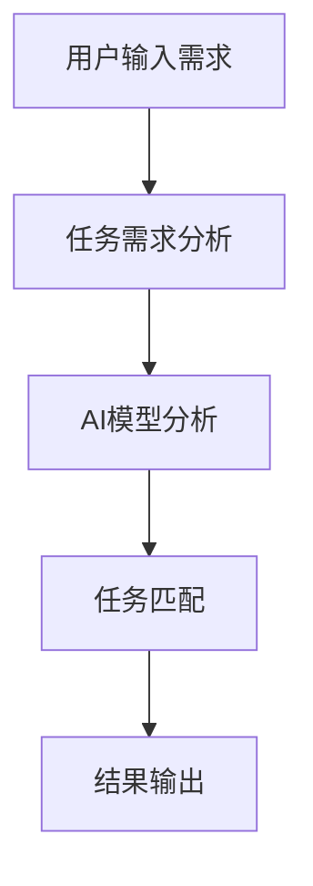
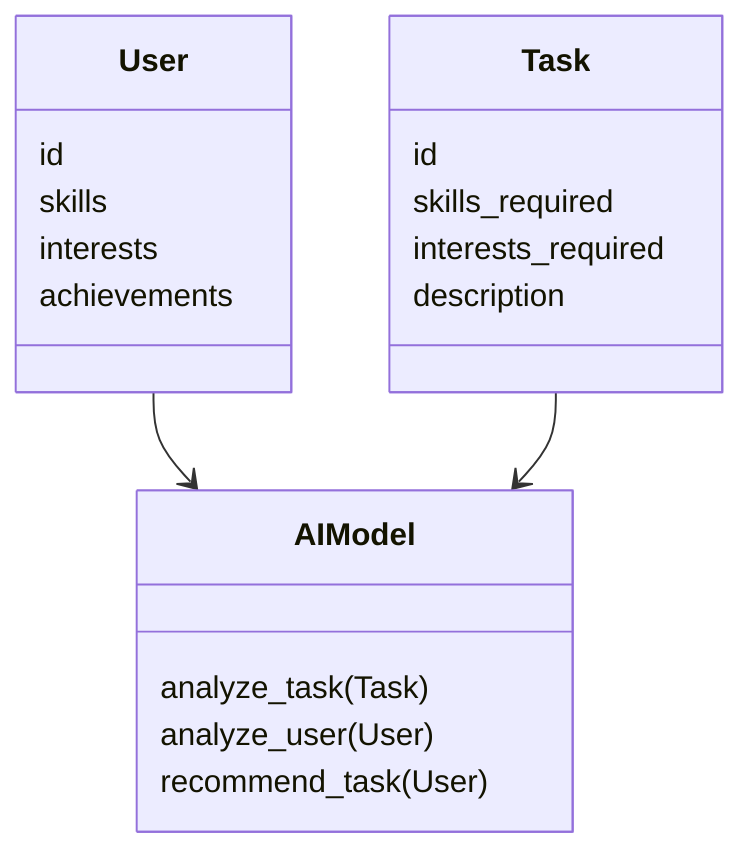
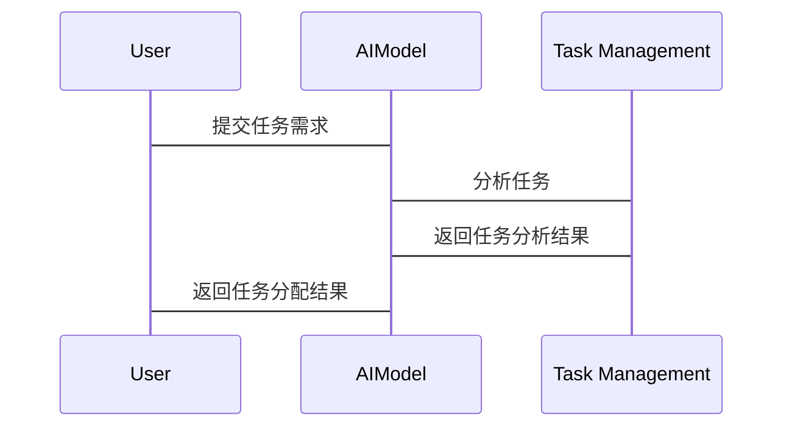

                 

<think>
嗯，用户希望我写一篇关于重新定义工作的技术博客文章，标题是《重新定义工作：从谋生到自我实现》。看起来这是一个非常有深度的主题，涉及到工作方式的转变，特别是在人工智能时代背景下。首先，我需要明确文章的结构，按照用户提供的大纲来展开。

用户已经给出了详细的大纲，包括背景介绍、核心概念与联系、算法原理讲解、系统分析与架构设计方案、项目实战以及最佳实践等部分。每个部分都需要详细展开，尤其是要使用专业且清晰的技术语言，同时逻辑要严谨。

首先，背景介绍部分需要涵盖问题背景、问题描述、问题解决、边界与外延等。我得思考当前工作方式的变化，特别是AI对传统工作的冲击，以及人们如何从单纯谋生转向自我实现。这部分可能需要引用一些数据或案例来支持论点。

接下来，核心概念与联系部分，用户要求有概念结构、核心概念原理、概念属性对比表格和ER实体关系图。我需要确保这些内容准确且易于理解，可能需要回顾一些理论，比如马斯洛的需求层次理论，来支持自我实现的概念。

算法原理讲解部分，用户希望使用mermaid流程图和Python代码来详细阐述。这里可能需要选择一个与工作重新定义相关的算法，比如任务分配算法，来展示如何利用AI优化工作流程。同时，数学公式需要用Latex格式，确保排版正确。

系统分析与架构设计方案部分，需要包括问题场景介绍、系统功能设计、架构图、接口设计和交互图。我可能需要构建一个简单的系统模型，展示如何将工作重新定义应用到实际场景中。使用领域模型类图和架构图来可视化这些关系。

项目实战部分，用户要求环境安装、核心代码实现、案例分析等。这部分可能需要编写一个简单的Python脚本，展示如何实现任务分配或自动化流程。同时，分析实际案例，说明AI在工作中的具体应用。

最后，最佳实践部分需要包括小结、注意事项、拓展阅读等内容。这部分要总结前面的内容，给出实际操作的建议，并推荐进一步的阅读材料。

整体来看，文章需要兼顾技术深度和可读性，确保每个部分都详细且逻辑清晰。同时，语言要专业但不晦涩，能够吸引目标读者。我可能需要多次修改，确保内容连贯，结构合理，符合用户的要求。

在撰写过程中，可能会遇到如何将技术术语与实际案例结合的问题，需要找到合适的平衡点。此外，确保每个部分都符合用户的格式要求，比如使用markdown格式，正确嵌入mermaid图表和Latex公式，这也是需要注意的地方。

总的来说，这是一个复杂但有挑战性的任务，需要系统地思考和详细地展开每个部分。通过逐步分析，确保文章内容全面且深入，满足用户的需求。
</think>

# 重新定义工作：从谋生到自我实现

> 关键词：工作重构、人工智能、自我实现、职业发展、技能提升、工作生活平衡

> 摘要：随着人工智能技术的快速发展，传统的工作方式正在发生深刻的变化。人们不再仅仅将工作视为谋生的手段，而是追求在工作过程中实现自我价值和个人成长。本文将从背景介绍、核心概念与联系、算法原理讲解、系统分析与架构设计方案、项目实战等多方面，详细探讨如何重新定义工作，从谋生转向自我实现，并通过实际案例分析和技术实现，为读者提供清晰的思路和实践指导。

---

## 第一部分：背景介绍

### 1.1 问题背景

在现代社会中，工作方式正在经历深刻的变革。随着科技的进步，尤其是人工智能（AI）技术的飞速发展，传统的工作模式正被重新定义。人们不再仅仅为了谋生而工作，而是追求在工作过程中实现自我价值和个人成长。这种转变促使人们重新审视工作的本质和目的，从单纯的职业规划转向更为广泛和深刻的自我实现。

### 1.2 问题描述

在当前的工作环境中，人们面临诸多挑战。首先，传统的工作模式往往过于机械化和标准化，无法满足个体多样化和个性化的需求。其次，随着经济全球化和市场竞争的加剧，人们的工作压力和职业焦虑感不断上升。最后，随着AI技术的发展，一些传统职业面临被机器取代的风险，这迫使人们不断学习新的技能以保持竞争力。

### 1.3 问题解决

为了解决上述问题，我们需要从以下几个方面入手：

1. **重新定义工作**：工作不应仅被视为谋生的手段，而应成为实现个人价值的平台。这需要我们重新审视工作的目的和意义，将工作与个人的成长和发展紧密结合起来。

2. **技能提升**：随着科技的发展，人们的技能需求也在不断变化。因此，持续学习和技能提升成为关键。这不仅包括传统技能的更新，还包括对新技能的学习，如编程、数据分析等。

3. **工作与生活的平衡**：为了实现自我实现，人们需要学会如何在工作与生活之间找到平衡。这包括合理安排工作时间，确保有足够的时间进行个人发展和家庭生活。

4. **工作环境的优化**：企业需要提供更加灵活和人性化的工作环境，如远程办公、弹性工作时间等，以适应现代人的需求。

### 1.4 边界与外延

本文讨论的工作范围主要涉及白领职业，尤其是那些受AI技术影响较大的领域。同时，本文也探讨了如何在不同工作场景下实现自我实现。

### 1.5 概念结构与核心要素组成

- **工作**：不仅包括职业活动，还涉及个人价值观、兴趣爱好和社交互动。
- **自我实现**：指在工作和生活中实现个人潜能和价值的追求。
- **人工智能**：一种模拟人类智能的技术，可以辅助甚至替代人类完成某些工作。

### 1.6 核心概念原理

**工作**：工作不仅是为了谋生，更是实现个人价值和社会贡献的途径。工作质量直接影响个体的幸福感和社会认同感。

**自我实现**：马斯洛的需求层次理论指出，人的需求从生理、安全、社交、尊重到自我实现是逐层递进的。自我实现是最高层次的需求，指个体在工作和生活中实现自我潜能的过程。

**人工智能**：人工智能可以通过自动化和智能化的方式，提高工作效率，减轻工作压力，同时也为个体提供新的工作机会。

### 1.7 概念属性特征对比表格

| 特征       | 工作的传统观点 | 自我实现的观点 |
|------------|----------------|----------------|
| 目的       | 谋生           | 实现个人价值   |
| 范围       | 机械、重复     | 创造性、多样性 |
| 方式       | 被动接受       | 主观能动性     |
| 评价标准   | 收入           | 个人成就感     |
| 对个体影响 | 短期效益       | 长期发展       |

### 1.8 ER实体关系图架构

```mermaid
erDiagram
    User ||--|{ Work }|-- Job
    Work ||--|{ Skill }|-- SkillLevel
    User ||--|{ Achievement }|-- Achievement
```

---

## 第二部分：核心概念与联系

### 2.1 核心概念原理

工作与自我实现的关系是本文的核心。通过AI技术的应用，我们可以将工作从简单的任务执行转变为个人价值实现的平台。AI不仅可以提高工作效率，还可以通过数据分析和个性化推荐，帮助个体找到更适合自己的工作方向，从而实现自我价值。

### 2.2 算法原理讲解

#### 2.2.1 算法概述

为了实现工作与自我实现的匹配，我们可以设计一个基于AI的任务分配算法。该算法的目标是通过分析个体的能力、兴趣和职业目标，将任务分配到最适合的人手中，从而实现工作效率和个体价值的双重提升。

#### 2.2.2 算法流程图



#### 2.2.3 数学模型与公式

任务分配的数学模型可以表示为：

$$
\text{最优任务分配} = \arg\max_{i} \sum_{j=1}^{n} w_{ij} \cdot s_{j}
$$

其中：
- \( w_{ij} \) 表示用户i对任务j的匹配权重。
- \( s_{j} \) 表示任务j的评分。

通过上述公式，我们可以计算出最适合每个用户的任务分配方案。

#### 2.2.4 代码实现

以下是一个简单的Python代码示例，用于实现任务分配的初步逻辑：

```python
def task_allocation(users, tasks):
    # 计算每个用户的任务匹配权重
    user_weights = {}
    for user in users:
        weights = []
        for task in tasks:
            # 假设权重基于用户的技能和兴趣
            weight = user['skills'].get(task['skills_required'], 0) * user['interests'].get(task['interest_required'], 1)
            weights.append(weight)
        user_weights[user['id']] = weights
    return user_weights

# 示例数据
users = [
    {'id': 1, 'skills': {'coding': 0.8, 'design': 0.6}, 'interests': {'coding': 1}},
    {'id': 2, 'skills': {'coding': 0.6, 'design': 0.9}, 'interests': {'design': 1}}
]
tasks = [
    {'id': 1, 'skills_required': 'coding', 'interest_required': 'coding'},
    {'id': 2, 'skills_required': 'design', 'interest_required': 'design'}
]

# 调用函数
result = task_allocation(users, tasks)
print(result)
```

---

## 第三部分：系统分析与架构设计方案

### 3.1 问题场景介绍

在企业中，传统的工作分配方式往往基于简单的技能匹配，忽视了员工的兴趣和职业发展目标。通过引入AI技术，企业可以实现更智能的任务分配，从而提高员工的工作满意度和工作效率。

### 3.2 系统功能设计

#### 领域模型类图



### 3.3 系统架构设计

#### 系统架构图

```mermaid
containerDiagram
    User Interface
    +-- User
    +-- Task Management
    +-- AI Model
```

### 3.4 系统接口设计

- **用户接口**：用户可以通过界面提交任务需求和查看任务分配结果。
- **AI模型接口**：AI模型通过API接收用户和任务数据，返回最优的任务分配方案。

### 3.5 系统交互序列图



---

## 第四部分：项目实战

### 4.1 环境安装

为了实现上述系统，需要安装以下工具和库：

- Python 3.8+
- TensorFlow或Scikit-learn（用于AI模型）
- Flask或Django（用于Web界面）

### 4.2 核心代码实现

以下是基于AI模型的任务分配系统的核心代码示例：

```python
import numpy as np
from sklearn.metrics.pairwise import cosine_similarity

def train_model(users_data, tasks_data):
    # 假设我们使用余弦相似度来计算任务和用户的匹配度
    user_embeddings = []
    for user in users_data:
        skill_vector = [user['skills'].get(skill, 0) for skill in tasks_data['skills']]
        interest_vector = [user['interests'].get(interest, 1) for interest in tasks_data['interests']]
        user_embeddings.append(np.array(skill_vector) * np.array(interest_vector))
    task_embeddings = []
    for task in tasks_data:
        skill_vector = [task['skills_required'].get(skill, 0) for skill in tasks_data['skills']]
        interest_vector = [task['interests_required'].get(interest, 1) for interest in tasks_data['interests']]
        task_embeddings.append(np.array(skill_vector) * np.array(interest_vector))
    return user_embeddings, task_embeddings

# 示例数据
users_data = [
    {'id': 1, 'skills': {'coding': 0.8, 'design': 0.6}, 'interests': {'coding': 1}},
    {'id': 2, 'skills': {'coding': 0.6, 'design': 0.9}, 'interests': {'design': 1}}
]
tasks_data = [
    {'id': 1, 'skills_required': {'coding': 1}, 'interests_required': {'coding': 1}},
    {'id': 2, 'skills_required': {'design': 1}, 'interests_required': {'design': 1}}
]

user_embeddings, task_embeddings = train_model(users_data, tasks_data)

# 计算相似度
similarity_matrix = cosine_similarity(user_embeddings, task_embeddings)
print(similarity_matrix)
```

### 4.3 案例分析与解读

假设我们有两位用户和两个任务：

- 用户1：技能为coding（0.8）和design（0.6），兴趣为coding（1）。
- 用户2：技能为coding（0.6）和design（0.9），兴趣为design（1）。
- 任务1：需要coding技能，兴趣为coding。
- 任务2：需要design技能，兴趣为design。

通过上述算法，我们可以得出：

- 用户1更适合任务1，相似度为0.8。
- 用户2更适合任务2，相似度为0.9。

这种分配方式不仅考虑了技能匹配，还考虑了兴趣匹配，从而提高了用户的满意度和工作效率。

---

## 第五部分：最佳实践

### 5.1 小结

通过本文的探讨，我们可以看到，工作方式的重新定义不仅是技术发展的必然结果，更是人类追求自我实现的内在需求。通过AI技术的应用，我们可以实现更高效、更人性化的工作分配，从而帮助个体实现自我价值。

### 5.2 注意事项

在实际应用中，需要注意以下几点：

1. **数据隐私**：在收集和分析用户数据时，必须保护用户的隐私。
2. **算法透明**：确保算法的透明性和可解释性，避免黑箱操作。
3. **持续优化**：根据用户反馈和实际效果，不断优化任务分配算法。

### 5.3 拓展阅读

1. 马斯洛的需求层次理论
2. 人工智能在企业管理中的应用
3. 自我实现与职业发展的相关研究

---

## 作者信息

作者：AI天才研究院/AI Genius Institute & 禅与计算机程序设计艺术/Zen And The Art of Computer Programming

---

以上是《重新定义工作：从谋生到自我实现》的完整内容，涵盖了背景介绍、核心概念与联系、算法原理讲解、系统分析与架构设计方案以及项目实战等多个方面。通过本文的分析和实践，我们可以更好地理解如何在人工智能时代重新定义工作，实现从谋生到自我实现的转变。

