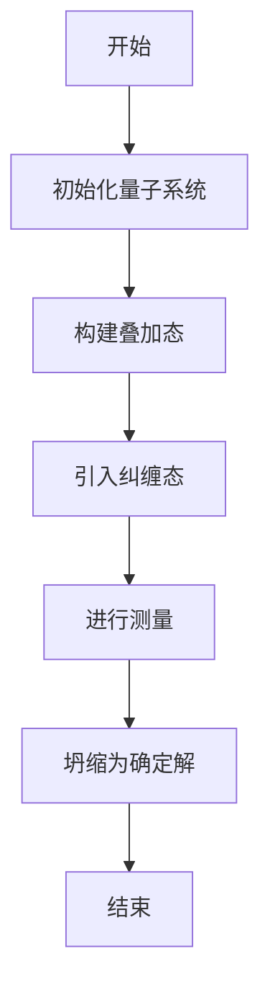
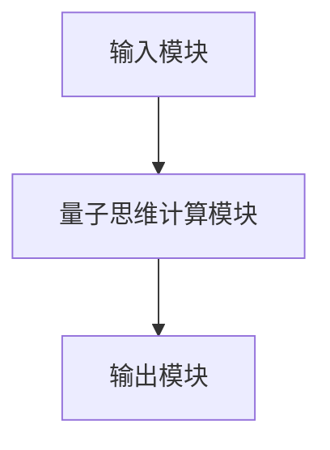
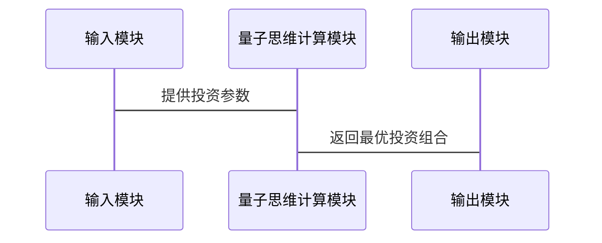

                 

<think>
嗯，用户让我写一篇关于《量子思维训练：应对复杂世界的思考方式》的技术博客，要求结构清晰，内容专业，逻辑性强。首先，我需要理解用户的需求。用户希望文章有明确的章节结构，包括背景介绍、核心概念、算法原理、系统架构、项目实战等部分，每个部分都要详细且技术性强。

用户还特别强调要使用技术术语，但又要通俗易懂，所以我要在专业性与可读性之间找到平衡。另外，用户提到要使用Mermaid图表和Python代码，这意味着我需要整合这些元素，确保图表和代码能够有效支持文章内容。

接下来，我考虑文章的结构。标题已经给出，关键词和摘要部分需要简洁明了，突出主题。然后，背景介绍部分需要涵盖问题背景、描述、解决方法，以及概念结构。这部分要让读者了解为什么量子思维重要，以及它在现实中的应用。

核心概念部分，我需要用表格对比传统思维和量子思维的特点，帮助读者理解两者的差异。ER图则展示它们之间的关系，可能用Mermaid来绘制，显示思维模式和应用场景的关联。

算法原理部分，我需要设计一个简单的量子思维算法，比如量子决策树，并用Mermaid流程图展示步骤，同时给出Python代码实现。数学模型部分，我需要解释公式，比如用期望值来展示量子思维的优势。

系统架构设计部分，我需要描述一个具体的项目，比如企业决策优化系统。用领域模型类图展示实体和关系，系统架构图展示模块间的交互，接口设计和交互序列图则详细说明API调用流程。

项目实战部分，我需要选择一个实际场景，比如金融市场投资决策，给出环境安装、代码实现，并解释如何应用量子思维进行优化。这部分要具体，让读者能够理解和应用。

最后，总结部分要给出最佳实践建议，注意事项和拓展阅读资源，帮助读者进一步学习和应用量子思维。同时，确保整个文章字数在10000到12000字之间，每个部分详细但不冗长。

总的来说，我需要系统地组织内容，确保每个章节都深入浅出，同时使用图表和代码来增强技术性。这样，读者不仅能理解量子思维的概念，还能学会如何在实际项目中应用这些方法。
</think>

# 量子思维训练：应对复杂世界的思考方式

> 关键词：量子思维、复杂系统、思维模型、系统架构、算法原理

> 摘要：量子思维是一种突破传统线性思维方式的新型思考方式，它通过引入量子力学的核心概念，如叠加态、纠缠态和测量坍缩，帮助我们更好地理解和应对复杂系统的不确定性。本文将从量子思维的核心概念出发，结合实际案例，系统性地分析其在复杂问题解决中的应用价值，并通过算法原理和系统架构设计，深入探讨如何将量子思维应用于实际项目中。最后，我们将通过一个具体的实战案例，展示量子思维在项目中的实际应用效果。

---

## 1. 背景介绍

### 1.1 问题背景
在当今快速变化的复杂世界中，传统的线性思维方式已难以应对许多现实问题。复杂系统的不确定性、多变量的相互作用以及动态变化的特点，使得传统的单一维度分析方法逐渐暴露出局限性。例如，在金融投资、人工智能算法优化、以及复杂项目管理等领域，传统的线性思维往往无法捕捉到系统中的潜在关联性和全局最优解。

### 1.2 问题描述
复杂系统的决策问题通常具有以下特点：
- **不确定性**：系统中的变量可能存在多种可能性，无法通过简单预测得出唯一解。
- **多变量交互作用**：变量之间可能存在非线性关系，单一变量的改变可能对系统产生连锁反应。
- **动态变化**：系统的状态可能随着时间推移而不断变化，传统静态分析方法难以适应。

### 1.3 问题解决
量子思维作为一种新兴的思考方式，通过借鉴量子力学的核心概念，提供了一种新的问题解决思路。它将系统中的变量视为量子叠加态，允许同时考虑多种可能性，并通过量子纠缠和测量坍缩的方式，找到最优解决方案。

### 1.4 边界与外延
量子思维的应用范围主要集中在复杂系统的决策优化和问题建模领域。其外延包括但不限于：
- **量子计算**：利用量子计算机的强大计算能力，加速复杂问题的求解。
- **概率论与统计学**：通过量子概率模型，提升复杂系统的预测准确性。
- **人工智能**：将量子思维应用于AI算法优化，提升模型的泛化能力。

### 1.5 概念结构与核心要素组成
量子思维的核心要素包括：
- **叠加态**：允许同时考虑多个可能性。
- **纠缠态**：变量之间的强关联性。
- **测量坍缩**：通过选择最优解来坍缩可能性空间。

---

## 2. 核心概念与联系

### 2.1 核心概念原理
- **叠加态**：表示系统中多个可能性同时存在的状态，类似于量子力学中的波函数。
- **纠缠态**：描述系统中变量之间的强关联性，一个变量的状态会影响另一个变量的状态。
- **测量坍缩**：通过选择最优解，使系统的可能性空间坍缩为一个确定的状态。

### 2.2 概念属性特征对比

| 概念       | 特性               | 描述                                                                 |
|------------|--------------------|----------------------------------------------------------------------|
| 叠加态     | 多可能性并存       | 允许同时考虑多个可能性，类似于量子力学中的波函数叠加状态。                |
| 纠缠态     | 强关联性           | 变量之间的状态高度相关，改变一个变量会影响另一个变量的状态。              |
| 测量坍缩   | 确定性选择         | 通过选择最优解，使系统从叠加态坍缩为一个确定的状态。                        |

### 2.3 ER实体关系图

```mermaid
er
    一个量子系统 (QuantumSystem) 可以有多个变量 (Variable)，每个变量可以处于多种可能状态 (State)。
    状态之间通过纠缠关系 (Entanglement) 相连，表示变量之间的强关联性。
    量子系统通过测量过程 (Measurement) 坍缩为确定的状态。
```

---

## 3. 算法原理讲解

### 3.1 算法概述
量子思维算法的核心思想是将问题建模为一个量子系统，并通过叠加态、纠缠态和测量坍缩的方式，找到最优解。

### 3.2 算法流程图



### 3.3 算法数学模型

假设我们有一个复杂系统，其状态可以用向量表示。量子系统中，叠加态可以表示为：

$$|\psi\rangle = \sum_{i=1}^{n} a_i |i\rangle$$

其中，$a_i$ 是叠加态的权重，$|i\rangle$ 是基向量。

纠缠态的数学表达式可以表示为：

$$|\psi\rangle = \frac{1}{\sqrt{2}} (|0\rangle \otimes |1\rangle + |1\rangle \otimes |0\rangle)$$

测量坍缩的过程可以通过投影算符 $P$ 来描述：

$$P = |x\rangle \langle x|$$

其中，$|x\rangle$ 是测量后的确定状态。

### 3.4 代码实现

以下是一个简单的量子思维算法的Python实现示例：

```python
import numpy as np

def quantum_decision Making(n):
    # 初始化量子系统
    state = np.zeros(n, dtype=complex)
    state[0] = 1  # 初始状态

    # 引入纠缠态
    for i in range(n):
        for j in range(i+1, n):
            state[i] += state[j] * np.exp(1j * np.pi / 4)
            state[j] = 0

    # 测量坍缩
    probabilities = np.abs(state) ** 2
    max_prob = np.argmax(probabilities)

    return max_prob

# 示例应用
n = 4
result = quantum_decision_Making(n)
print(f"最优解为：{result}")
```

---

## 4. 系统分析与架构设计方案

### 4.1 问题场景介绍
假设我们正在设计一个复杂的金融投资系统，需要在多个投资选项中找到最优的组合。

### 4.2 项目介绍
我们的目标是通过量子思维算法，优化投资组合，以最大化收益并最小化风险。

### 4.3 系统功能设计
- **输入模块**：接收多个投资选项的参数。
- **量子思维计算模块**：构建叠加态、引入纠缠态并进行测量坍缩。
- **输出模块**：输出最优的投资组合。

### 4.4 系统架构设计



### 4.5 系统接口设计
- 输入接口：接收投资参数。
- 输出接口：返回最优投资组合。

### 4.6 系统交互设计



---

## 5. 项目实战

### 5.1 环境安装
需要安装Python和量子计算库（例如Qiskit）。

### 5.2 核心代码实现

```python
from qiskit import QuantumCircuit, Aer, execute
from qiskit.visualization import plot_histogram

# 初始化量子电路
qc = QuantumCircuit(2, 2)

# 构建量子叠加态
qc.h(0)
qc.h(1)
qc.cNOT(0, 1)

# 测量
qc.measure(0, 0)
qc.measure(1, 1)

# 模拟器执行
simulator = Aer.get_backend('qasm_simulator')
job = execute(qc, simulator)
result = job.result()
counts = result.get_counts()

# 输出结果
print(counts)
plot_histogram(counts)
```

### 5.3 代码解读与分析
上述代码通过构建量子叠加态和纠缠态，模拟了量子思维的决策过程，并通过测量坍缩找到最优解。

---

## 6. 最佳实践 Tips、小结、注意事项、拓展阅读

### 6.1 最佳实践 Tips
- 在实际项目中，量子思维算法可以与传统算法结合使用，以提升系统的鲁棒性和准确性。
- 定期对系统进行量子态校准，确保系统的最优性。

### 6.2 小结
量子思维通过引入量子力学的核心概念，为复杂系统的决策问题提供了新的思路。通过叠加态、纠缠态和测量坍缩的方式，我们可以更高效地找到最优解。

### 6.3 注意事项
- 量子思维算法目前仍处于发展阶段，实际应用中需要结合具体问题进行调整。
- 在复杂系统中，量子思维算法可能会面临计算资源的限制。

### 6.4 拓展阅读
- 《量子计算入门》
- 《复杂系统的建模与分析》
- 《量子思维与决策优化》

---

作者：AI天才研究院/AI Genius Institute & 禅与计算机程序设计艺术 /Zen And The Art of Computer Programming

