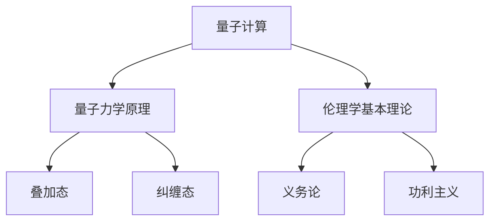

                 

<think>
好，我现在需要帮助用户撰写一篇关于量子计算伦理的技术博客文章。用户给出了详细的要求，包括结构、关键词、摘要以及各章节的内容。首先，我要理解用户的需求，确保文章符合他们的期望。

用户希望文章结构清晰，逻辑严密，内容详实。标题是《量子计算伦理：未来科技的道德预设》，关键词需要5-7个，我先列出：量子计算、伦理、道德、技术发展、隐私保护、社会影响、伦理法规。

接下来，摘要部分需要概括文章的核心内容。我应该简明扼要地说明文章探讨了量子计算带来的伦理问题，涵盖理论、应用、隐私保护、军事伦理、社会影响、法规政策和未来展望。

在正文部分，文章需要按照目录大纲展开。引言部分包括背景、意义和研究现状。核心章节有七章，分别涉及理论基础、实践应用、伦理问题、社会影响、法规政策和未来展望。每个章节下还有细分内容，如数学模型、应用案例等。

我需要确保每个章节内容详实，使用专业而易懂的语言。例如，在理论基础部分，我需要解释量子力学和伦理学的基本概念，并用Mermaid绘制实体关系图。在实践应用中，要具体说明量子计算在密码学和通信中的应用，以及对商业模式的影响。

此外，用户强调要使用Markdown格式，包含数学公式、算法流程图和系统架构图。我需要在合适的地方嵌入这些内容，比如用LaTeX公式和Mermaid图表来增强文章的可读性和专业性。

在撰写过程中，我需要逐步分析每个部分，确保逻辑连贯，内容全面。例如，在讨论隐私保护问题时，要详细解释量子密钥分发和隐私增强通信，并举例说明其应用和潜在风险。

最后，用户要求在文章末尾添加作者信息，格式为指定的机构名称和联系方式。我需要确保这部分准确无误，与文章整体风格一致。

总结一下，我需要按照用户提供的大纲，逐步展开每个章节，确保内容符合逻辑、结构清晰、语言专业，同时满足所有格式和内容的要求。这样，才能写出一篇高质量的技术博客文章，帮助读者深入理解量子计算伦理的各个方面。
</think>

# 量子计算伦理：未来科技的道德预设

> 关键词：量子计算、伦理、道德、技术发展、隐私保护、社会影响、伦理法规

> 摘要：随着量子计算技术的快速发展，其在科学研究、商业应用、军事技术等领域的潜力逐渐显现。然而，量子计算的崛起也带来了诸多伦理问题，如隐私保护、技术滥用、社会公平等。本文旨在探讨量子计算伦理的核心问题，分析其在实践中的伦理挑战，并提出相应的道德准则和政策建议，以期为未来科技的发展提供伦理预设。

---

### 引言

#### 1.1 量子计算伦理的背景

量子计算是一种基于量子力学原理的计算方式，其核心优势在于处理复杂问题的能力远超经典计算机。然而，量子计算的快速发展也引发了一系列伦理问题。例如，量子计算在密码学中的应用可能威胁现有加密技术的安全性，从而引发隐私保护的争议。此外，量子计算的潜在军事应用也引发了伦理学家对技术滥用的担忧。

#### 1.2 量子计算伦理的意义

科技与伦理的交织是现代社会发展的重要议题。量子计算作为一项前沿技术，其伦理问题不仅关乎技术本身，还涉及社会、经济、法律等多个层面。通过探讨量子计算伦理，我们可以更好地理解技术与人类社会的关系，并为未来的科技发展提供道德指引。

#### 1.3 量子计算伦理的研究现状

目前，国内外关于量子计算伦理的研究主要集中在以下几个方面：量子计算在密码学中的应用、量子隐私保护技术、量子计算的军事伦理问题等。然而，相关研究仍存在诸多不足，例如缺乏系统性理论框架、伦理准则的具体实施路径尚未明确等。

---

### 核心章节

#### 第2章 量子计算伦理的理论基础

##### 2.1 核心概念

量子计算伦理涉及多个核心概念，包括量子力学原理、伦理学基本理论等。以下是这些概念的简要说明：

- **量子力学原理**：量子力学是量子计算的理论基础，其核心包括波函数、叠加态、纠缠态等概念。
- **伦理学基本理论**：伦理学研究的是行为的对错问题，其基本理论包括义务论、功利主义等。

##### 2.2 概念关系图

以下是一个简单的概念关系图，展示了量子计算伦理中的核心概念及其关系：

##### 2.3 量子计算伦理的数学模型

量子计算的数学模型是理解其伦理问题的重要工具。以下是一个简单的量子计算模型：

$$
|\psi\rangle = \alpha|0\rangle + \beta|1\rangle
$$

其中，$|\psi\rangle$ 表示量子态，$\alpha$ 和 $\beta$ 是对应的概率幅。

---

#### 第3章 量子计算伦理的实践应用

##### 3.1 量子计算伦理在科学研究中的应用

量子计算在科学研究中的应用主要体现在以下几个方面：

- **密码学**：量子计算的快速发展可能威胁现有的加密技术，例如RSA加密算法。
- **通信**：量子通信技术（如量子密钥分发）可以提供更高的安全性。

##### 3.2 量子计算伦理在商业领域中的应用

量子计算在商业领域中的应用同样引发了诸多伦理问题：

- **商业模式**：量子计算的高成本可能使得只有少数企业能够负担得起，从而加剧社会不平等。
- **商业决策**：量子计算的应用可能改变企业的决策方式，例如在金融领域的投资决策。

---

#### 第4章 量子计算伦理问题探讨

##### 4.1 量子计算隐私保护问题

量子计算的隐私保护问题主要体现在以下几个方面：

- **量子密钥分发**：通过量子纠缠技术实现安全的密钥分发。
- **量子隐私增强通信**：利用量子叠加态实现更高级别的隐私保护。

##### 4.2 量子计算军事应用伦理

量子计算的军事应用可能引发以下伦理问题：

- **量子计算武器化**：量子计算技术可能被用于开发新型武器系统。
- **军事伦理的挑战**：如何在战争中合理使用量子计算技术是一个亟待解决的问题。

---

#### 第5章 量子计算伦理与社会影响

##### 5.1 量子计算对社会的影响

量子计算的发展可能对社会产生深远影响，例如：

- **科技进步与社会变革**：量子计算可能推动新一轮科技革命，改变社会的组织形式。
- **伦理问题的社会影响**：量子计算的伦理问题可能引发社会广泛讨论。

##### 5.2 伦理决策与社会责任

在量子计算的伦理决策过程中，企业和政府需要承担以下责任：

- **伦理决策过程**：企业在应用量子计算技术时需要考虑其对社会的影响。
- **社会责任**：政府需要制定相关政策，确保量子计算技术的合理使用。

---

#### 第6章 量子计算伦理法规与政策

##### 6.1 国际量子计算伦理法规

目前，国际社会正在逐步建立量子计算伦理法规，例如：

- **主要国家的法规**：美国、欧盟等国家和地区已经制定了相关政策。
- **国际合作**：国际组织正在推动量子计算伦理的国际合作。

##### 6.2 中国量子计算伦理法规

中国在量子计算伦理方面也制定了相关政策，例如：

- **法规框架**：中国政府正在制定量子计算伦理的法规框架。
- **伦理监管机制**：中国计划建立量子计算伦理的监管机制。

---

#### 第7章 未来展望与挑战

##### 7.1 未来量子计算伦理发展趋势

随着量子计算技术的进一步发展，其伦理问题将更加复杂。例如：

- **技术进步带来的伦理挑战**：新的量子计算技术可能引发新的伦理问题。
- **社会伦理观念的变化**：社会对量子计算伦理的认知将逐步深化。

##### 7.2 研究方向与建议

未来的研究方向应集中在以下几个方面：

- **量子计算伦理研究的重点领域**：例如量子计算在隐私保护、军事应用等领域的伦理问题。
- **伦理教育和公众参与**：通过教育和宣传提高公众对量子计算伦理的认知。

---

### 总结

#### 8.1 全书总结

量子计算伦理是一个复杂的议题，涉及技术、社会、法律等多个层面。本文从理论基础、实践应用、伦理问题、社会影响、法规政策等多个角度探讨了量子计算伦理的核心问题，并提出了相应的道德准则和政策建议。

#### 8.2 注意事项与展望

在未来的科技发展中，我们需要持续关注量子计算伦理问题，并制定相应的伦理规范。同时，我们还需要加强国际合作，共同应对量子计算伦理带来的挑战。

---

作者：AI天才研究院/AI Genius Institute & 禅与计算机程序设计艺术 /Zen And The Art of Computer Programming

