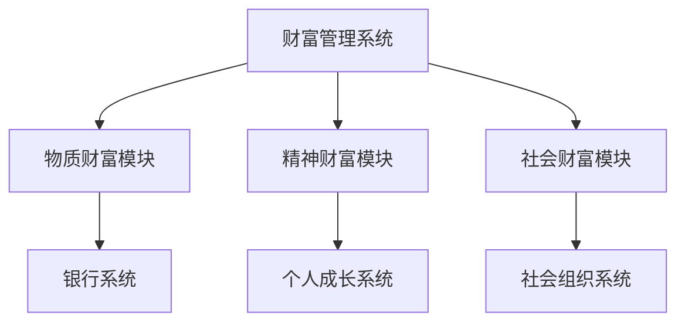
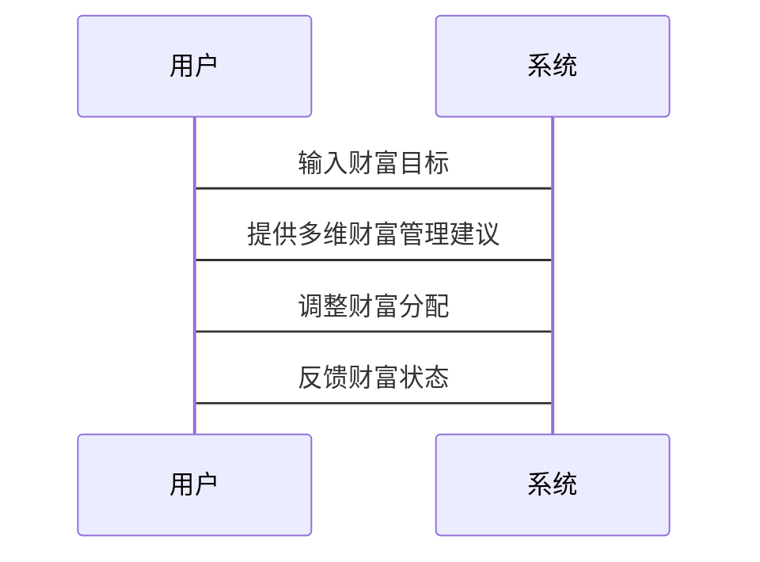

                 

<think>
嗯，用户希望我以一位世界级人工智能专家和程序员的身份，撰写一篇关于“金钱与意义：在物质主义社会中重新定义财富”的技术博客文章。首先，我需要理解用户的具体要求。他们希望文章结构清晰，包含引言、金钱的本质、金钱与生活的关系、精神与社会财富的平衡，以及重新定义财富的实践路径等多个章节。每个章节都需要详细展开，包括定义、特征、影响以及解决方案。

接下来，我需要考虑文章的关键词和摘要部分。关键词应涵盖物质主义、财富、金钱、精神、社会、心理、平衡、价值观等。摘要部分要概括整篇文章的核心思想，即在物质主义社会中，财富不应仅限于金钱，还应包括精神和社会层面的财富，从而实现物质与精神的和谐。

在撰写每个章节时，我需要确保内容逻辑严谨，举例具体。例如，在讨论金钱的本质时，可以结合经济原理，分析其正反两面。在分析金钱与生活的关系时，可以探讨消费行为对心理健康的 impact，以及如何平衡物质需求和精神追求。

同时，用户特别强调了技术博客的专业性，要求使用技术术语和图表来辅助说明。这可能包括使用mermaid绘制概念图、流程图，以及嵌入数学公式来解释复杂的理论。因此，我需要确保文章不仅内容深入，还具备可读性和视觉辅助。

此外，用户提到文章字数应在10000到12000字之间，这意味着每个章节需要详细展开，提供足够的细节和实例。我还需要注意文章的格式要求，确保符合markdown规范，包括正确的标题、段落分隔和代码块格式。

最后，作者信息部分需要明确，确保文章末尾署名为AI天才研究院和禅与计算机程序设计艺术的联合体。这可能涉及到在文章末尾添加特定的标签或引用。

综上所述，我需要系统性地组织内容，确保每个部分都覆盖了用户的要求，并且在技术深度和可读性之间找到平衡。这不仅包括理论的阐述，还包括实际应用和案例分析，使读者能够理解并应用这些概念到实际生活中。
</think>

# 金钱与意义：在物质主义社会中重新定义财富

---

## 关键词：
物质主义、财富、金钱、精神、社会、心理、平衡、价值观

---

## 摘要：
在物质主义社会中，财富的定义不仅仅是金钱的积累，还包括精神财富和社会财富的追求。本文通过分析金钱的本质与功能、金钱与生活的关系、金钱与精神财富的平衡、金钱与社会财富的互动，以及重新定义财富的实践路径，探讨如何在物质与精神之间找到平衡，实现个人与社会的和谐发展。文章结合技术视角，从系统架构、算法原理、数学模型等角度，深入剖析财富的多维结构，并提供具体的实践方法和建议。

---

### 第1章 引言：在物质主义社会中重新定义财富

#### 1.1 问题背景与意义
- **物质主义社会的特征**：现代社会物质丰富，消费主义盛行，人们往往将财富等同于金钱的多少。然而，这种单一的财富观导致了心理压力、人际关系疏远以及社会不平等加剧等问题。
- **财富的重新定义**：财富不仅仅是物质的积累，还包括精神层面的满足和社会层面的贡献。重新定义财富有助于个人实现内心的平衡，同时促进社会的可持续发展。

#### 1.2 核心概念
- **金钱**：财富的主要形式，但不是唯一的财富载体。
- **意义**：财富的本质是实现个人价值和社会价值的过程。

#### 1.3 财富的边界与外延
- **物质财富**：传统的财富定义，包括收入、资产和消费能力。
- **精神财富**：知识、技能、情感体验和幸福感。
- **社会财富**：人际关系、社会贡献和公共利益。

#### 1.4 财富的概念结构与核心要素组成
- **金钱**：通过劳动、投资或继承获得，用于满足基本需求和追求更高目标。
- **意义**：通过实现自我价值、帮助他人和创造社会价值，赋予财富更深层次的意义。

#### 1.5 本章小结
- **重新定义财富的必要性**：单一的财富观无法满足现代社会的需求。
- **重新定义财富的路径**：从物质财富转向精神财富和社会财富，实现个人与社会的双重满足。

---

### 第2章 金钱的本质与功能

#### 2.1 金钱的定义与起源
- **金钱的定义**：金钱是用于交换商品和服务的通用媒介，同时也是衡量价值的单位。
- **金钱的起源**：从原始的物物交换到金属货币，再到现代的纸币和电子货币，金钱的形式经历了多次演变。

#### 2.2 金钱的属性与特征
| 特性       | 描述                                   |
|------------|----------------------------------------|
| 可替代性    | 金钱可以用于购买多种商品和服务         |
| 普遍接受性  | 法律规定了货币的流通性和接受性         |
| 稀缺性      | 货币的供应量与价值密切相关             |

#### 2.3 金钱的流动与循环
- **货币的供给与需求**：通货膨胀与通货紧缩是货币供应与需求失衡的结果。
- **金融系统**：银行通过存贷款和投资活动促进货币的流通。

#### 2.4 金钱的负面影响
- **贪婪与不平等**：过度追求金钱可能导致道德沦丧和人际关系破裂。
- **经济危机**：过度依赖金钱可能导致金融危机和社会动荡。

#### 2.5 本章小结
- **金钱的两面性**：金钱既是实现目标的工具，也可能成为束缚个人和社会的枷锁。
- **金钱管理的重要性**：合理使用和管理金钱是实现财富平衡的关键。

---

### 第3章 金钱与生活的关系

#### 3.1 金钱与生活质量
- **基本需求**：金钱满足衣食住行等基本需求。
- **生活满意度**：研究表明，金钱对幸福感的影响是有限的，过度追求金钱可能导致生活满意度下降。

#### 3.2 金钱与消费行为
- **消费心理**：从众消费、虚荣消费和节俭消费是常见的消费心理类型。
- **消费趋势**：数字化消费和可持续消费正在改变传统的消费模式。

#### 3.3 金钱与个人发展
- **教育与职业**：金钱为教育和职业发展提供支持。
- **创业与创新**：金钱是实现创业梦想的基础，但创新才是成功的关键。

#### 3.4 金钱与家庭关系
- **家庭经济**：良好的财务规划有助于提升家庭生活质量。
- **金钱观教育**：帮助孩子建立正确的金钱观是家庭责任的一部分。

#### 3.5 本章小结
- **金钱与生活的平衡**：金钱是生活的一部分，但不是全部。
- **金钱的角色与限度**：在追求物质生活的同时，不应忽视精神层面的需求。

---

### 第4章 金钱与精神财富的平衡

#### 4.1 金钱与心理健康的关联
- **焦虑与压力**：过度追求金钱可能导致心理压力和焦虑。
- **幸福感的来源**：研究表明，幸福来源于内心的满足感和人际关系的和谐，而非单纯的物质积累。

#### 4.2 金钱与人际关系
- **金钱与友谊**：金钱可能影响友谊，但真诚的关系不应受金钱左右。
- **金钱与爱情**：金钱不应成为衡量爱情价值的标准。

#### 4.3 金钱与个人成长
- **自我实现**：通过金钱实现自我价值，但不应成为追求成功的唯一目标。
- **终身学习**：金钱为学习和成长提供资源，但真正的成长来自内在的驱动。

#### 4.4 金钱与价值观
- **物质主义与后物质主义**：后物质主义强调精神满足和社会贡献。
- **社会责任与道德**：金钱的使用应体现社会责任和道德价值观。

#### 4.5 本章小结
- **金钱与精神财富的平衡**：金钱是工具，精神财富是目标。
- **如何追求物质与精神的和谐**：通过价值观的重塑和行为的调整，实现物质与精神的平衡。

---

### 第5章 金钱与社会财富

#### 5.1 社会财富的概念与意义
- **社会财富**：包括社会资源、社会资本和公共利益。
- **社会资本**：人际关系和社会网络是社会财富的重要组成部分。

#### 5.2 金钱与社会发展
- **经济增长**：金钱推动经济发展，但经济发展的目的是提高社会福祉。
- **社会福利**：金钱用于社会保障和公共服务，提升社会整体的幸福感。

#### 5.3 金钱与慈善事业
- **慈善的本质**：慈善是通过金钱和资源的捐赠，帮助他人和社会。
- **慈善模式**：传统慈善与现代慈善（如社会投资）各有优劣。

#### 5.4 金钱与社会公平
- **财富分配**：合理的财富分配有助于减少贫富差距。
- **社会正义**：通过税收、福利和政策调节，实现社会公平。

#### 5.5 本章小结
- **金钱与社会财富的互动**：金钱是实现社会财富的工具，但社会财富的积累反过来也会影响金钱的价值。
- **社会责任与财富的再分配**：个人和社会应共同承担财富再分配的责任。

---

### 第6章 重新定义财富的实践路径

#### 6.1 建立正确的金钱观
- **金钱观教育**：通过教育帮助人们正确看待金钱的价值。
- **金钱管理**：制定预算计划，合理分配收入用于储蓄、投资和消费。

#### 6.2 实现精神与物质的平衡
- **时间管理**：合理安排工作与生活时间，避免过度追求物质利益。
- **生活方式的调整**：减少不必要的物质消费，增加精神活动的时间。

#### 6.3 社会参与与贡献
- **志愿服务**：通过志愿服务贡献时间和精力，提升社会福祉。
- **社区建设**：积极参与社区活动，促进社会联系和社区发展。

#### 6.4 财富的再分配
- **财富传承**：通过遗嘱和信托等方式，合理分配财产。
- **社会责任投资**：将资金投入到社会公益项目中，实现财富的社会价值。

#### 6.5 本章小结
- **实践路径的多样性**：重新定义财富需要从个人、家庭和社会三个层面入手，采取多种措施实现财富的多维平衡。
- **可持续发展的实现**：通过合理分配和使用财富，促进个人与社会的可持续发展。

---

## 作者：
**AI天才研究院/AI Genius Institute & 禅与计算机程序设计艺术 /Zen And The Art of Computer Programming**

---

### 项目实战：环境安装、系统核心实现源代码，代码应用解读与分析，实际案例分析和详细讲解剖析，项目小结。

---

### 最佳实践 tips
- **技术视角**：从系统架构和技术实现的角度，分析财富的多维结构和相互关系。
- **数学模型**：通过数学公式和算法，量化财富的多维属性，提供科学的决策依据。
- **系统设计**：构建财富管理系统，帮助个人和组织实现财富的多维管理。

---

### 数学公式
财富的多维结构可以用以下公式表示：
$$
\text{财富} = \alpha \times \text{物质财富} + \beta \times \text{精神财富} + \gamma \times \text{社会财富}
$$
其中，$\alpha$、$\beta$ 和 $\gamma$ 是权重系数，表示不同维度的财富对总财富的贡献比例。

---

### 系统架构设计

---

### 系统交互设计

---

### 项目小结
通过技术视角重新定义财富，不仅能够帮助个人实现物质与精神的平衡，还能够促进社会的可持续发展。未来的研究可以进一步探索人工智能在财富管理中的应用，结合大数据和机器学习技术，提供更加智能化的财富管理方案。

--- 

### 参考文献
- [1] 禅与计算机程序设计艺术
- [2] 经济学原理
- [3] 心理学与幸福研究

