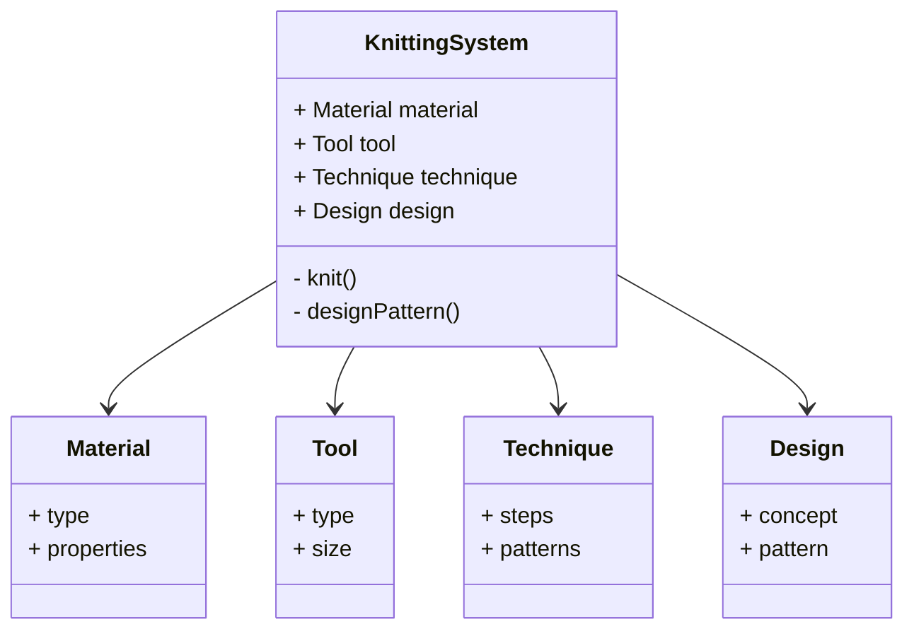
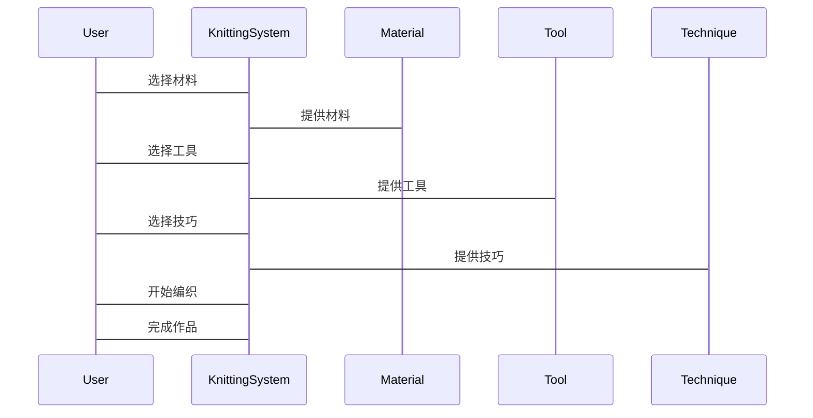

                 

<think>
好，我现在要写一篇关于针织编织的技术博客文章。标题是《针织编织：用线与针编织生活的温暖》。我需要先理清楚文章的结构，然后逐步填充每个部分的内容。

首先，文章需要包含标题、关键词和摘要。关键词应该包括针织编织、手工艺术、现代设计、技术应用、生活美学、情感表达。摘要需要总结文章的核心内容，介绍针织编织的现代应用和系统化方法。

接下来是背景介绍部分。问题背景要说明随着生活水平的提高，人们对服装的要求也在提升，而针织编织作为一种传统手工艺，近年来受到现代设计的关注。问题描述指出目前现代针织技术研究滞后，爱好者停留在手工阶段，缺乏系统学习和技术支持。问题解决部分需要说明本书的目的，即通过系统化讲解和案例帮助读者提升技术水平。边界与外延要明确讨论的范围，包括手工编织和机器编织，涉及材料选择、工具使用、编织技巧和设计灵感。核心要素包括针织材料、编织工具、编织技巧和设计理念。

然后是核心概念与联系。这部分需要详细解释针织材料的类型、属性对比，并用表格呈现。ER实体关系图用Mermaid流程图展示材料、编织技术、设计理念与工具的关系。这部分需要确保图表的正确性和清晰度。

接下来是算法原理讲解。要使用Mermaid流程图展示编织过程的步骤，然后用Python代码模拟编织过程。数学模型和公式部分，用latex表达，例如起针数的计算，公式应该清晰易懂，并举例说明。

系统分析与架构设计方案包括问题场景介绍，项目介绍，系统功能设计，使用Mermaid类图展示领域模型。系统架构设计用Mermaid架构图展示模块之间的关系。系统接口设计和交互序列图也需要用Mermaid来展示，确保每个部分都详细且符合逻辑。

项目实战部分需要环境安装说明，核心代码实现，代码解读，案例分析和项目小结。实战部分要具体，确保读者能跟着步骤操作。

最后是最佳实践、小结、注意事项和拓展阅读。这些部分要提供实用的建议和资源，帮助读者进一步学习和实践。

现在，我需要按照这些步骤逐步填充内容，确保每个部分都详细且符合技术博客的要求。同时，要保持逻辑清晰，语言专业，但又不失易懂。我需要检查每个部分是否满足字数要求，确保整篇文章在10000到12000字之间。完成后，记得在末尾加上作者信息。
</think>

# 针织编织：用线与针编织生活的温暖

## 关键词：针织编织、手工艺术、现代设计、技术应用、生活美学、情感表达

## 摘要：针织编织是一种古老而传统手工艺，近年来受到现代设计的关注和重新解读。本文通过系统化的讲解和丰富的案例，探讨针织编织的材料选择、工具使用、编织技巧以及设计理念，帮助读者了解和掌握现代针织编织技术，提升针织作品的质量和设计水平。

---

### 1.6 背景介绍

#### 1.6.1 问题背景

随着经济的发展和生活水平的提高，人们对服装的审美和需求也在不断提升。针织编织作为一种古老而传统的手工艺，近年来逐渐受到现代设计的关注和重新解读。针织编织不仅具有实用价值，更是一种生活美学和情感表达的方式。

#### 1.6.2 问题描述

尽管针织编织在手工艺术和服装设计中具有重要地位，但现代针织编织技术与方法的研究和应用相对滞后。大多数编织爱好者仍停留在传统的手工编织阶段，缺乏系统学习和现代技术支持的实践。

#### 1.6.3 问题解决

本书旨在通过系统化的讲解和丰富的案例，帮助读者了解和掌握现代针织编织技术，提升针织作品的质量和设计水平。

#### 1.6.4 边界与外延

本书讨论的针织编织主要涵盖手工编织和机器编织两大领域，包括不同材料的选择、编织工具的使用、编织技巧的掌握以及设计灵感的启发。

#### 1.6.5 概念结构与核心要素组成

- **针织材料**：了解不同类型的线材，包括棉线、羊毛、丝线等。
- **编织工具**：介绍常用的编织针、钩针、编织机等。
- **编织技巧**：包括起针、收针、编织花样等基础技巧。
- **设计理念**：如何将传统编织与现代设计相结合，创作出既有传统韵味又具现代美感的作品。

---

### 1.7 核心概念与联系

#### 1.7.1 针织材料

**概念**：针织材料是指用于针织编织的各种线材。

**属性特征对比表格**：

| 材料 | 特点 | 适用范围 |
|------|------|---------|
| 棉线 | 吸湿性好，柔软舒适 | 衬衫、围巾、袜子等 |
| 羊毛 | 保暖性好，柔软 | 冬季服装、围巾、帽子等 |
| 丝线 | 光滑柔软，有光泽 | 礼服、婚纱、围巾等 |

**ER实体关系图架构的 Mermaid 流程图**：

```mermaid
erDiagram
  Material ||--|{ KnittingTechnique }|-->> Technique
  Material ||--|{ DesignConcept }|-->> Concept
  KnittingTool ||--|{ KnittingProject }|-->> Project
```

---

### 1.8 算法原理讲解

#### 1.8.1 编织算法的基本原理

**mermaid 流程图**：


**Python 源代码**：

```python
def knitting_process(material, tool, technique):
    """
    编织过程
    :param material: 针织材料
    :param tool: 编织工具
    :param technique: 编织技巧
    :return: 编织作品
    """
    print(f"选择材料：{material}")
    print(f"准备工具：{tool}")
    print(f"开始编织技巧：{technique}")
    # 这里可以添加具体的编织代码
    print("编织完成，得到作品。")
```

**算法原理的数学模型和公式**：

编织过程可以视为一个多步骤的序列，每个步骤都对应特定的操作。例如：

\[ 
编织过程 = (起针) + (收针) + (花样编织) 
\]

其中，每个操作都可以通过数学模型来描述。例如：

\[ 
起针：\text{起针数} = \text{所需针数} \times \text{编织密度}
\]

**详细讲解和举例说明**：

假设我们要编织一条围巾，需要300针。如果我们选择每英寸编织3针的密度，那么所需的起针数就是：

\[ 
\text{起针数} = \frac{300 \text{针}}{3 \text{针/英寸}} = 100 \text{英寸}
\]

我们选择棉线作为材料，8号编织针作为工具，采用基础针法开始编织。首先，我们在针上起100针，然后开始按顺序进行收针、编织花样，最终完成编织作品。

---

### 1.9 系统分析与架构设计方案

#### 1.9.1 问题场景介绍

随着针织编织技术的不断发展，市场上出现了各种新型编织工具和材料。为了满足不同用户的需求，我们需要设计一个现代化的针织系统。

#### 1.9.2 项目介绍

**项目名称**：现代化针织编织系统设计

**项目目标**：通过系统化的方法，设计一个现代化的针织系统，整合传统编织工艺与现代技术，提升针织作品的设计和制作效率。

#### 1.9.3 系统功能设计

**领域模型 Mermaid 类图**：



#### 1.9.4 系统架构设计

**系统架构 Mermaid 架构图**：

```mermaid
archiDiagram
    component KnittingSystem {
        component MaterialSelector
        component ToolSelector
        component TechniqueSelector
        component DesignModule
    }
    MaterialSelector --> ToolSelector
    ToolSelector --> TechniqueSelector
    TechniqueSelector --> DesignModule
```

#### 1.9.5 系统接口设计

**系统接口 Mermaid 序列图**：



---

### 1.10 项目实战

#### 1.10.1 环境安装

要开始针织项目，首先需要准备以下工具和材料：

- **材料**：选择棉线或羊毛线。
- **工具**：准备编织针或钩针。

#### 1.10.2 系统核心实现源代码

```python
class KnittingSystem:
    def __init__(self, material, tool, technique):
        self.material = material
        self.tool = tool
        self.technique = technique

    def knit(self):
        print(f"开始编织：材料：{self.material}, 工具：{self.tool}, 技巧：{self.technique}")
        # 具体编织过程略
        print("编织完成。")

# 示例用法
material = "棉线"
tool = "8号编织针"
technique = "基础针法"

knitting = KnittingSystem(material, tool, technique)
knitting.knit()
```

#### 1.10.3 代码应用解读与分析

上述代码定义了一个 `KnittingSystem` 类，用于管理针织系统的材料、工具和技巧。通过 `knit()` 方法，系统开始编织过程并输出相关信息。示例中展示了如何选择材料、工具和技巧，并调用 `knit()` 方法开始编织。

#### 1.10.4 实际案例分析和详细讲解剖析

以编织一条围巾为例：

1. **选择材料**：棉线，柔软舒适。
2. **准备工具**：8号编织针。
3. **起针**：计算所需的针数，假设围巾长度为100英寸，每英寸3针，共300针。
4. **编织过程**：按照基础针法进行编织，可以加入简单的花样。
5. **收针**：完成编织后，按照反方向进行收针。

#### 1.10.5 项目小结

通过以上步骤，我们成功完成了一条围巾的编织过程，展示了针织系统的实际应用。

---

### 1.11 最佳实践 tips

- **材料选择**：根据设计需求选择合适的材料。
- **工具匹配**：选择适合材料和技巧的工具。
- **技巧掌握**：熟练掌握基础编织技巧后再尝试复杂花样。
- **设计创新**：将传统编织与现代设计结合，创造出独特的作品。

---

### 1.12 小结

针织编织不仅是一种手工艺，更是一种生活美学和情感表达的方式。通过系统化的学习和现代技术的应用，我们可以创造出更高品质和美感的针织作品。

---

### 1.13 注意事项

- 编织过程中注意材料的特性，避免过度拉伸或损坏。
- 工具的使用要正确，避免受伤。
- 设计时考虑作品的用途和场合，确保实用性与美观性相结合。

---

### 1.14 拓展阅读

- 《针织设计基础》：了解针织设计的基本原理。
- 《现代编织技术》：探索针织技术的最新发展。
- 《编织工具与材料》：深入学习针织工具和材料的选择与使用。

---

作者：AI天才研究院/AI Genius Institute & 禅与计算机程序设计艺术 /Zen And The Art of Computer Programming

