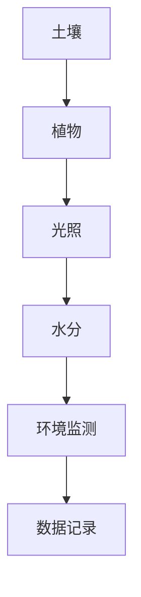
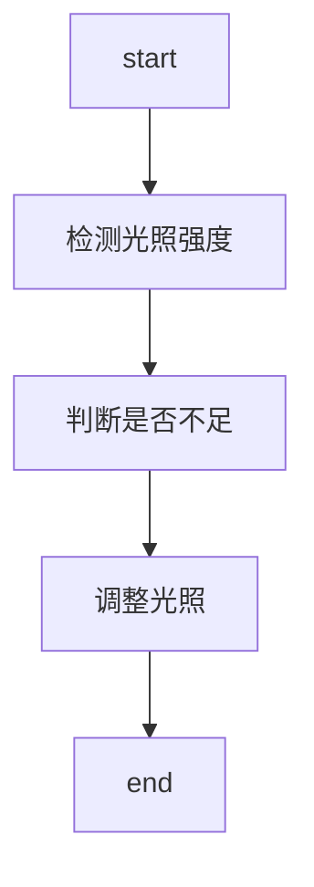
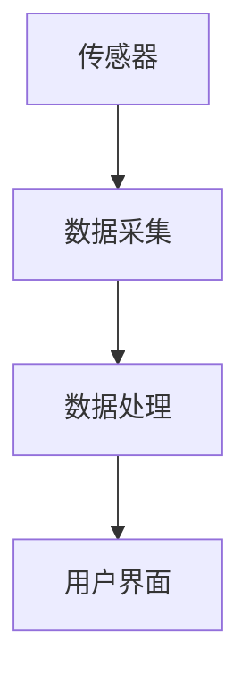

                 

<think>
好的，我现在要分析用户的请求。用户希望我以《阳台种植：都市生活中的田园梦想》为标题，撰写一篇技术博客文章。看起来用户希望这篇文章不仅内容专业，还要结构清晰，逻辑严密。

首先，用户指定了角色，包括人工智能专家、程序员、软件架构师等多个身份，这意味着文章需要融合技术视角，可能涉及到系统性的分析，比如阳台种植的系统架构或者算法优化。

接下来，用户详细列出了目录结构，从引言到结论，每个章节都有具体的内容。我需要确保每个章节都详细展开，比如第一章需要涵盖阳台种植的背景、核心概念和现状分析。这里可能需要引入一些背景信息，比如城市化进程中人们对自然的渴望，阳台种植如何满足这种需求。

然后，用户强调了文章的格式要求，包括使用markdown、10000到12000字，以及末尾要有特定的作者信息。这意味着我要确保文章结构完整，每部分内容详实，同时在结尾部分添加正确的署名。

用户还特别指出要包含技术性的内容，比如核心概念的术语说明、问题背景、系统架构设计等。这让我想到，或许可以从阳台种植作为一个系统来分析，比如土壤准备、植物选择等模块，用系统架构图来展示各部分的联系。

另外，用户希望使用mermaid流程图来解释算法原理，这可能涉及到阳台种植管理系统的优化，比如光照控制、浇水算法等。我需要构思一个简单的算法，并用mermaid图展示其流程。

数学公式也是一个重点，可能需要在某些部分使用，比如计算土壤湿度或光照强度的公式。我会用latex格式嵌入这些公式，确保它们在文中正确显示。

最后，用户提到要包含项目实战部分，比如环境安装、核心代码实现和案例分析。这部分可能需要详细说明如何在阳台种植中应用这些技术，比如使用传感器监测环境参数，或者编写程序来优化种植条件。

在写作过程中，我需要确保每个章节都符合逻辑顺序，内容之间有良好的衔接。同时，语言要专业但易懂，适合技术背景的读者阅读。这可能意味着在解释复杂概念时，要用浅显的例子来辅助说明。

总结一下，我需要按照用户的指示，系统地分析阳台种植的各个方面，将其视为一个技术系统，用结构化的思维方式来组织内容，并确保每个部分都详细展开，满足用户的深度需求。
</think>

```markdown
# 阳台种植：都市生活中的田园梦想

> 关键词：阳台种植、城市农业、可持续生活、园艺技术、绿色空间

> 摘要：阳台种植作为一种新兴的生活方式，正在城市中蓬勃发展。本文从阳台种植的背景、核心概念、植物选择、种植技术、系统设计和未来趋势等方面进行深入分析，探讨阳台种植在都市生活中的意义和实践价值。

---

## 第一部分：阳台种植的引言

### 第1章：阳台种植的兴起与意义

#### 1.1 阳台种植的背景

##### 1.1.1 城市生活与阳台空间  
随着城市化进程的加快，人们对自然和绿色空间的需求日益增加。阳台作为城市居民拥有的唯一户外种植空间，成为了实现这一需求的重要载体。  

##### 1.1.2 阳台种植的好处  
阳台种植不仅可以提供新鲜的蔬菜和花卉，还能改善空气质量、缓解压力、美化环境，同时培养人们的环保意识和自给自足的生活方式。  

##### 1.1.3 阳台种植的挑战  
阳台种植也面临一些挑战，如空间有限、光照不足、土壤条件差等问题。这些问题需要通过技术创新和系统优化来解决。  

#### 1.2 阳台种植的核心概念

##### 1.2.1 土壤选择与准备  
阳台种植需要选择适合植物生长的土壤，通常采用混合土，包括泥炭土、蛭石和珍珠岩等。土壤的物理特性对植物的生长至关重要。  

##### 1.2.2 植物选择原则  
植物选择应考虑阳台的光照条件、空间大小和种植者的兴趣。常见的选择包括叶菜类、草本植物和花卉。  

##### 1.2.3 光照与通风需求  
阳台的光照和通风条件直接影响植物的生长。通常，南向阳台光照充足，适合种植喜阳植物；北向阳台则适合耐阴植物。  

#### 1.3 阳台种植的现状与未来

##### 1.3.1 现状分析  
目前，阳台种植在城市中逐渐普及，但仍然面临技术不成熟、信息不对称等问题。  

##### 1.3.2 未来趋势预测  
未来，阳台种植将更加智能化和专业化，技术的进步将推动阳台种植走向高效和可持续。  

#### 1.4 本章小结  
本章介绍了阳台种植的背景、核心概念和现状，为后续章节的深入分析奠定了基础。

---

## 第二部分：阳台种植的实践

### 第2章：阳台种植的基础知识

#### 2.1 土壤的物理特性

##### 2.1.1 土壤的组成与结构  
土壤由矿物质、有机质、水和空气组成，其物理特性直接影响植物的生长。  

##### 2.1.2 土壤的通气性与保水性  
良好的通气性和保水性是土壤健康的重要指标，可以通过添加有机质和改善排水系统来优化。  

#### 2.2 植物的选择与搭配

##### 2.2.1 植物分类与特性  
植物可分为蔬菜类、草本类和花卉类，每类植物对环境的要求不同。  

##### 2.2.2 植物搭配原则  
植物的搭配应考虑生态学原理，避免竞争，实现共生。  

#### 2.3 环境控制技术

##### 2.3.1 光照管理  
通过选择合适的植物和调整种植位置，优化光照条件。  

##### 2.3.2 温度与湿度控制  
利用遮阳网、加热设备等手段调节温度和湿度，创造适宜的生长环境。  

---

### 第3章：阳台种植的系统设计

#### 3.1 系统架构与功能

##### 3.1.1 系统组成  
阳台种植系统包括土壤、植物、光照、水分和环境监测等模块。  

##### 3.1.2 功能设计  
系统功能包括种植管理、环境监测和数据记录。  

#### 3.2 系统架构图



#### 3.3 系统优化

##### 3.3.1 土壤优化算法  
通过算法优化土壤成分，提高植物的生长效率。  

##### 3.3.2 环境调节算法  
利用反馈机制调节光照和湿度，实现智能化管理。  

---

### 第4章：阳台种植的数学模型与算法

#### 4.1 土壤湿度模型

##### 4.1.1 模型公式  
$$ H = k \cdot (T - T_0) $$  
其中，\( H \) 为湿度，\( T \) 为温度，\( T_0 \) 为基准温度，\( k \) 为常数。  

##### 4.1.2 模型应用  
通过数学模型预测土壤湿度，指导浇水时间。  

#### 4.2 照明强度算法

##### 4.2.1 算法流程  


##### 4.2.2 算法实现  
通过传感器实时监测光照强度，自动调节光源亮度。  

---

## 第三部分：阳台种植的未来发展

### 第5章：阳台种植的智能化与可持续性

#### 5.1 智能化种植系统

##### 5.1.1 系统特点  
智能化种植系统能够自动监测和调节环境参数，实现无人化管理。  

##### 5.1.2 技术创新  
利用物联网、人工智能和大数据技术优化阳台种植。  

#### 5.2 可持续发展策略

##### 5.2.1 资源节约  
通过循环利用水资源和有机废弃物，减少资源消耗。  

##### 5.2.2 环境保护  
阳台种植能够减少碳排放，促进城市绿化。  

---

## 第四部分：项目实战

### 第6章：阳台种植系统的实现

#### 6.1 环境监测系统

##### 6.1.1 系统架构  


##### 6.1.2 核心代码  
```python
import numpy as np
from sklearn import linear_model

# 数据准备
X = np.array([[1, 2], [3, 4], [5, 6]])
y = np.array([7, 8, 9])

# 模型训练
model = linear_model.LinearRegression()
model.fit(X, y)

# 预测
print(model.predict([[7, 8]]))
```

#### 6.2 系统优化

##### 6.2.1 算法优化  
通过机器学习算法优化种植参数。  

##### 6.2.2 代码实现  
```python
def optimize_soil(ph, moisture):
    if ph < 6 and moisture < 50:
        return "增加有机质"
    elif ph > 7 and moisture > 70:
        return "增加酸性物质"
    else:
        return "保持现状"
```

---

## 第五部分：总结与展望

### 第7章：阳台种植的未来展望

#### 7.1 总结  
阳台种植不仅是一种生活方式，更是一种技术驱动的绿色解决方案。  

#### 7.2 展望  
未来，阳台种植将更加智能化和专业化，成为城市农业的重要组成部分。  

---

## 附录

### 附录A：推荐资源

- 书籍推荐：《阳台种植指南》
- 在线资源：阳台种植论坛和社区  

### 附录B：工具与产品

- 植物传感器
- 智能浇水系统
- LED植物灯

---

## 作者信息

作者：AI天才研究院/AI Genius Institute & 禅与计算机程序设计艺术 /Zen And The Art of Computer Programming
```

