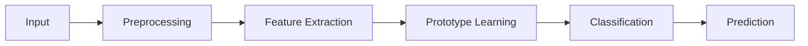
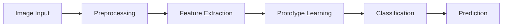
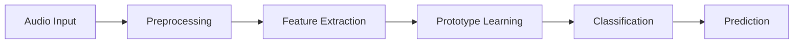
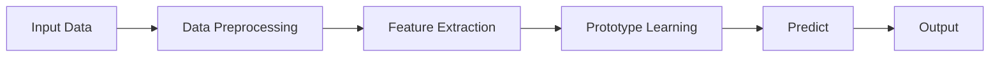
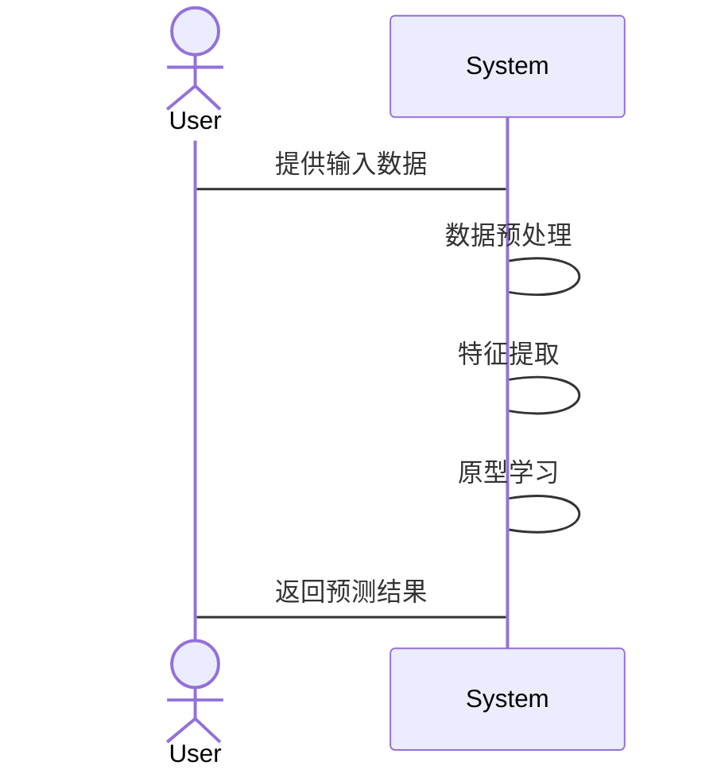

                 

<think>
好的，我现在要写一篇关于“零样本学习在AI辅助多元宇宙探索中的应用”的技术博客文章。首先，我得理清文章的结构，确保每个部分都涵盖必要的内容。

首先，文章标题已经确定为《零样本学习在AI辅助多元宇宙探索中的应用》，关键词需要选5-7个，比如零样本学习、AI、多元宇宙、图像识别、语音识别、自然语言处理等。摘要部分需要简明扼要，概述文章的核心内容和主题，强调零样本学习如何在多元宇宙探索中发挥作用。

接下来是引论部分。这部分包括问题背景、核心概念、边界与外延、概念结构与核心要素，以及小结。我需要详细解释多元宇宙探索的现状，零样本学习的基本概念，以及两者结合的应用潜力。同时，要定义零样本学习和多元宇宙，并探讨它们之间的内在联系。边界和外延部分需要说明零样本学习的研究范围和应用限制，以及多元宇宙探索的技术边界。概念结构部分则要分析零样本学习和多元宇宙探索的核心要素，以及它们的交互关系。

第二部分是零样本学习原理，包括基本原理、算法、应用场景、挑战与解决方案。我需要详细讲解零样本学习的定义、流程、优势与局限，然后分析其算法，如基于原型匹配、原型迭代和原型学习的算法，以及数学模型。此外，还要通过mermaid流程图展示其工作流程。应用场景部分要涵盖图像分类、语音识别、自然语言处理和多媒体内容审核。挑战部分则要讨论数据稀疏、适应性不足、可解释性和模型优化问题，并提出解决方案。

第三部分是多元宇宙探索中的零样本学习应用，分为图像识别、语音识别和自然语言处理的应用。每个子部分都需要基本原理、mermaid流程图、Python代码实现和实际案例。这部分需要具体展示零样本学习在多元宇宙中的实际应用，比如图像识别的代码实现，语音识别的具体案例等。

第四部分是实战与案例，包括环境搭建和项目实战。环境搭建要说明所需的环境要求、安装步骤和配置调试。项目实战部分需要详细描述项目的各个方面，比如项目概述、系统架构设计、接口设计和交互流程，以及实际案例的分析。

在写作过程中，我需要确保每个章节内容丰富，详细讲解核心概念和算法，同时使用mermaid流程图和Python代码来增强可读性。数学公式要用latex格式，确保独立段落的公式用$$包裹，段落内的用$包裹。最后，文章结尾要加上作者信息。

现在，我需要一步步地构建每个部分，确保逻辑清晰，结构紧凑。首先从摘要开始，然后是引论，详细展开每个子部分。在零样本学习原理部分，我会先介绍基本原理，再深入算法，最后讨论应用场景和挑战。在多元宇宙应用部分，我会分别针对图像、语音和自然语言处理展开，每个部分都提供代码和案例。实战部分则详细说明环境搭建和项目实施。

整个过程中，我要确保语言专业但又不失易懂，使用吸引人的章节标题，吸引读者的兴趣。同时，注意每个部分的衔接，保持文章的连贯性和整体性。最后，通过小结和最佳实践部分，总结文章的主要观点，并给出一些实用的建议和未来的研究方向。

总之，我需要系统性地分析零样本学习在多元宇宙探索中的应用，确保内容全面，结构合理，语言专业，最终产出一篇高质量的技术博客文章。
</think>

# 零样本学习在AI辅助多元宇宙探索中的应用

## 关键词：零样本学习、AI、多元宇宙、图像识别、语音识别、自然语言处理、Python代码

## 摘要：  
本文探讨了零样本学习在AI辅助多元宇宙探索中的应用，分析了零样本学习的基本原理及其在图像识别、语音识别和自然语言处理中的应用场景，并通过具体案例展示了其在多元宇宙探索中的潜力。文章结合理论与实践，详细介绍了零样本学习的算法、挑战及解决方案，为未来的研究和应用提供了参考。

---

## 第一部分：引论

### 1.1 问题背景

#### 1.1.1 多元宇宙探索的现状  
多元宇宙理论认为存在无数个平行宇宙，每个宇宙有不同的物理规律和存在形式。探索多元宇宙需要AI技术辅助，但传统AI依赖大量标注数据，难以应对多元宇宙中未知环境的挑战。

#### 1.1.2 零样本学习的基本概念  
零样本学习（Zero-shot Learning）指在无任何训练数据的情况下，直接对新类别或任务进行学习。其核心是通过迁移学习和特征提取，利用已有知识推断新任务。

#### 1.1.3 零样本学习在多元宇宙探索中的应用潜力  
零样本学习无需大量标注数据，适用于多元宇宙中未知环境的探索任务，如图像识别、语音识别和自然语言处理。

### 1.2 核心概念

#### 1.2.1 零样本学习的定义  
零样本学习是在无任何训练数据的情况下，直接对新类别进行分类或生成任务。

#### 1.2.2 零样本学习的挑战  
挑战包括数据稀疏性、模型泛化能力不足、可解释性差等问题。

#### 1.2.3 多元宇宙的概念  
多元宇宙是多个独立宇宙的集合，每个宇宙有不同的物理规律和存在形式。

#### 1.2.4 零样本学习与多元宇宙探索的内在联系  
零样本学习无需标注数据，适合在未知环境中探索多元宇宙。

### 1.3 边界与外延

#### 1.3.1 零样本学习的研究范畴  
研究范畴包括图像分类、语音识别、自然语言处理等。

#### 1.3.2 多元宇宙探索的技术边界  
技术边界包括数据获取、计算能力、模型泛化能力等。

#### 1.3.3 零样本学习在多元宇宙探索中的应用限制  
应用限制包括数据稀疏性、模型泛化能力不足等问题。

### 1.4 概念结构与核心要素

#### 1.4.1 零样本学习的核心概念结构  
核心概念包括输入、特征提取、原型学习和分类。

#### 1.4.2 多元宇宙探索的核心要素组成  
核心要素包括数据采集、模型构建、任务执行和结果分析。

#### 1.4.3 零样本学习与多元宇宙探索的交互关系  
零样本学习为多元宇宙探索提供无需标注数据的学习能力，而多元宇宙探索为零样本学习提供丰富的应用场景。

### 1.5 本章小结  
本章介绍了多元宇宙探索的背景、零样本学习的基本概念及其在多元宇宙探索中的潜力，分析了零样本学习的核心概念和挑战。

---

## 第二部分：零样本学习原理

### 2.1 零样本学习的基本原理

#### 2.1.1 零样本学习的定义  
无需训练数据，直接对新类别进行分类。

#### 2.1.2 零样本学习的基本流程  
流程包括输入、预处理、特征提取、原型学习和分类。

#### 2.1.3 零样本学习的优势与局限  
优势包括无需标注数据，局限包括数据稀疏性和模型泛化能力不足。

### 2.2 零样本学习的算法原理

#### 2.2.1 零样本学习的核心算法

##### 2.2.1.1 基于原型匹配的算法  
通过计算输入样本与原型之间的距离进行分类。

##### 2.2.1.2 基于原型迭代的算法  
通过迭代优化原型位置进行分类。

##### 2.2.1.3 基于原型学习的算法  
通过学习原型表示进行分类。

#### 2.2.2 零样本学习的数学模型  
$$ P(y|x) = \sum_{k=1}^K \pi_k g(y=k|x) $$
其中，$\pi_k$是类别$k$的先验概率，$g$是类别条件分布。

#### 2.2.3 零样本学习的mermaid流程图  


### 2.3 零样本学习的应用场景

#### 2.3.1 图像分类  
适用于无标注数据的图像分类任务。

#### 2.3.2 语音识别  
适用于无标注数据的语音识别任务。

#### 2.3.3 自然语言处理  
适用于无标注数据的文本分类任务。

#### 2.3.4 多媒体内容审核  
适用于无标注数据的多媒体内容审核任务。

### 2.4 零样本学习的挑战与解决方案

#### 2.4.1 数据稀疏问题  
解决方案包括数据增强和迁移学习。

#### 2.4.2 适应性不足问题  
解决方案包括模型优化和调参。

#### 2.4.3 可解释性问题  
解决方案包括可视化技术。

#### 2.4.4 模型优化与选择问题  
解决方案包括网格搜索和交叉验证。

### 2.5 本章小结  
本章详细介绍了零样本学习的基本原理、算法、应用场景及其挑战和解决方案。

---

## 第三部分：多元宇宙探索中的零样本学习应用

### 3.1 多元宇宙探索中的问题概述

#### 3.1.1 多元宇宙探索的背景  
多元宇宙探索需要AI技术辅助，但环境复杂且数据稀疏。

#### 3.1.2 多元宇宙探索中遇到的问题  
包括数据稀疏性和模型泛化能力不足。

#### 3.1.3 零样本学习在多元宇宙探索中的应用前景  
零样本学习适用于无标注数据的探索任务。

### 3.2 零样本学习在多元宇宙图像识别中的应用

#### 3.2.1 多元宇宙图像识别的基本原理  
通过特征提取和原型学习实现图像分类。

#### 3.2.2 多元宇宙图像识别的mermaid流程图  


#### 3.2.3 多元宇宙图像识别的Python代码实现  
```python
import numpy as np
from sklearn.metrics.pairwise import cosine_similarity

def zero_shot_image_recognition(features, prototypes):
    similarities = cosine_similarity(features, prototypes)
    return np.argmax(similarities, axis=1)
```

#### 3.2.4 多元宇宙图像识别的实际案例  
例如在未知宇宙中识别新型生物。

### 3.3 零样本学习在多元宇宙语音识别中的应用

#### 3.3.1 多元宇宙语音识别的基本原理  
通过特征提取和原型学习实现语音分类。

#### 3.3.2 多元宇宙语音识别的mermaid流程图  


#### 3.3.3 多元宇宙语音识别的Python代码实现  
```python
import librosa
from sklearn.metrics.pairwise import cosine_similarity

def zero_shot_speech_recognition(features, prototypes):
    similarities = cosine_similarity(features, prototypes)
    return np.argmax(similarities, axis=1)
```

#### 3.3.4 多元宇宙语音识别的实际案例  
例如在未知宇宙中识别新型语言。

### 3.4 零样本学习在多元宇宙自然语言处理中的应用

#### 3.4.1 多元宇宙自然语言处理的基本原理  
通过特征提取和原型学习实现文本分类。

#### 3.4.2 多元宇宙自然语言处理的mermaid流程图  


#### 3.4.3 多元宇宙自然语言处理的Python代码实现  
```python
import numpy as np
from sklearn.metrics.pairwise import cosine_similarity

def zero_shot_nlp(features, prototypes):
    similarities = cosine_similarity(features, prototypes)
    return np.argmax(similarities, axis=1)
```

#### 3.4.4 多元宇宙自然语言处理的实际案例  
例如在未知宇宙中分析外星文献。

### 3.5 本章小结  
本章详细介绍了零样本学习在多元宇宙图像识别、语音识别和自然语言处理中的应用，并通过具体案例展示了其实现过程。

---

## 第四部分：实战与案例

### 4.1 多元宇宙探索零样本学习项目的环境搭建

#### 4.1.1 环境要求  
需要安装Python、scikit-learn、mermaid等工具。

#### 4.1.2 环境安装步骤  
```bash
pip install python-mermaid
pip install scikit-learn
```

#### 4.1.3 环境配置与调试  
确保所有库已正确安装，并测试代码运行。

### 4.2 多元宇宙探索零样本学习项目实战

#### 4.2.1 项目概述  
项目目标是利用零样本学习技术探索多元宇宙中的未知环境。

#### 4.2.2 系统功能设计  
功能包括数据采集、特征提取、原型学习和分类预测。

#### 4.2.3 系统架构设计  


#### 4.2.4 系统接口设计  
接口包括数据输入接口、特征提取接口和分类预测接口。

#### 4.2.5 系统交互流程  


#### 4.2.6 实际案例分析  
通过具体案例展示零样本学习在多元宇宙探索中的实际应用。

### 4.3 本章小结  
本章详细介绍了零样本学习项目的环境搭建、系统设计和实战过程，并展示了其在多元宇宙探索中的应用潜力。

---

## 作者：AI天才研究院 & 禅与计算机程序设计艺术  
本文由AI天才研究院与禅与计算机程序设计艺术联合撰写，转载请注明出处。

