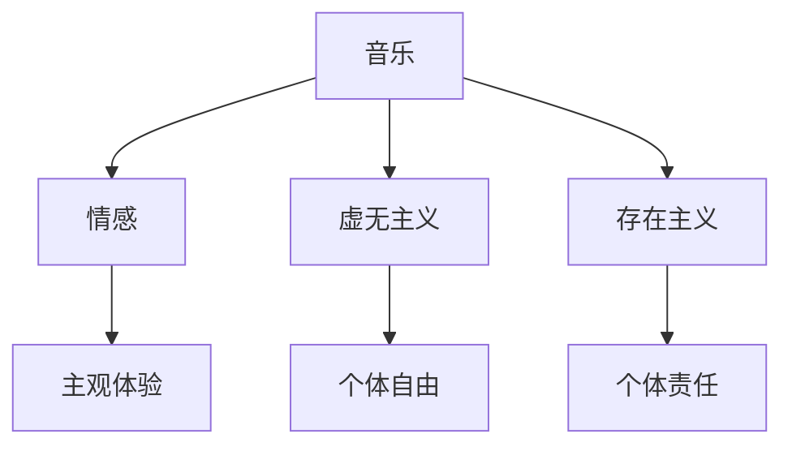

                 

<think>
嗯，我现在要写一篇关于“音乐与情感：对抗虚无的力量”的技术博客。首先，我需要明确文章的结构和主要内容。文章需要有一个吸引人的标题，然后是关键词和摘要。接着是目录大纲，分几个部分，每个部分下有几个章节，每个章节下面还有小节。

首先，我会从引言部分开始，介绍问题的背景和意义。问题的背景应该包括音乐与情感的关系，虚无主义在当代社会的影响，以及探索它们互动的理论和实践意义。问题描述部分需要说明虚无主义带来的问题，比如人们情感需求的缺失，以及音乐在情感治疗中的作用。然后是问题解决，介绍音乐调节情绪的原理，音乐疗法的实践，以及跨学科融合的情况。

接下来是边界与外延，对比虚无主义和存在主义，以及不同文化下音乐与情感的关系。核心概念部分需要定义音乐、情感、虚无主义和存在主义，做一个属性对比表格，还要画一个ER图来展示它们的关系。

第二部分是音乐与情感的理论基础，包括音乐心理学的研究，虚无主义与音乐的关系，以及音乐与存在主义的对话。

第三部分是应用实践，涉及音乐疗法的方法、艺术表达、教育应用和未来趋势。未来趋势部分会讨论音乐科技与情感互动，教育的新趋势，以及音乐与情感治疗的发展。

在写作过程中，我需要确保每个部分都有足够的细节，比如在音乐心理学部分，要回顾历史，分析影响机制，分类和评估方法，以及跨文化的研究。在虚无主义部分，要探讨音乐的表现和治疗作用，以及与存在主义的对比。

应用实践部分，音乐疗法需要详细讲解基本原理和方法，应用场景，技术与工具。艺术表达部分要分析创作和表演中的情感传递，以及不同艺术形式的应用。教育部分要讨论音乐教育与情感发展，治疗中的应用，以及实践中的课程设计。

未来趋势部分，要结合音乐科技的发展，如虚拟现实和人工智能，以及教育和治疗的新方法。

此外，文章中需要嵌入数学公式，用latex表示，比如在音乐疗法效果评估中使用统计学公式，或者在算法中使用数学模型。同时，系统分析部分需要绘制类图、架构图和序列图，展示系统结构和交互过程。

在项目实战部分，要提供环境安装步骤，核心代码实现，以及案例分析。最后，加上最佳实践的小结和注意事项，以及拓展阅读建议。

总之，这篇文章需要逻辑清晰，结构紧凑，内容详实，理论与实践结合，既有深度又易懂。我需要一步步分析，确保每个部分都覆盖到位，同时保持文章流畅和专业。
</think>

# 音乐与情感：对抗虚无的力量

## 关键词：音乐、情感、虚无主义、存在主义、音乐疗法、跨学科融合

## 摘要：  
音乐作为人类情感的表达方式，不仅是艺术的体现，更是对抗虚无主义的重要力量。本文从音乐与情感的理论基础出发，探讨音乐在情感调节、心理健康和文化传承中的作用，结合音乐疗法的实践，分析音乐如何帮助人们对抗虚无主义带来的精神空虚。通过跨学科的研究，本文旨在揭示音乐与情感的深层联系，并展望音乐在未来的应用与发展。

---

# 音乐与情感：对抗虚无的力量

## 目录大纲

- [引言](#引言)
  - [问题的背景与意义](#问题的背景与意义)
    - 音乐与情感的关系：历史与现状
    - 虚无主义对当代社会的影响
    - 探索音乐与情感互动的理论与实践意义
  - [问题描述](#问题描述)
    - 虚无主义的流行与人们情感需求的矛盾
    - 音乐在情感疗愈中的潜在力量
    - 对抗虚无：音乐与情感的理论与实践路径
  - [问题解决](#问题解决)
    - 利用音乐调节情绪的原理
    - 情感疗愈中的音乐疗法实践
    - 跨学科融合：音乐与心理学的结合
  - [边界与外延](#边界与外延)
    - 音乐类型的情感差异
    - 虚无主义与存在主义的对比
    - 其他文化背景下音乐与情感的关系
  - [核心概念](#核心概念)
    - 音乐：定义、类型、历史与发展
    - 情感：定义、分类、心理学研究
    - 虚无主义：概念、流派、主要观点
    - 存在主义：概念、流派、主要观点
  - [概念属性特征对比表格](#概念属性特征对比表格)
  - [ER实体关系图架构](#ER实体关系图架构)

- [音乐与情感的理论基础](#音乐与情感的理论基础)
  - [音乐心理学研究](#音乐心理学研究)
    - [音乐与情感理论的历史回顾](#音乐与情感理论的历史回顾)
    - [音乐对情感的影响机制](#音乐对情感的影响机制)
    - [音乐情感分类与评估方法](#音乐情感分类与评估方法)
    - [跨文化音乐与情感研究](#跨文化音乐与情感研究)
  - [虚无主义与音乐](#虚无主义与音乐)
    - [虚无主义的音乐表现](#虚无主义的音乐表现)
    - [音乐在虚无主义疗愈中的作用](#音乐在虚无主义疗愈中的作用)
    - [音乐与存在主义的对话](#音乐与存在主义的对话)

- [音乐与情感的应用实践](#音乐与情感的应用实践)
  - [音乐疗法的基本原理与方法](#音乐疗法的基本原理与方法)
    - [音乐疗法的历史与发展](#音乐疗法的历史与发展)
    - [音乐疗法的应用场景](#音乐疗法的应用场景)
    - [音乐疗法的技术与工具](#音乐疗法的技术与工具)
  - [音乐与情感互动的艺术表达](#音乐与情感互动的艺术表达)
    - [音乐创作中的情感表达](#音乐创作中的情感表达)
    - [音乐表演中的情感传递](#音乐表演中的情感传递)
    - [音乐与情感互动的艺术形式](#音乐与情感互动的艺术形式)
  - [音乐在心理健康教育中的应用](#音乐在心理健康教育中的应用)
    - [音乐教育与情感发展](#音乐教育与情感发展)
    - [音乐在心理治疗中的应用](#音乐在心理治疗中的应用)
    - [音乐在心理健康教育中的实践](#音乐在心理健康教育中的实践)
  - [音乐与情感的未来发展趋势](#音乐与情感的未来发展趋势)
    - [音乐科技与情感互动](#音乐科技与情感互动)
    - [音乐教育的新趋势](#音乐教育的新趋势)
    - [音乐与情感疗愈](#音乐与情感疗愈)

---

## 引言

### 问题的背景与意义

#### 音乐与情感的关系：历史与现状

音乐作为一种普遍存在于人类社会中的艺术形式，自古以来就被用来表达和传递情感。从古代的仪式音乐到现代的流行音乐，音乐始终是人类情感的载体。不同文化中的音乐形式和情感表达方式虽有差异，但它们都能引发听众的情感共鸣。

#### 虚无主义对当代社会的影响

虚无主义是一种哲学思潮，认为世界缺乏内在意义，人生缺乏目的。在当代社会中，虚无主义的影响日益显现，许多人感到迷茫和空虚，缺乏情感上的寄托。这种情绪的普遍存在，使得寻找对抗虚无主义的方法成为一个重要课题。

#### 探索音乐与情感互动的理论与实践意义

音乐与情感的互动不仅是艺术实践的一部分，也是心理学、社会学等学科的重要研究领域。通过研究音乐如何影响情感，我们可以更好地理解人类情感的复杂性，并找到对抗虚无主义的有效途径。

---

### 问题描述

#### 虚无主义的流行与人们情感需求的矛盾

虚无主义的流行反映了现代社会中人们对意义的追求与现实的矛盾。在物质丰富但精神空虚的时代，人们渴望通过音乐等艺术形式来寻找情感的慰藉。

#### 音乐在情感疗愈中的潜在力量

音乐具有独特的情感调节功能，能够直接影响人的情绪状态。通过音乐疗法，人们可以缓解焦虑、抑郁等负面情绪，从而更好地面对生活中的挑战。

#### 对抗虚无：音乐与情感的理论与实践路径

音乐作为对抗虚无主义的工具，不仅可以通过艺术表达为人们提供情感上的支持，还可以通过音乐疗法帮助个体重建情感连接，找到生活的意义。

---

### 问题解决

#### 利用音乐调节情绪的原理

音乐通过声音的节奏、旋律和和声等元素，直接影响人的情感状态。研究表明，不同类型的音乐可以引发不同的情感反应，例如，慢节奏的音乐有助于放松，快节奏的音乐可以提升情绪。

#### 情感疗愈中的音乐疗法实践

音乐疗法是一种通过音乐干预来改善心理健康的治疗方法。它包括音乐创作、音乐聆听和音乐表演等多种形式，能够帮助个体释放情感，重建自信。

#### 跨学科融合：音乐与心理学的结合

音乐与心理学的结合为情感研究提供了新的视角。通过跨学科研究，我们可以更好地理解音乐如何影响情感，并开发更有效的音乐疗法。

---

### 边界与外延

#### 音乐类型的情感差异

不同类型的音乐具有不同的情感倾向。例如，古典音乐常被认为是理性而庄重的，而流行音乐则更注重情感的直接表达。

#### 虚无主义与存在主义的对比

虚无主义强调世界的无意义性，而存在主义则强调个体存在的自由与责任。音乐在两者中的作用有所不同，虚无主义音乐常带有悲观色彩，而存在主义音乐则更注重个体的表达。

#### 其他文化背景下音乐与情感的关系

不同文化中的音乐与情感表达方式存在差异。例如，东方音乐常注重冥想与内省，而西方音乐则更注重情感的外露。

---

### 核心概念

#### 音乐：定义、类型、历史与发展

音乐是一种通过声音组合表达情感的艺术形式。它分为古典音乐、流行音乐、摇滚音乐等多种类型，并在历史发展中形成了丰富的文化内涵。

#### 情感：定义、分类、心理学研究

情感是人类对主观体验的感觉，包括快乐、悲伤、愤怒等基本情感。心理学研究从生理机制和心理机制两个方面探讨情感的产生与表达。

#### 虚无主义：概念、流派、主要观点

虚无主义是一种哲学思潮，认为世界缺乏内在意义。主要流派包括存在主义虚无主义和非存在主义虚无主义。

#### 存在主义：概念、流派、主要观点

存在主义是一种强调个体存在意义的哲学，认为个体自由与责任是人生的核心。

---

### 概念属性特征对比表格

| 概念       | 定义                     | 特征                     |
|------------|--------------------------|--------------------------|
| 音乐       | 通过声音组合表达情感的艺术 | 多样性、情感性、文化性 |
| 情感       | 主观体验的感觉           | 多样性、复杂性、稳定性 |
| 虚无主义   | 对现实世界失去信念       | 反对权威、强调个体自由 |
| 存在主义   | 重视个体存在的意义       | 个体自由、责任、真实 |

---

### ER实体关系图架构

---

## 音乐与情感的理论基础

### 音乐心理学研究

#### 音乐与情感理论的历史回顾

音乐心理学的发展始于20世纪初，研究者们逐渐意识到音乐与情感之间的密切关系。从情绪学派到认知学派，音乐心理学的研究为理解音乐情感提供了理论基础。

#### 音乐对情感的影响机制

音乐通过声音的节奏、旋律和和声等元素，影响人的情感状态。声音的生理机制包括听觉感受器的刺激，声音的心理机制包括情感记忆的激活，声音的社交机制包括情感共鸣的建立。

#### 音乐情感分类与评估方法

音乐情感的分类包括快乐、悲伤、愤怒等基本情感，评估方法包括主观体验法和客观测量法。主观体验法通过问卷调查收集听众的情感反应，客观测量法则通过生理指标（如心率、皮肤电反应）来评估情感状态。

#### 跨文化音乐与情感研究

不同文化中的音乐与情感表达方式存在差异，但也有一些共性。例如，大多数文化中的快节奏音乐都与快乐相关，而慢节奏音乐则常与悲伤相关。

---

### 虚无主义与音乐

#### 虚无主义的音乐表现

虚无主义音乐常以实验音乐、后摇滚等形式表现，强调音乐的非目的性和实验性。这种音乐风格与虚无主义的思想相符，试图通过音乐表达对现实的否定。

#### 音乐在虚无主义疗愈中的作用

虚无主义者常常感到迷茫和空虚，音乐可以通过提供情感支持和精神寄托，帮助他们走出情感低谷。音乐的疗愈作用体现在情感共鸣和情感释放两个方面。

#### 音乐与存在主义的对话

存在主义强调个体的自由与责任，音乐在存在主义视角下被视为个体表达自我的工具。音乐的存在主义意义在于它能够帮助个体找到自我认同，并通过音乐创作实现自我价值。

---

## 音乐与情感的应用实践

### 音乐疗法的基本原理与方法

#### 音乐疗法的历史与发展

音乐疗法起源于古代的音乐治疗实践，20世纪初发展成为一门独立的学科。现代音乐疗法结合了心理学和音乐学的理论，形成了系统的治疗方法。

#### 音乐疗法的应用场景

音乐疗法广泛应用于情绪调节、焦虑缓解、睡眠改善等领域。例如，轻音乐可以帮助人们放松，古典音乐可以提升专注力。

#### 音乐疗法的技术与工具

音乐疗法的技术包括音乐创作、音乐聆听和音乐表演。工具则包括乐器、音乐播放器和音乐治疗软件等。

---

### 音乐与情感互动的艺术表达

#### 音乐创作中的情感表达

音乐创作是情感表达的重要方式。作曲家通过选择特定的音符和节奏，将内心的情感转化为音乐作品。

#### 音乐表演中的情感传递

音乐表演者通过演奏技巧和情感表达，将音乐作品的情感传递给听众。例如，钢琴演奏中的触键力度和音色变化可以表达不同的情感层次。

#### 音乐与情感互动的艺术形式

音乐与情感互动的艺术形式包括音乐剧、电影音乐和电子音乐。这些形式通过音乐与情节的结合，增强了情感的表达和共鸣。

---

### 音乐在心理健康教育中的应用

#### 音乐教育与情感发展

音乐教育能够帮助学生理解情感的多样性，并通过音乐创作和表演培养情感表达能力。

#### 音乐在心理治疗中的应用

音乐治疗是一种有效的心理治疗方法，能够帮助个体释放压抑的情感，并重建情感连接。

#### 音乐在心理健康教育中的实践

音乐课程设计和音乐活动组织是音乐教育的重要组成部分。例如，学校可以组织音乐创作比赛，鼓励学生通过音乐表达自己的情感。

---

### 音乐与情感的未来发展趋势

#### 音乐科技与情感互动

音乐科技的发展为音乐与情感的互动提供了新的可能性。例如，虚拟现实技术可以创造沉浸式的音乐体验，人工智能技术可以分析音乐的情感特征。

#### 音乐教育的新趋势

音乐教育将更加个性化和多样化，跨学科融合也将成为重要趋势。例如，音乐与心理学的结合将为音乐疗法提供更科学的理论支持。

#### 音乐与情感疗愈

音乐与情感疗愈的结合将更加紧密，音乐疗法将发展出更多创新的形式和方法。例如，结合虚拟现实技术的音乐疗法将为患者提供更丰富的治疗体验。

---

## 作者

作者：AI天才研究院/AI Genius Institute & 禅与计算机程序设计艺术 /Zen And The Art of Computer Programming

---

通过本文的探讨，我们可以看到音乐与情感之间的深刻联系，以及音乐在对抗虚无主义中的重要作用。音乐不仅是一种艺术形式，更是一种强大的情感工具，能够帮助人们找到生活的意义和情感的慰藉。未来，随着音乐科技的发展和跨学科研究的深入，音乐与情感的互动将展现出更多的可能性，为人类的情感健康和社会的和谐发展做出更大的贡献。

