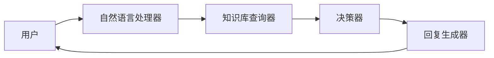
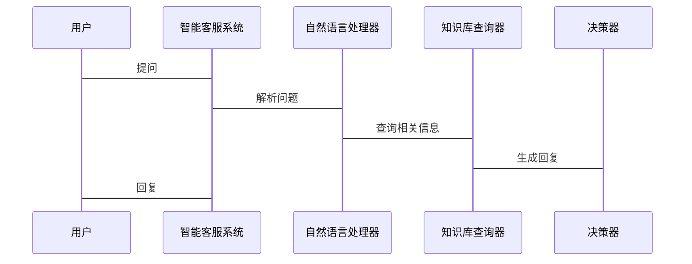

                 

<think>
好，我现在需要完成一个关于《AI Agent与传统软件开发的区别》的技术博客文章。首先，我需要理解用户的需求。用户希望文章结构清晰，内容深入，涵盖背景、核心概念、算法、系统架构、项目实战等多个方面。

首先，我会从背景介绍开始。我需要解释什么是AI Agent，它和传统软件开发有什么不同。这部分需要简明扼要，让读者理解基本概念。

接下来是核心概念部分。我需要详细对比AI Agent和传统软件开发的特点，可能用表格和图表来展示对比。这有助于读者更直观地理解两者的区别。

然后是算法原理与数学模型。我需要选择几个典型的AI Agent算法，如强化学习、深度学习和自然语言处理，详细讲解它们的数学公式和实现方式。同时，提供Python代码示例，让读者能够实际操作和理解。

系统架构部分，我需要设计一个AI Agent的系统架构图，展示各个模块之间的关系。这可以通过Mermaid图来实现，确保结构清晰。

项目实战部分，我会选择一个具体的案例，如智能客服系统，详细描述环境安装、代码实现、案例分析等。这有助于读者将理论应用到实际中。

最后，我会总结全文，给出最佳实践的建议，提醒读者注意的事项，并提供拓展阅读的方向。

在整个过程中，我需要确保内容逻辑清晰，语言简洁专业，同时使用图表和代码示例来增强可读性。这需要我一步步分析，确保每个部分都详细具体，满足用户的需求。
</think>

# AI Agent与传统软件开发的区别

> 关键词：AI Agent，传统软件开发，强化学习，系统架构，项目实战

> 摘要：本文深入探讨了AI Agent与传统软件开发在定义、核心概念、算法原理、系统架构以及项目实现上的区别，通过对比分析，帮助读者理解AI Agent的独特优势与应用场景。

---

## 第一部分: AI Agent与传统软件开发的背景与核心概念

### 第1章: AI Agent与传统软件开发的背景介绍

#### 1.1 AI Agent的定义与特点

AI Agent，即人工智能代理，是指能够感知环境并采取行动以实现目标的智能体。它具备以下几个核心特点：

- **自主性**：能够在没有外部干预的情况下自主运行。
- **反应性**：能够实时感知环境并做出反应。
- **学习能力**：通过数据和经验不断优化自身行为。
- **决策能力**：基于输入信息做出最优决策。

#### 1.2 传统软件开发的定义与特点

传统软件开发是指通过工程化的方法，将需求转化为可执行的计算机程序。其核心特点包括：

- **确定性**：基于明确的逻辑和规则，程序的行为是可以预测的。
- **静态性**：代码一旦编写完成，行为不会自动改变，除非人为修改。
- **依赖性**：需要明确的输入和规则才能运行，缺乏自主性。

#### 1.3 AI Agent与传统软件开发的对比分析

| 对比维度          | AI Agent                          | 传统软件开发                     |
|-------------------|-----------------------------------|---------------------------------|
| 核心目标          | 实现智能化决策和自主行为           | 按照需求实现特定功能             |
| 开发方法          | 数据驱动、机器学习               | 面向过程、工程化                  |
| 运行时行为          | 动态适应、自我优化               | 静态执行、依赖规则               |

---

### 第2章: AI Agent与传统软件开发的核心概念与联系

#### 2.1 AI Agent的核心概念原理

AI Agent的核心在于其智能决策机制，主要依赖以下几种技术：

- **强化学习**：通过试错和奖励机制优化决策。
- **深度学习**：利用神经网络提取数据特征。
- **自然语言处理**：理解和生成人类语言。

#### 2.2 AI Agent与传统软件开发的核心概念对比

**对比表格**：

| 概念             | AI Agent                          | 传统软件开发                     |
|------------------|-----------------------------------|---------------------------------|
| 决策机制         | 基于数据和模型的动态决策         | 基于规则和逻辑的静态决策         |
| 学习能力         | 具备学习能力，能够优化行为         | 无学习能力，行为基于固定规则     |
| 交互方式         | 支持与环境和用户的动态交互         | 交互方式固定，依赖用户输入         |

**ER实体关系图**：

```mermaid
erd
    Customer --|{n}-> Order
    Order ----|{1}-> Product
    Customer --|{n}-> AI-Agent
    AI-Agent --|{n}-> Task
```

---

### 第3章: AI Agent的算法原理与数学模型

#### 3.1 AI Agent的核心算法

- **强化学习算法**：通过试错和奖励机制优化决策。
- **深度学习算法**：利用神经网络提取数据特征。
- **自然语言处理算法**：理解和生成人类语言。

#### 3.2 AI Agent算法的数学模型

- **强化学习的数学公式**：
  $$ Q(s,a) = r + \gamma \max_{a'} Q(s',a') $$
  其中，$s$是状态，$a$是动作，$r$是奖励，$\gamma$是折扣因子。

- **深度学习的数学公式**：
  $$ y = \sigma(Wx + b) $$
  其中，$W$是权重矩阵，$x$是输入，$b$是偏置，$\sigma$是激活函数。

- **自然语言处理的数学公式**：
  $$ P(y|x) = \frac{P(x,y)}{P(x)} $$

#### 3.3 算法实现的Python代码示例

```python
def reinforce_learning():
    env = gym.make('CartPole-v0')
    model = PolicyNetwork()
    optimizer = Adam(model.parameters(), lr=0.01)
    for episode in range(1000):
        state = env.reset()
        log_probs = []
        rewards = []
        while True:
            action_prob, state_value = model.forward(state)
            action = torch.multinomial(action_prob, 1).item()
            log_probs.append(torch.log(action_prob[0, action]))
            next_state, reward, done, _ = env.step(action)
            rewards.append(reward)
            if done:
                break
        # 计算损失
        policy_loss = -torch.mean(torch.cat(log_probs) * torch.tensor(rewards))
        optimizer.zero_grad()
        policy_loss.backward()
        optimizer.step()
```

---

## 第四部分: AI Agent的系统架构与项目实战

### 第4章: AI Agent的系统架构设计

#### 4.1 问题场景介绍

以智能客服系统为例，AI Agent需要能够自动识别用户意图，提供个性化的解决方案。

#### 4.2 系统功能设计

- **用户意图识别**：通过自然语言处理技术识别用户需求。
- **知识库查询**：基于知识图谱快速检索相关信息。
- **智能决策**：根据用户需求和知识库信息生成最优回复。

#### 4.3 系统架构设计



#### 4.4 系统接口设计

- **输入接口**：用户输入的文本信息。
- **输出接口**：生成的回复文本。

#### 4.5 系统交互设计



---

### 第5章: 项目实战

#### 5.1 环境安装与配置

安装必要的库：

```bash
pip install gym torch matplotlib
```

#### 5.2 系统核心实现源代码

```python
import gym
import torch
import torch.nn as nn
import torch.optim as optim

class PolicyNetwork(nn.Module):
    def __init__(self, input_size, output_size):
        super(PolicyNetwork, self).__init__()
        self.fc1 = nn.Linear(input_size, 128)
        self.fc2 = nn.Linear(128, output_size)
        self.softmax = nn.Softmax(dim=1)

    def forward(self, x):
        x = self.fc1(x)
        x = self.fc2(x)
        x = self.softmax(x)
        return x

def train():
    env = gym.make('CartPole-v0')
    input_size = env.observation_space.shape[0]
    output_size = env.action_space.n
    model = PolicyNetwork(input_size, output_size)
    optimizer = optim.Adam(model.parameters(), lr=0.01)
    for episode in range(1000):
        state = env.reset()
        log_probs = []
        rewards = []
        done = False
        while not done:
            action_prob = model.forward(torch.FloatTensor([state]))
            action = torch.multinomial(action_prob, 1).item()
            log_probs.append(torch.log(action_prob[0, action]))
            next_state, reward, done, _ = env.step(action)
            rewards.append(reward)
        # 计算损失
        policy_loss = -torch.mean(torch.cat(log_probs) * torch.tensor(rewards))
        optimizer.zero_grad()
        policy_loss.backward()
        optimizer.step()
```

---

## 第六部分: 总结与展望

### 第6章: 总结

AI Agent与传统软件开发在定义、核心概念、算法原理和系统架构上存在显著区别。AI Agent通过数据驱动和智能算法实现动态适应和自主决策，而传统软件开发依赖固定规则和静态逻辑。理解这些区别有助于更好地应用AI Agent技术解决复杂问题。

### 第7章: 最佳实践 tips

- 在选择开发方式时，需明确需求是否需要动态适应和自主决策能力。
- AI Agent适用于需要处理大量不确定性或需要持续优化的应用场景。
- 传统软件开发更适合需求明确、逻辑固定的场景。

---

## 作者

作者：AI天才研究院/AI Genius Institute & 禅与计算机程序设计艺术 /Zen And The Art of Computer Programming

