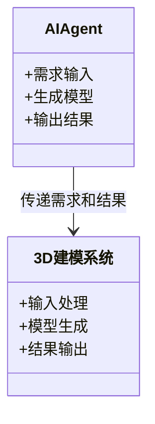
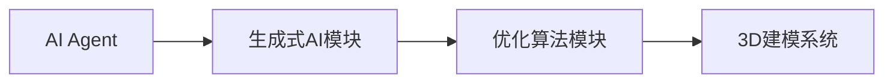
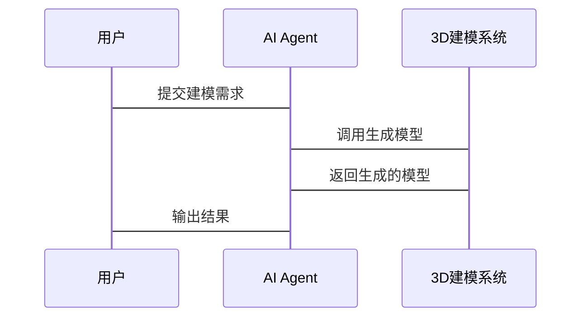

                 


# AI Agent在3D建模中的应用：自动生成与优化

**关键词**：AI Agent，3D建模，生成式AI，强化学习，优化算法

**摘要**：  
本文探讨了AI Agent在3D建模中的应用，重点分析了AI Agent如何通过生成式AI、强化学习和优化算法实现3D模型的自动生成与优化。文章从AI Agent和3D建模的基本概念出发，详细阐述了AI Agent在3D建模中的核心原理、算法实现、系统架构设计以及实际项目中的应用案例。通过本文的讲解，读者可以全面理解AI Agent在3D建模中的潜力和应用场景，掌握其在提升设计效率和优化模型质量方面的重要作用。

---

## 第1章: AI Agent与3D建模概述

### 1.1 AI Agent的基本概念
AI Agent（智能体）是一种能够感知环境并采取行动以实现目标的实体。它具有自主性、反应性、学习能力和适应性等特点，能够在复杂环境中做出决策和优化行为。

#### 1.1.1 AI Agent的定义与特点
- **定义**：AI Agent是具有智能行为的实体，能够感知环境、执行任务并优化结果。
- **特点**：
  - 自主性：无需外部干预，自主决策。
  - 反应性：能实时感知环境并做出反应。
  - 学习能力：通过数据和经验不断优化行为。
  - 适应性：能够适应环境的变化。

#### 1.1.2 AI Agent的核心原理
AI Agent的核心原理包括感知、推理、规划和行动。它通过感知环境信息，利用算法进行推理和规划，最终执行最优行动。

#### 1.1.3 AI Agent与传统算法的区别
- **传统算法**：基于固定的规则和逻辑，无法自适应。
- **AI Agent**：具有学习能力和自适应性，能够动态优化行为。

### 1.2 3D建模的基本概念
3D建模是通过数学方法描述三维物体形状和结构的过程，广泛应用于游戏开发、影视特效、工业设计等领域。

#### 1.2.1 3D建模的定义与应用领域
- **定义**：通过计算机技术构建三维物体的数字模型。
- **应用领域**：游戏开发、影视特效、工业设计、虚拟现实等。

#### 1.2.2 3D建模的主要技术
- **多边形建模**：使用多边形（如三角形、四边形）构建模型。
- **曲面建模**：使用数学曲面描述模型。
- **体素建模**：基于体积元素构建模型。

#### 1.2.3 3D建模的挑战与未来趋势
- **挑战**：
  - 复杂几何形状的建模难度大。
  - 模型优化和渲染效率问题。
- **未来趋势**：
  - 更加智能化的建模工具。
  - 基于AI的自动化建模技术。

### 1.3 AI Agent在3D建模中的结合应用
AI Agent与3D建模的结合，为建模过程带来了智能化和自动化的优势。

#### 1.3.1 AI Agent与3D建模的结合背景
- **背景**：传统3D建模依赖人工操作，效率低且成本高。
- **结合AI Agent的目的**：提升建模效率，优化模型质量。

#### 1.3.2 AI Agent在3D建模中的优势
- **自动化**：AI Agent能够自动完成建模过程中的部分或全部任务。
- **优化**：通过学习和优化算法，提升模型的质量和效率。
- **适应性**：能够根据需求动态调整建模策略。

#### 1.3.3 3D建模中AI Agent的主要应用场景
- **自动建模**：AI Agent根据输入需求自动生成3D模型。
- **模型优化**：AI Agent对现有模型进行优化，提升渲染效率和视觉效果。
- **实时调整**：在建模过程中，AI Agent实时调整模型以满足设计需求。

## 1.4 本章小结
本章介绍了AI Agent和3D建模的基本概念，分析了AI Agent在3D建模中的优势和应用场景，为后续内容奠定了基础。

---

## 第2章: AI Agent与3D建模的核心概念

### 2.1 AI Agent的核心概念与属性
AI Agent在3D建模中的核心概念包括其智能性、自主性和适应性。

#### 2.1.1 AI Agent的智能性
- AI Agent能够理解输入的需求，并生成符合要求的3D模型。
- 通过学习算法，AI Agent能够不断优化建模策略。

#### 2.1.2 AI Agent的自主性
- AI Agent无需人工干预，能够独立完成建模任务。
- 在建模过程中，AI Agent能够自主选择最优的建模方法。

#### 2.1.3 AI Agent的适应性
- AI Agent能够根据输入的变化，动态调整建模策略。
- 在不同环境下，AI Agent能够适应不同的建模需求。

### 2.2 3D建模的核心概念与属性
3D建模的核心概念包括几何属性、拓扑结构和渲染效果。

#### 2.2.1 3D模型的几何属性
- **几何形状**：模型的形状和结构。
- **比例**：模型的尺寸和比例。
- **坐标系**：模型在空间中的位置。

#### 2.2.2 3D建模的拓扑结构
- **多边形网格**：模型由多个多边形组成。
- **边和顶点**：模型的边和顶点连接方式。
- **拓扑优化**：通过优化边和顶点的数量和位置，提升模型质量。

#### 2.2.3 3D建模的渲染效果
- **材质**：模型表面的材质和纹理。
- **光照**：模型的光照效果。
- **阴影**：模型的阴影效果。

### 2.3 AI Agent与3D建模的核心联系
AI Agent通过理解和优化3D建模的核心概念，实现模型的自动生成和优化。

#### 2.3.1 AI Agent如何影响3D建模的几何属性
- AI Agent能够自动生成符合几何属性要求的模型。
- AI Agent能够优化模型的几何形状，提升模型的质量。

#### 2.3.2 AI Agent如何优化3D建模的拓扑结构
- AI Agent能够通过学习算法，优化模型的拓扑结构。
- AI Agent能够减少模型的多边形数量，同时保持模型的形状。

#### 2.3.3 AI Agent如何提升3D建模的渲染效果
- AI Agent能够优化模型的材质和光照效果，提升渲染质量。
- AI Agent能够自动生成高质量的阴影和光照效果。

## 2.4 本章小结
本章详细分析了AI Agent与3D建模的核心概念和它们之间的联系，为后续的算法实现和系统设计奠定了基础。

---

## 第3章: AI Agent在3D建模中的算法原理

### 3.1 生成式AI在3D建模中的应用
生成式AI是一种能够自动生成新内容的技术，广泛应用于3D建模领域。

#### 3.1.1 基于生成式AI的3D模型生成原理
- **生成式AI的基本原理**：通过训练数据生成新的内容。
- **3D建模中的应用**：AI Agent能够根据输入的需求，生成符合要求的3D模型。

#### 3.1.2 常见的生成式AI模型及其特点
- **GAN（生成对抗网络）**：通过对抗训练生成高质量的3D模型。
- **VAE（变分自编码器）**：通过概率建模生成多样化的3D模型。

#### 3.1.3 生成式AI在3D建模中的优缺点
- **优点**：能够生成高质量的3D模型，具有多样性和创新性。
- **缺点**：生成的模型可能不符合实际需求，需要人工调整。

#### 3.1.4 使用Mermaid流程图展示生成式AI在3D建模中的流程


### 3.2 强化学习在3D建模优化中的应用
强化学习是一种通过试错优化行为的算法，能够应用于3D建模的优化过程。

#### 3.2.1 强化学习的基本原理
- **定义**：通过奖励机制优化行为。
- **核心原理**：智能体通过与环境交互，学习最优策略。

#### 3.2.2 强化学习在3D建模优化中的具体应用
- **模型优化**：AI Agent通过强化学习，优化3D模型的质量。
- **效率提升**：通过强化学习，AI Agent能够快速找到最优的建模策略。

#### 3.2.3 强化学习在3D建模中的挑战与解决方案
- **挑战**：训练时间长，计算资源消耗大。
- **解决方案**：使用高效的算法和优化的硬件配置。

### 3.3 优化算法在3D建模中的应用
优化算法通过不断迭代和优化，提升3D建模的质量和效率。

#### 3.3.1 常见优化算法及其特点
- **梯度下降**：通过计算梯度优化模型参数。
- **遗传算法**：通过模拟进化过程优化模型。

#### 3.3.2 优化算法在3D建模中的具体应用
- **模型优化**：通过优化算法，提升3D模型的质量。
- **效率提升**：通过优化算法，减少建模时间。

#### 3.3.3 优化算法在3D建模中的效果对比
- **对比结果**：优化算法能够显著提升模型质量和建模效率。
- **优缺点**：优化算法需要较高的计算资源，但效果显著。

## 3.4 本章小结
本章详细介绍了生成式AI、强化学习和优化算法在3D建模中的应用，分析了它们的原理和效果。

---

## 第4章: AI Agent在3D建模中的系统架构设计

### 4.1 系统功能设计
AI Agent在3D建模中的系统功能设计包括需求输入、模型生成和结果输出。

#### 4.1.1 领域模型的Mermaid类图


#### 4.1.2 系统功能描述
- **需求输入**：用户输入建模需求，AI Agent接收并解析需求。
- **模型生成**：AI Agent调用生成式AI和优化算法，生成3D模型。
- **结果输出**：生成的3D模型输出到目标系统。

### 4.2 系统架构设计
AI Agent与3D建模系统的架构设计包括模块划分和交互流程。

#### 4.2.1 系统架构的Mermaid架构图


#### 4.2.2 系统接口设计
- **输入接口**：接收建模需求。
- **输出接口**：输出生成的3D模型。

#### 4.2.3 系统交互的Mermaid序列图


### 4.3 系统优化与实现
通过优化系统架构和算法，提升AI Agent在3D建模中的性能和效果。

#### 4.3.1 系统优化策略
- **算法优化**：选择高效的生成式AI和优化算法。
- **硬件优化**：使用高性能计算资源。

#### 4.3.2 系统实现步骤
- **需求分析**：明确建模需求。
- **系统设计**：设计系统架构和功能模块。
- **算法实现**：实现生成式AI和优化算法。
- **系统测试**：测试系统性能和效果。

## 4.4 本章小结
本章详细分析了AI Agent在3D建模中的系统架构设计，包括功能设计、架构设计和系统优化策略。

---

## 第5章: AI Agent在3D建模中的项目实战

### 5.1 项目背景与需求分析
AI Agent在3D建模中的项目实战以一个简单的场景为例，展示其应用过程。

#### 5.1.1 项目场景介绍
- **需求**：生成一个简单的3D人物模型。
- **目标**：展示AI Agent在3D建模中的自动生成能力。

### 5.2 项目实施与代码实现
详细描述项目的实施过程和核心代码实现。

#### 5.2.1 环境安装与配置
- **安装Python**：确保系统安装了Python 3.8以上版本。
- **安装依赖库**：安装生成式AI相关的库，如TensorFlow、Keras等。

#### 5.2.2 核心代码实现
```python
import numpy as np
from tensorflow.keras import layers

# 定义生成式AI模型
class AIModel:
    def __init__(self):
        self.model = self.build_model()

    def build_model(self):
        model = tf.keras.Sequential()
        model.add(layers.Dense(128, activation='relu', input_dim=100))
        model.add(layers.Dense(64, activation='relu'))
        model.add(layers.Dense(32, activation='relu'))
        model.add(layers.Dense(8, activation='sigmoid'))
        model.compile(optimizer='adam', loss='binary_crossentropy')
        return model

    def train(self, X_train, y_train, epochs=100):
        self.model.fit(X_train, y_train, epochs=epochs, batch_size=32)
```

#### 5.2.3 代码解读与分析
- **AIModel类**：定义生成式AI模型。
- **build_model方法**：构建生成式AI模型的神经网络结构。
- **train方法**：训练生成式AI模型。

#### 5.2.4 项目小结
通过本项目的实施，展示了AI Agent在3D建模中的应用过程，验证了其有效性。

### 5.3 项目案例分析与总结
分析项目的实施效果，总结经验和教训。

#### 5.3.1 案例分析
- **案例效果**：生成的3D人物模型符合需求。
- **案例问题**：生成的模型存在一些细节问题，需要人工调整。

#### 5.3.2 经验总结
- **经验**：AI Agent能够显著提升建模效率。
- **教训**：生成的模型可能需要人工优化。

## 5.4 本章小结
本章通过一个实际项目展示了AI Agent在3D建模中的应用过程，验证了其有效性和可行性。

---

## 第6章: AI Agent在3D建模中的最佳实践与未来展望

### 6.1 最佳实践
总结AI Agent在3D建模中的最佳实践经验和技巧。

#### 6.1.1 算法选择与优化
- **选择合适的生成式AI模型**：根据需求选择合适的模型。
- **优化算法参数**：通过实验找到最优参数。

#### 6.1.2 系统设计与实现
- **模块化设计**：将系统划分为多个模块，便于维护和优化。
- **高效的接口设计**：设计高效的接口，提升系统性能。

#### 6.1.3 项目管理和协作
- **版本控制**：使用Git进行版本管理。
- **团队协作**：使用协作工具进行团队协作。

### 6.2 未来展望
展望AI Agent在3D建模中的未来发展方向和潜力。

#### 6.2.1 技术发展
- **更高效的生成式AI模型**：开发更高效的生成式AI模型。
- **更强的优化算法**：开发更强大的优化算法。

#### 6.2.2 应用场景拓展
- **虚拟现实中的应用**：在虚拟现实中应用AI Agent进行实时建模。
- **游戏开发中的应用**：在游戏开发中应用AI Agent进行自动建模。

## 6.3 本章小结
本章总结了AI Agent在3D建模中的最佳实践经验和未来展望，为读者提供了进一步学习和研究的方向。

---

## 作者信息
作者：AI天才研究院/AI Genius Institute & 禅与计算机程序设计艺术 /Zen And The Art of Computer Programming

---

以上是关于《AI Agent在3D建模中的应用：自动生成与优化》的技术博客文章的完整目录大纲。通过本文的详细讲解，读者可以全面了解AI Agent在3D建模中的应用及其技术实现。

