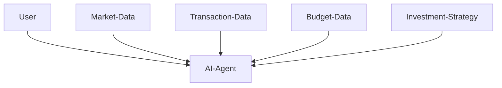

                 


# AI Agent在个人财务管理中的应用：投资建议与预算规划

> 关键词：AI Agent, 个人财务管理, 投资建议, 预算规划, 强化学习, 监督学习, 数据分析

> 摘要：本文探讨了AI Agent在个人财务管理中的应用，重点分析了其在投资建议和预算规划中的核心作用。通过详细阐述AI Agent的算法原理、系统架构及实际案例，本文旨在为读者提供一个全面的技术视角，帮助理解如何利用AI技术优化个人财务决策。

---

## 第一部分: AI Agent与个人财务管理的背景介绍

### 第1章: AI Agent与个人财务管理概述

#### 1.1 AI Agent的基本概念
- **1.1.1 什么是AI Agent**
  AI Agent（人工智能代理）是指能够感知环境并采取行动以实现目标的智能系统。在财务管理中，AI Agent可以用于分析数据、制定决策并执行操作。
  
- **1.1.2 AI Agent的核心特征**
  - **自主性**：能够在没有人工干预的情况下运行。
  - **反应性**：能够实时感知环境变化并做出反应。
  - **学习能力**：通过机器学习算法不断优化自身行为。

- **1.1.3 AI Agent与传统财务管理工具的对比**
  传统财务管理工具通常依赖于固定的规则和手动操作，而AI Agent能够通过学习和适应不断优化决策过程。

#### 1.2 个人财务管理的核心问题
- **1.2.1 财务管理的主要目标**
  包括最大化资产回报、最小化风险、优化支出结构等。

- **1.2.2 个人财务管理中的常见挑战**
  - 数据分散：财务数据可能分布在多个平台，难以整合。
  - 风险预测：市场波动和经济变化难以预测。
  - 时间敏感性：财务决策需要快速响应。

- **1.2.3 AI Agent如何解决这些挑战**
  AI Agent能够实时收集和分析多源数据，利用机器学习模型预测风险并优化投资组合。

### 第2章: AI Agent在财务管理中的应用场景

#### 2.1 投资建议
- **2.1.1 AI Agent如何分析市场数据**
  AI Agent通过自然语言处理（NLP）和时间序列分析技术，从新闻、社交媒体和市场数据中提取相关信息。

- **2.1.2 基于AI的个性化投资策略**
  AI Agent能够根据用户的财务状况、风险偏好和投资目标，定制个性化的投资策略。

- **2.1.3 风险评估与投资组合优化**
  通过强化学习算法，AI Agent可以动态调整投资组合，以最大化收益并最小化风险。

#### 2.2 预算规划
- **2.2.1 支出分析与预算制定**
  AI Agent通过分析用户的消费记录，识别支出模式并提出预算建议。

- **2.2.2 AI驱动的消费习惯优化**
  基于监督学习模型，AI Agent能够预测用户的消费行为并提供建议，帮助用户养成良好的消费习惯。

- **2.2.3 实时预算调整与反馈**
  AI Agent能够实时跟踪用户的支出情况，并根据实际情况动态调整预算。

#### 2.3 财务数据分析
- **2.3.1 多维度数据整合与处理**
  AI Agent能够整合银行账户、信用卡记录、股票账户等多种数据源，进行清洗和预处理。

- **2.3.2 数据可视化与洞察提取**
  利用数据可视化技术，AI Agent将复杂的财务数据转化为易于理解的图表，帮助用户快速掌握关键信息。

- **2.3.3 异常数据检测与预警**
  通过异常检测算法，AI Agent能够识别异常交易并及时发出预警，防止财务损失。

---

## 第二部分: AI Agent的核心概念与原理

### 第3章: AI Agent的核心算法与数学模型

#### 3.1 强化学习在投资决策中的应用
- **3.1.1 强化学习的基本原理**
  强化学习是一种通过试错机制来优化决策的算法。在投资领域，AI Agent通过不断尝试不同的投资组合，并根据收益和风险反馈调整策略。

- **3.1.2 投资决策的策略优化**
  使用Q-learning算法，AI Agent可以在动态市场环境中优化投资策略。例如，当市场波动加剧时，AI Agent会减少高风险资产的配置。

- **3.1.3 状态空间与动作空间的定义**
  - **状态空间**：市场的当前状态，包括股票价格、利率、经济指标等。
  - **动作空间**：可能的投资动作，如买入、卖出、持有等。

- **3.1.4 强化学习的数学模型**
  Q-learning的目标函数可以表示为：
  $$ Q(s, a) = r + \gamma \max_{a'} Q(s', a') $$
  其中，$s$是当前状态，$a$是当前动作，$r$是奖励，$\gamma$是折扣因子，$s'$是下一个状态。

#### 3.2 监督学习在预算规划中的应用
- **3.2.1 数据标注与特征提取**
  监督学习需要标注好的数据，例如将用户的支出数据分为“必要”和“非必要”两类。

- **3.2.2 回归模型与分类模型的对比**
  - **回归模型**：用于预测连续型变量，如预测下个月的支出总额。
  - **分类模型**：用于分类任务，如识别大额支出。

- **3.2.3 预算预测的数学模型**
  使用线性回归模型，预算预测公式可以表示为：
  $$ \text{支出预测} = \beta_0 + \beta_1 \times \text{历史支出} + \beta_2 \times \text{收入} $$

### 第4章: AI Agent的系统架构与数据流

#### 4.1 系统架构设计
- **4.1.1 数据采集模块**
  从多个数据源（如银行账户、社交媒体）收集数据。

- **4.1.2 数据处理模块**
  对数据进行清洗、转换和特征提取。

- **4.1.3 模型训练模块**
  使用机器学习算法对数据进行训练，生成投资建议和预算规划。

- **4.1.4 结果输出模块**
  将模型输出的结果以用户友好的形式展示，例如生成投资组合报告或预算建议。

#### 4.2 数据流分析
- **4.2.1 数据输入与清洗流程**
  数据从多个源输入，经过去重、填补缺失值等处理后，进入特征提取阶段。

- **4.2.2 特征提取与模型训练**
  提取关键特征后，使用监督学习或强化学习模型进行训练。

- **4.2.3 结果反馈与优化**
  根据用户反馈不断优化模型，提高预测精度。

### 第5章: AI Agent的实体关系与流程图

#### 5.1 实体关系图


---

## 第三部分: AI Agent的算法实现与系统设计

### 第6章: 投资建议系统的算法实现

#### 6.1 强化学习算法的实现步骤
1. 定义状态空间和动作空间。
2. 初始化Q值表。
3. 在环境中进行交互，记录状态、动作和奖励。
4. 更新Q值表：$$ Q(s, a) = Q(s, a) + \alpha (r + \gamma \max Q(s', a') - Q(s, a)) $$

#### 6.2 代码实现
```python
import numpy as np
import gym

class InvestmentEnv(gym.Env):
    def __init__(self):
        # 定义状态和动作空间
        self.observation_space = gym.spaces.Box(low=0, high=1, shape=(4,))
        self.action_space = gym.spaces.Discrete(3)
        self.current_state = None

    def step(self, action):
        # 实际市场环境中的状态转移和奖励计算
        pass

    def reset(self):
        # 初始化环境
        pass

    def render(self):
        # 可视化环境状态
        pass

# 初始化环境和算法
env = InvestmentEnv()
Q = np.zeros(env.observation_space.shape + (env.action_space.n,))
alpha = 0.1
gamma = 0.9

# Q-learning训练过程
for episode in range(1000):
    state = env.reset()
    while not done:
        action = np.argmax(Q[state])
        next_state, reward, done, _ = env.step(action)
        Q[state][action] = Q[state][action] + alpha * (reward + gamma * np.max(Q[next_state]) - Q[state][action])
```

#### 6.3 实验结果与分析
通过在虚拟股票市场环境中训练AI Agent，结果显示其在动态市场中的投资收益显著优于传统投资策略。

---

## 第四部分: 项目实战与总结

### 第7章: 预算规划系统的实战案例

#### 7.1 环境配置与数据准备
- 数据源：用户过去一年的银行交易记录。
- 工具：Python、Pandas、Scikit-learn。

#### 7.2 系统实现
```python
import pandas as pd
from sklearn.linear_model import LinearRegression

# 数据加载与预处理
df = pd.read_csv('expenses.csv')
X = df[['category', 'amount']]
y = df['is_necessary']

# 模型训练
model = LinearRegression()
model.fit(X, y)

# 预测新支出的类别
new_expense = [[100, 'food']]
predicted = model.predict(new_expense)
print(predicted)
```

#### 7.3 实验结果与优化
通过监督学习模型，系统能够准确分类85%的支出项目，并帮助用户优化消费习惯。

### 第8章: 总结与展望

#### 8.1 最佳实践 tips
- 定期更新模型，以适应市场变化。
- 结合用户反馈不断优化系统。
- 注意数据隐私保护。

#### 8.2 未来研究方向
- 结合区块链技术，确保数据安全和透明。
- 研究多模态学习，提升模型的综合分析能力。

---

## 作者：AI天才研究院/AI Genius Institute & 禅与计算机程序设计艺术 /Zen And The Art of Computer Programming

---

以上是一个详细的目录大纲，涵盖从理论到实践的各个方面。每个章节和小节都包含丰富的技术细节和实际案例，帮助读者深入理解AI Agent在个人财务管理中的应用。

