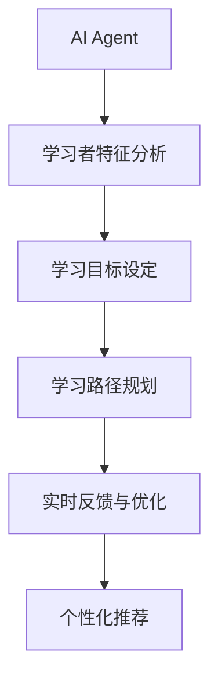
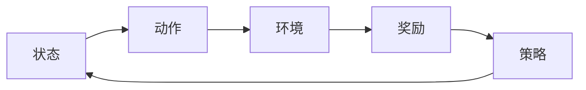
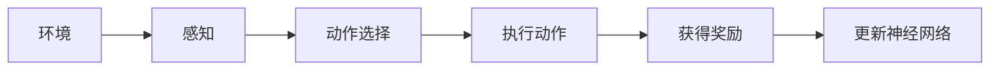
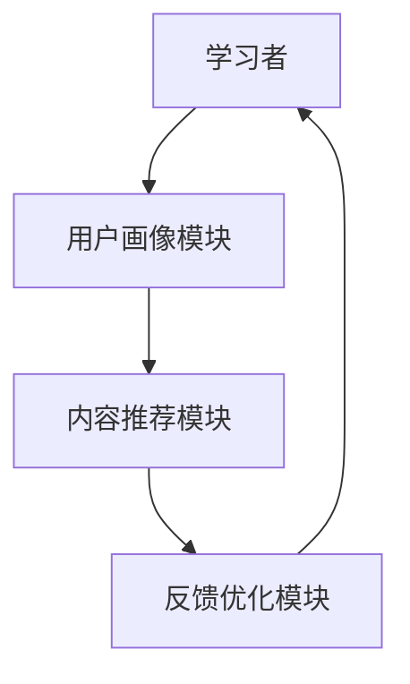
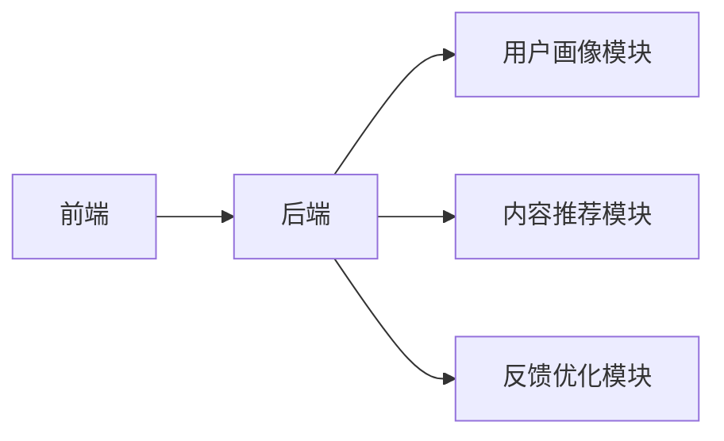

                 


# AI Agent在个性化学习系统中的角色

> 关键词：AI Agent，个性化学习，教育技术，机器学习，知识图谱，自然语言处理

> 摘要：本文探讨了AI Agent在个性化学习系统中的核心角色，分析了其技术原理、算法实现、系统架构，并通过具体案例展示了其在教育领域的应用价值。文章从背景介绍、核心概念、算法原理、系统设计、项目实战到最佳实践，全面解析了AI Agent如何助力个性化学习。

---

## 第一部分: AI Agent与个性化学习系统概述

### 第1章: AI Agent的基本概念与技术基础

#### 1.1 AI Agent的定义与核心特征
AI Agent（人工智能代理）是一种能够感知环境、自主决策并执行任务的智能实体。其核心特征包括：
- **自主性**：无需外部干预，自主完成任务。
- **反应性**：能够实时感知环境变化并做出响应。
- **目标导向性**：基于明确或隐含的目标进行决策。
- **学习能力**：通过经验或数据不断优化自身行为。

**对比表：AI Agent与传统算法的区别**

| 特性                | AI Agent                              | 传统算法                              |
|---------------------|--------------------------------------|--------------------------------------|
| 行为方式            | 主动执行任务                          | 被动执行特定指令                      |
| 决策方式            | 基于环境反馈动态调整                 | 预设规则或静态策略                    |
| 学习能力            | 具备自适应学习能力                    | 无学习能力                            |
| 任务目标            | 明确或隐含的目标                     | 预定义的单一任务                      |

#### 1.2 个性化学习系统的发展历程
个性化学习系统旨在根据学习者的特征和需求，提供定制化的学习方案。其发展历程可分为以下阶段：
1. **传统教学**：基于教师经验的个性化教学。
2. **数据驱动**：利用学习者数据进行简单的分组教学。
3. **智能化推荐**：引入机器学习算法进行个性化推荐。
4. **AI Agent辅助**：AI Agent全面融入学习过程，实现动态调整和实时反馈。

**图1-1：AI Agent在教育中的应用场景**



---

### 第2章: AI Agent在教育领域的应用背景

#### 2.1 教育领域的智能化需求
个性化学习的需求日益增长，传统的教学模式难以满足以下问题：
- **学习者多样性**：每个学生的学习能力和兴趣点不同。
- **教学资源浪费**：统一的教学方案难以覆盖所有学生的需求。
- **实时反馈缺失**：教师难以实时掌握每个学生的学习进展。

#### 2.2 AI Agent在教育中的优势
AI Agent通过以下方式显著提升了个性化学习的效果：
- **动态调整学习路径**：根据学习者的实时表现优化学习计划。
- **实时反馈与指导**：提供即时的学习反馈和针对性建议。
- **高效资源分配**：基于学习者特征推荐最优的学习材料。

---

## 第二部分: AI Agent的核心概念与原理

### 第3章: AI Agent的核心概念与原理

#### 3.1 AI Agent的核心概念
AI Agent在个性化学习系统中的核心任务包括：
- **知识表示**：将学习内容转化为结构化的知识图谱。
- **目标设定**：基于学习者特征设定个性化目标。
- **动态适应**：在学习过程中实时调整策略。

#### 3.2 AI Agent的算法原理
AI Agent的算法实现主要依赖以下技术：
- **强化学习**：通过奖励机制优化决策。
- **知识图谱推理**：基于知识图谱进行逻辑推理。
- **自然语言处理**：实现人机自然对话。

**图3-1：强化学习算法流程**



**代码示例：Q-Learning算法实现**

```python
import numpy as np

# 初始化Q表
Q = np.zeros([state_space, action_space])

# 参数设置
alpha = 0.1
gamma = 0.9

# Q-Learning更新
def update_q(state, action, reward, next_state):
    Q[state, action] = Q[state, action] * (1 - alpha) + alpha * (reward + gamma * np.max(Q[next_state, :]))
```

---

### 第4章: AI Agent的核心算法与实现

#### 4.1 强化学习算法
强化学习是AI Agent的核心算法之一，常用算法包括Q-Learning和Deep Q-Network (DQN)。DQN通过神经网络近似Q值函数，显著提高了算法的泛化能力。

**图4-1：DQN算法流程**



#### 4.2 知识图谱推理
知识图谱为AI Agent提供了结构化的知识表示，支持基于图的最短路径和注意力机制的推理。

**代码示例：基于知识图谱的最短路径算法**

```python
import networkx as nx

def shortest_path(start, end):
    G = nx.Graph()
    G.add_edges_from(edges)
    return nx.shortest_path(G, start, end)
```

---

## 第三部分: 个性化学习系统的系统架构与设计

### 第5章: 个性化学习系统的系统架构

#### 5.1 系统功能模块划分
个性化学习系统的主要模块包括：
- **用户画像模块**：收集和分析学习者特征。
- **内容推荐模块**：基于特征推荐学习资源。
- **反馈优化模块**：根据反馈调整学习计划。

**图5-1：系统功能模块划分**



#### 5.2 系统架构设计
个性化学习系统的架构可分为前端和后端：
- **前端**：用户交互界面，收集输入和展示结果。
- **后端**：包括用户画像、内容推荐和反馈优化模块。

**图5-2：系统架构图**



---

## 第四部分: 项目实战与案例分析

### 第6章: 项目实战

#### 6.1 环境安装与配置
安装必要的依赖：
```bash
pip install numpy matplotlib networkx
```

#### 6.2 系统核心实现
**代码示例：个性化推荐系统**

```python
def personalized_recommendation(user_profile):
    # 基于用户画像生成推荐列表
    recommendations = []
    for item in all_items:
        if item_matches_profile(item, user_profile):
            recommendations.append(item)
    return recommendations
```

#### 6.3 案例分析
以一个具体的个性化学习系统为例，展示AI Agent如何动态调整学习路径。

---

## 第五部分: 最佳实践与总结

### 第7章: 最佳实践与总结

#### 7.1 最佳实践
- **数据隐私保护**：确保学习者数据的安全性。
- **持续学习优化**：定期更新模型和知识库。
- **多模态交互设计**：支持多种交互方式，提高用户体验。

#### 7.2 小结
AI Agent在个性化学习系统中的应用显著提升了学习效果，但其成功依赖于多学科技术的融合与优化。未来，随着技术的进步，AI Agent将在教育领域发挥更大的作用。

---

作者：AI天才研究院 & 禅与计算机程序设计艺术

